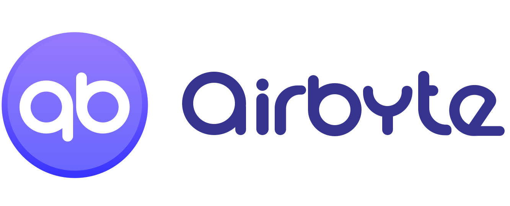

# Getting Started

 

[](https://airbyte.io)

### Data integration made simple, secure and reliable.

The new open-source standard to sync data from applications & databases to warehouses.

[](https://docs.airbyte.io/deployment/deploying-airbyte/with-docker) [](https://docs.airbyte.io/deployment/deploying-airbyte/on-aws-ec2) [](https://docs.airbyte.io/deployment/deploying-airbyte/on-gcp-compute-engine)


Airbyte is on a mission to make data integration pipelines a commodity.

* **Maintenance-free connectors you can use in minutes**. Just authenticate your sources and warehouse, and get connectors that adapts to schema and API changes for you.
* On a mission to **cover the long tail of integrations**, as Airbyte will be very active in maintaining the pipelines’ reliability. 
* **Building new integrations made trivial**. We make it very easy to add new integrations that you need, by offering scheduling and orchestration. 
* **Your data stays in your cloud**. Have full control over your data, and the costs of your data transfers. 
* **No more security compliance process** to go through as self-hosted. 
* **No more pricing indexed on volume**, as cloud-based solutions offer. 

## Getting Started

### Quick start

```bash
git clone git@github.com:airbytehq/airbyte.git
cd airbyte
docker-compose up
```

Now visit [http://localhost:8000](http://localhost:8000)

## Features

* **Normalized schemas**: Elegant, entirely customizable and a fully extensible admin panel.
* **Full-grade scheduler**: Automate your replications with the frequency you need.
* **Real-time Monitoring**: We log all errors to let you know about them.
* **Incremental updates**: Automated replications are based on incremental updates to reduce your data transfer costs.
* **Manual full refresh**: Sometimes, you need to re-sync all your data to start again.
* **Granular system logs**: No opacity whatsoever to let you control and trust.

[See more on our website.](https://airbyte.io/features/)

## Contributing

We love contributions to Airbyte, big or small. See our [Contributing Guide](https://docs.airbyte.io/contributing/contributing-to-airbyte) on how to get started. Not sure where to start? We’ve listed some [good first issues](https://github.com/airbytehq/airbyte/labels/good%20first%20issue) to start with. You can also [book a free, no-pressure pairing session](https://drift.me/micheltricot/meeting) with one of our core contributors.

## Community support

For general help using Airbyte, please refer to the official Airbyte documentation. For additional help, you can use one of these channels to ask a question:

* [Slack](https://join.slack.com/t/airbytehq/shared_invite/zt-h5m88w3a-twQ_6AF9e8SnAzOIkHu2VQ) \(For live discussion with the Community and Airbyte team\)
* [GitHub](https://github.com/airbytehq/airbyte) \(Bug reports, Contributions\)
* [Twitter](https://twitter.com/airbytehq) \(Get the news fast\)

## Roadmap

Check out our [roadmap](https://github.com/airbytehq/airbyte/projects/1) to get informed of the latest features released and the upcoming ones. You may also give us insights and vote for a specific feature. For our high-level roadmap and strategy, you can check [our handbook](https://docs.airbyte.io/company-handbook/company-handbook/roadmap).

## License

Airbyte is licensed under the MIT license. See the [LICENSE](https://docs.airbyte.io/license) file for licensing information.

