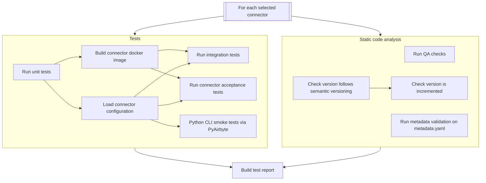
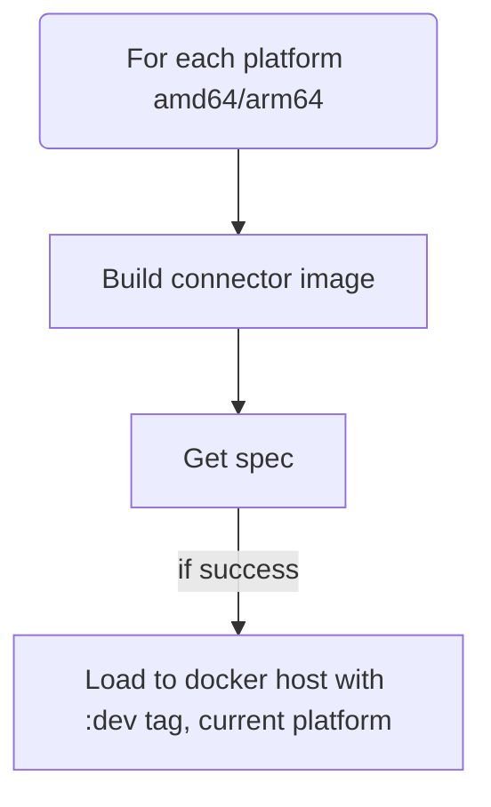
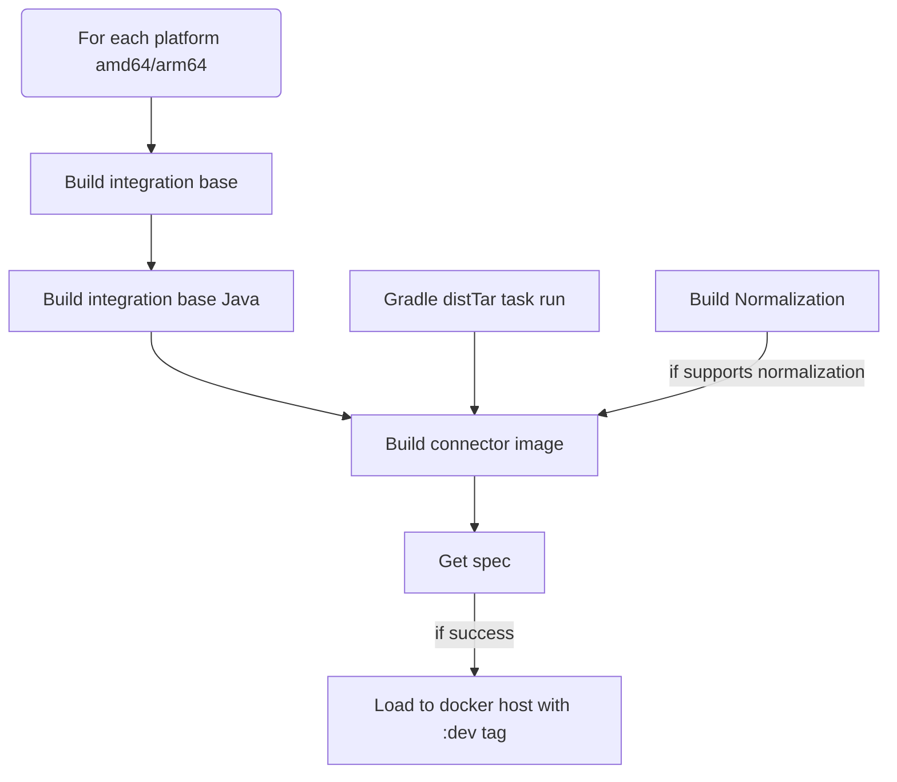
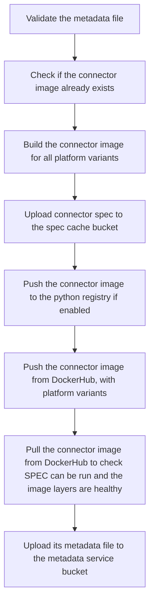
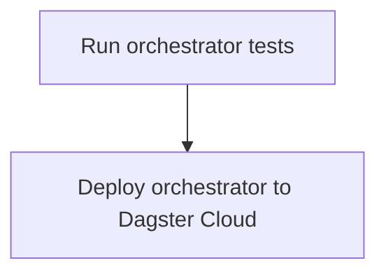

# Airbyte CI CLI

## What is it?

`airbyte-ci` is a command line interface to run CI/CD pipelines. The goal of this CLI is to offer
developers a tool to run these pipelines locally and in a CI context with the same guarantee. It can
prevent unnecessary commit -> push cycles developers typically go through when they when to test
their changes against a remote CI. This is made possible thanks to the use of
[Dagger](https://dagger.io), a CI/CD engine relying on Docker Buildkit to provide reproducible
builds. Our pipeline are declared with Python code, the main entrypoint is
[here](https://github.com/airbytehq/airbyte/blob/master/airbyte-ci/connector_ops/connector_ops/pipelines/commands/airbyte_ci.py).
This documentation should be helpful for both local and CI use of the CLI. We indeed
[power connector testing in the CI with this CLI](https://github.com/airbytehq/airbyte/blob/master/.github/workflows/connector_integration_test_single_dagger.yml#L78).

## How to install

### Requirements

- A running Docker engine with version >= 20.10.23

## Install or Update

The recommended way to install `airbyte-ci` is using the [Makefile](../../../Makefile).

```sh
# from the root of the airbyte repository
make tools.airbyte-ci.install
```

### Setting up connector secrets access

If you plan to use Airbyte CI to run CAT (Connector Acceptance Tests), we recommend setting up GSM
access so that Airbyte CI can pull remote secrets from GSM. For setup instructions, see the CI
Credentials package (which Airbyte CI uses under the hood) README's
[Get GSM Access](https://github.com/airbytehq/airbyte/blob/master/airbyte-ci/connectors/ci_credentials/README.md#get-gsm-access)
instructions.

### Updating the airbyte-ci tool

To reinstall airbyte-ci, run the following command:

```sh
airbyte-ci update
```

or if that fails, you can reinstall it with the following command:

```sh
# from the root of the airbyte repository
make tools.airbyte-ci.install
```

## Checking the airbyte-ci install

To check that airbyte-ci is installed correctly, run the following command:

```sh
make tools.airbyte-ci.check
```

## Cleaning the airbyte-ci install

To clean the airbyte-ci install, run the following command:

```sh
make tools.airbyte-ci.clean
```

## Disabling telemetry

We collect anonymous usage data to help improve the tool. If you would like to disable this, you can
set the `AIRBYTE_CI_DISABLE_TELEMETRY` environment variable to `true`.

## Installation for development

#### Pre-requisites

- Poetry >= 1.1.8
- Python >= 3.10

#### Installation

If you are developing on pipelines, we recommend installing airbyte-ci with poetry:

```bash
cd airbyte-ci/connectors/pipelines/
poetry install
poetry shell
cd ../../
```

**Alternatively**, you can install airbyte-ci with pipx so that the entrypoint is available in your
PATH:

```bash
make tools.airbyte-ci.install
```

However, this will not automatically install the dependencies for the local dependencies of
airbyte-ci, or respect the lockfile.

Its often best to use the `poetry` steps instead.

#### Running Tests

From `airbyte-ci/connectors/pipelines`:

```bash
poetry run pytest tests
```

You can also run a subset of tests:

```bash
poetry run pytest pipelines/models/steps.py
```

More options, such as running test by keyword matching, are available - see the
[pytest CLI documentation](https://docs.pytest.org/en/6.2.x/usage.html) for all the available
options.```

#### Checking Code Format (Pipelines)

```bash
poetry run ruff check pipelines
```

## Commands reference

At this point you can run `airbyte-ci` commands.

- [Airbyte CI CLI](#airbyte-ci-cli)
  - [What is it?](#what-is-it)
  - [How to install](#how-to-install)
    - [Requirements](#requirements)
  - [Install or Update](#install-or-update)
    - [Setting up connector secrets access](#setting-up-connector-secrets-access)
    - [Updating the airbyte-ci tool](#updating-the-airbyte-ci-tool)
  - [Checking the airbyte-ci install](#checking-the-airbyte-ci-install)
  - [Cleaning the airbyte-ci install](#cleaning-the-airbyte-ci-install)
  - [Disabling telemetry](#disabling-telemetry)
  - [Installation for development](#installation-for-development)
    - [Pre-requisites](#pre-requisites)
    - [Installation](#installation)
    - [Running Tests](#running-tests)
    - [Checking Code Format (Pipelines)](#checking-code-format-pipelines)
  - [Commands reference](#commands-reference)
    - [`airbyte-ci` command group](#airbyte-ci-command-group)
      - [Options](#options)
    - [`connectors` command subgroup](#connectors-command-subgroup)
      - [Options](#options-1)
    - [`connectors list` command](#connectors-list-command)
      - [Examples](#examples)
    - [`connectors test` command](#connectors-test-command)
      - [Examples](#examples-1)
      - [What it runs](#what-it-runs)
      - [Options](#options-2)
      - [Extra parameters](#extra-parameters)
    - [`connectors build` command](#connectors-build-command)
      - [What it runs](#what-it-runs-1)
    - [Options](#options-3)
    - [`connectors publish` command](#connectors-publish-command)
    - [Examples](#examples-2)
    - [Options](#options-4)
      - [What it runs](#what-it-runs-2)
      - [Python registry publishing](#python-registry-publishing)
    - [`connectors up-to-date` command](#connectors-up-to-date-command)
    - [Examples](#examples-3)
    - [Other things it could do](#other-things-it-could-do)
    - [`connectors bump-version` command](#connectors-bump-version-command)
    - [Examples](#examples-4)
      - [Arguments](#arguments)
    - [`connectors upgrade_cdk` command](#connectors-upgrade_cdk-command)
    - [Examples](#examples-5)
      - [Arguments](#arguments-1)
    - [`connectors migrate-to-base-image` command](#connectors-migrate-to-base-image-command)
      - [Examples](#examples-6)
    - [`connectors migrate-to-poetry` command](#connectors-migrate-to-poetry-command)
      - [Examples](#examples-7)
    - [`connectors migrate-to-inline-schemas` command](#connectors-migrate-to-inline-schemas-command)
      - [Examples](#examples-8)
    - [`connectors pull-request` command](#connectors-pull-request-command)
      - [Examples](#examples-9)
    - [`format` command subgroup](#format-command-subgroup)
    - [Options](#options-6)
    - [Examples](#examples-10)
    - [`format check all` command](#format-check-all-command)
    - [`format fix all` command](#format-fix-all-command)
    - [`poetry` command subgroup](#poetry-command-subgroup)
    - [Options](#options-7)
    - [Examples](#examples-11)
    - [`publish` command](#publish-command)
      - [Options](#options-8)
    - [`metadata` command subgroup](#metadata-command-subgroup)
    - [`metadata deploy orchestrator` command](#metadata-deploy-orchestrator-command)
      - [Example](#example)
      - [What it runs](#what-it-runs-3)
    - [`tests` command](#tests-command)
      - [Options](#options-9)
      - [Examples](#examples-12)
    - [`migrate-to-manifest-only` command](#migrate-to-manifest-only-command)
      - [Examples](#examples-13)
  - [Changelog](#changelog)
  - [More info](#more-info)
- [Troubleshooting](#troubleshooting)
  - [Commands](#commands)
    - [`make tools.airbyte-ci.check`](#make-toolsairbyte-cicheck)
    - [`make tools.airbyte-ci.clean`](#make-toolsairbyte-ciclean)
  - [Common issues](#common-issues)
    - [`airbyte-ci` is not found](#airbyte-ci-is-not-found)
  - [Development](#development)
    - [`airbyte-ci` is not found](#airbyte-ci-is-not-found-1)
    - [python3.10 not found](#python310-not-found)
    - [Any type of pipeline failure](#any-type-of-pipeline-failure)

### <a id="airbyte-ci-command-group"></a>`airbyte-ci` command group

**The main command group option has sensible defaults. In local use cases you're not likely to pass
options to the `airbyte-ci` command group.**

#### Options

| Option                                         | Default value                   | Mapped environment variable   | Description                                                                                 |
| ---------------------------------------------- | ------------------------------- | ----------------------------- | ------------------------------------------------------------------------------------------- |
| `--yes/--y`                                    | False                           |                               | Agrees to all prompts.                                                                      |
| `--yes-auto-update/--no-auto-update`           | True                            |                               | Agrees to the auto update prompts.                                                          |
| `--enable-update-check/--disable-update-check` | True                            |                               | Turns on the update check feature                                                           |
| `--enable-dagger-run/--disable-dagger-run`     | `--enable-dagger-run`           |                               | Disables the Dagger terminal UI.                                                            |
| `--is-local/--is-ci`                           | `--is-local`                    |                               | Determines the environment in which the CLI runs: local environment or CI environment.      |
| `--git-branch`                                 | The checked out git branch name | `CI_GIT_BRANCH`               | The git branch on which the pipelines will run.                                             |
| `--git-revision`                               | The current branch head         | `CI_GIT_REVISION`             | The commit hash on which the pipelines will run.                                            |
| `--diffed-branch`                              | `master`                        |                               | Branch to which the git diff will happen to detect new or modified files.                   |
| `--gha-workflow-run-id`                        |                                 |                               | GHA CI only - The run id of the GitHub action workflow                                      |
| `--ci-context`                                 | `manual`                        |                               | The current CI context: `manual` for manual run, `pull-request`, `nightly_builds`, `master` |
| `--pipeline-start-timestamp`                   | Current epoch time              | `CI_PIPELINE_START_TIMESTAMP` | Start time of the pipeline as epoch time. Used for pipeline run duration computation.       |
| `--show-dagger-logs/--hide-dagger-logs`        | `--hide-dagger-logs`            |                               | Flag to show or hide the dagger logs.                                                       |

### <a id="connectors-command-subgroup"></a>`connectors` command subgroup

Available commands:

- `airbyte-ci connectors test`: Run tests for one or multiple connectors.
- `airbyte-ci connectors build`: Build docker images for one or multiple connectors.
- `airbyte-ci connectors publish`: Publish a connector to Airbyte's DockerHub.

#### Options

| Option                                                         | Multiple | Default value                    | Mapped Environment Variable | Description                                                                                                                                                                                                                                                                                                                                                                                                                                                                               |
| -------------------------------------------------------------- | -------- | -------------------------------- | --------------------------- | ----------------------------------------------------------------------------------------------------------------------------------------------------------------------------------------------------------------------------------------------------------------------------------------------------------------------------------------------------------------------------------------------------------------------------------------------------------------------------------------- |
| `--use-remote-secrets/--use-local-secrets`                     | False    |                                  |                             | If --use-remote-secrets, connectors configuration will be pulled from Google Secret Manager. Requires the `GCP_GSM_CREDENTIALS` environment variable to be set with a service account with permission to read GSM secrets. If --use-local-secrets the connector configuration will be read from the local connector `secrets` folder. If this flag is not used and a `GCP_GSM_CREDENTIALS` environment variable is set remote secrets will be used, local secrets will be used otherwise. |
| `--name`                                                       | True     |                                  |                             | Select a specific connector for which the pipeline will run. Can be used multiple times to select multiple connectors. The expected name is the connector technical name. e.g. `source-pokeapi`                                                                                                                                                                                                                                                                                           |
| `--support-level`                                              | True     |                                  |                             | Select connectors with a specific support level: `community`, `certified`. Can be used multiple times to select multiple support levels.                                                                                                                                                                                                                                                                                                                                                  |
| `--metadata-query`                                             | False    |                                  |                             | Filter connectors by the `data` field in the metadata file using a [simpleeval](https://github.com/danthedeckie/simpleeval) query. e.g. 'data.ab_internal.ql == 200'                                                                                                                                                                                                                                                                                                                      |
| `--use-local-cdk`                                              | False    | False                            |                             | Build with the airbyte-cdk from the local repository. " "This is useful for testing changes to the CDK.                                                                                                                                                                                                                                                                                                                                                                                   |
| `--language`                                                   | True     |                                  |                             | Select connectors with a specific language: `python`, `low-code`, `java`. Can be used multiple times to select multiple languages.                                                                                                                                                                                                                                                                                                                                                        |
| `--modified`                                                   | False    | False                            |                             | Run the pipeline on only the modified connectors on the branch or previous commit (depends on the pipeline implementation). Archived connectors are ignored.                                                                                                                                                                                                                                                                                                                              |
| `--concurrency`                                                | False    | 5                                |                             | Control the number of connector pipelines that can run in parallel. Useful to speed up pipelines or control their resource usage.                                                                                                                                                                                                                                                                                                                                                         |
| `--metadata-change-only/--not-metadata-change-only`            | False    | `--not-metadata-change-only`     |                             | Only run the pipeline on connectors with changes on their metadata.yaml file.                                                                                                                                                                                                                                                                                                                                                                                                             |
| `--enable-dependency-scanning / --disable-dependency-scanning` | False    | ` --disable-dependency-scanning` |                             | When enabled the dependency scanning will be performed to detect the connectors to select according to a dependency change.                                                                                                                                                                                                                                                                                                                                                               |
| `--docker-hub-username`                                        |          |                                  | DOCKER_HUB_USERNAME         | Your username to connect to DockerHub. Required for the publish subcommand.                                                                                                                                                                                                                                                                                                                                                                                                               |
| `--docker-hub-password`                                        |          |                                  | DOCKER_HUB_PASSWORD         | Your password to connect to DockerHub. Required for the publish subcommand.                                                                                                                                                                                                                                                                                                                                                                                                               |

### <a id="connectors-list-command"></a>`connectors list` command

Retrieve the list of connectors satisfying the provided filters.

#### Examples

List all connectors:

`airbyte-ci connectors list`

List all connectors and write the output to a file:
`airbyte-ci connectors list --output=connectors.json`

List certified connectors:

`airbyte-ci connectors --support-level=certified list`

List connectors changed on the current branch:

`airbyte-ci connectors --modified list`

List connectors with a specific language:

`airbyte-ci connectors --language=python list`

List connectors with multiple filters:

`airbyte-ci connectors --language=low-code --support-level=certified list`

### <a id="connectors-test-command"></a>`connectors test` command

Run a test pipeline for one or multiple connectors.

#### Examples

Test a single connector: `airbyte-ci connectors --name=source-pokeapi test`

Test multiple connectors: `airbyte-ci connectors --name=source-pokeapi --name=source-bigquery test`

Test certified connectors: `airbyte-ci connectors --support-level=certified test`

Test connectors changed on the current branch: `airbyte-ci connectors --modified test`

Run acceptance test only on the modified connectors, just run its full refresh tests:
`airbyte-ci connectors --modified test --only-step="acceptance" --acceptance.-k=test_full_refresh`

#### What it runs



#### Options

| Option                                                  | Multiple | Default value | Description                                                                                                                                                                                              |
| ------------------------------------------------------- | -------- | ------------- | -------------------------------------------------------------------------------------------------------------------------------------------------------------------------------------------------------- |
| `--skip-step/-x`                                        | True     |               | Skip steps by id e.g. `-x unit -x acceptance`                                                                                                                                                            |
| `--only-step/-k`                                        | True     |               | Only run specific steps by id e.g. `-k unit -k acceptance`                                                                                                                                               |
| `--fail-fast`                                           | False    | False         | Abort after any tests fail, rather than continuing to run additional tests. Use this setting to confirm a known bug is fixed (or not), or when you only require a pass/fail result.                      |
| `--code-tests-only`                                     | True     | False         | Skip any tests not directly related to code updates. For instance, metadata checks, version bump checks, changelog verification, etc. Use this setting to help focus on code quality during development. |
| `--concurrent-cat`                                      | False    | False         | Make CAT tests run concurrently using pytest-xdist. Be careful about source or destination API rate limits.                                                                                              |
| `--<step-id>.<extra-parameter>=<extra-parameter-value>` | True     |               | You can pass extra parameters for specific test steps. More details in the extra parameters section below                                                                                                |
| `--ci-requirements`                                     | False    |               |                                                                                                                                                                                                          | Output the CI requirements as a JSON payload. It is used to determine the CI runner to use.

Note:

- The above options are implemented for Java connectors but may not be available for Python
  connectors. If an option is not supported, the pipeline will not fail but instead the 'default'
  behavior will be executed.

#### Extra parameters

You can pass extra parameters to the following steps:

- `unit`
- `integration`
- `acceptance`

This allows you to override the default parameters of these steps. For example, you can only run the
`test_read` test of the acceptance test suite with:
`airbyte-ci connectors --name=source-pokeapi test --acceptance.-k=test_read` Here the `-k` parameter
is passed to the pytest command running acceptance tests. Please keep in mind that the extra
parameters are not validated by the CLI: if you pass an invalid parameter, you'll face a late
failure during the pipeline execution.

### <a id="connectors-build-command"></a>`connectors build` command

Run a build pipeline for one or multiple connectors and export the built docker image to the local
docker host. It's mainly purposed for local use.

Build a single connector: `airbyte-ci connectors --name=source-pokeapi build`

Build a single connector with a custom image tag:
`airbyte-ci connectors --name=source-pokeapi build --tag=my-custom-tag`

Build a single connector for multiple architectures:
`airbyte-ci connectors --name=source-pokeapi build --architecture=linux/amd64 --architecture=linux/arm64`

You will get:

- `airbyte/source-pokeapi:dev-linux-amd64`
- `airbyte/source-pokeapi:dev-linux-arm64`

Build multiple connectors:
`airbyte-ci connectors --name=source-pokeapi --name=source-bigquery build`

Build certified connectors: `airbyte-ci connectors --support-level=certified build`

Build connectors changed on the current branch: `airbyte-ci connectors --modified build`

#### What it runs

For Python and Low Code connectors:



For Java connectors:



### Options

| Option                | Multiple | Default value  | Description                                                          |
| --------------------- | -------- | -------------- | -------------------------------------------------------------------- |
| `--architecture`/`-a` | True     | Local platform | Defines for which architecture(s) the connector image will be built. |
| `--tag`               | False    | `dev`          | Image tag for the built image.                                       |

### <a id="connectors-publish-command"></a>`connectors publish` command

Run a publish pipeline for one or multiple connectors. It's mainly purposed for CI use to release a
connector update.

### Examples

Publish all connectors modified in the head commit: `airbyte-ci connectors --modified publish`

### Options

| Option                               | Required | Default                         | Mapped environment variable        | Description                                                                                                                                                                               |
| ------------------------------------ | -------- | ------------------------------- | ---------------------------------- | ----------------------------------------------------------------------------------------------------------------------------------------------------------------------------------------- |
| `--pre-release/--main-release`       | False    | `--pre-release`                 |                                    | Whether to publish the pre-release or the main release version of a connector. Defaults to pre-release. For main release you have to set the credentials to interact with the GCS bucket. |
| `--spec-cache-gcs-credentials`       | False    |                                 | `SPEC_CACHE_GCS_CREDENTIALS`       | The service account key to upload files to the GCS bucket hosting spec cache.                                                                                                             |
| `--spec-cache-bucket-name`           | False    |                                 | `SPEC_CACHE_BUCKET_NAME`           | The name of the GCS bucket where specs will be cached.                                                                                                                                    |
| `--metadata-service-gcs-credentials` | False    |                                 | `METADATA_SERVICE_GCS_CREDENTIALS` | The service account key to upload files to the GCS bucket hosting the metadata files.                                                                                                     |
| `--metadata-service-bucket-name`     | False    |                                 | `METADATA_SERVICE_BUCKET_NAME`     | The name of the GCS bucket where metadata files will be uploaded.                                                                                                                         |
| `--slack-webhook`                    | False    |                                 | `SLACK_WEBHOOK`                    | The Slack webhook URL to send notifications to.                                                                                                                                           |
| `--slack-channel`                    | False    |                                 | `SLACK_CHANNEL`                    | The Slack channel name to send notifications to.                                                                                                                                          |
| `--ci-requirements`                  | False    |                                 |                                    | Output the CI requirements as a JSON payload. It is used to determine the CI runner to use.                                                                                               |
| `--python-registry-token`            | False    |                                 | `PYTHON_REGISTRY_TOKEN`            | The API token to authenticate with the registry. For pypi, the `pypi-` prefix needs to be specified                                                                                       |
| `--python-registry-url`              | False    | https://upload.pypi.org/legacy/ | `PYTHON_REGISTRY_URL`              | The python registry to publish to. Defaults to main pypi                                                                                                                                  |
| `--python-registry-check-url`        | False    | https://pypi.org/pypi           | `PYTHON_REGISTRY_CHECK_URL`        | The python registry url to check whether a package is published already                                                                                                                   |
| `--promote-release-candidate`        | False    | False                           |                                    | Promote the release candidate version of selected connectors as main version.                                                                                                             |
| `--rollback-release-candidate`       | False    | False                           |                                    | Rollback the release candidate version of the selector connectors.                                                                                                                        |

I've added an empty "Default" column, and you can fill in the default values as needed.

#### What it runs



#### Python registry publishing

If `remoteRegistries.pypi.enabled` in the connector metadata is set to `true`, the connector will be
published to the python registry. To do so, the `--python-registry-token` and
`--python-registry-url` options are used to authenticate with the registry and publish the
connector. If the current version of the connector is already published to the registry, the publish
will be skipped (the `--python-registry-check-url` is used for the check).

On a pre-release, the connector will be published as a `.dev<N>` version.

The `remoteRegistries.pypi.packageName` field holds the name of the used package name. It should be
set to `airbyte-source-<package name>`. Certified Python connectors are required to have PyPI
publishing enabled.

An example `remoteRegistries` entry in a connector `metadata.yaml` looks like this:

```yaml
remoteRegistries:
  pypi:
    enabled: true
    packageName: airbyte-source-pokeapi
```

### <a id="connectors-up-to-date"></a>`connectors up-to-date` command

Meant to be run on a cron script.

Actions:

- Set the latest base image version on selected connectors
- Run `poetry update` on selected connectors
- Bump the connector version and update the changelog
- Open a PR with the changes, set `auto-merge` label on it.

```
Usage: airbyte-ci connectors up-to-date [OPTIONS]

Options:
  --no-bump    Don't bump the version or changelog.
  --dep TEXT  Give a specific set of `poetry add` dependencies to update. For
              example: --dep airbyte-cdk==0.80.0 --dep pytest@^6.2
  --open-reports    Auto open reports in the browser.
  --create-prs      Create pull requests for each updated connector.
  --auto-merge    Set the auto-merge label on created PRs.
  --help      Show this message and exit.
```

### Examples

Get source-openweather up to date. If there are changes, bump the version and add to changelog:

- `airbyte-ci connectors --name=source-openweather up-to-date`: upgrades main dependecies
- `airbyte-ci connectors --name=source-openweather up-to-date`
- `airbyte-ci connectors --name=source-openweather up-to-date --create-prs`: make a pull request for it
- `airbyte-ci connectors --name=source-openweather up-to-date --no-bump`: don't change the version or changelog

### <a id="connectors-bump-version"></a>`connectors bump-version` command

Bump the version of the selected connectors.
A placeholder will be added to the changelog file for the new entry PR number.
Use the `connectors pull-request` command to create a PR, it will update the changelog entry with the PR number.

### Examples

Bump source-openweather:
`airbyte-ci connectors --name=source-openweather bump-version patch "<changelog-entry>"`

#### Arguments

| Argument          | Description                                                            |
| ----------------- | ---------------------------------------------------------------------- |
| `BUMP_TYPE`       | major, minor, patch, rc, or version:<explicit-version>                 |
| `CHANGELOG_ENTRY` | The changelog entry that will get added to the connector documentation |

#### Options

| Option      | Description                                                                               |
| ----------- | ----------------------------------------------------------------------------------------- |
| --pr-number | Explicitly set the PR number in the changelog entry, a placeholder will be set otherwise. |
| --rc        | Bump the version by the specified bump type and append the release candidate suffix.      |

### <a id="connectors-upgrade-cdk"></a>`connectors upgrade-cdk` command

Updates the CDK version of the selected connectors.
For Python connectors, sets the `airbyte-cdk` dependency in `pyproject.toml` and refreshes the lockfile, updating only essential dependencies.

### Examples

`airbyte-ci connectors --language=python upgrade-cdk` -> Updates all python connectors to the caret range of the latest version.
`airbyte-ci connectors --name=source-openweather upgrade-cdk "3.0.0"` -> Pins source-openweather to version 3.0.0
`airbyte-ci connectors --modified upgrade-cdk "<4"` -> Updates all modified connectors to the highest available version of major version 3.x.x

#### Arguments

| Argument      | Description                                                               |
| ------------- | ------------------------------------------------------------------------- |
| `CDK_VERSION` | CDK version constraint to set (default to `^{most_recent_patch_version}`) |

#### Notes

When using < (less than) or > (greater than) for the `CDK_VERSION` argument, it must be wrapped in quotation marks ("<3"). Otherwise the shell (zsh or bash) will interprete these characters as redirection operators.

### <a id="connectors-migrate-to-base-image"></a>`connectors migrate-to-base-image` command

Make a connector using a Dockerfile migrate to the base image by:

- Removing its Dockerfile
- Updating its metadata to use the latest base image version
- Updating its documentation to explain the build process
- Bumping by a patch version

#### Examples

Migrate source-openweather to use the base image:
`airbyte-ci connectors --name=source-openweather migrate-to-base-image`

### <a id="connectors-migrate-to-poetry"></a>`connectors migrate-to-poetry` command

Migrate connectors the poetry package manager.

#### Examples

Migrate source-openweather to use the base image:
`airbyte-ci connectors --name=source-openweather migrate-to-poetry`
`airbyte-ci connectors --name=source-openweather migrate-to-poetry --changelog --bump patch`

### <a id="connectors-migrate-to-inline-schemas"></a>`connectors migrate-to-inline-schemas` command

Migrate `.json` schemas into `manifest.yaml` files, when present.

```
Usage: airbyte-ci connectors migrate-to-inline-schemas [OPTIONS]

Options:
  --report  Auto open report browser.
  --help    Show this message and exit.
```

#### Examples

Migrate source-quickbooks to use inline schemas:
`airbyte-ci connectors --name=source-quickbooks migrate-to-inline-schemas`

### <a id="connectors-pull-request"></a>`connectors pull-request` command

Makes a pull request for all changed connectors. If the branch already exists, it will update the existing one.

```
Usage: airbyte-ci connectors pull-request [OPTIONS]

Options:
  -m, --message TEXT          Commit message and pull request title and
                              changelog (if enabled).  [required]
  -b, --branch_id TEXT        update a branch named <branch_id>/<connector-
                              name> instead generating one from the message.
                              [required]
  --report                    Auto open report browser.
  --title TEXT                Title of the PR to be created or edited
                              (optional - defaults to message or no change).
  --body TEXT                 Body of the PR to be created or edited (optional
                              - defaults to empty or not change).
  --help                      Show this message and exit.
```

#### Examples

Make a PR for all changes, bump the version and make a changelog in those PRs. They will be on the branch ci_update/round2/<connector-name>:
`airbyte-ci connectors --modified pull-request -m "upgrading connectors" -b ci_update/round2`

Do it just for a few connectors:
`airbyte-ci connectors --name source-aha --name source-quickbooks pull-request -m "upgrading connectors" -b ci_update/round2`

You can also set or set/change the title or body of the PR:
`airbyte-ci connectors --name source-aha --name source-quickbooks pull-request -m "upgrading connectors" -b ci_update/round2 --title "New title" --body "full body\n\ngoes here"`

### <a id="connectors-list-command"></a>`connectors generate-erd` command

Generates a couple of files and publish a new ERD to dbdocs. The generated files are:

- `<source code_directory>/erd/discovered_catalog.json`: the catalog used to generate the estimated relations and the dbml file
- `<source code_directory>/erd/estimated_relationships.json`: the output of the LLM trying to figure out the relationships between the different streams
- `<source code_directory>/erd/source.dbml`: the file used the upload the ERDs to dbdocs

Pre-requisites:

- The config file use to discover the catalog should be available in `<source code_directory>/secrets/config.json`

#### Create initial diagram workflow or on connector's schema change

Steps

- Ensure the pre-requisites mentioned above are met
- Run `DBDOCS_TOKEN=<token> GENAI_API_KEY=<api key> airbyte-ci connectors --name=<source name> generate-erd`
- Create a PR with files `<source code_directory>/erd/estimated_relationships.json` and `<source code_directory>/erd/source.dbml` for documentation purposes

Expected Outcome

- The diagram is available in dbdocs
- `<source code_directory>/erd/estimated_relationships.json` and `<source code_directory>/erd/source.dbml` are updated on master

#### On manual validation

Steps

- If not exists, create file `<source code_directory>/erd/confirmed_relationships.json` with the following format and add:
  - `relations` describes the relationships that we know exist
  - `false_positives` describes the relationships the LLM found that we know do not exist

```
{
    "streams": [
        {
            "name": <stream_name>,
            "relations": {
                <stream_name property>: "<target stream>.<target stream column>"
            }
            "false_positives": {
                <stream_name property>: "<target stream>.<target stream column>"
            }
        },
        <...>
    ]
}
```

- Ensure the pre-requisites mentioned above are met
- Run `DBDOCS_TOKEN=<token> airbyte-ci connectors --name=<source name> generate-erd -x llm_relationships`
- Create a PR with files `<source code_directory>/erd/confirmed_relationships.json` and `<source code_directory>/erd/source.dbml` for documentation purposes

#### Options

| Option           | Required | Default | Mapped environment variable | Description                                                 |
| ---------------- | -------- | ------- | --------------------------- | ----------------------------------------------------------- |
| `--skip-step/-x` | False    |         |                             | Skip steps by id e.g. `-x llm_relationships -x publish_erd` |

### <a id="format-subgroup"></a>`format` command subgroup

Available commands:

- `airbyte-ci format check all`
- `airbyte-ci format fix all`

### Options

| Option              | Required | Default | Mapped environment variable | Description                                                                                 |
| ------------------- | -------- | ------- | --------------------------- | ------------------------------------------------------------------------------------------- |
| `--quiet/-q`        | False    | False   |                             | Hide formatter execution details in reporting.                                              |
| `--ci-requirements` | False    |         |                             | Output the CI requirements as a JSON payload. It is used to determine the CI runner to use. |

### Examples

- Check for formatting errors in the repository: `airbyte-ci format check all`
- Fix formatting for only python files: `airbyte-ci format fix python`

### <a id="format-check-command"></a>`format check all` command

This command runs formatting checks, but does not format the code in place. It will exit 1 as soon
as a failure is encountered. To fix errors, use `airbyte-ci format fix all`.

Running `airbyte-ci format check` will run checks on all different types of code. Run
`airbyte-ci format check --help` for subcommands to check formatting for only certain types of
files.

### <a id="format-fix-command"></a>`format fix all` command

This command runs formatting checks and reformats any code that would be reformatted, so it's
recommended to stage changes you might have before running this command.

Running `airbyte-ci format fix all` will format all of the different types of code. Run
`airbyte-ci format fix --help` for subcommands to format only certain types of files.

### <a id="poetry-subgroup"></a>`poetry` command subgroup

Available commands:

- `airbyte-ci poetry publish`

### Options

| Option           | Required | Default | Mapped environment variable | Description                                                    |
| ---------------- | -------- | ------- | --------------------------- | -------------------------------------------------------------- |
| `--package-path` | True     |         |                             | The path to the python package to execute a poetry command on. |

### Examples

- Publish a python package:
  `airbyte-ci poetry --package-path=path/to/package publish --publish-name=my-package --publish-version="1.2.3" --python-registry-token="..." --registry-url="http://host.docker.internal:8012/"`

### <a id="format-check-command"></a>`publish` command

This command publishes poetry packages (using `pyproject.toml`) or python packages (using
`setup.py`) to a python registry.

For poetry packages, the package name and version can be taken from the `pyproject.toml` file or be
specified as options.

#### Options

| Option                    | Required | Default                         | Mapped environment variable | Description                                                                                              |
| ------------------------- | -------- | ------------------------------- | --------------------------- | -------------------------------------------------------------------------------------------------------- |
| `--publish-name`          | False    |                                 |                             | The name of the package. Not required for poetry packages that define it in the `pyproject.toml` file    |
| `--publish-version`       | False    |                                 |                             | The version of the package. Not required for poetry packages that define it in the `pyproject.toml` file |
| `--python-registry-token` | True     |                                 | PYTHON_REGISTRY_TOKEN       | The API token to authenticate with the registry. For pypi, the `pypi-` prefix needs to be specified      |
| `--python-registry-url`   | False    | https://upload.pypi.org/legacy/ | PYTHON_REGISTRY_URL         | The python registry to publish to. Defaults to main pypi                                                 |

### <a id="metadata-validate-command-subgroup"></a>`metadata` command subgroup

Available commands:

- `airbyte-ci metadata deploy orchestrator`

### <a id="metadata-upload-orchestrator"></a>`metadata deploy orchestrator` command

This command deploys the metadata service orchestrator to production. The
`DAGSTER_CLOUD_METADATA_API_TOKEN` environment variable must be set.

#### Example

`airbyte-ci metadata deploy orchestrator`

#### What it runs



### <a id="tests-command"></a>`tests` command

This command runs the poe tasks declared in the `[tool.airbyte-ci]` section of our internal poetry
packages. Feel free to checkout this
[Pydantic model](https://github.com/airbytehq/airbyte/blob/main/airbyte-ci/connectors/pipelines/pipelines/airbyte_ci/test/models.py#L9)
to see the list of available options in `[tool.airbyte-ci]` section.

You can find the list of internal packages
[here](https://github.com/airbytehq/airbyte/blob/master/airbyte-ci/connectors/pipelines/pipelines/airbyte_ci/test/__init__.py#L1)

#### Options

| Option                     | Required | Multiple | Description                                                                                 |
| -------------------------- | -------- | -------- | ------------------------------------------------------------------------------------------- |
| `--poetry-package-path/-p` | False    | True     | Poetry packages path to run the poe tasks for.                                              |
| `--modified`               | False    | False    | Run poe tasks of modified internal poetry packages.                                         |
| `--ci-requirements`        | False    | False    | Output the CI requirements as a JSON payload. It is used to determine the CI runner to use. |

#### Examples

You can pass multiple `--poetry-package-path` options to run poe tasks.

E.G.: running Poe tasks on the modified internal packages of the current branch:
`airbyte-ci test --modified`

### <a id="migrate-to-manifest-only-command"></a>`migrate-to-manifest-only` command

This command migrates valid connectors to the `manifest-only` format. It contains two steps:

1. Check: Validates whether a connector is a candidate for the migration. If not, the operation will be skipped.
2. Migrate: Strips out all unneccessary files/folders, leaving only the root-level manifest, metadata, icon, and acceptance/integration test files. Unwraps the manifest (references and `$parameters`) so it's compatible with Connector Builder.

#### Examples

```bash
airbyte-ci connectors --name=source-pokeapi migrate-to-manifest-only
airbyte-ci connectors --language=low-code migrate-to-manifest-only
```

## Changelog

| Version | PR                                                         | Description                                                                                                                  |
| ------- | ---------------------------------------------------------- | ---------------------------------------------------------------------------------------------------------------------------- |
| 4.49.1  | [#52087](https://github.com/airbytehq/airbyte/pull/52087)  | Wire the `--enable-report-auto-open` correctly for connector tests                                                           |
| 4.49.0  | [#52033](https://github.com/airbytehq/airbyte/pull/52033)  | Run gradle as a subprocess and not via Dagger                                                                                |
| 4.48.9  | [#51609](https://github.com/airbytehq/airbyte/pull/51609)  | Fix ownership of shared cache volume for non root connectors                                                                 |
| 4.48.8  | [#51582](https://github.com/airbytehq/airbyte/pull/51582)  | Fix typo in `migrate-to-inline-schemas` command                                                                              |
| 4.48.7  | [#51579](https://github.com/airbytehq/airbyte/pull/51579)  | Give back the ownership of /tmp to the original user on finalize build                                                       |
| 4.48.6  | [#51577](https://github.com/airbytehq/airbyte/pull/51577)  | Run finalize build scripts as root                                                                                           |
| 4.48.5  | [#49827](https://github.com/airbytehq/airbyte/pull/49827)  | Bypasses CI checks for promoted release candidate PRs.                                                                       |
| 4.48.4  | [#51003](https://github.com/airbytehq/airbyte/pull/51003)  | Install git in the build / test connector container when `--use-cdk-ref` is passed.                                          |
| 4.48.3  | [#50988](https://github.com/airbytehq/airbyte/pull/50988)  | Remove deprecated `--no-update` flag from poetry commands                                                                    |
| 4.48.2  | [#50871](https://github.com/airbytehq/airbyte/pull/50871)  | Speed up connector modification detection.                                                                                   |
| 4.48.1  | [#50410](https://github.com/airbytehq/airbyte/pull/50410)  | Java connector build: give ownership of built artifacts to the current image user.                                           |
| 4.48.0  | [#49960](https://github.com/airbytehq/airbyte/pull/49960)  | Deprecate airbyte-ci format command                                                                                          |
| 4.47.0  | [#49832](https://github.com/airbytehq/airbyte/pull/49462)  | Build java connectors from the base image declared in `metadata.yaml`.                                                       |
| 4.46.5  | [#49835](https://github.com/airbytehq/airbyte/pull/49835)  | Fix connector language discovery for projects with Kotlin Gradle build scripts.                                              |
| 4.46.4  | [#49462](https://github.com/airbytehq/airbyte/pull/49462)  | Support Kotlin Gradle build scripts in connectors.                                                                           |
| 4.46.3  | [#49465](https://github.com/airbytehq/airbyte/pull/49465)  | Fix `--use-local-cdk` on rootless connectors.                                                                                |
| 4.46.2  | [#49136](https://github.com/airbytehq/airbyte/pull/49136)  | Fix failed install of python components due to non-root permissions.                                                         |
| 4.46.1  | [#49146](https://github.com/airbytehq/airbyte/pull/49146)  | Update `crane` image address as the one we were using has been deleted by the maintainer.                                    |
| 4.46.0  | [#48790](https://github.com/airbytehq/airbyte/pull/48790)  | Add unit tests step for manifest-only connectors                                                                             |
| 4.45.3  | [#48927](https://github.com/airbytehq/airbyte/pull/48927)  | Fix bug in determine_changelog_entry_comment                                                                                 |
| 4.45.2  | [#48868](https://github.com/airbytehq/airbyte/pull/48868)  | Fix ownership issues while using `--use-local-cdk`                                                                           |
| 4.45.1  | [#48872](https://github.com/airbytehq/airbyte/pull/48872)  | Make the `connectors list` command write its output to a JSON file.                                                          |
| 4.45.0  | [#48866](https://github.com/airbytehq/airbyte/pull/48866)  | Adds `--rc` option to `bump-version` command                                                                                 |
| 4.44.2  | [#48725](https://github.com/airbytehq/airbyte/pull/48725)  | up-to-date: specific changelog comment for base image upgrade to rootless.                                                   |
| 4.44.1  | [#48836](https://github.com/airbytehq/airbyte/pull/48836)  | Manifest-only connector build: give ownership of copied file to the current user.                                            |
| 4.44.0  | [#48818](https://github.com/airbytehq/airbyte/pull/48818)  | Use local CDK or CDK ref for manifest only connector build.                                                                  |
| 4.43.1  | [#48824](https://github.com/airbytehq/airbyte/pull/48824)  | Allow uploading CI reports to GCS with fewer permissions set.                                                                |
| 4.43.0  | [#36545](https://github.com/airbytehq/airbyte/pull/36545)  | Switch to `airbyte` user when available in Python base image.                                                                |
| 4.42.2  | [#48404](https://github.com/airbytehq/airbyte/pull/48404)  | Include `advanced_auth` in spec migration for manifest-only pipeline                                                         |
| 4.42.1  | [#47316](https://github.com/airbytehq/airbyte/pull/47316)  | Connector testing: skip incremental acceptance test when the connector is not released.                                      |
| 4.42.0  | [#47386](https://github.com/airbytehq/airbyte/pull/47386)  | Version increment check: make sure consecutive RC remain on the same version.                                                |
| 4.41.9  | [#47483](https://github.com/airbytehq/airbyte/pull/47483)  | Fix build logic used in `up-to-date` to support any connector language.                                                      |
| 4.41.8  | [#47447](https://github.com/airbytehq/airbyte/pull/47447)  | Use `cache_ttl` for base image registry listing in `up-to-date`.                                                             |
| 4.41.7  | [#47444](https://github.com/airbytehq/airbyte/pull/47444)  | Remove redundant `--ignore-connector` error from up-to-date. `--metadata-query` can be used instead.                         |
| 4.41.6  | [#47308](https://github.com/airbytehq/airbyte/pull/47308)  | Connector testing: skip incremental acceptance test when the connector is not released.                                      |
| 4.41.5  | [#47255](https://github.com/airbytehq/airbyte/pull/47255)  | Fix `DisableProgressiveRollout` following Dagger API change.                                                                 |
| 4.41.4  | [#47203](https://github.com/airbytehq/airbyte/pull/47203)  | Fix some `with_exec` and entrypoint usage following Dagger upgrade                                                           |
| 4.41.3  | [#47189](https://github.com/airbytehq/airbyte/pull/47189)  | Fix up-to-date which did not export doc to the right path                                                                    |
| 4.41.2  | [#47185](https://github.com/airbytehq/airbyte/pull/47185)  | Fix the bump version command which did not update the changelog.                                                             |
| 4.41.1  | [#46914](https://github.com/airbytehq/airbyte/pull/46914)  | Upgrade to Dagger 0.13.3                                                                                                     |
| 4.41.0  | [#46914](https://github.com/airbytehq/airbyte/pull/46914)  | Rework the connector rollback pipeline for progressive rollout                                                               |
| 4.40.0  | [#46380](https://github.com/airbytehq/airbyte/pull/46380)  | The `bump-version` command now allows the `rc` bump type.                                                                    |
| 4.39.0  | [#46696](https://github.com/airbytehq/airbyte/pull/46696)  | Bump PyAirbyte dependency and replace `airbyte-lib-validate-source` CLI command with new `validate` command                  |
| 4.38.0  | [#46380](https://github.com/airbytehq/airbyte/pull/46380)  | `connectors up-to-date` now supports manifest-only connectors!                                                               |
| 4.37.0  | [#46380](https://github.com/airbytehq/airbyte/pull/46380)  | Include custom components file handling in manifest-only migrations                                                          |
| 4.36.2  | [#46278](https://github.com/airbytehq/airbyte/pull/46278)  | Fixed a bug in RC rollout and promote not taking `semaphore`                                                                 |
| 4.36.1  | [#46274](https://github.com/airbytehq/airbyte/pull/46274)  | `airbyte-ci format js` respects `.prettierc` and `.prettierignore`                                                           |
| 4.36.0  | [#44877](https://github.com/airbytehq/airbyte/pull/44877)  | Implement `--promote/rollback-release-candidate` in `connectors publish`.                                                    |
| 4.35.6  | [#45632](https://github.com/airbytehq/airbyte/pull/45632)  | Add entry to format file ignore list (`destination-*/expected-spec.json`)                                                    |
| 4.35.5  | [#45672](https://github.com/airbytehq/airbyte/pull/45672)  | Fix docs mount during publish                                                                                                |
| 4.35.4  | [#42584](https://github.com/airbytehq/airbyte/pull/42584)  | Mount connector directory to metadata validation                                                                             |
| 4.35.3  | [#45393](https://github.com/airbytehq/airbyte/pull/45393)  | Resolve symlinks in `SimpleDockerStep`.                                                                                      |
| 4.35.2  | [#45360](https://github.com/airbytehq/airbyte/pull/45360)  | Updated dependencies.                                                                                                        |
| 4.35.1  | [#45160](https://github.com/airbytehq/airbyte/pull/45160)  | Remove deps.toml dependency for java connectors.                                                                             |
| 4.35.0  | [#44879](https://github.com/airbytehq/airbyte/pull/44879)  | Mount `components.py` when building manifest-only connector image                                                            |
| 4.34.2  | [#44786](https://github.com/airbytehq/airbyte/pull/44786)  | Pre-emptively skip archived connectors when searching for modified files                                                     |
| 4.34.1  | [#44557](https://github.com/airbytehq/airbyte/pull/44557)  | Conditionally propagate parameters in manifest-only migration                                                                |
| 4.34.0  | [#44551](https://github.com/airbytehq/airbyte/pull/44551)  | `connectors publish` do not push the `latest` tag when the current version is a release candidate.                           |
| 4.33.1  | [#44465](https://github.com/airbytehq/airbyte/pull/44465)  | Ignore version check if only erd folder is changed                                                                           |
| 4.33.0  | [#44377](https://github.com/airbytehq/airbyte/pull/44377)  | Upload connector SBOM to metadata service bucket on publish.                                                                 |
| 4.32.5  | [#44173](https://github.com/airbytehq/airbyte/pull/44173)  | Bug fix for live tests' --should-read-with-state handling.                                                                   |
| 4.32.4  | [#44025](https://github.com/airbytehq/airbyte/pull/44025)  | Ignore third party connectors on `publish`.                                                                                  |
| 4.32.3  | [#44118](https://github.com/airbytehq/airbyte/pull/44118)  | Improve error handling in live tests.                                                                                        |
| 4.32.2  | [#43970](https://github.com/airbytehq/airbyte/pull/43970)  | Make `connectors publish` early exit if no connectors are selected.                                                          |
| 4.32.1  | [#41642](https://github.com/airbytehq/airbyte/pull/41642)  | Avoid transient publish failures by increasing `POETRY_REQUESTS_TIMEOUT` and setting retries on `PublishToPythonRegistry`.   |
| 4.32.0  | [#43969](https://github.com/airbytehq/airbyte/pull/43969)  | Add an `--ignore-connector` option to `up-to-date`                                                                           |
| 4.31.5  | [#43934](https://github.com/airbytehq/airbyte/pull/43934)  | Track deleted files when generating pull-request                                                                             |
| 4.31.4  | [#43724](https://github.com/airbytehq/airbyte/pull/43724)  | Do not send slack message on connector pre-release.                                                                          |
| 4.31.3  | [#43426](https://github.com/airbytehq/airbyte/pull/43426)  | Ignore archived connectors on connector selection from modified files.                                                       |
| 4.31.2  | [#43433](https://github.com/airbytehq/airbyte/pull/43433)  | Fix 'changed_file' indentation in 'pull-request' command                                                                     |
| 4.31.1  | [#43442](https://github.com/airbytehq/airbyte/pull/43442)  | Resolve type check failure in bump version                                                                                   |
| 4.31.0  | [#42970](https://github.com/airbytehq/airbyte/pull/42970)  | Add explicit version set to bump version                                                                                     |
| 4.30.1  | [#43386](https://github.com/airbytehq/airbyte/pull/43386)  | Fix 'format' command usage bug in airbyte-enterprise.                                                                        |
| 4.30.0  | [#42583](https://github.com/airbytehq/airbyte/pull/42583)  | Updated dependencies                                                                                                         |
| 4.29.0  | [#42576](https://github.com/airbytehq/airbyte/pull/42576)  | New command: `migrate-to-manifest-only`                                                                                      |
| 4.28.3  | [#42046](https://github.com/airbytehq/airbyte/pull/42046)  | Trigger connector tests on doc change.                                                                                       |
| 4.28.2  | [#43297](https://github.com/airbytehq/airbyte/pull/43297)  | `migrate-to-inline_schemas` removes unused schema files and empty schema dirs.                                               |
| 4.28.1  | [#42972](https://github.com/airbytehq/airbyte/pull/42972)  | Add airbyte-enterprise support for format commandi                                                                           |
| 4.28.0  | [#42849](https://github.com/airbytehq/airbyte/pull/42849)  | Couple selection of strict-encrypt variants (e vice versa)                                                                   |
| 4.27.0  | [#42574](https://github.com/airbytehq/airbyte/pull/42574)  | Live tests: run from connectors test pipeline for connectors with sandbox connections                                        |
| 4.26.1  | [#42905](https://github.com/airbytehq/airbyte/pull/42905)  | Rename the docker cache volume to avoid using the corrupted previous volume.                                                 |
| 4.26.0  | [#42849](https://github.com/airbytehq/airbyte/pull/42849)  | Send publish failures messages to `#connector-publish-failures`                                                              |
| 4.25.4  | [#42463](https://github.com/airbytehq/airbyte/pull/42463)  | Add validation before live test runs                                                                                         |
| 4.25.3  | [#42437](https://github.com/airbytehq/airbyte/pull/42437)  | Ugrade-cdk: Update to work with Python connectors using poetry                                                               |
| 4.25.2  | [#42077](https://github.com/airbytehq/airbyte/pull/42077)  | Live/regression tests: add status check for regression test runs                                                             |
| 4.25.1  | [#42410](https://github.com/airbytehq/airbyte/pull/42410)  | Live/regression tests: disable approval requirement on forks                                                                 |
| 4.25.0  | [#42044](https://github.com/airbytehq/airbyte/pull/42044)  | Live/regression tests: add support for selecting from a subset of connections                                                |
| 4.24.3  | [#42040](https://github.com/airbytehq/airbyte/pull/42040)  | Always send regression test approval status check; skip on auto-merge PRs.                                                   |
| 4.24.2  | [#41676](https://github.com/airbytehq/airbyte/pull/41676)  | Send regression test approval status check when skipped.                                                                     |
| 4.24.1  | [#41642](https://github.com/airbytehq/airbyte/pull/41642)  | Use the AIRBYTE_GITHUB_REPO environment variable to run airbyte-ci in other repos.                                           |
| 4.24.0  | [#41627](https://github.com/airbytehq/airbyte/pull/41627)  | Require manual regression test approval for certified connectors                                                             |
| 4.23.1  | [#41541](https://github.com/airbytehq/airbyte/pull/41541)  | Add support for submodule use-case.                                                                                          |
| 4.23.0  | [#39906](https://github.com/airbytehq/airbyte/pull/39906)  | Add manifest only build pipeline                                                                                             |
| 4.22.0  | [#41623](https://github.com/airbytehq/airbyte/pull/41623)  | Make `airbyte-ci` run on private forks.                                                                                      |
| 4.21.1  | [#41029](https://github.com/airbytehq/airbyte/pull/41029)  | `up-to-date`: mount local docker config to `Syft` to pull private images and benefit from increased DockerHub rate limits.   |
| 4.21.0  | [#40547](https://github.com/airbytehq/airbyte/pull/40547)  | Make bump-version accept a `--pr-number` option.                                                                             |
| 4.20.3  | [#40754](https://github.com/airbytehq/airbyte/pull/40754)  | Accept and ignore additional args in `migrate-to-poetry` pipeline                                                            |
| 4.20.2  | [#40709](https://github.com/airbytehq/airbyte/pull/40709)  | Fix use of GH token.                                                                                                         |
| 4.20.1  | [#40698](https://github.com/airbytehq/airbyte/pull/40698)  | Add live tests evaluation mode options.                                                                                      |
| 4.20.0  | [#38816](https://github.com/airbytehq/airbyte/pull/38816)  | Add command for running all live tests (validation + regression).                                                            |
| 4.19.0  | [#39600](https://github.com/airbytehq/airbyte/pull/39600)  | Productionize the `up-to-date` command                                                                                       |
| 4.18.3  | [#39341](https://github.com/airbytehq/airbyte/pull/39341)  | Fix `--use-local-cdk` option: change `no-deps` to `force-reinstall`                                                          |
| 4.18.2  | [#39483](https://github.com/airbytehq/airbyte/pull/39483)  | Skip IncrementalAcceptanceTests when AcceptanceTests succeed.                                                                |
| 4.18.1  | [#39457](https://github.com/airbytehq/airbyte/pull/39457)  | Make slugify consistent with live-test                                                                                       |
| 4.18.0  | [#39366](https://github.com/airbytehq/airbyte/pull/39366)  | Implement IncrementalAcceptance tests to only fail CI on community connectors when there's an Acceptance tests regression.   |
| 4.17.0  | [#39321](https://github.com/airbytehq/airbyte/pull/39321)  | Bust the java connector build cache flow to get fresh yum packages on a daily basis.                                         |
| 4.16.0  | [#38772](https://github.com/airbytehq/airbyte/pull/38232)  | Add pipeline to replace usage of AirbyteLogger.                                                                              |
| 4.15.7  | [#38772](https://github.com/airbytehq/airbyte/pull/38772)  | Fix regression test connector image retrieval.                                                                               |
| 4.15.6  | [#38783](https://github.com/airbytehq/airbyte/pull/38783)  | Fix a variable access error with `repo_dir` in the `bump-version` command.                                                   |
| 4.15.5  | [#38732](https://github.com/airbytehq/airbyte/pull/38732)  | Update metadata deploy pipeline to 3.10                                                                                      |
| 4.15.4  | [#38646](https://github.com/airbytehq/airbyte/pull/38646)  | Make airbyte-ci able to test external repos.                                                                                 |
| 4.15.3  | [#38645](https://github.com/airbytehq/airbyte/pull/38645)  | Fix typo preventing correct secret mounting on Python connectors integration tests.                                          |
| 4.15.2  | [#38628](https://github.com/airbytehq/airbyte/pull/38628)  | Introduce ConnectorTestContext to avoid trying fetching connector secret in the PublishContext.                              |
| 4.15.1  | [#38615](https://github.com/airbytehq/airbyte/pull/38615)  | Do not eagerly fetch connector secrets.                                                                                      |
| 4.15.0  | [#38322](https://github.com/airbytehq/airbyte/pull/38322)  | Introduce a SecretStore abstraction to fetch connector secrets from metadata files.                                          |
| 4.14.1  | [#38582](https://github.com/airbytehq/airbyte/pull/38582)  | Fixed bugs in `up-to-date` flags, `pull-request` version change logic.                                                       |
| 4.14.0  | [#38281](https://github.com/airbytehq/airbyte/pull/38281)  | Conditionally run test suites according to `connectorTestSuitesOptions` in metadata files.                                   |
| 4.13.3  | [#38221](https://github.com/airbytehq/airbyte/pull/38221)  | Add dagster cloud dev deployment pipeline opitions                                                                           |
| 4.13.2  | [#38246](https://github.com/airbytehq/airbyte/pull/38246)  | Remove invalid connector test step options.                                                                                  |
| 4.13.1  | [#38020](https://github.com/airbytehq/airbyte/pull/38020)  | Add `auto_merge` as an internal package to test.                                                                             |
| 4.13.0  | [#32715](https://github.com/airbytehq/airbyte/pull/32715)  | Tag connector metadata with git info                                                                                         |
| 4.12.7  | [#37787](https://github.com/airbytehq/airbyte/pull/37787)  | Remove requirements on dockerhub credentials to run QA checks.                                                               |
| 4.12.6  | [#36497](https://github.com/airbytehq/airbyte/pull/36497)  | Add airbyte-cdk to list of poetry packages for testing                                                                       |
| 4.12.5  | [#37785](https://github.com/airbytehq/airbyte/pull/37785)  | Set the `--yes-auto-update` flag to `True` by default.                                                                       |
| 4.12.4  | [#37786](https://github.com/airbytehq/airbyte/pull/37786)  | (fixed 4.12.2): Do not upload dagger log to GCP when no credentials are available.                                           |
| 4.12.3  | [#37783](https://github.com/airbytehq/airbyte/pull/37783)  | Revert 4.12.2                                                                                                                |
| 4.12.2  | [#37778](https://github.com/airbytehq/airbyte/pull/37778)  | Do not upload dagger log to GCP when no credentials are available.                                                           |
| 4.12.1  | [#37765](https://github.com/airbytehq/airbyte/pull/37765)  | Relax the required env var to run in CI and handle their absence gracefully.                                                 |
| 4.12.0  | [#37690](https://github.com/airbytehq/airbyte/pull/37690)  | Pass custom CI status name in `connectors test`                                                                              |
| 4.11.0  | [#37641](https://github.com/airbytehq/airbyte/pull/37641)  | Updates to run regression tests in GitHub Actions.                                                                           |
| 4.10.5  | [#37641](https://github.com/airbytehq/airbyte/pull/37641)  | Reintroduce changes from 4.10.0 with a fix.                                                                                  |
| 4.10.4  | [#37641](https://github.com/airbytehq/airbyte/pull/37641)  | Temporarily revert changes from version 4.10.0                                                                               |
| 4.10.3  | [#37615](https://github.com/airbytehq/airbyte/pull/37615)  | Fix `KeyError` when running `migrate-to-poetry`                                                                              |
| 4.10.2  | [#37614](https://github.com/airbytehq/airbyte/pull/37614)  | Fix `UnboundLocalError: local variable 'add_changelog_entry_result' referenced before assignment` in `migrate-to-base-image` |
| 4.10.1  | [#37622](https://github.com/airbytehq/airbyte/pull/37622)  | Temporarily disable regression tests in CI                                                                                   |
| 4.10.0  | [#37616](https://github.com/airbytehq/airbyte/pull/37616)  | Improve modified files comparison when the target branch is from a fork.                                                     |
| 4.9.0   | [#37440](https://github.com/airbytehq/airbyte/pull/37440)  | Run regression tests with `airbyte-ci connectors test`                                                                       |
| 4.8.0   | [#37404](https://github.com/airbytehq/airbyte/pull/37404)  | Accept a `git-repo-url` option on the `airbyte-ci` root command to checkout forked repo.                                     |
| 4.7.4   | [#37485](https://github.com/airbytehq/airbyte/pull/37485)  | Allow java connectors to be written in kotlin.                                                                               |
| 4.7.3   | [#37101](https://github.com/airbytehq/airbyte/pull/37101)  | Pin PyAirbyte version.                                                                                                       |
| 4.7.2   | [#36962](https://github.com/airbytehq/airbyte/pull/36962)  | Re-enable connector dependencies upload on publish.                                                                          |
| 4.7.1   | [#36961](https://github.com/airbytehq/airbyte/pull/36961)  | Temporarily disable python connectors dependencies upload until we find a schema the data team can work with.                |
| 4.7.0   | [#36892](https://github.com/airbytehq/airbyte/pull/36892)  | Upload Python connectors dependencies list to GCS on publish.                                                                |
| 4.6.5   | [#36722](https://github.com/airbytehq/airbyte/pull/36527)  | Fix incorrect pipeline names                                                                                                 |
| 4.6.4   | [#36480](https://github.com/airbytehq/airbyte/pull/36480)  | Burst the Gradle Task cache if a new CDK version was released                                                                |
| 4.6.3   | [#36527](https://github.com/airbytehq/airbyte/pull/36527)  | Handle extras as well as groups in `airbyte ci test` [poetry packages]                                                       |
| 4.6.2   | [#36220](https://github.com/airbytehq/airbyte/pull/36220)  | Allow using `migrate-to-base-image` without PULL_REQUEST_NUMBER                                                              |
| 4.6.1   | [#36319](https://github.com/airbytehq/airbyte/pull/36319)  | Fix `ValueError` related to PR number in migrate-to-poetry                                                                   |
| 4.6.0   | [#35583](https://github.com/airbytehq/airbyte/pull/35583)  | Implement the `airbyte-ci connectors migrate-to-poetry` command.                                                             |
| 4.5.4   | [#36206](https://github.com/airbytehq/airbyte/pull/36206)  | Revert poetry cache removal during nightly builds                                                                            |
| 4.5.3   | [#34586](https://github.com/airbytehq/airbyte/pull/34586)  | Extract connector changelog modification logic into its own class                                                            |
| 4.5.2   | [#35802](https://github.com/airbytehq/airbyte/pull/35802)  | Fix bug with connectors bump-version command                                                                                 |
| 4.5.1   | [#35786](https://github.com/airbytehq/airbyte/pull/35786)  | Declare `live_tests` as an internal poetry package.                                                                          |
| 4.5.0   | [#35784](https://github.com/airbytehq/airbyte/pull/35784)  | Format command supports kotlin                                                                                               |
| 4.4.0   | [#35317](https://github.com/airbytehq/airbyte/pull/35317)  | Augment java connector reports to include full logs and junit test results                                                   |
| 4.3.2   | [#35536](https://github.com/airbytehq/airbyte/pull/35536)  | Make QA checks run correctly on `*-strict-encrypt` connectors.                                                               |
| 4.3.1   | [#35437](https://github.com/airbytehq/airbyte/pull/35437)  | Do not run QA checks on publish, just MetadataValidation.                                                                    |
| 4.3.0   | [#35438](https://github.com/airbytehq/airbyte/pull/35438)  | Optionally disable telemetry with environment variable.                                                                      |
| 4.2.4   | [#35325](https://github.com/airbytehq/airbyte/pull/35325)  | Use `connectors_qa` for QA checks and remove redundant checks.                                                               |
| 4.2.3   | [#35322](https://github.com/airbytehq/airbyte/pull/35322)  | Declare `connectors_qa` as an internal package for testing.                                                                  |
| 4.2.2   | [#35364](https://github.com/airbytehq/airbyte/pull/35364)  | Fix connector tests following gradle changes in #35307.                                                                      |
| 4.2.1   | [#35204](https://github.com/airbytehq/airbyte/pull/35204)  | Run `poetry check` before `poetry install` on poetry package install.                                                        |
| 4.2.0   | [#35103](https://github.com/airbytehq/airbyte/pull/35103)  | Java 21 support.                                                                                                             |
| 4.1.4   | [#35039](https://github.com/airbytehq/airbyte/pull/35039)  | Fix bug which prevented gradle test reports from being added.                                                                |
| 4.1.3   | [#35010](https://github.com/airbytehq/airbyte/pull/35010)  | Use `poetry install --no-root` in the builder container.                                                                     |
| 4.1.2   | [#34945](https://github.com/airbytehq/airbyte/pull/34945)  | Only install main dependencies when running poetry install.                                                                  |
| 4.1.1   | [#34430](https://github.com/airbytehq/airbyte/pull/34430)  | Speed up airbyte-ci startup (and airbyte-ci format).                                                                         |
| 4.1.0   | [#34923](https://github.com/airbytehq/airbyte/pull/34923)  | Include gradle test reports in HTML connector test report.                                                                   |
| 4.0.0   | [#34736](https://github.com/airbytehq/airbyte/pull/34736)  | Run poe tasks declared in internal poetry packages.                                                                          |
| 3.10.4  | [#34867](https://github.com/airbytehq/airbyte/pull/34867)  | Remove connector ops team                                                                                                    |
| 3.10.3  | [#34836](https://github.com/airbytehq/airbyte/pull/34836)  | Add check for python registry publishing enabled for certified python sources.                                               |
| 3.10.2  | [#34044](https://github.com/airbytehq/airbyte/pull/34044)  | Add pypi validation testing.                                                                                                 |
| 3.10.1  | [#34756](https://github.com/airbytehq/airbyte/pull/34756)  | Enable connectors tests in draft PRs.                                                                                        |
| 3.10.0  | [#34606](https://github.com/airbytehq/airbyte/pull/34606)  | Allow configuration of separate check URL to check whether package exists already.                                           |
| 3.9.0   | [#34606](https://github.com/airbytehq/airbyte/pull/34606)  | Allow configuration of python registry URL via environment variable.                                                         |
| 3.8.1   | [#34607](https://github.com/airbytehq/airbyte/pull/34607)  | Improve gradle dependency cache volume protection.                                                                           |
| 3.8.0   | [#34316](https://github.com/airbytehq/airbyte/pull/34316)  | Expose Dagger engine image name in `--ci-requirements` and add `--ci-requirements` to the `airbyte-ci` root command group.   |
| 3.7.3   | [#34560](https://github.com/airbytehq/airbyte/pull/34560)  | Simplify Gradle task execution framework by removing local maven repo support.                                               |
| 3.7.2   | [#34555](https://github.com/airbytehq/airbyte/pull/34555)  | Override secret masking in some very specific special cases.                                                                 |
| 3.7.1   | [#34441](https://github.com/airbytehq/airbyte/pull/34441)  | Support masked secret scrubbing for java CDK v0.15+                                                                          |
| 3.7.0   | [#34343](https://github.com/airbytehq/airbyte/pull/34343)  | allow running connector upgrade_cdk for java connectors                                                                      |
| 3.6.1   | [#34490](https://github.com/airbytehq/airbyte/pull/34490)  | Fix inconsistent dagger log path typing                                                                                      |
| 3.6.0   | [#34111](https://github.com/airbytehq/airbyte/pull/34111)  | Add python registry publishing                                                                                               |
| 3.5.3   | [#34339](https://github.com/airbytehq/airbyte/pull/34339)  | only do minimal changes on a connector version_bump                                                                          |
| 3.5.2   | [#34381](https://github.com/airbytehq/airbyte/pull/34381)  | Bind a sidecar docker host for `airbyte-ci test`                                                                             |
| 3.5.1   | [#34321](https://github.com/airbytehq/airbyte/pull/34321)  | Upgrade to Dagger 0.9.6 .                                                                                                    |
| 3.5.0   | [#33313](https://github.com/airbytehq/airbyte/pull/33313)  | Pass extra params after Gradle tasks.                                                                                        |
| 3.4.2   | [#34301](https://github.com/airbytehq/airbyte/pull/34301)  | Pass extra params after Gradle tasks.                                                                                        |
| 3.4.1   | [#34067](https://github.com/airbytehq/airbyte/pull/34067)  | Use dagster-cloud 1.5.7 for deploy                                                                                           |
| 3.4.0   | [#34276](https://github.com/airbytehq/airbyte/pull/34276)  | Introduce `--only-step` option for connector tests.                                                                          |
| 3.3.0   | [#34218](https://github.com/airbytehq/airbyte/pull/34218)  | Introduce `--ci-requirements` option for client defined CI runners.                                                          |
| 3.2.0   | [#34050](https://github.com/airbytehq/airbyte/pull/34050)  | Connector test steps can take extra parameters                                                                               |
| 3.1.3   | [#34136](https://github.com/airbytehq/airbyte/pull/34136)  | Fix issue where dagger excludes were not being properly applied                                                              |
| 3.1.2   | [#33972](https://github.com/airbytehq/airbyte/pull/33972)  | Remove secrets scrubbing hack for --is-local and other small tweaks.                                                         |
| 3.1.1   | [#33979](https://github.com/airbytehq/airbyte/pull/33979)  | Fix AssertionError on report existence again                                                                                 |
| 3.1.0   | [#33994](https://github.com/airbytehq/airbyte/pull/33994)  | Log more context information in CI.                                                                                          |
| 3.0.2   | [#33987](https://github.com/airbytehq/airbyte/pull/33987)  | Fix type checking issue when running --help                                                                                  |
| 3.0.1   | [#33981](https://github.com/airbytehq/airbyte/pull/33981)  | Fix issues with deploying dagster, pin pendulum version in dagster-cli install                                               |
| 3.0.0   | [#33582](https://github.com/airbytehq/airbyte/pull/33582)  | Upgrade to Dagger 0.9.5                                                                                                      |
| 2.14.3  | [#33964](https://github.com/airbytehq/airbyte/pull/33964)  | Reintroduce mypy with fixes for AssertionError on publish and missing report URL on connector test commit status.            |
| 2.14.2  | [#33954](https://github.com/airbytehq/airbyte/pull/33954)  | Revert mypy changes                                                                                                          |
| 2.14.1  | [#33956](https://github.com/airbytehq/airbyte/pull/33956)  | Exclude pnpm lock files from auto-formatting                                                                                 |
| 2.14.0  | [#33941](https://github.com/airbytehq/airbyte/pull/33941)  | Enable in-connector normalization in destination-postgres                                                                    |
| 2.13.1  | [#33920](https://github.com/airbytehq/airbyte/pull/33920)  | Report different sentry environments                                                                                         |
| 2.13.0  | [#33784](https://github.com/airbytehq/airbyte/pull/33784)  | Make `airbyte-ci test` able to run any poetry command                                                                        |
| 2.12.0  | [#33313](https://github.com/airbytehq/airbyte/pull/33313)  | Add upgrade CDK command                                                                                                      |
| 2.11.0  | [#32188](https://github.com/airbytehq/airbyte/pull/32188)  | Add -x option to connector test to allow for skipping steps                                                                  |
| 2.10.12 | [#33419](https://github.com/airbytehq/airbyte/pull/33419)  | Make ClickPipelineContext handle dagger logging.                                                                             |
| 2.10.11 | [#33497](https://github.com/airbytehq/airbyte/pull/33497)  | Consider nested .gitignore rules in format.                                                                                  |
| 2.10.10 | [#33449](https://github.com/airbytehq/airbyte/pull/33449)  | Add generated metadata models to the default format ignore list.                                                             |
| 2.10.9  | [#33370](https://github.com/airbytehq/airbyte/pull/33370)  | Fix bug that broke airbyte-ci test                                                                                           |
| 2.10.8  | [#33249](https://github.com/airbytehq/airbyte/pull/33249)  | Exclude git ignored files from formatting.                                                                                   |
| 2.10.7  | [#33248](https://github.com/airbytehq/airbyte/pull/33248)  | Fix bug which broke airbyte-ci connectors tests when optional DockerHub credentials env vars are not set.                    |
| 2.10.6  | [#33170](https://github.com/airbytehq/airbyte/pull/33170)  | Remove Dagger logs from console output of `format`.                                                                          |
| 2.10.5  | [#33097](https://github.com/airbytehq/airbyte/pull/33097)  | Improve `format` performances, exit with 1 status code when `fix` changes files.                                             |
| 2.10.4  | [#33206](https://github.com/airbytehq/airbyte/pull/33206)  | Add "-y/--yes" Flag to allow preconfirmation of prompts                                                                      |
| 2.10.3  | [#33080](https://github.com/airbytehq/airbyte/pull/33080)  | Fix update failing due to SSL error on install.                                                                              |
| 2.10.2  | [#33008](https://github.com/airbytehq/airbyte/pull/33008)  | Fix local `connector build`.                                                                                                 |
| 2.10.1  | [#32928](https://github.com/airbytehq/airbyte/pull/32928)  | Fix BuildConnectorImages constructor.                                                                                        |
| 2.10.0  | [#32819](https://github.com/airbytehq/airbyte/pull/32819)  | Add `--tag` option to connector build.                                                                                       |
| 2.9.0   | [#32816](https://github.com/airbytehq/airbyte/pull/32816)  | Add `--architecture` option to connector build.                                                                              |
| 2.8.1   | [#32999](https://github.com/airbytehq/airbyte/pull/32999)  | Improve Java code formatting speed                                                                                           |
| 2.8.0   | [#31930](https://github.com/airbytehq/airbyte/pull/31930)  | Move pipx install to `airbyte-ci-dev`, and add auto-update feature targeting binary                                          |
| 2.7.3   | [#32847](https://github.com/airbytehq/airbyte/pull/32847)  | Improve --modified behaviour for pull requests.                                                                              |
| 2.7.2   | [#32839](https://github.com/airbytehq/airbyte/pull/32839)  | Revert changes in v2.7.1.                                                                                                    |
| 2.7.1   | [#32806](https://github.com/airbytehq/airbyte/pull/32806)  | Improve --modified behaviour for pull requests.                                                                              |
| 2.7.0   | [#31930](https://github.com/airbytehq/airbyte/pull/31930)  | Merge airbyte-ci-internal into airbyte-ci                                                                                    |
| 2.6.0   | [#31831](https://github.com/airbytehq/airbyte/pull/31831)  | Add `airbyte-ci format` commands, remove connector-specific formatting check                                                 |
| 2.5.9   | [#32427](https://github.com/airbytehq/airbyte/pull/32427)  | Re-enable caching for source-postgres                                                                                        |
| 2.5.8   | [#32402](https://github.com/airbytehq/airbyte/pull/32402)  | Set Dagger Cloud token for airbyters only                                                                                    |
| 2.5.7   | [#31628](https://github.com/airbytehq/airbyte/pull/31628)  | Add ClickPipelineContext class                                                                                               |
| 2.5.6   | [#32139](https://github.com/airbytehq/airbyte/pull/32139)  | Test coverage report on Python connector UnitTest.                                                                           |
| 2.5.5   | [#32114](https://github.com/airbytehq/airbyte/pull/32114)  | Create cache mount for `/var/lib/docker` to store images in `dind` context.                                                  |
| 2.5.4   | [#32090](https://github.com/airbytehq/airbyte/pull/32090)  | Do not cache `docker login`.                                                                                                 |
| 2.5.3   | [#31974](https://github.com/airbytehq/airbyte/pull/31974)  | Fix latest CDK install and pip cache mount on connector install.                                                             |
| 2.5.2   | [#31871](https://github.com/airbytehq/airbyte/pull/31871)  | Deactivate PR comments, add HTML report links to the PR status when its ready.                                               |
| 2.5.1   | [#31774](https://github.com/airbytehq/airbyte/pull/31774)  | Add a docker configuration check on `airbyte-ci` startup.                                                                    |
| 2.5.0   | [#31766](https://github.com/airbytehq/airbyte/pull/31766)  | Support local connectors secrets.                                                                                            |
| 2.4.0   | [#31716](https://github.com/airbytehq/airbyte/pull/31716)  | Enable pre-release publish with local CDK.                                                                                   |
| 2.3.1   | [#31748](https://github.com/airbytehq/airbyte/pull/31748)  | Use AsyncClick library instead of base Click.                                                                                |
| 2.3.0   | [#31699](https://github.com/airbytehq/airbyte/pull/31699)  | Support optional concurrent CAT execution.                                                                                   |
| 2.2.6   | [#31752](https://github.com/airbytehq/airbyte/pull/31752)  | Only authenticate when secrets are available.                                                                                |
| 2.2.5   | [#31718](https://github.com/airbytehq/airbyte/pull/31718)  | Authenticate the sidecar docker daemon to DockerHub.                                                                         |
| 2.2.4   | [#31535](https://github.com/airbytehq/airbyte/pull/31535)  | Improve gradle caching when building java connectors.                                                                        |
| 2.2.3   | [#31688](https://github.com/airbytehq/airbyte/pull/31688)  | Fix failing `CheckBaseImageUse` step when not running on PR.                                                                 |
| 2.2.2   | [#31659](https://github.com/airbytehq/airbyte/pull/31659)  | Support builds on x86_64 platform                                                                                            |
| 2.2.1   | [#31653](https://github.com/airbytehq/airbyte/pull/31653)  | Fix CheckBaseImageIsUsed failing on non certified connectors.                                                                |
| 2.2.0   | [#30527](https://github.com/airbytehq/airbyte/pull/30527)  | Add a new check for python connectors to make sure certified connectors use our base image.                                  |
| 2.1.1   | [#31488](https://github.com/airbytehq/airbyte/pull/31488)  | Improve `airbyte-ci` start time with Click Lazy load                                                                         |
| 2.1.0   | [#31412](https://github.com/airbytehq/airbyte/pull/31412)  | Run airbyte-ci from any where in airbyte project                                                                             |
| 2.0.4   | [#31487](https://github.com/airbytehq/airbyte/pull/31487)  | Allow for third party connector selections                                                                                   |
| 2.0.3   | [#31525](https://github.com/airbytehq/airbyte/pull/31525)  | Refactor folder structure                                                                                                    |
| 2.0.2   | [#31533](https://github.com/airbytehq/airbyte/pull/31533)  | Pip cache volume by python version.                                                                                          |
| 2.0.1   | [#31545](https://github.com/airbytehq/airbyte/pull/31545)  | Reword the changelog entry when using `migrate-to-base-image`.                                                               |
| 2.0.0   | [#31424](https://github.com/airbytehq/airbyte/pull/31424)  | Remove `airbyte-ci connectors format` command.                                                                               |
| 1.9.4   | [#31478](https://github.com/airbytehq/airbyte/pull/31478)  | Fix running tests for connector-ops package.                                                                                 |
| 1.9.3   | [#31457](https://github.com/airbytehq/airbyte/pull/31457)  | Improve the connector documentation for connectors migrated to our base image.                                               |
| 1.9.2   | [#31426](https://github.com/airbytehq/airbyte/pull/31426)  | Concurrent execution of java connectors tests.                                                                               |
| 1.9.1   | [#31455](https://github.com/airbytehq/airbyte/pull/31455)  | Fix `None` docker credentials on publish.                                                                                    |
| 1.9.0   | [#30520](https://github.com/airbytehq/airbyte/pull/30520)  | New commands: `bump-version`, `upgrade_base_image`, `migrate-to-base-image`.                                                 |
| 1.8.0   | [#30520](https://github.com/airbytehq/airbyte/pull/30520)  | New commands: `bump-version`, `upgrade_base_image`, `migrate-to-base-image`.                                                 |
| 1.7.2   | [#31343](https://github.com/airbytehq/airbyte/pull/31343)  | Bind Pytest integration tests to a dockerhost.                                                                               |
| 1.7.1   | [#31332](https://github.com/airbytehq/airbyte/pull/31332)  | Disable Gradle step caching on source-postgres.                                                                              |
| 1.7.0   | [#30526](https://github.com/airbytehq/airbyte/pull/30526)  | Implement pre/post install hooks support.                                                                                    |
| 1.6.0   | [#30474](https://github.com/airbytehq/airbyte/pull/30474)  | Test connector inside their containers.                                                                                      |
| 1.5.1   | [#31227](https://github.com/airbytehq/airbyte/pull/31227)  | Use python 3.11 in amazoncorretto-bazed gradle containers, run 'test' gradle task instead of 'check'.                        |
| 1.5.0   | [#30456](https://github.com/airbytehq/airbyte/pull/30456)  | Start building Python connectors using our base images.                                                                      |
| 1.4.6   | [ #31087](https://github.com/airbytehq/airbyte/pull/31087) | Throw error if airbyte-ci tools is out of date                                                                               |
| 1.4.5   | [#31133](https://github.com/airbytehq/airbyte/pull/31133)  | Fix bug when building containers using `with_integration_base_java_and_normalization`.                                       |
| 1.4.4   | [#30743](https://github.com/airbytehq/airbyte/pull/30743)  | Add `--disable-report-auto-open` and `--use-host-gradle-dist-tar` to allow gradle integration.                               |
| 1.4.3   | [#30595](https://github.com/airbytehq/airbyte/pull/30595)  | Add --version and version check                                                                                              |
| 1.4.2   | [#30595](https://github.com/airbytehq/airbyte/pull/30595)  | Remove directory name requirement                                                                                            |
| 1.4.1   | [#30595](https://github.com/airbytehq/airbyte/pull/30595)  | Load base migration guide into QA Test container for strict encrypt variants                                                 |
| 1.4.0   | [#30330](https://github.com/airbytehq/airbyte/pull/30330)  | Add support for pyproject.toml as the prefered entry point for a connector package                                           |
| 1.3.0   | [#30461](https://github.com/airbytehq/airbyte/pull/30461)  | Add `--use-local-cdk` flag to all connectors commands                                                                        |
| 1.2.3   | [#30477](https://github.com/airbytehq/airbyte/pull/30477)  | Fix a test regression introduced the previous version.                                                                       |
| 1.2.2   | [#30438](https://github.com/airbytehq/airbyte/pull/30438)  | Add workaround to always stream logs properly with --is-local.                                                               |
| 1.2.1   | [#30384](https://github.com/airbytehq/airbyte/pull/30384)  | Java connector test performance fixes.                                                                                       |
| 1.2.0   | [#30330](https://github.com/airbytehq/airbyte/pull/30330)  | Add `--metadata-query` option to connectors command                                                                          |
| 1.1.3   | [#30314](https://github.com/airbytehq/airbyte/pull/30314)  | Stop patching gradle files to make them work with airbyte-ci.                                                                |
| 1.1.2   | [#30279](https://github.com/airbytehq/airbyte/pull/30279)  | Fix correctness issues in layer caching by making atomic execution groupings                                                 |
| 1.1.1   | [#30252](https://github.com/airbytehq/airbyte/pull/30252)  | Fix redundancies and broken logic in GradleTask, to speed up the CI runs.                                                    |
| 1.1.0   | [#29509](https://github.com/airbytehq/airbyte/pull/29509)  | Refactor the airbyte-ci test command to run tests on any poetry package.                                                     |
| 1.0.0   | [#28000](https://github.com/airbytehq/airbyte/pull/29232)  | Remove release stages in favor of support level from airbyte-ci.                                                             |
| 0.5.0   | [#28000](https://github.com/airbytehq/airbyte/pull/28000)  | Run connector acceptance tests with dagger-in-dagger.                                                                        |
| 0.4.7   | [#29156](https://github.com/airbytehq/airbyte/pull/29156)  | Improve how we check existence of requirement.txt or setup.py file to not raise early pip install errors.                    |
| 0.4.6   | [#28729](https://github.com/airbytehq/airbyte/pull/28729)  | Use keyword args instead of positional argument for optional paramater in Dagger's API                                       |
| 0.4.5   | [#29034](https://github.com/airbytehq/airbyte/pull/29034)  | Disable Dagger terminal UI when running publish.                                                                             |
| 0.4.4   | [#29064](https://github.com/airbytehq/airbyte/pull/29064)  | Make connector modified files a frozen set.                                                                                  |
| 0.4.3   | [#29033](https://github.com/airbytehq/airbyte/pull/29033)  | Disable dependency scanning for Java connectors.                                                                             |
| 0.4.2   | [#29030](https://github.com/airbytehq/airbyte/pull/29030)  | Make report path always have the same prefix: `airbyte-ci/`.                                                                 |
| 0.4.1   | [#28855](https://github.com/airbytehq/airbyte/pull/28855)  | Improve the selected connectors detection for connectors commands.                                                           |
| 0.4.0   | [#28947](https://github.com/airbytehq/airbyte/pull/28947)  | Show Dagger Cloud run URLs in CI                                                                                             |
| 0.3.2   | [#28789](https://github.com/airbytehq/airbyte/pull/28789)  | Do not consider empty reports as successfull.                                                                                |
| 0.3.1   | [#28938](https://github.com/airbytehq/airbyte/pull/28938)  | Handle 5 status code on MetadataUpload as skipped                                                                            |
| 0.3.0   | [#28869](https://github.com/airbytehq/airbyte/pull/28869)  | Enable the Dagger terminal UI on local `airbyte-ci` execution                                                                |
| 0.2.3   | [#28907](https://github.com/airbytehq/airbyte/pull/28907)  | Make dagger-in-dagger work for `airbyte-ci tests` command                                                                    |
| 0.2.2   | [#28897](https://github.com/airbytehq/airbyte/pull/28897)  | Sentry: Ignore error logs without exceptions from reporting                                                                  |
| 0.2.1   | [#28767](https://github.com/airbytehq/airbyte/pull/28767)  | Improve pytest step result evaluation to prevent false negative/positive.                                                    |
| 0.2.0   | [#28857](https://github.com/airbytehq/airbyte/pull/28857)  | Add the `airbyte-ci tests` command to run the test suite on any `airbyte-ci` poetry package.                                 |
| 0.1.1   | [#28858](https://github.com/airbytehq/airbyte/pull/28858)  | Increase the max duration of Connector Package install to 20mn.                                                              |
| 0.1.0   |                                                            | Alpha version not in production yet. All the commands described in this doc are available.                                   |

## More info

This project is owned by the Connectors Operations team. We share project updates and remaining
stories before its release to production in this
[EPIC](https://github.com/airbytehq/airbyte/issues/24403).

# Troubleshooting

## Commands

### `make tools.airbyte-ci.check`

This command checks if the `airbyte-ci` command is appropriately installed.

### `make tools.airbyte-ci.clean`

This command removes the `airbyte-ci` command from your system.

## Common issues

### `airbyte-ci` is not found

If you get the following error when running `airbyte-ci`:

```bash
$ airbyte-ci
zsh: command not found: airbyte-ci
```

It means that the `airbyte-ci` command is not in your PATH.

Try running

```bash
make make tools.airbyte-ci.check
```

For some hints on how to fix this.

But when in doubt it can be best to run

```bash
make tools.airbyte-ci.clean
```

Then reinstall the CLI with

```bash
make tools.airbyte-ci.install
```

## Development

### `airbyte-ci` is not found

To fix this, you can either:

- Ensure that airbyte-ci is installed with pipx. Run `pipx list` to check if airbyte-ci is
  installed.
- Run `pipx ensurepath` to add the pipx binary directory to your PATH.
- Add the pipx binary directory to your PATH manually. The pipx binary directory is usually
  `~/.local/bin`.

### python3.10 not found

If you get the following error when running
`pipx install --editable --force --python=python3.10 airbyte-ci/connectors/pipelines/`:

```bash
$ pipx install --editable --force --python=python3.10 airbyte-ci/connectors/pipelines/
Error: Python 3.10 not found on your system.
```

It means that you don't have Python 3.10 installed on your system.

To fix this, you can either:

- Install Python 3.10 with pyenv. Run `pyenv install 3.10` to install the latest Python version.
- Install Python 3.10 with your system package manager. For instance, on Ubuntu you can run
  `sudo apt install python3.10`.
- Ensure that Python 3.10 is in your PATH. Run `which python3.10` to check if Python 3.10 is
  installed and in your PATH.

### Any type of pipeline failure

First you should check that the version of the CLI you are using is the latest one. You can check
the version of the CLI with the `--version` option:

```bash
$ airbyte-ci --version
airbyte-ci, version 0.1.0
```

and compare it with the version in the pyproject.toml file:

```bash
$ cat airbyte-ci/connectors/pipelines/pyproject.toml | grep version
```

If you get any type of pipeline failure, you can run the pipeline with the `--show-dagger-logs`
option to get more information about the failure.

```bash
$ airbyte-ci --show-dagger-logs connectors --name=source-pokeapi test
```

and when in doubt, you can reinstall the CLI with the `--force` option:

```bash
$ pipx reinstall pipelines --force
```
