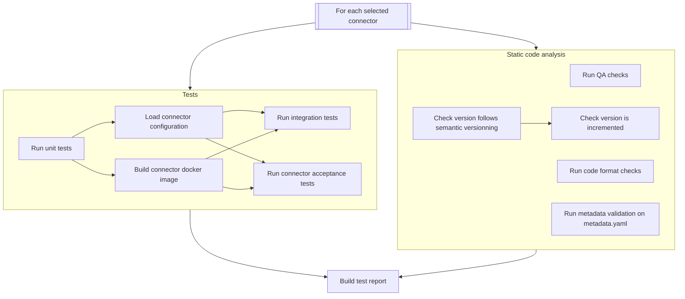
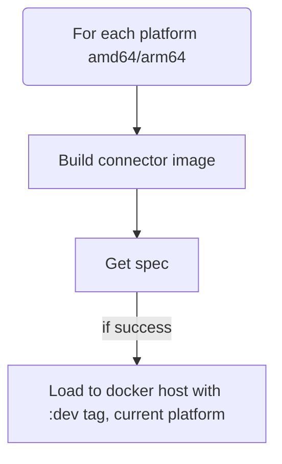
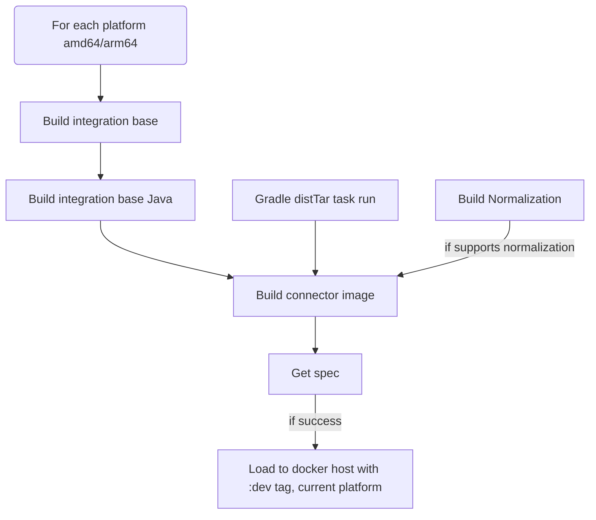
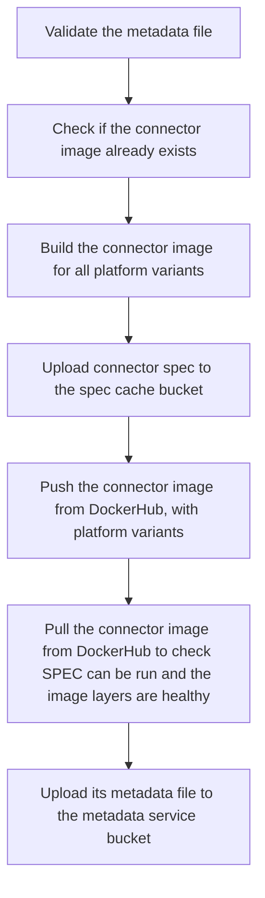
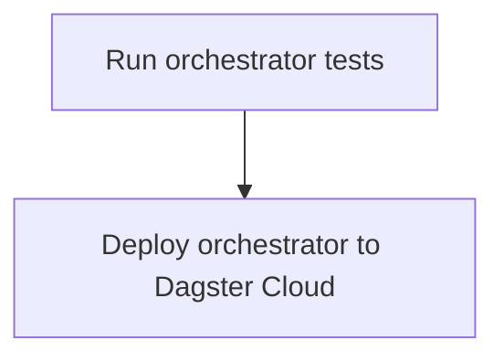

# Airbyte CI CLI

## What is it?
`airbyte-ci` is a command line interface to run CI/CD pipelines.
The goal of this CLI is to offer developers a tool to run these pipelines locally and in a CI context with the same guarantee.
It can prevent unnecessary commit -> push cycles developers typically go through when they when to test their changes against a remote CI.
This is made possible thanks to the use of [Dagger](https://dagger.io), a CI/CD engine relying on Docker Buildkit to provide reproducible builds.
Our pipeline are declared with Python code, the main entrypoint is [here](https://github.com/airbytehq/airbyte/blob/master/airbyte-ci/connector_ops/connector_ops/pipelines/commands/airbyte_ci.py).
This documentation should be helpful for both local and CI use of the CLI. We indeed [power connector testing in the CI with this CLI](https://github.com/airbytehq/airbyte/blob/master/.github/workflows/connector_integration_test_single_dagger.yml#L78).

## How to install
### Requirements
* A running Docker engine with version >= 20.10.23
* Python >= 3.10
* [pipx](https://pypa.github.io/pipx/installation/)


## Install or Update

The recommended way to install `airbyte-ci` is using pipx. This ensures the tool and its dependencies are isolated from your other Python projects.

If you havent installed pyenv, you can do it with brew:

```bash
brew update
brew install pyenv
```

If you haven't installed pipx, you can do it with pip:

```bash
pyenv install # ensure you have the correct python version
python -m pip install --user pipx
python -m pipx ensurepath
```

Once pyenv and pipx is installed then run the following:

```bash
# install airbyte-ci
pipx install --editable --force --python=python3.10 airbyte-ci/connectors/pipelines/
```

This command installs `airbyte-ci` and makes it globally available in your terminal.

_Note: `--force` is required to ensure updates are applied on subsequent installs._
_Note: `--python=python3.10` is required to ensure the correct python version is used._
_Note: `--editable` is required to ensure the correct python version is used._

If you face any installation problems feel free to reach out the Airbyte Connectors Operations team.

### Setting up connector secrets access

If you plan to use Airbyte CI to run CAT (Connector Acceptance Tests), we recommend setting up GSM
access so that Airbyte CI can pull remote secrets from GSM. For setup instructions, see the 
CI Credentials package (which Airbyte CI uses under the hood) README's 
[Get GSM Access](https://github.com/airbytehq/airbyte/blob/master/airbyte-ci/connectors/ci_credentials/README.md#get-gsm-access)
instructions.

### Updating the airbyte-ci tool
To reinstall airbyte-ci:

```sh
pipx reinstall pipelines
```

## Installation for development

#### Pre-requisites
* Poetry >= 1.1.8
* Python >= 3.10

#### Installation

If you are developing on pipelines, we recommend installing airbyte-ci in editable mode:

```bash
cd airbyte-ci/connectors/pipelines/
poetry install
poetry shell
cd ../../
```

At this point you can run `airbyte-ci` commands.

## Commands reference
- [`airbyte-ci` command group](#airbyte-ci)
  * [Options](#options)
- [`connectors` command subgroup](#connectors-command-subgroup)
  * [Options](#options-1)
- [`connectors list` command](#connectors-list-command)
- [`connectors test` command](#connectors-test-command)
  * [Examples](#examples-)
  * [What it runs](#what-it-runs-)
- [`connectors build` command](#connectors-build-command)
  * [What it runs](#what-it-runs)
- [`connectors publish` command](#connectors-publish-command)
- [Examples](#examples)
- [Options](#options-2)
- [`connectors bump_version` command](#connectors-bump_version)
- [`connectors upgrade_base_image` command](#connectors-upgrade_base_image)
- [`connectors migrate_to_base_image` command](#connectors-migrate_to_base_image)
- [`metadata` command subgroup](#metadata-command-subgroup)
- [`metadata validate` command](#metadata-validate-command)
  * [Example](#example)
  * [Options](#options-3)
- [`metadata upload` command](#metadata-upload-command)
  * [Example](#example-1)
  * [Options](#options-4)
- [`metadata deploy orchestrator` command](#metadata-deploy-orchestrator-command)
  * [Example](#example-2)
  * [What it runs](#what-it-runs--1)
- [`metadata test lib` command](#metadata-test-lib-command)
  * [Example](#example-3)
- [`metadata test orchestrator` command](#metadata-test-orchestrator-command)
  * [Example](#example-4)
- [`tests` command](#test-command)
  * [Example](#example-5)
### <a id="airbyte-ci-command-group"></a>`airbyte-ci` command group
**The main command group option has sensible defaults. In local use cases you're not likely to pass options to the `airbyte-ci` command group.**

#### Options

| Option                                  | Default value                   | Mapped environment variable   | Description                                                                                 |
| --------------------------------------- | ------------------------------- | ----------------------------- | ------------------------------------------------------------------------------------------- |
| `--no-tui`                              |                                 |                               | Disables the Dagger terminal UI.                                                            |
| `--is-local/--is-ci`                    | `--is-local`                    |                               | Determines the environment in which the CLI runs: local environment or CI environment.      |
| `--git-branch`                          | The checked out git branch name | `CI_GIT_BRANCH`               | The git branch on which the pipelines will run.                                             |
| `--git-revision`                        | The current branch head         | `CI_GIT_REVISION`             | The commit hash on which the pipelines will run.                                            |
| `--diffed-branch`                       | `origin/master`                 |                               | Branch to which the git diff will happen to detect new or modified files.                   |
| `--gha-workflow-run-id`                 |                                 |                               | GHA CI only - The run id of the GitHub action workflow                                      |
| `--ci-context`                          | `manual`                        |                               | The current CI context: `manual` for manual run, `pull_request`, `nightly_builds`, `master` |
| `--pipeline-start-timestamp`            | Current epoch time              | `CI_PIPELINE_START_TIMESTAMP` | Start time of the pipeline as epoch time. Used for pipeline run duration computation.       |
| `--show-dagger-logs/--hide-dagger-logs` | `--hide-dagger-logs`            |                               | Flag to show or hide the dagger logs.                                                       |

### <a id="connectors-command-subgroup"></a>`connectors` command subgroup

Available commands:
* `airbyte-ci connectors test`: Run tests for one or multiple connectors.
* `airbyte-ci connectors build`: Build docker images for one or multiple connectors.
* `airbyte-ci connectors publish`: Publish a connector to Airbyte's DockerHub.

#### Options
| Option                                                         | Multiple | Default value                    | Mapped Environment Variable | Description                                                                                                                                                                                                                                                                                                                                                                                                                                                                               |
| -------------------------------------------------------------- | -------- | -------------------------------- | --------------------------- | ----------------------------------------------------------------------------------------------------------------------------------------------------------------------------------------------------------------------------------------------------------------------------------------------------------------------------------------------------------------------------------------------------------------------------------------------------------------------------------------- |
| `--use-remote-secrets/--use-local-secrets`                     | False    |                                  |                             | If --use-remote-secrets, connectors configuration will be pulled from Google Secret Manager. Requires the `GCP_GSM_CREDENTIALS` environment variable to be set with a service account with permission to read GSM secrets. If --use-local-secrets the connector configuration will be read from the local connector `secrets` folder. If this flag is not used and a `GCP_GSM_CREDENTIALS` environment variable is set remote secrets will be used, local secrets will be used otherwise. |
| `--name`                                                       | True     |                                  |                             | Select a specific connector for which the pipeline will run. Can be used multiple times to select multiple connectors. The expected name is the connector technical name. e.g. `source-pokeapi`                                                                                                                                                                                                                                                                                           |
| `--support-level`                                              | True     |                                  |                             | Select connectors with a specific support level: `community`, `certified`. Can be used multiple times to select multiple support levels.                                                                                                                                                                                                                                                                                                                                                  |
| `--metadata-query`                                             | False    |                                  |                             | Filter connectors by the `data` field in the metadata file using a [simpleeval](https://github.com/danthedeckie/simpleeval) query. e.g. 'data.ab_internal.ql == 200'                                                                                                                                                                                                                                                                                                                      |
| `--use-local-cdk`                                              | False    | False                            |                             | Build with the airbyte-cdk from the local repository. " "This is useful for testing changes to the CDK.                                                                                                                                                                                                                                                                                                                                                                                   |
| `--language`                                                   | True     |                                  |                             | Select connectors with a specific language: `python`, `low-code`, `java`. Can be used multiple times to select multiple languages.                                                                                                                                                                                                                                                                                                                                                        |
| `--modified`                                                   | False    | False                            |                             | Run the pipeline on only the modified connectors on the branch or previous commit (depends on the pipeline implementation).                                                                                                                                                                                                                                                                                                                                                               |
| `--concurrency`                                                | False    | 5                                |                             | Control the number of connector pipelines that can run in parallel. Useful to speed up pipelines or control their resource usage.                                                                                                                                                                                                                                                                                                                                                         |
| `--metadata-change-only/--not-metadata-change-only`            | False    | `--not-metadata-change-only`     |                             | Only run the pipeline on connectors with changes on their metadata.yaml file.                                                                                                                                                                                                                                                                                                                                                                                                             |
| `--enable-dependency-scanning / --disable-dependency-scanning` | False    | ` --disable-dependency-scanning` |                             | When enabled the dependency scanning will be performed to detect the connectors to select according to a dependency change.                                                                                                                                                                                                                                                                                                                                                               |
| `--docker-hub-username`                                        |          |                                  | DOCKER_HUB_USERNAME         | Your username to connect to DockerHub. Required for the publish subcommand.                                                                                                                                                                                                                                                                                                                                                                                                               |
| `--docker-hub-password`                                        |          |                                  | DOCKER_HUB_PASSWORD         | Your password to connect to DockerHub. Required for the publish subcommand.                                                                                                                                                                                                                                                                                                                                                                                                               |
                                                                                                                                           

### <a id="connectors-list-command"></a>`connectors list` command
Retrieve the list of connectors satisfying the provided filters.

#### Examples
List all connectors:

`airbyte-ci connectors list`

List certified connectors:

`airbyte-ci connectors --support-level=certified list`

List connectors changed on the current branch:

`airbyte-ci connectors --modified list`

List connectors with a specific language:

`airbyte-ci connectors --language=python list`

List connectors with multiple filters:

`airbyte-ci connectors --language=low-code --support-level=certified list`


### <a id="connectors-test-command"></a>`connectors test` command
Run a test pipeline for one or multiple connectors.

#### Examples

Test a single connector:
`airbyte-ci connectors --name=source-pokeapi test`

Test multiple connectors:
`airbyte-ci connectors --name=source-pokeapi --name=source-bigquery test`

Test certified connectors:
`airbyte-ci connectors --support-level=certified test`

Test connectors changed on the current branch:
`airbyte-ci connectors --modified test`

#### What it runs


#### Options

| Option              | Multiple | Default value | Description                                                                                                                                                                                              |
| ------------------- | -------- | ------------- | -------------------------------------------------------------------------------------------------------------------------------------------------------------------------------------------------------- |
| `--fail-fast`       | False    | False         | Abort after any tests fail, rather than continuing to run additional tests. Use this setting to confirm a known bug is fixed (or not), or when you only require a pass/fail result.                      |
| `--fast-tests-only` | True     | False         | Run unit tests only, skipping integration tests or any tests explicitly tagged as slow. Use this for more frequent checks, when it is not feasible to run the entire test suite.                         |
| `--code-tests-only` | True     | False         | Skip any tests not directly related to code updates. For instance, metadata checks, version bump checks, changelog verification, etc. Use this setting to help focus on code quality during development. |
| `--concurrent-cat`  | False    | False         | Make CAT tests run concurrently using pytest-xdist. Be careful about source or destination API rate limits.                                                                                              |

Note:

* The above options are implemented for Java connectors but may not be available for Python connectors. If an option is not supported, the pipeline will not fail but instead the 'default' behavior will be executed.

### <a id="connectors-build-command"></a>`connectors build` command
Run a build pipeline for one or multiple connectors and export the built docker image to the local docker host.
It's mainly purposed for local use.

Build a single connector:
`airbyte-ci connectors --name=source-pokeapi build`

Build multiple connectors:
`airbyte-ci connectors --name=source-pokeapi --name=source-bigquery build`

Build certified connectors:
`airbyte-ci connectors --support-level=certified build`

Build connectors changed on the current branch:
`airbyte-ci connectors --modified build`

#### What it runs

For Python and Low Code connectors:



For Java connectors:


### <a id="connectors-publish-command"></a>`connectors publish` command
Run a publish pipeline for one or multiple connectors.
It's mainly purposed for CI use to release a connector update.

### Examples
Publish all connectors modified in the head commit: `airbyte-ci connectors --modified publish`

### Options

| Option                               | Required | Default         | Mapped environment variable        | Description                                                                                                                                                                               |
| ------------------------------------ | -------- | --------------- | ---------------------------------- | ----------------------------------------------------------------------------------------------------------------------------------------------------------------------------------------- |
| `--pre-release/--main-release`       | False    | `--pre-release` |                                    | Whether to publish the pre-release or the main release version of a connector. Defaults to pre-release. For main release you have to set the credentials to interact with the GCS bucket. |
| `--spec-cache-gcs-credentials`       | False    |                 | `SPEC_CACHE_GCS_CREDENTIALS`       | The service account key to upload files to the GCS bucket hosting spec cache.                                                                                                             |
| `--spec-cache-bucket-name`           | False    |                 | `SPEC_CACHE_BUCKET_NAME`           | The name of the GCS bucket where specs will be cached.                                                                                                                                    |
| `--metadata-service-gcs-credentials` | False    |                 | `METADATA_SERVICE_GCS_CREDENTIALS` | The service account key to upload files to the GCS bucket hosting the metadata files.                                                                                                     |
| `--metadata-service-bucket-name`     | False    |                 | `METADATA_SERVICE_BUCKET_NAME`     | The name of the GCS bucket where metadata files will be uploaded.                                                                                                                         |
| `--slack-webhook`                    | False    |                 | `SLACK_WEBHOOK`                    | The Slack webhook URL to send notifications to.                                                                                                                                           |
| `--slack-channel`                    | False    |                 | `SLACK_CHANNEL`                    | The Slack channel name to send notifications to.                                                                                                                                          |

I've added an empty "Default" column, and you can fill in the default values as needed.
#### What it runs



### <a id="connectors-bump_version"></a>`connectors bump_version` command
Bump the version of the selected connectors.

### Examples
Bump source-openweather: `airbyte-ci connectors --name=source-openweather bump_version patch <pr-number> "<changelog-entry>"`

#### Arguments
| Argument              | Description                                                            |
| --------------------- | ---------------------------------------------------------------------- |
| `BUMP_TYPE`           | major, minor or patch                                                  |
| `PULL_REQUEST_NUMBER` | The GitHub pull request number, used in the changelog entry            |
| `CHANGELOG_ENTRY`     | The changelog entry that will get added to the connector documentation |

### <a id="connectors-upgrade_base_image"></a>`connectors upgrade_base_image` command
Modify the selected connector metadata to use the latest base image version.

### Examples
Upgrade the base image for source-openweather: `airbyte-ci connectors --name=source-openweather upgrade_base_image`

### Options
| Option                  | Required | Default | Mapped environment variable | Description                                                                                                     |
| ----------------------- | -------- | ------- | --------------------------- | --------------------------------------------------------------------------------------------------------------- |
| `--docker-hub-username` | True     |         | `DOCKER_HUB_USERNAME`       | Your username to connect to DockerHub. It's used to read the base image registry.                               |
| `--docker-hub-password` | True     |         | `DOCKER_HUB_PASSWORD`       | Your password to connect to DockerHub. It's used to read the base image registry.                               |
| `--set-if-not-exists`   | False    | True    |                             | Whether to set or not the baseImage metadata if no connectorBuildOptions is declared in the connector metadata. |

### <a id="connectors-migrate_to_base_image"></a>`connectors migrate_to_base_image` command
Make a connector using a Dockerfile migrate to the base image by:
* Removing its Dockerfile
* Updating its metadata to use the latest base image version
* Updating its documentation to explain the build process
* Bumping by a patch version

### Examples
Migrate source-openweather to use the base image: `airbyte-ci connectors --name=source-openweather migrate_to_base_image`

### Arguments
| Argument              | Description                                                 |
| --------------------- | ----------------------------------------------------------- |
| `PULL_REQUEST_NUMBER` | The GitHub pull request number, used in the changelog entry |

### <a id="metadata-validate-command-subgroup"></a>`metadata` command subgroup

Available commands:
* `airbyte-ci metadata deploy orchestrator`

### <a id="metadata-upload-orchestrator"></a>`metadata deploy orchestrator` command
This command deploys the metadata service orchestrator to production.
The `DAGSTER_CLOUD_METADATA_API_TOKEN` environment variable must be set.

#### Example
`airbyte-ci metadata deploy orchestrator`

#### What it runs


### <a id="tests-command"></a>`tests` command
This command runs the Python tests for a airbyte-ci poetry package.

#### Arguments
| Option                | Required | Default | Mapped environment variable | Description                         |
| --------------------- | -------- | ------- | --------------------------- | ----------------------------------- |
| `poetry_package_path` | True     |         |                             | The path to poetry package to test. |

#### Options
| Option             | Required | Default | Mapped environment variable | Description                                                                                      |
| ------------------ | -------- | ------- | --------------------------- | ------------------------------------------------------------------------------------------------ |
| `--test-directory` | False    | tests   |                             | The path to the directory on which pytest should discover tests, relative to the poetry package. |


#### Example
`airbyte-ci test airbyte-ci/connectors/pipelines --test-directory=tests`
`airbyte-ci tests airbyte-integrations/bases/connector-acceptance-test --test-directory=unit_tests`

## Changelog
| Version | PR                                                         | Description                                                                                               |
| ------- | ---------------------------------------------------------- | --------------------------------------------------------------------------------------------------------- |
| 2.5.5   | [#32114](https://github.com/airbytehq/airbyte/pull/32114)  | Create cache mount for `/var/lib/docker` to store images in `dind` context.                            |
| 2.5.4   | [#32090](https://github.com/airbytehq/airbyte/pull/32090)  | Do not cache `docker login`.                            |
| 2.5.3   | [#31974](https://github.com/airbytehq/airbyte/pull/31974)  | Fix latest CDK install and pip cache mount on connector install.                            |
| 2.5.2   | [#31871](https://github.com/airbytehq/airbyte/pull/31871)  | Deactivate PR comments, add HTML report links to the PR status when its ready.                            |
| 2.5.1   | [#31774](https://github.com/airbytehq/airbyte/pull/31774)  | Add a docker configuration check on `airbyte-ci` startup.                                                 |
| 2.5.0   | [#31766](https://github.com/airbytehq/airbyte/pull/31766)  | Support local connectors secrets.                                                                         |
| 2.4.0   | [#31716](https://github.com/airbytehq/airbyte/pull/31716)  | Enable pre-release publish with local CDK.                                                                |
| 2.3.1   | [#31748](https://github.com/airbytehq/airbyte/pull/31748)  | Use AsyncClick library instead of base Click.                                                             |
| 2.3.0   | [#31699](https://github.com/airbytehq/airbyte/pull/31699)  | Support optional concurrent CAT execution.                                                                |
| 2.2.6   | [#31752](https://github.com/airbytehq/airbyte/pull/31752)  | Only authenticate when secrets are available.                                                             |
| 2.2.5   | [#31718](https://github.com/airbytehq/airbyte/pull/31718)  | Authenticate the sidecar docker daemon to DockerHub.                                                      |
| 2.2.4   | [#31535](https://github.com/airbytehq/airbyte/pull/31535)  | Improve gradle caching when building java connectors.                                                     |
| 2.2.3   | [#31688](https://github.com/airbytehq/airbyte/pull/31688)  | Fix failing `CheckBaseImageUse` step when not running on PR.                                              |
| 2.2.2   | [#31659](https://github.com/airbytehq/airbyte/pull/31659)  | Support builds on x86_64 platform                                                                         |
| 2.2.1   | [#31653](https://github.com/airbytehq/airbyte/pull/31653)  | Fix CheckBaseImageIsUsed failing on non certified connectors.                                             |
| 2.2.0   | [#30527](https://github.com/airbytehq/airbyte/pull/30527)  | Add a new check for python connectors to make sure certified connectors use our base image.               |
| 2.1.1   | [#31488](https://github.com/airbytehq/airbyte/pull/31488)  | Improve `airbyte-ci` start time with Click Lazy load                                                      |
| 2.1.0   | [#31412](https://github.com/airbytehq/airbyte/pull/31412)  | Run airbyte-ci from any where in airbyte project                                                          |
| 2.0.4   | [#31487](https://github.com/airbytehq/airbyte/pull/31487)  | Allow for third party connector selections                                                                |
| 2.0.3   | [#31525](https://github.com/airbytehq/airbyte/pull/31525)  | Refactor folder structure                                                                                 |
| 2.0.2   | [#31533](https://github.com/airbytehq/airbyte/pull/31533)  | Pip cache volume by python version.                                                                       |
| 2.0.1   | [#31545](https://github.com/airbytehq/airbyte/pull/31545)  | Reword the changelog entry when using `migrate_to_base_image`.                                            |
| 2.0.0   | [#31424](https://github.com/airbytehq/airbyte/pull/31424)  | Remove `airbyte-ci connectors format` command.                                                            |
| 1.9.4   | [#31478](https://github.com/airbytehq/airbyte/pull/31478)  | Fix running tests for connector-ops package.                                                              |
| 1.9.3   | [#31457](https://github.com/airbytehq/airbyte/pull/31457)  | Improve the connector documentation for connectors migrated to our base image.                            |
| 1.9.2   | [#31426](https://github.com/airbytehq/airbyte/pull/31426)  | Concurrent execution of java connectors tests.                                                            |
| 1.9.1   | [#31455](https://github.com/airbytehq/airbyte/pull/31455)  | Fix `None` docker credentials on publish.                                                                 |
| 1.9.0   | [#30520](https://github.com/airbytehq/airbyte/pull/30520)  | New commands: `bump_version`, `upgrade_base_image`, `migrate_to_base_image`.                              |
| 1.8.0   | [#30520](https://github.com/airbytehq/airbyte/pull/30520)  | New commands: `bump_version`, `upgrade_base_image`, `migrate_to_base_image`.                              |
| 1.7.2   | [#31343](https://github.com/airbytehq/airbyte/pull/31343)  | Bind Pytest integration tests to a dockerhost.                                                            |
| 1.7.1   | [#31332](https://github.com/airbytehq/airbyte/pull/31332)  | Disable Gradle step caching on source-postgres.                                                           |
| 1.7.0   | [#30526](https://github.com/airbytehq/airbyte/pull/30526)  | Implement pre/post install hooks support.                                                                 |
| 1.6.0   | [#30474](https://github.com/airbytehq/airbyte/pull/30474)  | Test connector inside their containers.                                                                   |
| 1.5.1   | [#31227](https://github.com/airbytehq/airbyte/pull/31227)  | Use python 3.11 in amazoncorretto-bazed gradle containers, run 'test' gradle task instead of 'check'.     |
| 1.5.0   | [#30456](https://github.com/airbytehq/airbyte/pull/30456)  | Start building Python connectors using our base images.                                                   |
| 1.4.6   | [ #31087](https://github.com/airbytehq/airbyte/pull/31087) | Throw error if airbyte-ci tools is out of date                                                            |
| 1.4.5   | [#31133](https://github.com/airbytehq/airbyte/pull/31133)  | Fix bug when building containers using `with_integration_base_java_and_normalization`.                    |
| 1.4.4   | [#30743](https://github.com/airbytehq/airbyte/pull/30743)  | Add `--disable-report-auto-open` and `--use-host-gradle-dist-tar` to allow gradle integration.            |
| 1.4.3   | [#30595](https://github.com/airbytehq/airbyte/pull/30595)  | Add --version and version check                                                                           |
| 1.4.2   | [#30595](https://github.com/airbytehq/airbyte/pull/30595)  | Remove directory name requirement                                                                         |
| 1.4.1   | [#30595](https://github.com/airbytehq/airbyte/pull/30595)  | Load base migration guide into QA Test container for strict encrypt variants                              |
| 1.4.0   | [#30330](https://github.com/airbytehq/airbyte/pull/30330)  | Add support for pyproject.toml as the prefered entry point for a connector package                        |
| 1.3.0   | [#30461](https://github.com/airbytehq/airbyte/pull/30461)  | Add `--use-local-cdk` flag to all connectors commands                                                     |
| 1.2.3   | [#30477](https://github.com/airbytehq/airbyte/pull/30477)  | Fix a test regression introduced the previous version.                                                    |
| 1.2.2   | [#30438](https://github.com/airbytehq/airbyte/pull/30438)  | Add workaround to always stream logs properly with --is-local.                                            |
| 1.2.1   | [#30384](https://github.com/airbytehq/airbyte/pull/30384)  | Java connector test performance fixes.                                                                    |
| 1.2.0   | [#30330](https://github.com/airbytehq/airbyte/pull/30330)  | Add `--metadata-query` option to connectors command                                                       |
| 1.1.3   | [#30314](https://github.com/airbytehq/airbyte/pull/30314)  | Stop patching gradle files to make them work with airbyte-ci.                                             |
| 1.1.2   | [#30279](https://github.com/airbytehq/airbyte/pull/30279)  | Fix correctness issues in layer caching by making atomic execution groupings                              |
| 1.1.1   | [#30252](https://github.com/airbytehq/airbyte/pull/30252)  | Fix redundancies and broken logic in GradleTask, to speed up the CI runs.                                 |
| 1.1.0   | [#29509](https://github.com/airbytehq/airbyte/pull/29509)  | Refactor the airbyte-ci test command to run tests on any poetry package.                                  |
| 1.0.0   | [#28000](https://github.com/airbytehq/airbyte/pull/29232)  | Remove release stages in favor of support level from airbyte-ci.                                          |
| 0.5.0   | [#28000](https://github.com/airbytehq/airbyte/pull/28000)  | Run connector acceptance tests with dagger-in-dagger.                                                     |
| 0.4.7   | [#29156](https://github.com/airbytehq/airbyte/pull/29156)  | Improve how we check existence of requirement.txt or setup.py file to not raise early pip install errors. |
| 0.4.6   | [#28729](https://github.com/airbytehq/airbyte/pull/28729)  | Use keyword args instead of positional argument for optional  paramater in Dagger's API                   |
| 0.4.5   | [#29034](https://github.com/airbytehq/airbyte/pull/29034)  | Disable Dagger terminal UI when running publish.                                                          |
| 0.4.4   | [#29064](https://github.com/airbytehq/airbyte/pull/29064)  | Make connector modified files a frozen set.                                                               |
| 0.4.3   | [#29033](https://github.com/airbytehq/airbyte/pull/29033)  | Disable dependency scanning for Java connectors.                                                          |
| 0.4.2   | [#29030](https://github.com/airbytehq/airbyte/pull/29030)  | Make report path always have the same prefix: `airbyte-ci/`.                                              |
| 0.4.1   | [#28855](https://github.com/airbytehq/airbyte/pull/28855)  | Improve the selected connectors detection for connectors commands.                                        |
| 0.4.0   | [#28947](https://github.com/airbytehq/airbyte/pull/28947)  | Show Dagger Cloud run URLs in CI                                                                          |
| 0.3.2   | [#28789](https://github.com/airbytehq/airbyte/pull/28789)  | Do not consider empty reports as successfull.                                                             |
| 0.3.1   | [#28938](https://github.com/airbytehq/airbyte/pull/28938)  | Handle 5 status code on MetadataUpload as skipped                                                         |
| 0.3.0   | [#28869](https://github.com/airbytehq/airbyte/pull/28869)  | Enable the Dagger terminal UI on local `airbyte-ci` execution                                             |
| 0.2.3   | [#28907](https://github.com/airbytehq/airbyte/pull/28907)  | Make dagger-in-dagger work for `airbyte-ci tests` command                                                 |
| 0.2.2   | [#28897](https://github.com/airbytehq/airbyte/pull/28897)  | Sentry: Ignore error logs without exceptions from reporting                                               |
| 0.2.1   | [#28767](https://github.com/airbytehq/airbyte/pull/28767)  | Improve pytest step result evaluation to prevent false negative/positive.                                 |
| 0.2.0   | [#28857](https://github.com/airbytehq/airbyte/pull/28857)  | Add the `airbyte-ci tests` command to run the test suite on any `airbyte-ci` poetry package.              |
| 0.1.1   | [#28858](https://github.com/airbytehq/airbyte/pull/28858)  | Increase the max duration of Connector Package install to 20mn.                                           |
| 0.1.0   |                                                            | Alpha version not in production yet. All the commands described in this doc are available.                |

## More info
This project is owned by the Connectors Operations team.
We share project updates and remaining stories before its release to production in this [EPIC](https://github.com/airbytehq/airbyte/issues/24403).

# Troubleshooting
## `airbyte-ci` is not found
If you get the following error when running `airbyte-ci`:
```bash
$ airbyte-ci
zsh: command not found: airbyte-ci
```
It means that the `airbyte-ci` command is not in your PATH.

To fix this, you can either:
* Ensure that airbyte-ci is installed with pipx. Run `pipx list` to check if airbyte-ci is installed.
* Run `pipx ensurepath` to add the pipx binary directory to your PATH.
* Add the pipx binary directory to your PATH manually. The pipx binary directory is usually `~/.local/bin`.


## python3.10 not found
If you get the following error when running `pipx install --editable --force --python=python3.10 airbyte-ci/connectors/pipelines/`:
```bash
$ pipx install --editable --force --python=python3.10 airbyte-ci/connectors/pipelines/
Error: Python 3.10 not found on your system.
```

It means that you don't have Python 3.10 installed on your system.

To fix this, you can either:
* Install Python 3.10 with pyenv. Run `pyenv install 3.10` to install the latest Python version.
* Install Python 3.10 with your system package manager. For instance, on Ubuntu you can run `sudo apt install python3.10`.
* Ensure that Python 3.10 is in your PATH. Run `which python3.10` to check if Python 3.10 is installed and in your PATH.

## Any type of pipeline failure
First you should check that the version of the CLI you are using is the latest one.
You can check the version of the CLI with the `--version` option:
```bash
$ airbyte-ci --version
airbyte-ci, version 0.1.0
```

and compare it with the version in the pyproject.toml file:
```bash
$ cat airbyte-ci/connectors/pipelines/pyproject.toml | grep version
```

If you get any type of pipeline failure, you can run the pipeline with the `--show-dagger-logs` option to get more information about the failure.
```bash
$ airbyte-ci --show-dagger-logs connectors --name=source-pokeapi test
```

and when in doubt, you can reinstall the CLI with the `--force` option:
```bash
$ pipx reinstall pipelines --force
```

