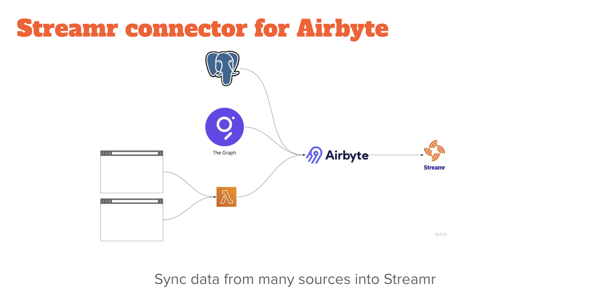
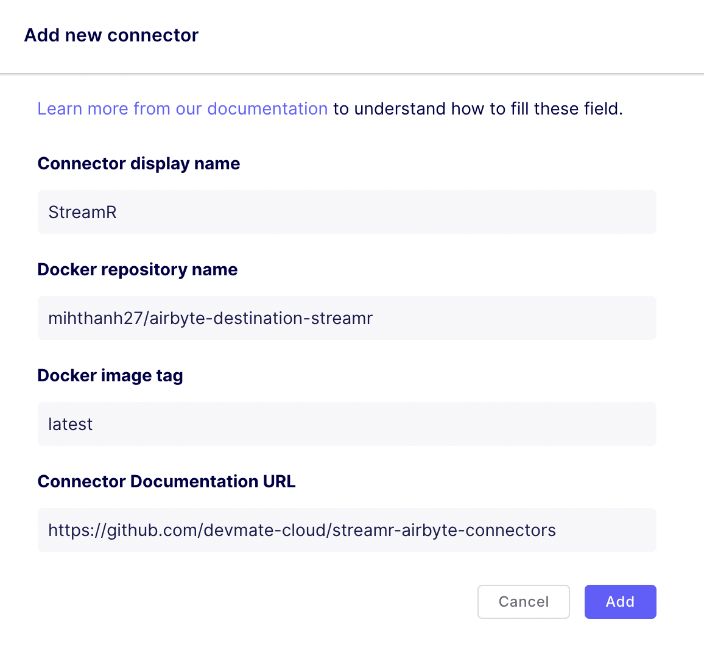

# Streamr Airbyte Destination



# Airbyte + Streamr
- Data ingestion is hard, Airbyte makes it more easy and scalable
- Take advantage of many data sources from files, api, databases,...
- Let users have a choice other than traditional, centralize solutions (Kafka, BigQuery, Snowflake,...)

# Docker images

https://hub.docker.com/repository/docker/mihthanh27/airbyte-destination-streamr
```
docker pull mihthanh27/airbyte-destination-streamr
```

# How to use
Go to Airbyte > Settings > Destination



# Development

1. Install [`nvm`](https://github.com/nvm-sh/nvm#installing-and-updating)
2. Install Node.js `nvm install 14 && nvm use 14`
3. Update `npm` to version 7.x by running `npm install -g npm@7`
4. Install `lerna` by running `npm install -g lerna`
5. Run `npm run prepare` to install dependencies for all projects (`npm run clean` to clean all)
6. Run `npm run build` to build all projects (for a single project add scope, e.g `npm run build -- --scope faros-destination`)
7. Run `npm run test` to test all projects (for a single project add scope, e.g `npm run test -- --scope faros-destination`)
8. Run `npm run lint` to apply linter on all projects (for a single project add scope, e.g `npm run lint -- --scope faros-destination`)

## Other useful commands

1. Audit fix `npm audit fix`
2. Clean your project `lerna run clean` (sometimes you also wanna `rm -rf ./node_modules`)

Read more about `lerna` here - https://github.com/lerna/lerna

# Build Docker images

In order to build a Docker image for a connector run the `docker build` command and set `path` argument.
For example for Faros Destination connector run:

```shell
docker build . --build-arg path=destinations/streamr-destination -t airbyte-destination-streamr
```

And then run it:
```shell
docker run airbyte-destination-streamr
```

# Releasing

## Publish Connector Docker images

Connector Docker images are automatically published to Docker Hub after updates
to the main branch. They are tagged by the version listed in the connector's
`package.json`. If the connector is updated without incrementing the version,
GitHub will **NOT** overwrite the existing image in Docker Hub.
