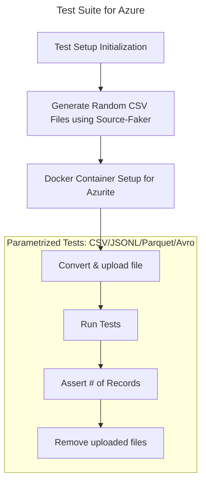

# Integration Tests for Azure Blob Storage

## Prerequisites
- `build_customization.py` to install `docker` package in base image
- `config-*.json` and `configured_catalog.json`
- `source-faker` configuration inside `./csv_export` folder. `secret_faker.json` has property `count` which represents number of records per file.

## Test Suite

- `Generate Random CSV Files` calls main.sh in subprocess and wait till 3 csv files will be generated.
- `Docker Container Setup` runs container with `Azurite server emulator` on localhost.
- `Convert & upload file` part reads `.csv` and uploads multiple files of desired format (CSV/JSONL/Parquet/Avro) to Azurite.
- `Tests` assert number of records read from source using provided catalog.
- After every test finishes, all uploaded files are deleted.