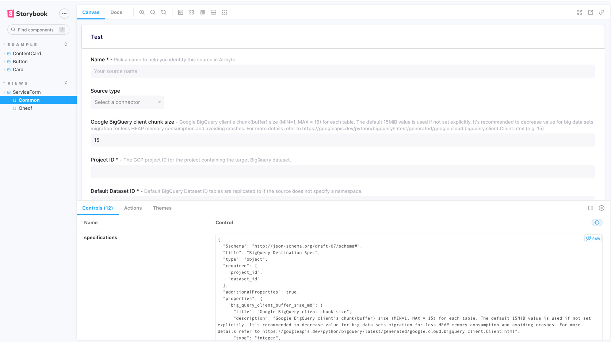

0. Run `npm install` (make sure to install node 16 if you don't already have it)
1. Run `npm run storybook` in `airbyte-webapp` directory
2. Open `ServiceForm` component story http://localhost:9009/?path=/story/views-serviceform--source
3. Press `raw` on the specifications property, so you will be able to paste a json structured string
4. Edit specifications property to the connectionConfigration you want

e.g.
```
{
    "$schema": "http://json-schema.org/draft-07/schema#",
    "title": "BigQuery Destination Spec",
    "type": "object",
    "required": ["project_id", "dataset_id"],
    "properties": {
      "project_id": {
        "type": "string",
        "description": "The GCP project ID for the project containing the target BigQuery dataset.",
        "title": "Project ID"
      },
      "dataset_id": {
        "type": "string",
        "description": "Default BigQuery Dataset ID tables are replicated to if the source does not specify a namespace.",
        "title": "Default Dataset ID"
      },
      "credentials_json": {
        "type": "string",
        "description": "The contents of the JSON service account key. Check out the <a href=\"https://docs.airbyte.io/integrations/destinations/bigquery\">docs</a> if you need help generating this key. Default credentials will be used if this field is left empty.",
        "title": "Credentials JSON",
        "airbyte_secret": true
      }
    }
  }
```


