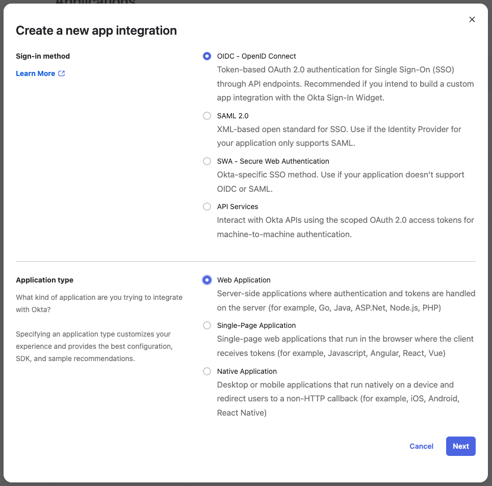

import Tabs from "@theme/Tabs";
import TabItem from "@theme/TabItem";

# Setup Single Sign-On via Okta

This page guides you through setting up Okta for [Single Sign-On](../sso.md) with Airbyte.

Airbyte will communicate with your Okta account using OpenID Connect (OIDC).

## Creating an Okta app for Airbyte

:::info
The following steps need to be executed by an administrator of your company's Okta account.
:::

You will need to create a new Okta OIDC App Integration for your Airbyte. Documentation on how to do this in Okta can be found [here](https://help.okta.com/en-us/content/topics/apps/apps_app_integration_wizard_oidc.htm).

You should create an app integration with **OIDC - OpenID Connect** as the sign-in method and **Web Application** as the application type:



On the following screen you'll need to configure all parameters for your Okta application:

<Tabs groupId="cloud-hosted">
  <TabItem value="cloud" label="Cloud">
    You'll require to know your **Company Identifier** to fill in those values. You receive this
    from your contact at Airbyte.

    Create the application with the following parameters:

    <dl>
      <dt>**App integration name**</dt>
      <dd>A human readable name for the application (e.g. **Airbyte Cloud**). This is only used for identification inside your Okta dashboard.</dd>
      <dt>**Logo** (optional)</dt>
      <dd>You can upload an Airbyte logo, which you can find at https://airbyte.com/company/press</dd>
      <dt>**Grant type**</dt>
      <dd>Only **Authorization Code** should be selected</dd>
      <dt>**Sign-in redirect URIs**</dt>
      <dd>
      ```
      https://cloud.airbyte.com/auth/realms/<your-company-identifier>/broker/default/endpoint
      ```
      </dd>
      <dt>**Sign-out redirect URIs**</dt>
      <dd>
      ```
      https://cloud.airbyte.com/auth/realms/<your-company-identifier>/broker/default/endpoint/logout_response
      ```
      </dd>
      <dt>**Trusted Origins**</dt>
      <dd>Leave empty</dd>
      <dt>**Assignments > Controlled Access**</dt>
      <dd>You can control whether everyone in your Okta organization should be able to access Airbyte using their Okta account or limit it only to a subset of your users by selecting specific groups who should get access.</dd>
    </dl>

    You'll need to pass your Airbyte contact the following information of the created application. After that we'll setup SSO for you and let you know once it's ready.

    * Your **Okta domain** (it's not specific to this application, see [Find your Okta domain](https://developer.okta.com/docs/guides/find-your-domain/main/))
    * **Client ID**
    * **Client Secret**
    * **Email Domain** (users signing in from this domain will be required to sign in via SSO)

  :::warning
  For security purposes, existing [Applications](https://reference.airbyte.com/reference/authentication) used to access the Airbyte API that were created before enabling SSO **will be disabled** once the user that owns the Application signs in via SSO for the first time. After enabling SSO, please make sure to replace any Application secrets that were previously in use.
  :::

  </TabItem>
  <TabItem value="self-managed" label="Self Hosted">
    Create the application with the following parameters:

    <dl>
      <dt>**App integration name**</dt>
      <dd>Please choose a URL-friendly app integration name without spaces or special characters, such as `my-airbyte-app`. Screenshot of Okta app integration name Spaces or special characters in this field could result in invalid redirect URIs.</dd>
      <dt>**Logo** (optional)</dt>
      <dd>You can upload an Airbyte logo, which you can find at https://airbyte.com/company/press</dd>
      <dt>**Grant type**</dt>
      <dd>Only **Authorization Code** should be selected</dd>
      <dt>**Sign-in redirect URIs**</dt>
      <dd>
      ```
      <your-airbyte-domain>/auth/realms/airbyte/broker/<app-integration-name>/endpoint
      ```

      `<your-airbyte-domain>` refers to the domain you access your Airbyte instance at, e.g. `https://airbyte.internal.mycompany.com`

      `<app-integration-name>` refers to the value you entered in the **App integration name** field
      </dd>
      <dt>**Sign-out redirect URIs**</dt>
      <dd>
      ```
      <your-airbyte-domain>/auth/realms/airbyte/broker/<app-integration-name>/endpoint/logout_response
      ```
      </dd>
      <dt>**Trusted Origins**</dt>
      <dd>Leave empty</dd>
      <dt>**Assignments > Controlled Access**</dt>
      <dd>You can control whether everyone in your Okta organization should be able to access Airbyte using their Okta account or limit it only to a subset of your users by selecting specific groups who should get access.</dd>
    </dl>

    Once your Okta app is set up, you're ready to deploy Airbyte with SSO. Take note of the following configuration values, as you will need them to configure Airbyte to use your new Okta SSO app integration:

    * Okta domain ([How to find your Okta domain](https://developer.okta.com/docs/guides/find-your-domain/main/))
    * App Integration Name
    * Client ID
    * Client Secret

    Visit the [implementation guide](/enterprise-setup/implementation-guide.md) for instructions on how to deploy Airbyte Enterprise using `kubernetes`, `kubectl` and `helm`.

  </TabItem>
</Tabs>
