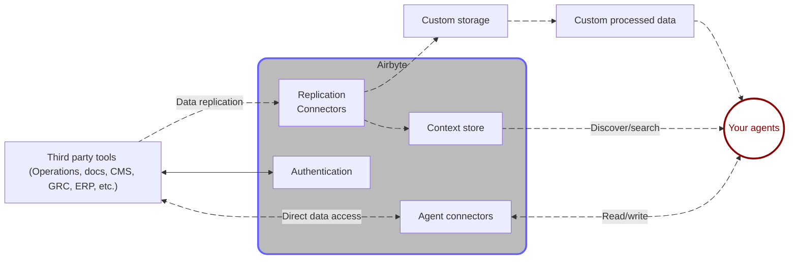

# About Agent Engine

Airbyte's Agent Engine is a data layer for AI agents. Use the Agent Engine as a cloud platform to manage connectors, credentials, and data replication for your agents. You can also use Airbyte's open source agent connectors as standalone Python packages, import them into your AI agents, and manage storage and credentials yourself.

## The problem with AI agents

AI agents have almost unlimited potential to scale productivity, accelerate insights, and democratize information. However, most organizations struggle to realize this promise.

- Large language models can reason, but rely on stale public training data that limits their effectiveness. They lack real-time knowledge, are stateless, and can't act on and verify facts.

- Improving context with real business data is difficult. It forces teams to build infrastructure they don't want to own: storage layers, indexing services, pipelines, and permissions models. All of this is maintenance debt just to acquire missing context.

- Even if high-quality data is available, agents still perform poorly. They lack real-time access, can't search, can't write, miss key information, and need human intervention.

Organizations trying to build agents face a problem:

- They need massive upfront investment, or

- Their agents don't perform well, or

- Both

The result is that agentic features never scale. They remain expensive, fragile prototypes that can't support real-world operations.

## How Airbyte solves that problem

Airbyte's Agent Engine solves this problem with three components.

- Open-source, type-safe connectors designed for AI agents. These connectors allow agents to retrieve information they don't have, perform computations or transformations, interact with external systems, and trigger side-effects, like sending emails, updating databases, and starting workflows

- Storage and management of end-user credentials.

- Out of the box context storage to power low-latency search operations.

## Tools, context, and MCP servers

It's helpful to think of the Agent Engine as a data layer that makes agentic tool use easy and provides critical context to your agents at the times they need it.

Tools are external capabilities AI agents can invoke. They allow agents to perceive, decide, and act beyond their training data. They're an important link between an incapable agent and the real-time data access and search that agent needs to become effective.

But even with tools, you need context. Agents need to know what data exists and how records connect across systems.

It's tempting to think MCP servers are the answer. And to some extent, they do help by letting agents call APIs. However, they don't solve the discovery problem at the heart of poorly performing agents.

Airbyte's combination of correct tool use and context storage creates a unified data layer for your agents. It enables them to not just call tools, but search across systems without knowing every ID, map data across vendors, and index unstructured data _before_ runtime.

## Who Agent Engine is for

- AI companies building agentic solutions, especially multi-tenant infrastructure and SaaS services.

- Engineering teams building agents for internal use cases.

- Hackers, explorers, innovators, and anyone who needs to empower an agent in minutes.

- People tired of expensive agents that aren't helpful.

<!-- ## Requirements -->
