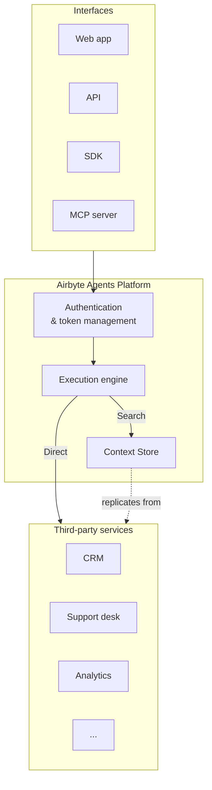
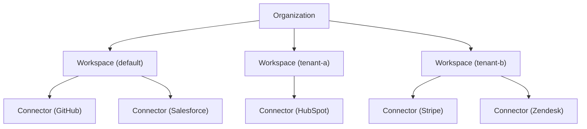

# System architecture

Airbyte Agents is a cloud platform that gives AI agents authenticated, structured access to third-party SaaS data. It stores credentials, manages token refresh, and exposes a uniform execution interface so agents can read, search, and write data across dozens of services.

You can interact with the platform through four interfaces. They all connect to the same service, so credentials you configure through one interface are available to all of them.

- [**Web app**](../../interfaces/ui) at [app.airbyte.ai](https://app.airbyte.ai) — Talk to an Airbyte-hosted agent in Chats, or define Automations that run on a schedule or webhook.
- [**API**](../../interfaces/api) — HTTP endpoints for managing connectors, tokens, and executing operations from any language.
- [**SDK**](../../interfaces/sdk) — Python SDK for building agents that authenticate, connect, and execute operations in your own code.
- [**MCP server**](../../interfaces/mcp) — A remote Model Context Protocol server that connects MCP-capable agents like Claude, Cursor, and ChatGPT to your data.

## Resource hierarchy

Every Airbyte Agents account is organized into a three-level hierarchy.

- **[Organization](./organizations)** — The top-level container. Maps to a single billing account and a set of platform API credentials. All workspaces, users, and billing settings live here.
- **[Workspace](./workspaces)** — An isolation boundary within an organization. Each workspace holds its own set of connectors and credentials. A token scoped to one workspace cannot access another.
- **[Connector](./connectors-and-credentials)** — A stored credential and configuration for a third-party service. Connectors are the building blocks agents use to interact with external APIs.

## Credential management

Airbyte Agents uses a two-layer credential model.

- **Platform credentials** identify your organization with Airbyte. When you sign in to the web app, Airbyte authenticates you behind the scenes. For the API, SDK, and MCP server, your organization's `client_id` and `client_secret` — available on the [Profile page](https://app.airbyte.ai/profile) — serve the same purpose.
- **Connector credentials** authenticate with each third-party service. When you add a connector, you provide the service's API key, OAuth tokens, or other credentials. Airbyte stores them securely and handles token refresh at execution time.

Add credentials once through any interface and every other interface can use them. For details, see [Connectors and credentials](./connectors-and-credentials).

## Execution model

When an agent interacts with a connector, it makes **tool calls**. Each tool call targets an entity and an action — for example, `issues.list` or `contacts.search`. Airbyte classifies tool calls into two types.

- **Direct** — A real-time request to the third-party API. Airbyte routes the call through the connector, and returns the live response. Use direct calls for real-time look-ups and actions that change state, like creating a ticket or sending a message.
- **Search** — A query against the [Context Store](../context-store), a managed, pre-indexed replica of your connector data. Airbyte answers the call from its own storage without contacting the upstream API, which makes search calls fast and cost-efficient. Use search calls for filtered look-ups across large datasets.

For details on reviewing tool call activity, see [Review tool calls](../../admin/tool-calls).

## Billing

Airbyte Agents bills based on **agent operations (AOs)**, a unit derived from a combination of tool calls and token usage. Each plan includes a monthly allowance of AOs. For details, see [Billing and pricing](../../admin/billing).

import DocCardList from '@theme/DocCardList';

<DocCardList />
