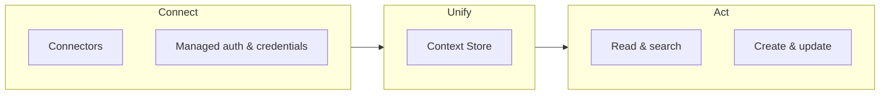

# Connect, Unify, Act

AI agents need real-time access to business data. That data is often spread across dozens of systems, and building and maintaining those integrations is expensive and fragile. Airbyte Agents solves this with three layers:

1. **Connect** your agents to any system
2. **Unify** data from every source into one searchable layer
3. Let agents **Act** on that data in real time

## Connect

Airbyte provides a growing library of open source, type-safe [agent connectors](../connectors) that plug AI agents into third-party APIs. Each connector is a standalone Python package with strongly typed methods, validation, and error handling.

The platform manages the hard parts of connecting to third-party systems:

- **Authentication.** The platform handles OAuth flows, API keys, and token refresh for you. Store end-user credentials once and use them from any interface.

- **Multi-tenancy.** [Workspaces](../interfaces/sdk/workspaces) isolate connectors and credentials across tenants, teams, or environments within an organization.

- **Multiple interfaces.** Use connectors through the [web app](../interfaces/ui) in chats and automations, the [Python SDK](../interfaces/sdk), the [HTTP API](../interfaces/api), or the [MCP server](../interfaces/mcp), whichever fits your stack.

Connecting a new data source takes minutes. You don't build or maintain API wrappers, manage credential storage, or handle token lifecycle.

## Unify

Once your agents are connected, the [Context Store](context-store) indexes and normalizes data from every source into one searchable layer.

Without the Context Store, an agent that needs to answer a question like "find all open deals over $10,000" has to page through API results, manage rate limits, and accumulate records in its context window. This is slow, expensive, and unreliable. For benchmark data on how the Context Store compares to live API retrieval, see the [airbyte-agents-benchmarks](https://github.com/airbytehq/airbyte-agents-benchmarks) repository.

- **Curated replication.** Airbyte selects a useful subset of entities from each connector and replicates them into managed storage.

- **Indexed search.** Agents answer questions with fast, indexed searches instead of live API crawls.

- **Cross-source queries.** Agents search across all connected systems through a single interface, even systems whose APIs don't offer a search endpoint.

- **Automatic refresh.** The store refreshes regularly, so agents always work with recent data.

The result is that agents reason over unified, searchable context rather than raw, isolated API responses.

## Act

With context in hand, agents execute operations against connected systems in real time. Every connector exposes a uniform interface consisting of entities, actions, and parameters. This interface allows agents to:

- **Read**: `list`, `get`, and `search` retrieve records from a connector. When the Context Store is on, `context_store_search` provides fast, indexed retrieval.

- **Write**: `create` and `update` push changes back to the source system, such as creating a ticket, updating a contact, or sending a message.

This pattern is the same across every connector and interface. Whether an agent runs in Airbyte's web app,SDK, API, or MCP, it calls the same entities and actions with the same parameters.

## How the layers compose

You connect once, data unifies automatically, and aents act with full context.

A single connector gives an agent the ability to fetch live data, search across an indexed store, and write changes back, all through one consistent interface. Adding a new data source extends every layer at once: the agent can immediately connect, search, and act on the new system.

To see this in practice, start with a [tutorial](../get-started/developer-quickstart).
