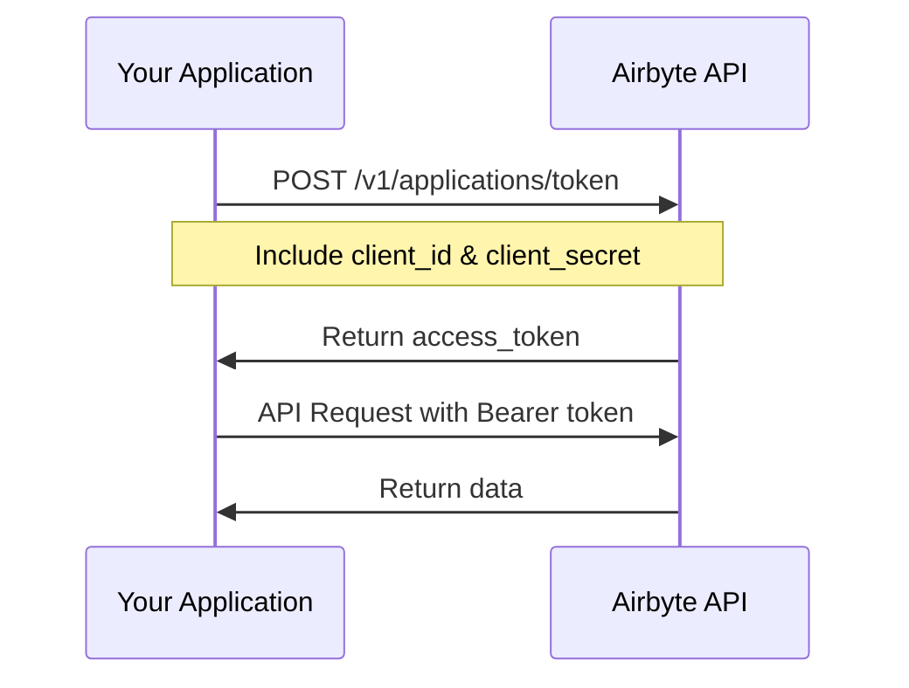
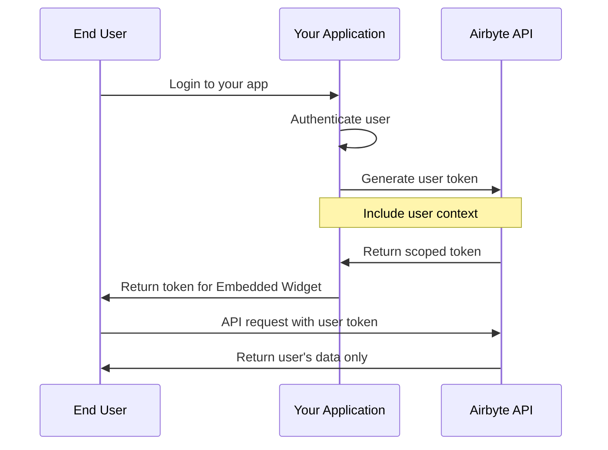

# Authentication & Authorization

This guide covers authentication and authorization patterns for Airbyte AI Agents, including how to secure your integration, manage user access, and implement multi-tenant architectures.

## Overview

Airbyte uses OAuth 2.0 Client Credentials flow for API authentication. For embedded scenarios, you'll need to implement user-scoped access and multi-tenant isolation.

## Authentication Flows

### 1. Application Authentication (Server-to-Server)

Used for backend services and server-side applications.

**Flow:**


**Implementation:**

```python
import requests

def get_application_token(client_id, client_secret):
    """
    Generate application access token.
    Use for server-side operations.
    """
    response = requests.post(
        "https://api.airbyte.com/v1/applications/token",
        json={
            "client_id": client_id,
            "client_secret": client_secret
        }
    )

    response.raise_for_status()
    data = response.json()

    return {
        "access_token": data["access_token"],
        "token_type": data["token_type"],
        "expires_in": data["expires_in"]  # Usually 3600 seconds (1 hour)
    }

# Example usage
token_data = get_application_token(
    client_id="your_client_id",
    client_secret="your_client_secret"
)

access_token = token_data["access_token"]
```

**JavaScript:**
```javascript
async function getApplicationToken(clientId, clientSecret) {
  const response = await fetch(
    'https://api.airbyte.com/v1/applications/token',
    {
      method: 'POST',
      headers: { 'Content-Type': 'application/json' },
      body: JSON.stringify({
        client_id: clientId,
        client_secret: clientSecret
      })
    }
  );

  if (!response.ok) {
    throw new Error(`Authentication failed: ${response.statusText}`);
  }

  return await response.json();
}
```

---

### 2. User-Scoped Authentication (Embedded Scenarios)

Used when embedding Airbyte in your application for end-users.

**Flow:**


**Implementation:**

```python
def generate_user_token(client_id, client_secret, user_id, workspace_id):
    """
    Generate user-scoped access token for embedded scenarios.
    Token is limited to specific workspace and user.
    """
    # First, get application token
    app_token = get_application_token(client_id, client_secret)

    # Then, generate user-scoped token
    response = requests.post(
        "https://api.airbyte.com/v1/users/token",
        headers={"Authorization": f"Bearer {app_token['access_token']}"},
        json={
            "userId": user_id,
            "workspaceId": workspace_id,
            "expiresIn": 900  # 15 minutes (for widget usage)
        }
    )

    response.raise_for_status()
    return response.json()

# Example: Generate token for embedded widget
user_token = generate_user_token(
    client_id="your_client_id",
    client_secret="your_client_secret",
    user_id="user_123",
    workspace_id="ws_abc456"
)

# Pass this token to the embedded widget
widget_token = user_token["access_token"]
```

---

## Token Management

### Token Expiration

| Token Type | Default Expiration | Use Case |
|-----------|-------------------|----------|
| Application Token | 1 hour (3600s) | Server-side API calls |
| User Token | 15 minutes (900s) | Embedded widget |
| Refresh Token | 30 days | Long-lived access |

### Token Refresh Implementation

```python
import time
from datetime import datetime, timedelta

class TokenManager:
    """Manage token lifecycle with automatic refresh."""

    def __init__(self, client_id, client_secret):
        self.client_id = client_id
        self.client_secret = client_secret
        self.access_token = None
        self.expires_at = None

    def get_token(self):
        """Get valid token, refresh if needed."""
        if self.access_token and self.expires_at:
            # Refresh 5 minutes before expiry
            if datetime.now() < self.expires_at - timedelta(minutes=5):
                return self.access_token

        # Generate new token
        token_data = get_application_token(
            self.client_id,
            self.client_secret
        )

        self.access_token = token_data["access_token"]
        self.expires_at = datetime.now() + timedelta(
            seconds=token_data["expires_in"]
        )

        return self.access_token

    def make_authenticated_request(self, url, method="GET", **kwargs):
        """Make API request with automatic token management."""
        token = self.get_token()

        headers = kwargs.get("headers", {})
        headers["Authorization"] = f"Bearer {token}"
        kwargs["headers"] = headers

        response = requests.request(method, url, **kwargs)

        # Handle token expiration
        if response.status_code == 401:
            # Force refresh and retry
            self.access_token = None
            token = self.get_token()
            headers["Authorization"] = f"Bearer {token}"
            response = requests.request(method, url, **kwargs)

        return response

# Usage
token_manager = TokenManager(client_id, client_secret)

# Make requests without worrying about tokens
response = token_manager.make_authenticated_request(
    "https://api.airbyte.com/v1/workspaces"
)
```

---

## Multi-Tenant Architecture

### Pattern 1: Workspace per Customer

Each customer gets their own isolated workspace.

**Benefits:**
- ✅ Complete data isolation
- ✅ Independent configuration per customer
- ✅ Easy to manage and scale
- ✅ Clear billing boundaries

**Implementation:**

```python
def create_customer_workspace(client_id, client_secret, customer_id, customer_name):
    """Create isolated workspace for customer."""
    token_manager = TokenManager(client_id, client_secret)

    response = token_manager.make_authenticated_request(
        "https://api.airbyte.com/v1/workspaces",
        method="POST",
        json={
            "name": f"{customer_name} - {customer_id}",
            "metadata": {
                "customer_id": customer_id,
                "created_at": datetime.now().isoformat()
            }
        }
    )

    workspace = response.json()

    # Store workspace ID for customer
    # (in your database)
    save_customer_workspace_mapping(customer_id, workspace["workspaceId"])

    return workspace

def get_customer_workspace(customer_id):
    """Get workspace for specific customer."""
    # Retrieve from your database
    workspace_id = load_customer_workspace_mapping(customer_id)
    return workspace_id
```

**Architecture Diagram:**
```
Organization (Your Company)
├── Workspace (Customer A) ← Isolated
│   ├── Sources
│   ├── Destinations
│   └── Connections
├── Workspace (Customer B) ← Isolated
│   ├── Sources
│   └── Connections
└── Workspace (Customer C) ← Isolated
    ├── Sources
    └── Connections
```

---

### Pattern 2: Shared Workspace with Permissions

Multiple customers share a workspace with permission-based access control.

**Benefits:**
- ✅ Simpler workspace management
- ✅ Lower overhead for many small customers
- ✅ Easier to share common resources

**Drawbacks:**
- ⚠️ Requires careful permission management
- ⚠️ More complex access control logic
- ⚠️ Less isolation

**Implementation:**

```python
def create_user_permission(user_id, workspace_id, resources):
    """Create permission for user to access specific resources."""
    token_manager = TokenManager(client_id, client_secret)

    response = token_manager.make_authenticated_request(
        "https://api.airbyte.com/v1/permissions",
        method="POST",
        json={
            "userId": user_id,
            "workspaceId": workspace_id,
            "permissionType": "workspace_reader",
            "resourceIds": resources  # Specific sources/connections
        }
    )

    return response.json()

def validate_user_access(user_id, resource_id):
    """Validate user has access to resource."""
    token_manager = TokenManager(client_id, client_secret)

    response = token_manager.make_authenticated_request(
        f"https://api.airbyte.com/v1/permissions",
        params={"userId": user_id}
    )

    permissions = response.json()

    # Check if user has access to resource
    for permission in permissions.get("data", []):
        if resource_id in permission.get("resourceIds", []):
            return True

    return False
```

---

## Security Best Practices

### 1. Credential Storage

**Never expose credentials in client-side code:**

```python
# ❌ BAD - Don't do this!
# Exposing credentials in frontend
const clientSecret = "your_secret_here";  // Never do this!

# ✅ GOOD - Use server-side proxy
# Frontend calls your backend
# Backend handles Airbyte authentication

# Backend endpoint:
@app.post("/api/generate-widget-token")
def generate_widget_token(current_user):
    """Generate user token server-side."""
    # Validate user session
    if not current_user.is_authenticated:
        raise HTTPException(status_code=401)

    # Generate user-scoped token
    token = generate_user_token(
        client_id=os.getenv("AIRBYTE_CLIENT_ID"),
        client_secret=os.getenv("AIRBYTE_CLIENT_SECRET"),
        user_id=current_user.id,
        workspace_id=current_user.workspace_id
    )

    return {"token": token["access_token"]}
```

### 2. Environment Variables

Store credentials securely:

```python
# .env file
AIRBYTE_CLIENT_ID=your_client_id
AIRBYTE_CLIENT_SECRET=your_client_secret
AIRBYTE_API_URL=https://api.airbyte.com/v1

# Load in application
from dotenv import load_dotenv
import os

load_dotenv()

CLIENT_ID = os.getenv("AIRBYTE_CLIENT_ID")
CLIENT_SECRET = os.getenv("AIRBYTE_CLIENT_SECRET")

# Add .env to .gitignore!
```

### 3. Token Scoping

Always use minimum required permissions:

```python
def generate_limited_token(user_id, workspace_id, allowed_operations):
    """Generate token with limited permissions."""
    return generate_user_token(
        client_id=CLIENT_ID,
        client_secret=CLIENT_SECRET,
        user_id=user_id,
        workspace_id=workspace_id,
        scopes=allowed_operations  # e.g., ["read:sources", "write:connections"]
    )

# Read-only token for viewing
readonly_token = generate_limited_token(
    user_id="user_123",
    workspace_id="ws_abc",
    allowed_operations=["read:sources", "read:connections"]
)

# Full access token for configuration
admin_token = generate_limited_token(
    user_id="admin_456",
    workspace_id="ws_abc",
    allowed_operations=["read:*", "write:*", "delete:*"]
)
```

### 4. Rate Limiting

Implement rate limiting to prevent abuse:

```python
from functools import wraps
from flask_limiter import Limiter
from flask import Flask, request

app = Flask(__name__)
limiter = Limiter(
    app,
    key_func=lambda: request.headers.get("X-User-ID", "anonymous")
)

@app.post("/api/proxy/query")
@limiter.limit("100 per minute")  # 100 requests per minute per user
def proxy_query():
    """Rate-limited proxy endpoint."""
    user_id = request.headers.get("X-User-ID")

    # Validate user and forward request to Airbyte
    # ...

    return result
```

### 5. Audit Logging

Log all data access for security and compliance:

```python
import logging
from datetime import datetime

logger = logging.getLogger(__name__)

def audit_log(user_id, action, resource_type, resource_id, status):
    """Log all data access."""
    logger.info({
        "timestamp": datetime.now().isoformat(),
        "user_id": user_id,
        "action": action,
        "resource_type": resource_type,
        "resource_id": resource_id,
        "status": status
    })

def query_source_with_audit(user_id, source_id, stream, filters):
    """Query source with audit logging."""
    try:
        result = query_source(source_id, stream, filters)

        audit_log(
            user_id=user_id,
            action="query",
            resource_type="source",
            resource_id=source_id,
            status="success"
        )

        return result
    except Exception as e:
        audit_log(
            user_id=user_id,
            action="query",
            resource_type="source",
            resource_id=source_id,
            status=f"failed: {str(e)}"
        )
        raise
```

---

## Embedded Widget Authentication

### Server-Side Token Generation

For embedded widget, generate tokens on your backend:

```python
from flask import Flask, jsonify, session
from flask_cors import CORS

app = Flask(__name__)
CORS(app)

@app.route("/api/embedded/token", methods=["POST"])
def get_embedded_token():
    """Generate token for embedded widget."""
    # Validate user session
    if "user_id" not in session:
        return jsonify({"error": "Unauthorized"}), 401

    user_id = session["user_id"]
    workspace_id = get_user_workspace(user_id)

    # Generate short-lived token (15 minutes)
    token = generate_user_token(
        client_id=CLIENT_ID,
        client_secret=CLIENT_SECRET,
        user_id=user_id,
        workspace_id=workspace_id
    )

    return jsonify({
        "token": token["access_token"],
        "expiresIn": token["expires_in"]
    })
```

### Frontend Integration

```javascript
// Frontend code
async function initializeWidget() {
  // Fetch token from your backend
  const response = await fetch('/api/embedded/token', {
    method: 'POST',
    credentials: 'include'  // Include session cookies
  });

  const { token, expiresIn } = await response.json();

  // Initialize Airbyte widget with token
  const widget = new AirbyteWidget({
    token: token,
    workspaceId: 'ws_abc123',
    onTokenExpired: async () => {
      // Refresh token when expired
      const newToken = await initializeWidget();
      return newToken.token;
    }
  });

  return widget;
}
```

---

## Common Authentication Patterns

### Pattern 1: API Key for Backend Services

Simple authentication for server-side services:

```python
class AirbyteClient:
    """Simple client with API key authentication."""

    def __init__(self, client_id, client_secret):
        self.client_id = client_id
        self.client_secret = client_secret
        self.token_manager = TokenManager(client_id, client_secret)

    def query(self, endpoint, **kwargs):
        """Make authenticated API request."""
        return self.token_manager.make_authenticated_request(
            f"https://api.airbyte.com/v1/{endpoint}",
            **kwargs
        )

# Usage
client = AirbyteClient(
    client_id=os.getenv("AIRBYTE_CLIENT_ID"),
    client_secret=os.getenv("AIRBYTE_CLIENT_SECRET")
)

workspaces = client.query("workspaces")
```

### Pattern 2: JWT for User Context

Use JWT to pass user context:

```python
import jwt
from datetime import datetime, timedelta

def create_user_jwt(user_id, workspace_id, secret_key):
    """Create JWT with user context."""
    payload = {
        "user_id": user_id,
        "workspace_id": workspace_id,
        "exp": datetime.utcnow() + timedelta(hours=1),
        "iat": datetime.utcnow()
    }

    return jwt.encode(payload, secret_key, algorithm="HS256")

def validate_user_jwt(token, secret_key):
    """Validate and decode JWT."""
    try:
        payload = jwt.decode(token, secret_key, algorithms=["HS256"])
        return payload
    except jwt.ExpiredSignatureError:
        raise Exception("Token expired")
    except jwt.InvalidTokenError:
        raise Exception("Invalid token")
```

---

## Troubleshooting

### Issue: "401 Unauthorized"
**Cause:** Invalid or expired token

**Solution:**
```python
# Check token validity
def is_token_valid(token):
    response = requests.get(
        "https://api.airbyte.com/v1/workspaces",
        headers={"Authorization": f"Bearer {token}"}
    )
    return response.status_code != 401

# Refresh if invalid
if not is_token_valid(current_token):
    current_token = get_application_token(client_id, client_secret)
```

### Issue: "403 Forbidden"
**Cause:** Insufficient permissions or invalid credentials

**Solution:**
- Verify client ID and secret are correct
- Check user has required permissions
- Ensure workspace exists and user has access

### Issue: Token Expires Too Quickly
**Cause:** Short-lived user tokens (15 minutes)

**Solution:**
```javascript
// Implement token refresh in widget
const widget = new AirbyteWidget({
  token: initialToken,
  onTokenExpired: async () => {
    const response = await fetch('/api/embedded/token', {
      method: 'POST',
      credentials: 'include'
    });
    const { token } = await response.json();
    return token;
  }
});
```

---

## Next Steps

- [Connection Templates](./connection-templates.md) - Automate connection setup
- [Source Templates](./source-templates.md) - Pre-configure sources
- [Embedded Widget](../widget/README.md) - Integrate widget with authentication
- [Quickstart Guide](../../quickstart.md) - Build your first integration

## Additional Resources

- [OAuth 2.0 Specification](https://oauth.net/2/)
- [JWT Best Practices](https://tools.ietf.org/html/rfc8725)
- [API Security Guide](https://owasp.org/www-project-api-security/)
- [Airbyte API Reference](https://reference.airbyte.com)
