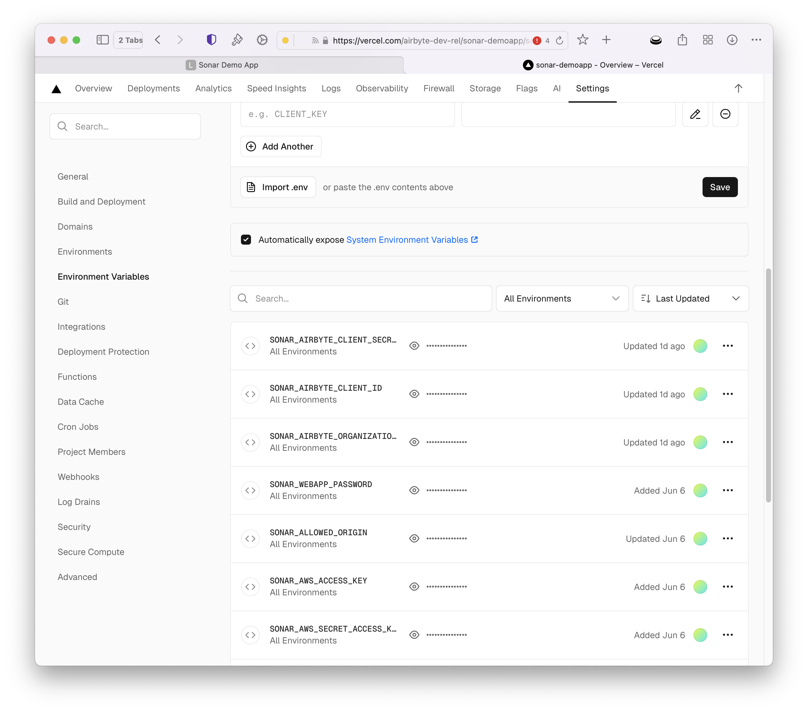

# Develop Your Web App

The sample onboarding app is a full-stack React application with support for both local and production (Vercel) deployment architectures:

- **Development**: Frontend React19 with Vite build tool + Backend (Express) with proxy
- **Production**: Frontend React19 with Vite build tool + API Routes (Vercel serverless functions)

## Backend

Production deployment of the  application uses **Vercel Serverless Functions** instead of a traditional Express server for better performance and scalability:

```markdown
api/
├── health.js          # GET /api/health - Health check
├── logout.js          # POST /api/logout - User logout
├── users/
│   ├── index.js       # POST /api/users - Create/login user
│   └── me.js          # GET /api/users/me - Get current user
├── airbyte/
│   └── token.js       # POST /api/airbyte/token - Generate widget token
└── _lib/              # Shared utilities
    ├── auth.js        # Authentication & CORS helpers
    ├── db.js          # Database operations
    └── airbyte.js     # Airbyte API integration
```

Key Features

- **Serverless Architecture**: Each API endpoint is an independent function
- **Auto-scaling**: Functions scale automatically based on demand
- **Cookie-based Authentication**: Secure HTTP-only cookies
- **CORS Support**: Configured for cross-origin requests
- **File-based Database**: Simple JSON storage (upgradeable to Vercel KV)

### Local deployment

Ensure you are in the `embedded-demoapp` root directory, then install dependencies:

```bash
npm install
```

Set /server/.env.local to use localhost

```bash
SONAR_ALLOWED_ORIGIN=http://localhost:5173
```

Run the front end:

```bash
npm run dev
```

Run the backend server:

```bash
cd server && npm start
```

Your app will now be running on http://localhost:5173

## Vercel Deployment

The application is designed to run unchanged on Vercel, with the only configuration change required is setting environment keys via Settings > Environment Variables. It is recommended to use the Import .env button to avoid typo errors. Remember to change the SONAR_ALLOWED_ORIGIN to point to the vercel url.



## Widget Implementation

The Airbyte Embedded widget is a javascript library with visibility of the component managed in the sample app via `src/components/UserProfile.jsx`. Actual lifecycle management of the Widget, including loading the Javascript library and managing authentication tokens is managed by `src/airbyteService.js`. This service endpoint provides the following functions. Developers are encouraged to add their own logging or instrumentation to these functions if additional management is required within the customer app.

- `generateWidgetToken` - modify if you wish to use a custom UUID vs. email address as unique customer identifier
- `loadAirbyteWidget` - creates the actual widget and retrieves widget library from cdn.
- `openAirbyteWidget` - opens the  widget
- `closeAirbyteWidget` - closes the widget
