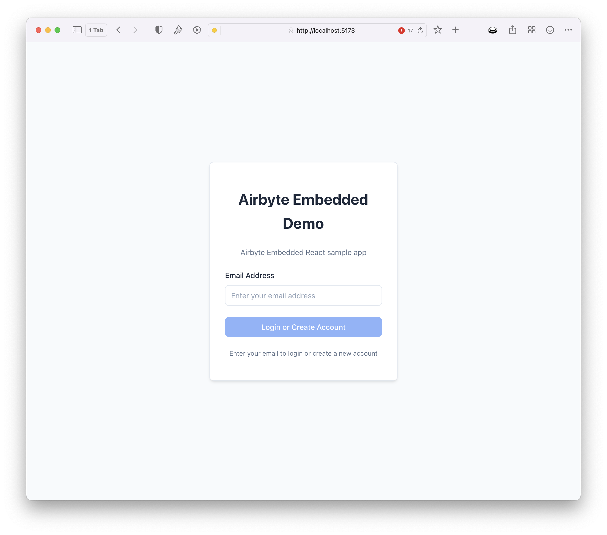
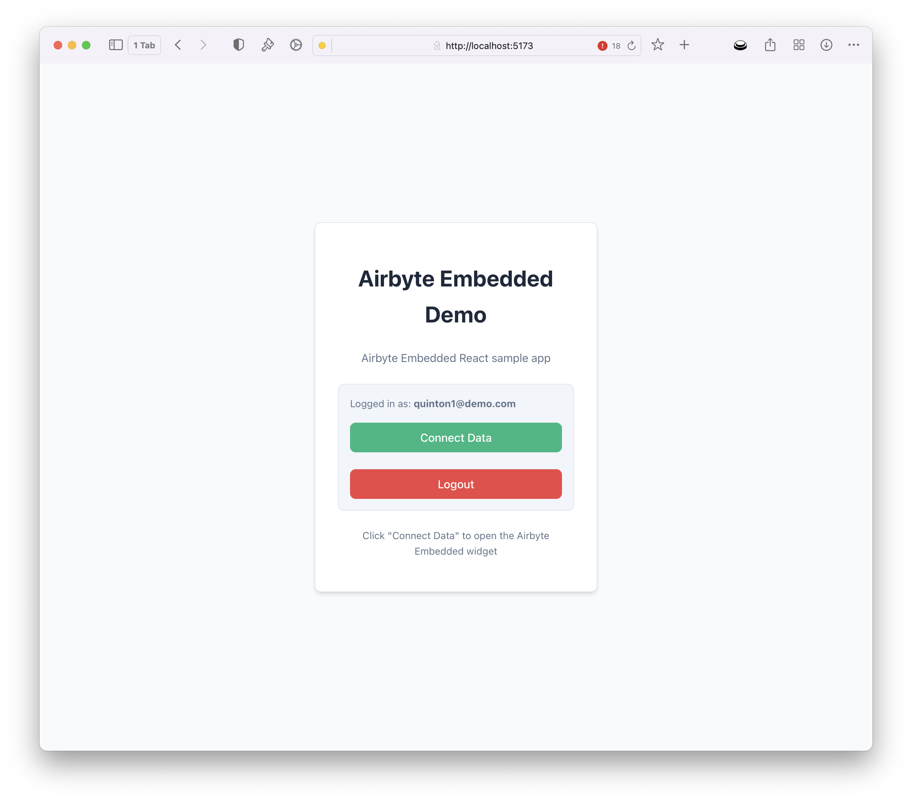
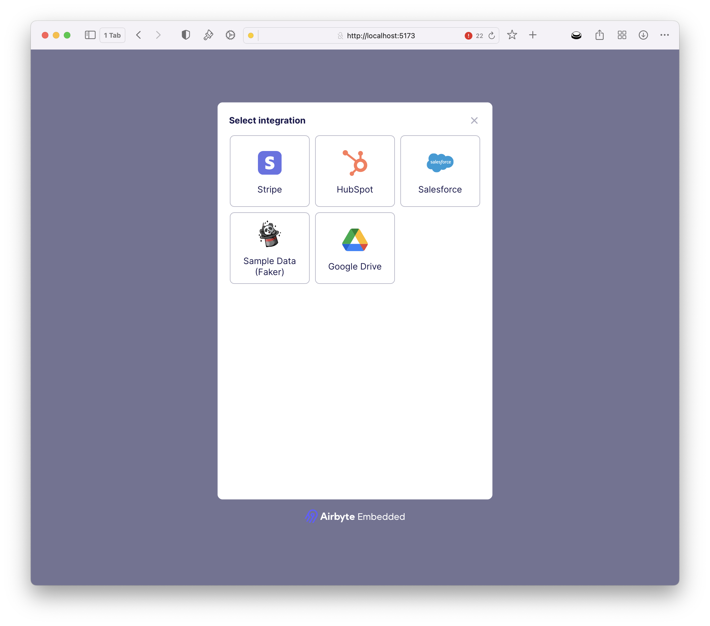

# Use Airbyte Embedded

With your app up and running, you will be prompted to enter your web password before continuing. After authentication, you will be presented with a screen to allow customers to onboard by adding their email address.



Once a user record is created, the customer can tap Connect Data to configure which source they wish to connect.



This will render the Airbyte Embedded widget. This widget displays a list of available connectors.



Customers can select a source and input their configuration. Upon save, a customer workspace will be created via Airbyte Embedded with the customer’s source configuration and a data pipeline created to sync data to your AI destination store. In this instance, S3.

## External User Id

The sample application uses the customer's email as the unique external id to define a workspace within Airbyte Embedded. For production usage, it is recommended to use a unique identifier specific to your business such as a UUID.

If you need to change this logic, pass in a different id to the server token endpoint `/server/server.js` or add custom logic into `/src/airbyteService.js`

```javascript

Line 108: `api.generateWidgetToken(req.user.email)` 

```

## Versioning the Widget

It is generally recommended that you pull in a specific version of any npm package to prevent unexpected changes.  If you are pulling in this package as a script, you can do this by importing it as:

```javascript
<script src="https://cdn.jsdelivr.net/npm/@airbyte-embedded/airbyte-embedded-widget@0.4.2"></script>
```

In addition, within the package.json, if you wish to pin to a minor version, use the following syntax:

```javascript
"@airbyte-embedded/airbyte-embedded-widget": "^0.4.2"
```
