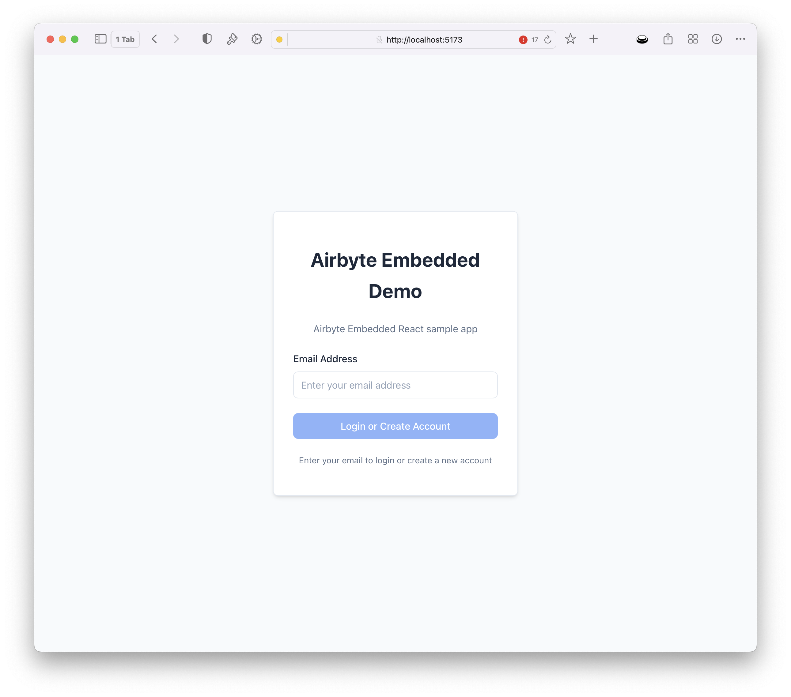
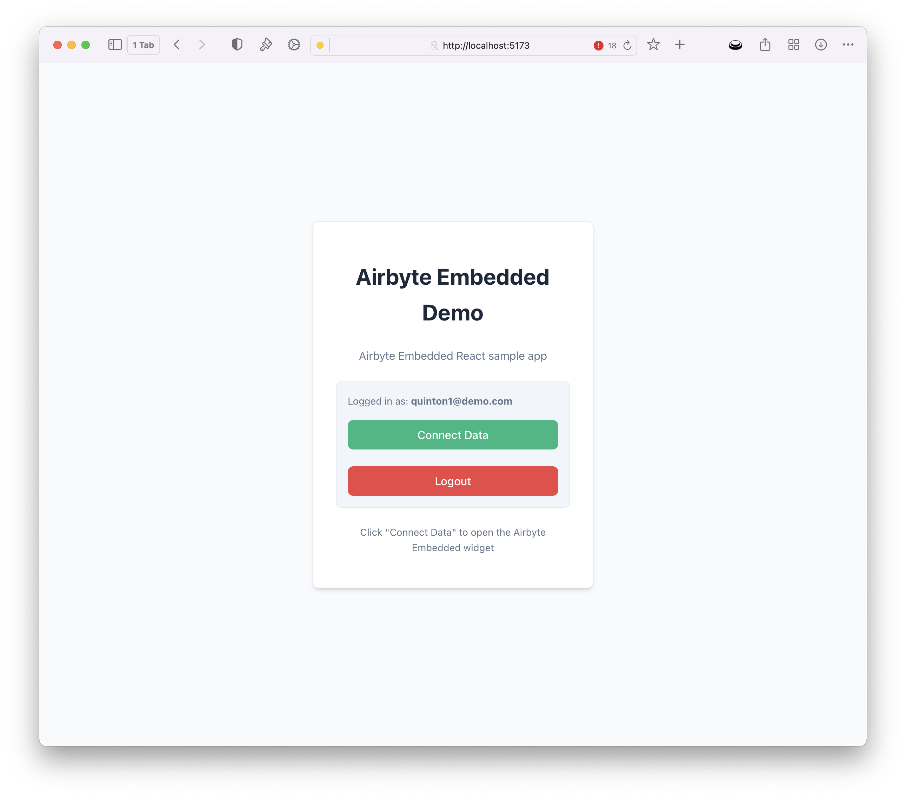
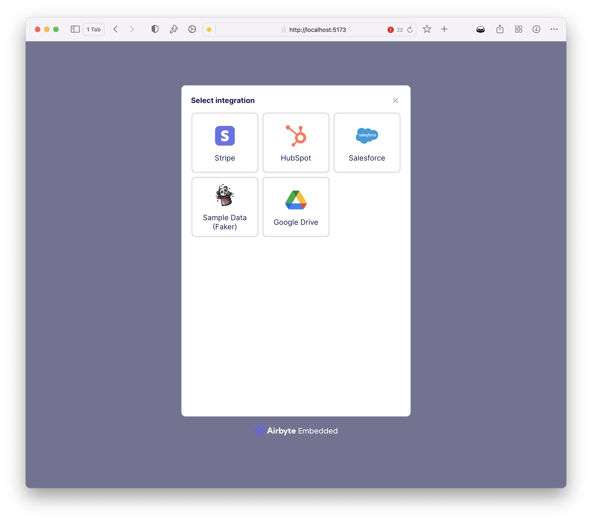

# Use Airbyte Embedded

With your app up and running, you will be prompted to enter your web password before continuing. After authentication, you will be presented with a screen to allow customers to onboard by adding their email address.



Once a user record is created, the customer can tap Connect Data to configure which source they wish to connect.



This will render the Airbyte Embedded widget. This widget displays a list of available connectors.



Customers can select a source and input their configuration. Upon save, a customer workspace will be created via Airbyte Embedded with the customer’s source configuration and a data pipeline created to sync data to your AI destination store. In this instance, S3.

## External User Id

The sample application uses the customer's email as the unique external id to define a workspace within Airbyte Embedded. For production usage, it is recommended to use a UUID or identifier specific to your business.  

If you need to change this logic, pass in a different id to the server token endpoint `/server/server.js` or add custom logic into `/src/airbyteService.js`

```javascript

Line 108: `api.generateWidgetToken(req.user.email)` 

```

## Versioning the Widget

Depending on your needs, you may version the widget you use to avoid introducing any unexpected changes into your app. As a best practice, it is recommended to pin to minor versions:

In your component:

```javascript

<script src="https://cdn.jsdelivr.net/npm/@airbyte-embedded/airbyte-embedded-widget@0.4.2"></script>

```

or package.json:

```javascript

"@airbyte-embedded/airbyte-embedded-widget": "0.4.2"

```

In addition, within the package.json, if you wish to pin to a min version, use the following syntax:

```javascript

"@airbyte-embedded/airbyte-embedded-widget": "^0.4.2"

```

Should you prefer to always pull the latest version, omit the version number entirely:

```javascript

<script src="https://cdn.jsdelivr.net/npm/@airbyte-embedded/airbyte-embedded-widget"></script>

```
