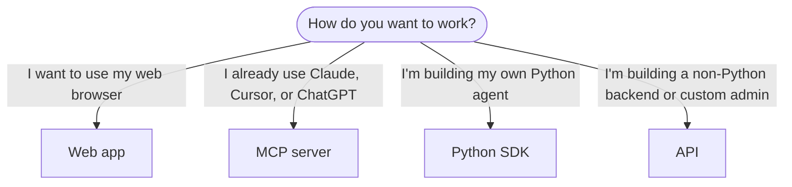

# Choose how to use Airbyte Agents

Airbyte Agents offers four interfaces. They all share the same platform, the same connectors, and the same [Context Store](../concepts/context-store). You can use one, many, or all of them. The flowchart below shows the best path according to your needs.



## Web app

**Best for:** non-developers, operations teams, and anyone who wants to explore Airbyte Agents without writing code.

The [web app](../interfaces/ui) at [app.airbyte.ai](https://app.airbyte.ai) is the fastest way to get started. Describe what you need in natural language. An Airbyte-hosted agent picks the right connectors, makes the necessary tool calls, and replies with an answer grounded in your data.

There are two primary surfaces.

- **[Chats](../interfaces/ui/chats)**: interactive conversations with an agent. Ask a question, iterate on the answer, and explore your data in real time.

- **[Automations](../interfaces/ui/automations)**: agent tasks that run on a schedule, on a webhook, or on demand. Use Automations when you need the same work to happen repeatedly without a person in the loop.

**Get started:** sign up at [app.airbyte.ai](https://app.airbyte.ai) and click **New Chat**.

## MCP server

**Best for:** Users of Claude, Cursor, ChatGPT, VS Code, or any agent that supports the [Model Context Protocol](https://modelcontextprotocol.io/).

The [MCP server](../interfaces/mcp) is a remote, Airbyte-hosted server that gives MCP-capable agents authenticated access to your connected data. You have nothing to install. Add the server URL to your agent's MCP configuration, authenticate with your Airbyte account, and your agent can immediately read and write data across every connector in your workspace.

**Get started:** see the [MCP server docs](../interfaces/mcp) for setup instructions for Claude Code, Cursor, VS Code, Claude Desktop, ChatGPT, and other clients.

## Python SDK

**Best for:** Python developers building custom agents with frameworks like Pydantic AI, LangChain, or FastMCP.

The [Python SDK](../interfaces/sdk) (`airbyte-agent-sdk`) gives you typed connectors, automatic credential handling, and patterns for exposing connectors as tools to any AI agent framework. Install the SDK, authenticate with your Airbyte API credentials, and start executing operations in your own code.

```bash
uv add airbyte-agent-sdk
```

**Get started:** follow one of the step-by-step tutorials in the [Developer Quickstart](developer-quickstart):

- [Pydantic AI tutorial](developer-quickstart/tutorial-pydantic)
- [LangChain tutorial](developer-quickstart/tutorial-langchain)
- [FastMCP tutorial](developer-quickstart/tutorial-fastmcp)

## HTTP API

**Best for:** backend engineers, non-Python stacks, custom administration flows, and embedding the authentication module in your app.

The [API](../interfaces/api) exposes REST endpoints for managing connectors, tokens, and executing operations from any language or backend service. Use it when you need programmatic control over Airbyte Agents from a stack that isn't Python, or when you're building a custom integration layer.

**Get started:** see the [API docs](../interfaces/api) for authentication, connector management, and execution endpoints.

## All paths lead to the same data

Whichever interface you choose, your agents work with the same connectors, the same credentials, and the same Context Store. A connector you add in the web app is immediately available through the SDK, API, and MCP server. You can mix and match interfaces as your needs evolve.

For a deeper look at how the platform is organized, see [System architecture](../concepts/architecture).
