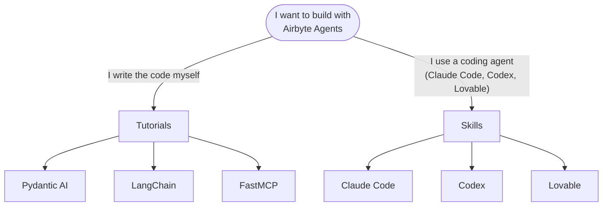

# Developer Quickstart

This section is for developers who want to build agents that use Airbyte connectors. Pick a path based on how you prefer to work.

## Tutorials

Step-by-step guides that take you from an empty project to a working agent in approximately 15 minutes. Each tutorial uses a different Python framework, but all of them follow the same pattern: create a project, install the Airbyte Agent SDK, connect to a data source, and execute operations.

Pick the framework you use:

- [**Pydantic AI**](tutorial-pydantic) — Build an agent with Pydantic AI and the Airbyte Agent SDK.
- [**LangChain**](tutorial-langchain) — Build an agent with LangChain, LangGraph, and the Airbyte Agent SDK.
- [**FastMCP**](tutorial-fastmcp) — Build an MCP server with FastMCP and the Airbyte Agent SDK.

## Skills

Skills are pre-packaged instructions you install into a coding agent so it can generate working code against Airbyte connectors. Instead of writing the integration yourself, you install a skill and prompt the agent to build with Airbyte.

Pick the coding agent you use:

- [**Claude Code**](skills/claude-code) — Install Airbyte skills into Claude Code as a plugin or through skills.sh.
- [**Codex**](skills/codex) — Install Airbyte skills into OpenAI Codex through skills.sh or a manual symlink.
- [**Lovable**](skills/lovable) — Paste the Airbyte skill into a Lovable build prompt to generate full-stack apps with Airbyte connectors.

## Before you start

Both paths share a few common requirements.

- **An Airbyte Agents account.** Sign up for free at [app.airbyte.ai](https://app.airbyte.ai).
- **API credentials.** Copy your `AIRBYTE_CLIENT_ID` and `AIRBYTE_CLIENT_SECRET` from the [Profile page](https://app.airbyte.ai/profile) in the Airbyte Agents web app. See [Manage your user profile](../../admin/profile) for details.
- **A connector.** Add at least one connector to your workspace from the [Credentials page](https://app.airbyte.ai/credentials) in the web app. The tutorials use GitHub, but any connector works.
- **Python 3.13+ and uv** (for tutorials). Skills have their own prerequisites listed on each skill page.

import DocCardList from '@theme/DocCardList';

<DocCardList />
