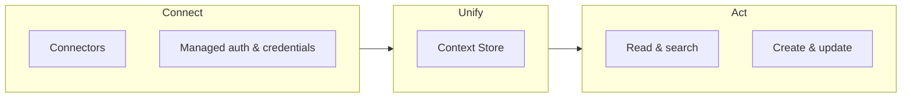

# What is Airbyte Agents?

Airbyte Agents gives AI agents reliable, real-time access to your business data. It connects agents to the tools your organization runs on, unifies that data into one searchable layer, and lets agents read, search, and write across every connected system.

You get managed connectors, secure credential storage, and the Context Store, a replication of connected data that your agents can query in milliseconds. Whether you use the web app, the MCP server, the Python SDK, or the HTTP API, your agents work with the same data, the same connectors, and the same permissions.

Sign up for free at [app.airbyte.ai](https://app.airbyte.ai).

## The problem

AI models can reason, plan, and use tools. What they lack is data.

- **Models are data-blind.** Large language models rely on stale training data. They have no real-time knowledge of your customers, deals, tickets, codebase, or workflows. This makes them broadly ineffective at doing real work without proper context.

- **Building integrations is expensive.** Connecting an agent to even one other system means managing authentication, pagination, rate limits, and schema changes. Connecting to ten is a full-time job.

- **Scattered data produces scattered answers.** Without a unified view, agents make separate API calls to separate systems and try to piece the picture together at runtime. The result is slow, expensive, and unreliable.

Organizations either end up with agents that demo well but fail in production, or they never ship agents at all because the data infrastructure is too costly to build.

## How Airbyte Agents works

Airbyte Agents solves this with three layers: connect, unify, and act.

### Connect

Airbyte provides a growing library of open source, type safe [agent connectors](../connectors). These plug agents into third-party APIs like Salesforce, HubSpot, Stripe, Jira, Zendesk, GitHub, and more.

The platform handles the hard parts:

- **Authentication.** OAuth flows, API keys, and token refresh are managed for you. Store credentials once and use them from any interface.

- **Multi-tenancy.** Workspaces isolate connectors and credentials across tenants, teams, or environments.

- **Open source.** Every connector is a standalone Python package you can inspect, extend, or run locally.

### Unify

The [Context Store](../concepts/context-store) indexes and normalizes data from every connected source into one searchable layer.

Instead of making live API calls at query time, agents search pre-indexed context. This means faster answers, lower costs, and reliable cross-system reasoning. A single query can span multiple connectors without the agent touching any of those APIs directly.

### Act

Agents execute operations against connected systems in real time. Every connector exposes a uniform interface.

- **Read.** List, get, and search records from any connector.

- **Write.** Create and update records; send a message, close a ticket, update a contact, and more.

The interface is the same across every connector and every access path. Whether an agent runs in Airbyte's web app, through the SDK or API, or through the MCP, it uses the same entities, actions, and parameters.

## What you can do with it

- Ask an agent to find all enterprise customers with open support tickets this week.

- Update a Jira ticket or send a Slack message based on data from your CRM.

- Search across Salesforce, Zendesk, and Stripe in a single query.

- Build a scheduled automation that summarizes daily pipeline activity.

- Connect Claude, Cursor, or ChatGPT to your business data with a one-line MCP config.

## Who Airbyte Agents is for

- **Engineering teams** adding real-time business data to internal agents and tools.

- **Operations teams and individual users** who want their AI tools to work with real business data, no coding required.

- **AI companies** building multi-tenant agent products that need reliable data access at scale.

## Four ways to use it

Airbyte Agents supports four interfaces. They all connect to the same platform, so connectors and credentials you configure through one interface are available to all of them.

- [**Web app**](../interfaces/ui): chat with an Airbyte-hosted agent or build scheduled automations. No code required.

- [**MCP server**](../interfaces/mcp): connect agents like Claude, Cursor, and ChatGPT to your data. Nothing to install.

- [**Python SDK**](../interfaces/sdk): build agents with typed connectors, automatic credential handling, and framework integrations.

- [**API**](../interfaces/api): manage connectors, tokens, and execution from any language or backend.

For help choosing, see [Choose how to use Airbyte Agents](choose-how-to-use).

## Pricing

Airbyte Agents offers a free plan with no credit card required. Paid plans scale based on [agent operations (AOs)](../concepts/agent-operations), a unit of work derived from tool calls and token usage. For details, see [Billing and pricing](../admin/billing).

## Next steps

- [Choose how to use Airbyte Agents](choose-how-to-use): find the right interface for your use case.

- [Developer Quickstart](developer-quickstart): explore tutorials and coding-agent skills to start building in minutes.

- [Core concepts](../concepts): dive deeper into platform architecture, the Context Store, and agent operations.
