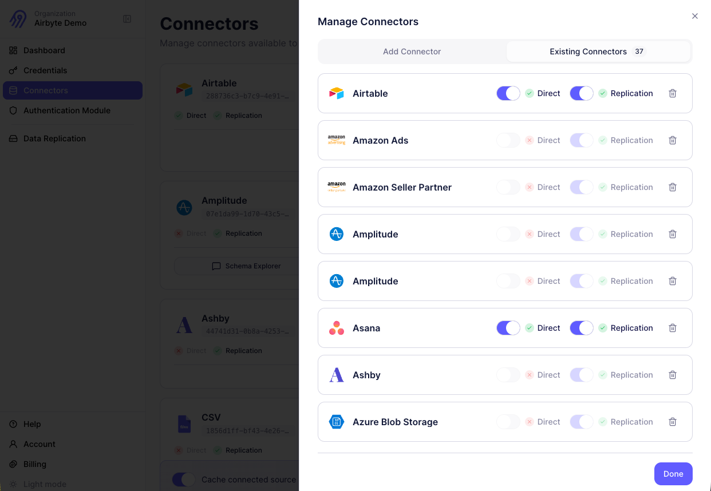

# Add a connector

Before your AI agents can interact with external data sources, you need to add connectors to your workspace. Adding a connector makes it available for your end users to authenticate and use with their own credentials.

## What adding a connector does

When you add a connector in Airbyte Agents, you're configuring which data sources your app supports. This is separate from authentication, which happens when individual users connect their accounts.

Adding a connector (creating a source template) does the following.

- Makes the connector available in your organization's connector catalog
- Allows your end users to authenticate with their own credentials for that data source
- Configures which modes the connector operates in: direct, replication, or both

To do the same thing programmatically, see [Add a connector](../api/add-connector) in the API section.

## Connector modes

Airbyte Agents connectors can operate in two modes:

- **Direct mode** allows AI agents to execute real-time queries against connected data sources. When a user asks a question, the agent calls the third-party API directly to fetch fresh data. This mode is ideal for operational queries, real-time lookups, and actions that need current information.

- **Replication mode** syncs data from connected sources to object storage like S3, GCS, or Azure Blob Storage. This mode is useful for analytics, RAG pipelines, and scenarios where you need to process large volumes of historical data.

Some connectors support both modes, while others support only one. When adding a connector, you can choose which modes to activate based on your application's needs.

## Add a new connector

Add a connector through the Airbyte Agents dashboard.

1. Click **Connectors**.

2. Click **Manage Connectors** (or **Enable Connector** if you haven't added any connectors yet).

3. In the slide-out panel, browse or search for the connector you want to add, and click it.

4. Click the **Existing Connectors** tab and select the modes you want to enable for the connector:

   - Check **Direct** to enable real-time agent queries

   - Check **Replication** to enable replicating data to object storage

5. Click **Done**.

The connector appears in your active connectors list. Your end users can authenticate with this connector and use it in the modes you defined.

## Update connectors

To modify or delete connectors you've already added, follow these steps.

1. Click **Connectors** > **Manage Connectors** > **Existing Connectors**.

2. For each connector, you can:

   - Toggle Direct mode on or off

   - Toggle Replication mode on or off, if data replication is enabled

   - Remove the connector entirely by clicking the trash icon

At least one mode must remain enabled for each active connector.
