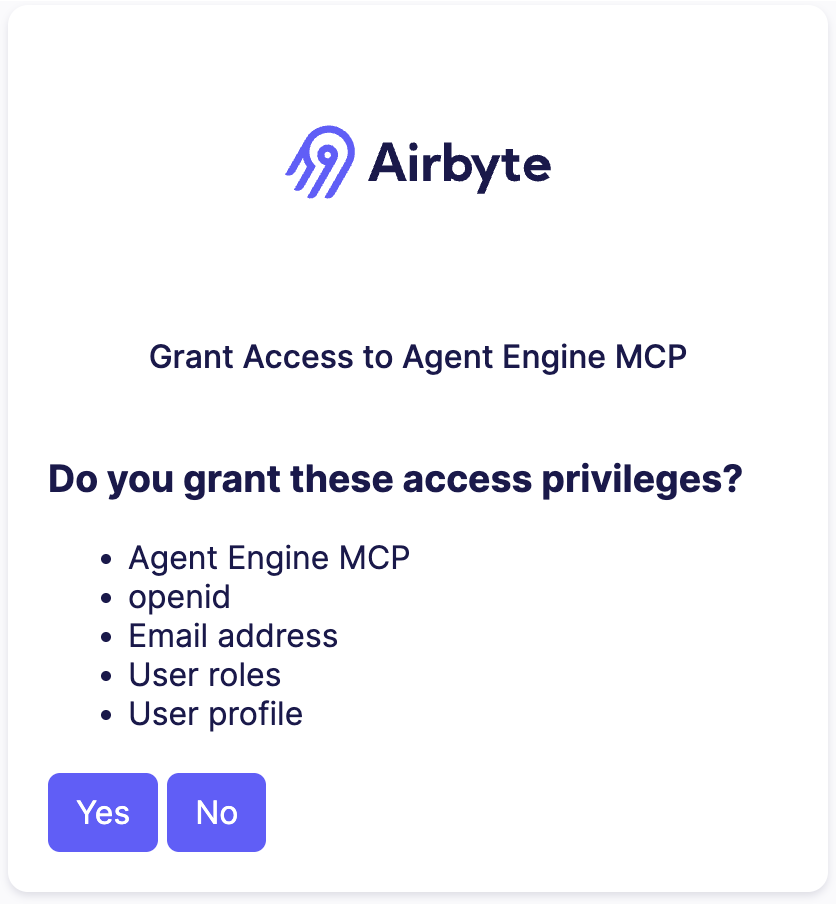

import Tabs from '@theme/Tabs';
import TabItem from '@theme/TabItem';

# Airbyte Agent Engine MCP server

The Airbyte Agent Engine MCP server connects your AI agent to your data through the [Model Context Protocol (MCP)](https://modelcontextprotocol.io/). It gives your agent authenticated access to the platforms you use every day, like your CRM, support desk, analytics tools, and more, so your agent can read and write data on your behalf.

Airbyte hosts and manages this remote MCP server, so there's nothing to install.

## Requirements

Before you begin, make sure you have the following:

- **An Agent Engine account.** Sign up at [app.airbyte.ai](https://app.airbyte.ai) if you don't have one.

- **An AI agent that supports MCP.** For example, Claude Desktop, Claude Code, Cursor, or Codex.

- **Credentials for the connectors you want to use.** Each service requires its own authentication. For example, you need a Linear API key to connect Linear, or Salesforce OAuth credentials to connect Salesforce.

## Add the MCP server to your agent

Select your client below for setup instructions. Each client requires you to authenticate with your Airbyte account before you can use the MCP server.

<Tabs>
<TabItem value="claude-code" label="Claude Code" default>

1. Run the following command in your terminal:

    ```bash
    claude mcp add --transport http airbyte-agent https://mcp.airbyte.ai/mcp
    ```

2. Run Claude Code with `claude`.

3. Type `/mcp`.

4. Select the **airbyte-agent** MCP you added in step 1.

5. Select **Authenticate**. Your web browser opens.

6. If you're not logged into the Agent Engine, log in now.

7. Grant access to the Agent Engine MCP.

    

8. Return to Claude Code and begin using the MCP server.

</TabItem>
<TabItem value="cursor" label="Cursor">

1. Go to **Cursor** > **Settings** > **Cursor Settings** > **MCP**.

2. Click **Add new MCP server**.

3. Set the type to **URL** and enter the server URL:

    ```text
    https://mcp.airbyte.ai/mcp
    ```

    You can also add the server manually by editing your `mcp.json` file:

    ```json
    {
      "mcpServers": {
        "Airbyte": {
          "url": "https://mcp.airbyte.ai/mcp"
        }
      }
    }
    ```

4. Cursor detects that the server requires OAuth and opens your browser automatically.

5. Log in with your Airbyte account and grant access.

6. Return to Cursor. The MCP server tools are now available.

:::note
Cursor 1.0 and later support OAuth and Streamable HTTP natively. If the browser doesn't open automatically, check that you're running Cursor 1.0 or later.
:::

</TabItem>
<TabItem value="claude-desktop" label="Claude Desktop">

1. Open **Settings** with **CMD + ,** (macOS) or **Ctrl + ,** (Windows/Linux).

2. Go to **Developer** > **Edit Config** to open `claude_desktop_config.json`.

3. Add the Airbyte MCP server:

    ```json
    {
      "mcpServers": {
        "Airbyte": {
          "url": "https://mcp.airbyte.ai/mcp"
        }
      }
    }
    ```

4. Save the file and restart Claude Desktop.

5. After restarting, Claude Desktop detects the remote server and opens your browser for OAuth authentication.

6. Log in with your Airbyte account and grant access.

7. Return to Claude Desktop and begin using the MCP server.

</TabItem>
<TabItem value="codex" label="Codex">

1. Run the following command in your terminal to add the server:

    ```bash
    codex mcp add airbyte --url https://mcp.airbyte.ai/mcp
    ```

2. Launch Codex with `codex`.

3. Codex detects that the server requires OAuth and opens your browser.

4. Log in with your Airbyte account and grant access.

5. Return to Codex and begin using the MCP server.

</TabItem>
<TabItem value="vscode" label="VS Code / GitHub Copilot">

1. Open the Command Palette with **CMD+Shift+P** (macOS) or **Ctrl+Shift+P** (Windows/Linux).

2. Select **MCP: Add Server**.

3. Choose **HTTP** as the server type.

4. Enter the Airbyte MCP server URL:

    ```text
    https://mcp.airbyte.ai/mcp
    ```

5. VS Code detects that the server requires OAuth and shows a sign-in prompt.

6. Follow the prompt to open your browser, log in with your Airbyte account, and grant access.

7. Return to VS Code. The MCP server tools are now available in Copilot Chat.

</TabItem>
<TabItem value="other" label="Other clients">

The Airbyte MCP server works with any client that supports OAuth authentication and Streamable HTTP transport. Use the following server URL in your client's MCP configuration:

```text
https://mcp.airbyte.ai/mcp
```

Most clients that support remote MCP servers accept a JSON configuration like this:

```json
{
  "mcpServers": {
    "Airbyte": {
      "url": "https://mcp.airbyte.ai/mcp"
    }
  }
}
```

When your client first connects, it detects that the server requires OAuth and opens your browser. Log in with your Airbyte account and grant access. After you authenticate, the MCP server's tools are available to your agent.

</TabItem>
</Tabs>

## Example usage

After you connect the MCP server, your agent can discover and call its tools automatically based on your prompts. The following examples show common workflows.

### Add a connector

To connect a new data source, prompt your agent with the service you want to connect. The agent handles the setup, including starting a browser-based credential flow where you enter your credentials securely.

```text
Connect my Linear account
```

The agent:

1. Lists the available connector types.
2. Starts a credential flow and gives you a URL to visit.
3. You visit the URL and enter your credentials in the browser.
4. The agent confirms the connector was created and is ready to query.

:::note
Credentials are always entered in the browser, never in the chat. The agent gives you a link to visit.
:::

### Remove a connector

To remove a connector you no longer need:

```text
Delete my Linear connector
```

### Query data

After you connect a data source, prompt your agent. The agent discovers the available entities, understands their schemas, and executes the right queries.

```text
Show me the 10 most recent Gong calls
```

```text
Find all open deals in Salesforce worth more than $50,000
```

```text
List HubSpot contacts who were created this week
```

```text
How many Zendesk tickets are in "open" status?
```

The agent uses field selection to return only the data you need, which reduces token usage and improves response quality.

## Troubleshooting

### Authentication fails

- Make sure you have an active account at [app.airbyte.ai](https://app.airbyte.ai).
- Try logging out of your agent's MCP integration and reconnecting to trigger a fresh OAuth flow.
- If you joined a new Airbyte organization, authenticate again to refresh your access.

### Agent can't find the MCP server

- Restart your agent after adding the MCP server configuration.
- Verify the server URL is exactly `https://mcp.airbyte.ai/mcp` in your configuration.
- Check that your client supports Streamable HTTP or OAuth-based MCP servers.

### Connector credential flow doesn't complete

- Make sure you visited the credential URL the agent provided and completed the form in the browser.
- If the flow timed out, ask the agent to start a new credential flow.

### Queries return unexpected results

- Ask the agent to describe the available entities before querying, so it picks the right one.
- For time-based queries, the agent resolves relative dates like "this week" or "last month" automatically.
