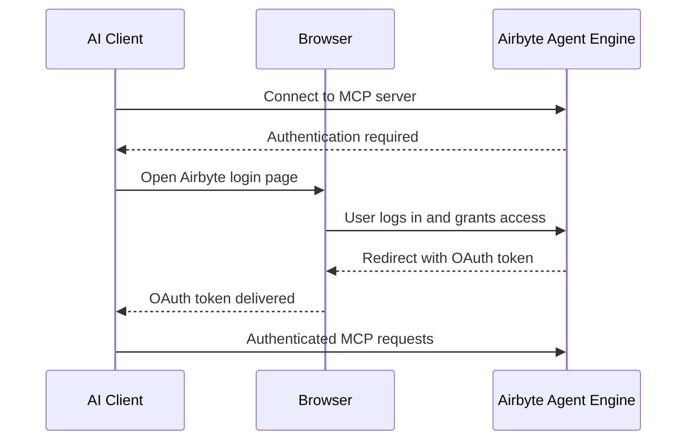
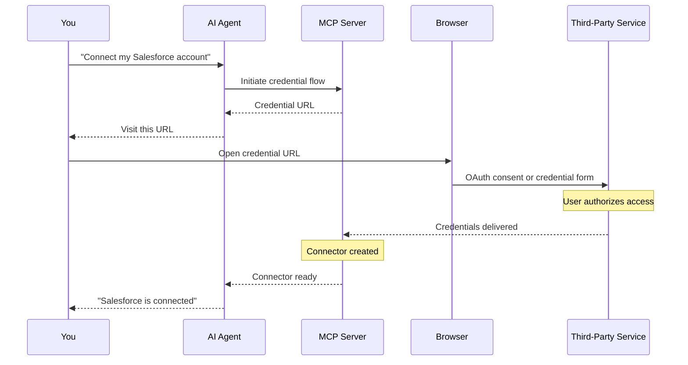

import Tabs from '@theme/Tabs';
import TabItem from '@theme/TabItem';

# Agent Engine MCP server

The Airbyte Agent Engine MCP server connects your AI agent to your data through the [Model Context Protocol (MCP)](https://modelcontextprotocol.io/). It gives your agent authenticated access to the platforms you use every day, like your CRM, support desk, analytics tools, and more, so your agent can read and write data on your behalf. See [Connectors](../connectors) for a list of available connectors.

Airbyte hosts and manages this remote MCP server, so there's nothing to install.

## What connectors do

Each connector is a type-safe integration that gives your AI agent direct access to a third-party platform's API. Connectors let your agent list, search, retrieve, and in some cases create or update records in the connected service. Every connector exposes a set of **entities** (such as contacts, deals, issues, or invoices) and **actions** (such as list, get, search, create, or update) that the agent can call.

For example:

- A **CRM connector** like Salesforce or HubSpot lets your agent query contacts, companies, deals, and tickets.
- A **billing connector** like Stripe lets your agent look up customers, invoices, charges, and subscriptions.
- A **communication connector** like Slack lets your agent read channel messages and threads, and send or update messages.
- A **revenue intelligence connector** like Gong lets your agent retrieve call recordings, transcripts, and activity statistics.
- A **project management connector** like Jira or Linear lets your agent search issues, projects, and comments.

Connectors handle authentication, pagination, schema validation, and error handling so the agent can focus on answering questions and performing tasks. The agent automatically discovers which entities and actions are available for each connector you've added, so you only need to describe what you want in natural language.

When you connect a service through the MCP server, the Agent Engine can copy key data from that connector into a [context store](../platform/context-store). The context store is Airbyte-managed object storage that enables fast search across your connected data. This improves search speed and reduces token consumption compared to querying third-party APIs directly, especially for prompts that involve filtering or searching large datasets.

For the complete list of connectors and their supported entities, see [Agent connectors](../connectors).

## Requirements

Before you begin, make sure you have the following:

- **An Agent Engine account.** Sign up at [app.airbyte.ai](https://app.airbyte.ai) if you don't have one.

- **An AI agent that supports MCP.** For example, Claude Desktop, Claude Code, Cursor, Codex, or ChatGPT.

- **Credentials for the connectors you want to use.** Each service requires its own authentication. For example, you need a Linear API key to connect Linear, or Salesforce OAuth credentials to connect Salesforce.

## Add the MCP server to your agent

Select your client below for setup instructions. Each client requires you to authenticate with your Airbyte account before you can use the MCP server.

<Tabs>
<TabItem value="claude-code" label="Claude Code" default>

Add the MCP server to your Claude Code command line tool.

1. Run the following command in your terminal:

    ```bash
    claude mcp add --transport http airbyte-agent https://mcp.airbyte.ai/mcp
    ```

2. Run Claude Code with `claude`.

3. Type `/mcp`.

4. Select the **airbyte-agent** MCP you added in step 1.

5. Select **Authenticate**. Your web browser opens.

6. If you're not logged into the Agent Engine, log in now.

7. Grant access to the Agent Engine MCP.

8. Return to Claude Code and begin using the MCP server.

</TabItem>
<TabItem value="cursor" label="Cursor">

Add the MCP server to your Cursor app.

1. Go to **Cursor** > **Settings** > **Cursor Settings** > **Tools and MCP**.

2. Click **Add custom MCP**.

3. In `mcp.json`, add:

    ```json
    {
      "mcpServers": {
        "Airbyte Agent Engine MCP": {
          "url": "https://mcp.airbyte.ai/mcp"
        }
      }
    }
    ```

4. Close `mcp.json` and return to Cursor Settings.

5. Find the Airbyte MCP server and click **Connect**.

6. If you're not logged into the Agent Engine, log in now.

7. Grant access to the Agent Engine MCP.

8. Return to Cursor. The MCP server tools are now available.

</TabItem>
<TabItem value="claude-desktop" label="Claude Desktop">

Claude Desktop uses Custom Connectors for remote MCP servers. Don't use the `claude_desktop_config.json` file, as it only supports local servers.

1. Open Claude Desktop and go to **Settings** > **Connectors**.

2. Click **Add custom connector**.

3. Enter the server name and URL: `https://mcp.airbyte.ai/mcp`

4. Click **Add**.

5. Find the Airbyte connector in the list and click **Connect**. Your browser opens.

6. Log in with your Airbyte account and grant access.

7. Return to Claude Desktop. The MCP server is automatically enabled. If it isn't, in your chat, click **+** > **Connectors** > **Airbyte** to turn it on.

</TabItem>
<TabItem value="codex" label="Codex">

Add the MCP server to your Codex command line tool.

1. Run the following command in your terminal to add the server:

    ```bash
    codex mcp add airbyte --url https://mcp.airbyte.ai/mcp
    ```

2. Codex detects that the server requires OAuth and opens your browser.

3. Log in with your Airbyte account and grant access.

4. Launch Codex with `codex`.

5. Begin using the MCP server.

</TabItem>
<TabItem value="chatgpt" label="ChatGPT">

ChatGPT supports remote MCP servers through its [Developer Mode](https://platform.openai.com/docs/guides/developer-mode) feature. Developer Mode is available on Pro, Plus, Business, Enterprise, and Education plans. It's not available on Free plans.

:::note Business and Enterprise plans
On Business plans, apps are enabled by default. Workspace owners can restrict them from **Workspace Settings** > **Apps**.

On Enterprise and Education plans, apps are disabled by default. A workspace admin must go to **Workspace Settings** > **Apps** > **Directory**, find the app, and click **Enable** before workspace members can use it.
:::

1. Open [ChatGPT](https://chatgpt.com) on the web.

2. Go to **Settings** > **Apps** > **Advanced settings**.

3. Toggle **Developer mode** to **ON**.

4. Go back to the apps screen.

5. Click **Create app** next to "Advanced settings." This button only appears when Developer Mode is enabled.

6. Enter the server details:

    - **Name**: `Airbyte Agent Engine`
    - **Server URL**: `https://mcp.airbyte.ai/mcp`
    - **Authentication**: Select **OAuth**

7. Accept ChatGPT's disclaimer and click **Create**. The app appears under **Drafts** in your Apps settings.

8. When prompted, log into Agent Engine if necessary, then accept the access privileges.

9. Open a new conversation to start using the MCP server.

</TabItem>
<TabItem value="other" label="Other clients">

The Airbyte MCP server works with any client that supports OAuth authentication and Streamable HTTP transport. Use the following server URL in your client's MCP configuration:

```text
https://mcp.airbyte.ai/mcp
```

Most clients that support remote MCP servers accept a JSON configuration like this:

```json
{
  "mcpServers": {
    "Airbyte Agent Engine MCP": {
      "url": "https://mcp.airbyte.ai/mcp"
    }
  }
}
```

When your client first connects, it detects that the server requires OAuth. It may or may not open your browser automatically. You may need to click a button to do this. Log in with your app.airbyte.ai account and grant access. After you authenticate, the MCP server's tools are available to your agent.

</TabItem>
</Tabs>

## Example usage

After you connect the MCP server, your agent can discover and call its tools automatically based on your prompts. The following examples show common actions.

### Add a connector

To connect a new data source, prompt your agent with the service you want to connect. The MCP can use any Airbyte [agent connector](../connectors). The agent handles the setup, including starting a browser-based credential flow where you enter your credentials securely.

```text
Connect my Linear account
```

The agent:

1. Starts a credential flow and gives you a URL to visit.
2. You visit the URL and enter your credentials in the browser.
3. The agent confirms the connector was created and is ready to query.

:::note
Credentials are always entered in the browser, never in the chat.
:::

### Remove a connector

To remove a connector you no longer need:

```text
Delete my Linear connector
```

### Query data

After you connect a data source, prompt your agent. The agent discovers the available entities, understands their schemas, and executes the right queries.

```text
Show me the 10 most recent Gong calls
```

```text
Find all open deals in Salesforce worth more than $50,000
```

```text
List HubSpot contacts who were created this week
```

```text
How many Zendesk tickets are in "open" status?
```

The agent uses field selection to return only the data you need, which reduces token usage and improves response quality.

## How authentication works

The MCP server uses a two-layer authentication model: one layer to authenticate you with the Airbyte Agent Engine, and a second layer to authenticate with each third-party service you connect.

### Layer 1: Authenticating with the MCP server

When your AI client first connects to the MCP server, it initiates an [OAuth 2.0](https://oauth.net/2/) authorization flow with Airbyte:



1. Your client detects that the MCP server at `https://mcp.airbyte.ai/mcp` requires authentication.
2. Your client opens a browser window to the Airbyte login page.
3. You log in with your [Agent Engine](https://app.airbyte.ai) account (or create one).
4. You grant the MCP server access to your Airbyte account.
5. The browser redirects back to your client with an OAuth token.
6. Your client stores the token and uses it for all subsequent MCP requests.

This token authorizes the MCP server to act on your behalf within the Agent Engine. The token is scoped to your Airbyte account and organization, so the MCP server can only access connectors and data that belong to you. If the token expires, your client automatically triggers a new OAuth flow.

### Layer 2: Authenticating with third-party services

After you authenticate with the MCP server, you still need to connect each third-party service individually. When you ask your agent to connect a service (for example, "Connect my Salesforce account"), a second credential flow begins:



1. The agent calls the MCP server to initiate a credential flow for the requested service.
2. The MCP server returns a secure URL for you to visit in your browser.
3. You open the URL and authenticate directly with the third-party service. Depending on the connector, this is either:
   - An **OAuth consent screen** where you authorize Airbyte to access your account (used by services like Salesforce, HubSpot, GitHub, Google, and Slack), or
   - A **credential form** where you enter an API key or access token (used by services like Stripe, Gong, and Linear).
4. After you complete the flow, Airbyte securely stores your credentials and creates a connector.
5. The agent confirms the connector is ready and you can begin querying data.

:::note
Your third-party credentials are always entered in the browser, never in the agent chat. Airbyte stores credentials securely on the server side and the MCP server never exposes them to the AI agent.
:::

Once a connector is created, the agent uses it for all subsequent queries to that service. You don't need to re-authenticate unless your credentials expire or are revoked by the third-party service.

## Troubleshooting

### MCP server authentication fails

- Make sure you have an active account at [app.airbyte.ai](https://app.airbyte.ai).
- Try logging out of your agent's MCP integration and reconnecting to trigger a fresh OAuth flow.
- If you joined a new Airbyte organization, authenticate again to refresh your access.
- If your client reports a token error, remove and re-add the MCP server to clear stored tokens.

### Agent can't find the MCP server

- Restart your agent after adding the MCP server configuration.
- Verify the server URL is exactly `https://mcp.airbyte.ai/mcp` in your configuration.
- Check that your client supports Streamable HTTP or OAuth-based MCP servers.

### Connector credential flow doesn't complete

- Make sure you visited the credential URL the agent provided and completed the form in the browser.
- If the flow timed out, ask the agent to start a new credential flow.

### ChatGPT doesn't show the "Create app" button

- Verify that Developer Mode is toggled on in **Settings** > **Apps** > **Advanced settings**.
- Make sure your ChatGPT plan supports Developer Mode. It requires Pro, Plus, Business, Enterprise, or Education. Free plans don't have access.
- After enabling Developer Mode, go back to the main **Apps** screen. The **Create app** button appears next to "Advanced settings."

### ChatGPT can't connect to the MCP server

- Confirm the server URL is exactly `https://mcp.airbyte.ai/mcp` with no trailing slash or extra path.
- If the OAuth flow doesn't complete, try deleting the app in **Settings** > **Apps** and creating it again.
- On Enterprise or Education plans, a workspace admin must enable the app before members can use it. Check with your admin if you see a permissions error.

### Queries return unexpected results

- Ask the agent to describe the available entities before querying, so it picks the right one.
- For time-based queries, the agent resolves relative dates like "this week" or "last month" automatically.
