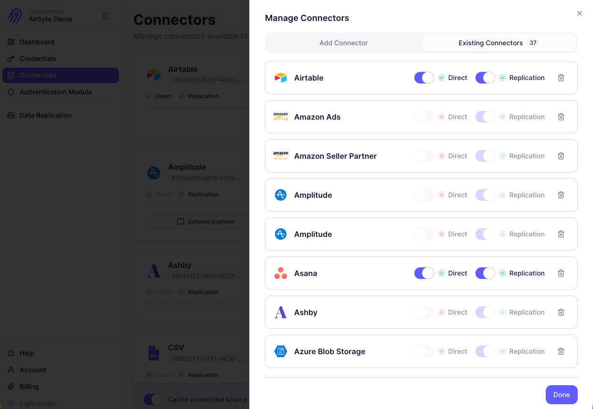

import Tabs from '@theme/Tabs';
import TabItem from '@theme/TabItem';

# Enable a connector

Before your AI agents can interact with external data sources, you need to enable connectors in the Agent Engine. Enabling a connector makes it available for your end users to authenticate and use with their own credentials.

## What enabling a connector does

When you enable a connector in Agent Engine, you're configuring which data sources your app supports. This is separate from authentication, which happens when individual users connect their accounts.

Enabling a connector creates a **source template** in the API, which is the organization-level configuration for a connector type. The Agent Engine uses three layers:

- **Definition**: A connector type available in the Airbyte catalog (for example, GitHub or Salesforce), identified by a `sourceDefinitionId`. List definitions with `GET /api/v1/integrations/definitions/sources`.
- **Source template**: Your organization's configuration of a definition, including default settings and enabled modes. Managed through `GET/POST/PATCH/DELETE /api/v1/integrations/templates/sources`.
- **Connector**: A per-user instance with actual credentials, created when an end user authenticates. Managed through `/api/v1/integrations/connectors`.

Enabling a connector (creating a source template) does the following.

- Makes the connector available in your organization's connector catalog
- Allows your end users to authenticate with their own credentials for that data source
- Configures which modes the connector operates in: direct, replication, or both

## Connector modes

Agent Engine connectors can operate in two modes:

- **Direct mode** allows AI agents to execute real-time queries against connected data sources. When a user asks a question, the agent calls the third-party API directly to fetch fresh data. This mode is ideal for operational queries, real-time lookups, and actions that need current information.

- **Replication mode** syncs data from connected sources to object storage like S3, GCS, or Azure Blob Storage. This mode is useful for analytics, RAG pipelines, and scenarios where you need to process large volumes of historical data.

Some connectors support both modes, while others support only one. When enabling a connector, you can choose which modes to activate based on your application's needs.

## With the UI

### Enable a new connector

Enable a connector through the Agent Engine dashboard.

1. Click **Connectors**.

2. Click **Manage Connectors** (or **Enable Connector** if you haven't enabled any connectors yet).

3. In the slide-out panel, browse or search for the connector you want to enable, and click it.

4. Click the **Existing Connectors** tab and select the modes you want to enable for the connector:

   - Check **Direct** to enable real-time agent queries

   - Check **Replication** to enable replicating data to object storage

5. Click **Done**.

The connector appears in your active connectors list. Your end users can authenticate with this connector and use it in the modes you defined.



### Update connectors

To modify or delete connectors you've already enabled, follow these steps.

1. Click **Connectors** > **Manage Connectors** > **Existing Connectors**.

2. For each connector, you can:

   - Toggle Direct mode on or off

   - Toggle Replication mode on or off, if data replication is enabled

   - Remove the connector entirely by clicking the trash icon

At least one mode must remain enabled for each active connector.

## With the API

You can also enable connectors programmatically using the Agent Engine API. This approach is useful for automation, infrastructure-as-code workflows, or when building custom admin interfaces.

### Get an application token

Request an application token using your Airbyte client credentials.

```bash title="Request"
curl --location 'https://api.airbyte.ai/api/v1/account/applications/token' \
  --header 'Content-Type: application/json' \
  --data '{
    "client_id": "<your_client_id>",
    "client_secret": "<your_client_secret>"
  }'
```

Save the returned access token for subsequent API calls.

### List source templates

To see which connectors are enabled (as source templates) for your organization:

```bash title="Request"
curl 'https://api.airbyte.ai/api/v1/integrations/templates/sources' \
  --header 'Authorization: Bearer <APPLICATION_TOKEN>'
```

This returns both source templates you've created and standard source templates available to all Agent Engine users.

### Create a source template

If you don't see the connector you need, create a source template for it.

```bash title="Request"
curl -X POST 'https://api.airbyte.ai/api/v1/integrations/templates/sources' \
  --header 'Authorization: Bearer <APPLICATION_TOKEN>' \
  --header 'Content-Type: application/json' \
  --data '{
    "organization_id": "<your_organization_id>",
    "actor_definition_id": "<connector_definition_id>",
    "partial_default_config": {}
  }'
```

The `actor_definition_id` is the identifier for the connector type. This corresponds to the `sourceDefinitionId` returned by the [definitions endpoint](/ai-agents/api/#make-your-first-request). You can also find these IDs in the [Airbyte Connector Registry](https://connectors.airbyte.com/files/registries/v0/cloud_registry.json).

The `partial_default_config` object lets you pre-configure default values for the source template, so your users don't need to provide them during authentication.

### Update a source template

To modify an existing source template.

```bash title="Request"
curl -X PATCH 'https://api.airbyte.ai/api/v1/integrations/templates/sources/<template_id>' \
  --header 'Authorization: Bearer <APPLICATION_TOKEN>' \
  --header 'Content-Type: application/json' \
  --data '{
    "partial_default_config": {
      "some_field": "new_default_value"
    }
  }'
```

When you update a source template, the changes apply to all connectors created from it.

### Delete a source template

To delete a source template, follow these steps. Once you do this, the connector type is no longer available for end users to authenticate with.

```bash title="Request"
curl -X DELETE 'https://api.airbyte.ai/api/v1/integrations/templates/sources/<template_id>' \
  --header 'Authorization: Bearer <APPLICATION_TOKEN>'
```

## Next steps

After enabling connectors, set up [authentication](authenticate) to let users connect their accounts.
