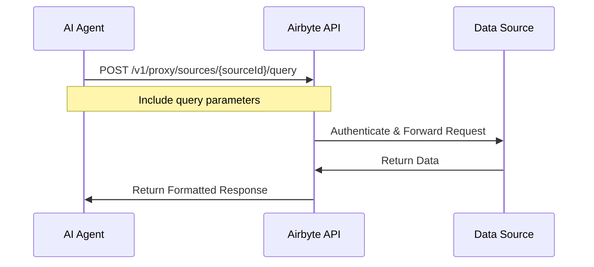

# Proxy Requests

Airbyte Proxy Requests allow you to access data from configured sources on-demand without running a full sync. This is ideal for AI agents that need real-time data access or want to query specific records dynamically.

## What are Proxy Requests?

Proxy requests enable your AI application to:
- **Query data on-demand** from configured sources
- **Bypass full sync workflows** for immediate data access
- **Reduce latency** by fetching only the data you need
- **Save resources** by avoiding unnecessary full syncs

Unlike traditional Airbyte syncs that move data in batches, proxy requests act as a pass-through to the source API, allowing you to make real-time queries.

## Use Cases

### AI Agent Scenarios
- **Chatbots**: Fetch customer order details from Shopify in real-time
- **AI Assistants**: Query CRM records from Salesforce based on user questions
- **Analytics Agents**: Pull latest metrics from Google Analytics on-demand
- **Data Retrieval**: Access specific files from S3 buckets dynamically

### When to Use Proxy Requests
- ✅ Real-time data access is critical
- ✅ You need specific records, not full datasets
- ✅ Low latency is important
- ✅ Data changes frequently

### When to Use Regular Syncs
- ✅ You need complete historical data
- ✅ Data can be a few minutes or hours stale
- ✅ You want to query data locally (in your warehouse)
- ✅ You need to perform complex transformations

## Supported Source Types

Airbyte supports proxy requests for two main categories:

1. **[API Sources](./api-sources.md)** - RESTful APIs and SaaS platforms
   - Stripe, Shopify, Salesforce, HubSpot, etc.
   - OAuth and API key authentication
   - Structured data responses

2. **[File Storage Sources](./file-storage-sources.md)** - Cloud storage platforms
   - Amazon S3, Google Cloud Storage, Azure Blob Storage
   - Object/file retrieval
   - Binary and text content

## How Proxy Requests Work



### Authentication Flow
1. Your AI agent authenticates with Airbyte API using a bearer token
2. Airbyte uses the stored source credentials to authenticate with the data source
3. The request is proxied to the source API
4. Results are returned directly to your agent

### Benefits
- **No credential management**: Source credentials are stored securely in Airbyte
- **Consistent interface**: Uniform API across different sources
- **Error handling**: Airbyte handles retries and rate limiting
- **Audit trail**: All requests are logged for compliance

## Basic Usage

### 1. Configure a Source

First, create and configure a source using the Airbyte API or Embedded Widget:

```bash
curl -X POST https://api.airbyte.com/v1/sources \
  -H "Authorization: Bearer YOUR_TOKEN" \
  -H "Content-Type: application/json" \
  -d '{
    "workspaceId": "your-workspace-id",
    "name": "Shopify Store",
    "sourceDefinitionId": "shopify-source-def-id",
    "configuration": {
      "shop": "mystore.myshopify.com",
      "credentials": {
        "auth_method": "api_password",
        "api_password": "YOUR_API_PASSWORD"
      },
      "start_date": "2024-01-01"
    }
  }'
```

### 2. Make Proxy Requests

Once configured, query data using proxy requests:

```bash
curl -X POST https://api.airbyte.com/v1/proxy/sources/{sourceId}/query \
  -H "Authorization: Bearer YOUR_TOKEN" \
  -H "Content-Type: application/json" \
  -d '{
    "stream": "orders",
    "filters": {
      "status": "fulfilled",
      "limit": 10
    }
  }'
```

### 3. Process Results

```json
{
  "records": [
    {
      "id": "12345",
      "customer_name": "John Doe",
      "total": 99.99,
      "status": "fulfilled"
    },
    {
      "id": "12346",
      "customer_name": "Jane Smith",
      "total": 149.99,
      "status": "fulfilled"
    }
  ],
  "next_page_token": "eyJwYWdlIjoy..."
}
```

## Code Examples

### Python

```python
import requests

def query_source(source_id, stream, filters):
    """Query a source using Airbyte proxy requests."""

    url = f"https://api.airbyte.com/v1/proxy/sources/{source_id}/query"
    headers = {
        "Authorization": f"Bearer {ACCESS_TOKEN}",
        "Content-Type": "application/json"
    }
    payload = {
        "stream": stream,
        "filters": filters
    }

    response = requests.post(url, headers=headers, json=payload)
    response.raise_for_status()

    return response.json()

# Example usage
results = query_source(
    source_id="src_123456",
    stream="orders",
    filters={"status": "fulfilled", "limit": 10}
)

for record in results["records"]:
    print(f"Order {record['id']}: ${record['total']}")
```

### JavaScript/TypeScript

```javascript
async function querySource(sourceId, stream, filters) {
  const response = await fetch(
    `https://api.airbyte.com/v1/proxy/sources/${sourceId}/query`,
    {
      method: 'POST',
      headers: {
        'Authorization': `Bearer ${ACCESS_TOKEN}`,
        'Content-Type': 'application/json'
      },
      body: JSON.stringify({
        stream: stream,
        filters: filters
      })
    }
  );

  if (!response.ok) {
    throw new Error(`Proxy request failed: ${response.statusText}`);
  }

  return await response.json();
}

// Example usage
const results = await querySource(
  'src_123456',
  'orders',
  { status: 'fulfilled', limit: 10 }
);

results.records.forEach(record => {
  console.log(`Order ${record.id}: $${record.total}`);
});
```

## Pagination

For large result sets, use pagination:

```python
def query_all_records(source_id, stream, filters):
    """Query all records with pagination."""
    all_records = []
    next_page_token = None

    while True:
        payload = {
            "stream": stream,
            "filters": filters
        }

        if next_page_token:
            payload["page_token"] = next_page_token

        response = query_source(source_id, stream, payload)
        all_records.extend(response["records"])

        next_page_token = response.get("next_page_token")
        if not next_page_token:
            break

    return all_records
```

## Rate Limiting

Proxy requests are subject to:
1. **Airbyte API rate limits** - Varies by plan
2. **Source API rate limits** - Depends on the source (Shopify, Stripe, etc.)

### Best Practices
- Implement exponential backoff for retries
- Cache frequently accessed data
- Use batch requests when supported
- Monitor rate limit headers

```python
import time

def query_with_retry(source_id, stream, filters, max_retries=3):
    """Query with exponential backoff."""
    for attempt in range(max_retries):
        try:
            return query_source(source_id, stream, filters)
        except requests.exceptions.HTTPError as e:
            if e.response.status_code == 429:  # Rate limited
                wait_time = 2 ** attempt
                print(f"Rate limited. Waiting {wait_time}s...")
                time.sleep(wait_time)
            else:
                raise

    raise Exception("Max retries exceeded")
```

## Error Handling

### Common Error Codes

| Status Code | Meaning | Solution |
|------------|---------|----------|
| 400 | Bad Request | Check request payload format |
| 401 | Unauthorized | Verify access token is valid |
| 403 | Forbidden | Check source permissions |
| 404 | Not Found | Verify source ID exists |
| 429 | Rate Limited | Implement backoff strategy |
| 500 | Server Error | Retry with exponential backoff |
| 502 | Source Unavailable | Check source API status |

### Example Error Response

```json
{
  "error": {
    "code": "RATE_LIMIT_EXCEEDED",
    "message": "Rate limit exceeded for source API",
    "retry_after": 60
  }
}
```

## Security Considerations

### Authentication
- Never expose Airbyte access tokens in client-side code
- Use server-side proxy for browser-based applications
- Rotate tokens regularly
- Use user-scoped tokens for multi-tenant scenarios

### Data Access
- Implement proper access control in your application
- Validate user permissions before making proxy requests
- Log all data access for audit purposes
- Consider data residency requirements

## Monitoring and Observability

### Track Request Metrics
- Request latency
- Error rates
- Rate limit hits
- Data volume transferred

### Example Monitoring

```python
import time
from dataclasses import dataclass

@dataclass
class ProxyMetrics:
    request_count: int = 0
    error_count: int = 0
    total_latency: float = 0

    def avg_latency(self):
        return self.total_latency / self.request_count if self.request_count > 0 else 0

metrics = ProxyMetrics()

def query_with_metrics(source_id, stream, filters):
    """Query with metrics tracking."""
    start_time = time.time()

    try:
        result = query_source(source_id, stream, filters)
        metrics.request_count += 1
        return result
    except Exception as e:
        metrics.error_count += 1
        raise
    finally:
        metrics.total_latency += time.time() - start_time

# Print metrics
print(f"Requests: {metrics.request_count}")
print(f"Errors: {metrics.error_count}")
print(f"Avg Latency: {metrics.avg_latency():.2f}s")
```

## Comparison: Proxy Requests vs Regular Syncs

| Feature | Proxy Requests | Regular Syncs |
|---------|---------------|---------------|
| **Latency** | Low (real-time) | High (scheduled) |
| **Data Freshness** | Immediate | Delayed by sync schedule |
| **Cost** | Per-request | Per-sync |
| **Use Case** | On-demand queries | Full data replication |
| **Data Volume** | Small (specific records) | Large (complete datasets) |
| **Caching** | Not cached | Stored in destination |
| **Query Capability** | Limited by source API | Full SQL queries |

## Next Steps

- **[API Sources](./api-sources.md)** - Learn about supported API sources
- **[File Storage Sources](./file-storage-sources.md)** - Learn about file storage access
- **[Authentication Guide](../embedded/api/authentication.md)** - Set up authentication
- **[Quickstart](../quickstart.md)** - Build your first integration

## Additional Resources

- [Airbyte API Reference](https://reference.airbyte.com)
- [Proxy Request API Documentation](https://reference.airbyte.com/reference/proxyrequest)
- [Source Catalog](https://docs.airbyte.com/integrations)

## FAQ

### Can I use proxy requests without setting up a destination?
Yes! Proxy requests don't require a destination. You only need to configure the source.

### Are proxy requests available on all plans?
Proxy requests are available on Enterprise plans. Contact sales for details.

### What's the request timeout?
Proxy requests timeout after 30 seconds by default. For long-running queries, use regular syncs instead.

### Can I proxy write operations?
Currently, proxy requests are read-only. Write operations are not supported.

### How do I know which streams are available?
Use the source schema API to list available streams for a configured source.
