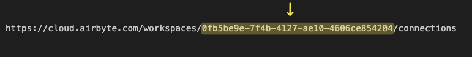

# Getting Started with Proxy Requests

Proxy Requests make it possible for an app developer to perform a call on behalf of a customer to fetch their data via a pre-configured connector within Airbyte Embedded. This may include structured data such as responses from a third party API, or unstructured data from files. Proxy requests are a valuable way for app developers building AI powered apps that uses customer data and LLMs to allow the user to derive deeper insights and analysis. This guide will provide instructions on how to call the API directly, or use the embedded MCP server, and share the response with LLMs. 

## Pre-requisites

Proxy Requests requires the Airbyte organization to have Airbyte Embedded enabled, and  a proxy request supported connector already created within the environment. The list below includes the currently supported connectors:

- Stripe

If you do not already have a connector created, please use the [Embedded Widget](https://docs.airbyte.com/developer-tools/embedded/widget/prerequisites-setup) to onboard a customer data source, or [use the Airbyte Sources tab to create your own](https://docs.airbyte.com/platform/using-airbyte/getting-started/add-a-source). 

## Authentication

To perform a proxy request API or MCP call, you must provide a valid Bearer token. Please refer to the [Platform Core Concepts](https://docs.airbyte.com/platform/connector-development/connector-builder-ui/authentication#bearer-token) for further reading on Authentication. For Airbyte Embedded, to obtain a bearer token, you need the following:

- Client Id: Retrieve yours from selecting Organization Settings, and choosing Embedded from the left hand menu
- Client Secret: Retrieve yours from selecting Organization Settings, and choosing Embedded from the left hand menu
- Workspace Id: Retrieve yours by copying the id from the Airbyte url. This workspace must be the same workspace where the source connector is defined.
    
    
    

If you are using Python, this [token manager](https://github.com/quintonwall/airbyte-token-manager) can be included in your project to handle managing and refreshing Bearer tokens.

## Proxy Request API

[Proxy requests](https://api.airbyte.ai/api/v1/docs#tag/Embedded/operation/get_embedded_scoped_token_info) are performed as a POST against the following URL, where `source_id` is the id of the configured Airbyte connector which you want to perform the request to:

```bash

https://api.airbyte.ai/api/v1/sonar/apis/{source_id}/request
```

With the body used to pass in the requested URL or stream. For example, I have a source connector configured within Airbyte to my Stripe instance. I have already authenticated and tested the connector. In order to call the Stripe invoices API, a proxy request would look like:

```bash
curl -X POST -H 'Content-Type: application/json' \
-H 'Authorization: Bearer {AIRBYTE_ACCESS_TOKEN}' \
-d {"method": "GET", "url": "https://api.stripe.com/v1/invoices", "headers": {"additional_header_key": "value"}}' \
'https://api.airbyte.ai/api/v1/sonar/apis/{SOURCE_ID}/request'
```

Proxy requests also support passing of query parameters to the end API, Stripe in this instance. For example, if you wanted to only return invoices for a particular customer, you could perform the following request:

```bash
curl -X POST -H 'Content-Type: application/json' \
-H 'Authorization: Bearer {AIRBYTE_ACCESS_TOKEN}' \
-d {"method": "GET", "url": "https://api.stripe.com/v1/invoices?customer=cus_ABC123456789", "headers": {"additional_header_key": "value"}}' \
'https://api.airbyte.ai/api/v1/sonar/apis/{SOURCE_ID}/request'
```

For a full example using the Proxy Request API in Python, check out [the sample project on Github.](https://github.com/quintonwall/airbyte-proxy-requests/tree/main) 


## Proxy Requests for Files
Similar to API requests, proxy requests may fetch unstructured data in the form of files.

Here's an example of how to list files:
```bash
curl -X GET -H 'Content-Type: application/json' \
-H 'Authorization: Bearer {AIRBYTE_ACCESS_TOKEN}' \
'https://api.airbyte.ai/api/v1/sonar/files/{SOURCE_ID}/list/path/to/directory/or/file/prefix'
```

Here's an example of how to fetch an individual file:
```bash
curl -X GET -H 'Content-Type: application/octet-stream' \
-H 'Authorization: Bearer {AIRBYTE_ACCESS_TOKEN}' \
-H 'Range: bytes=0-1048575' \
'https://api.airbyte.ai/api/v1/sonar/files/{SOURCE_ID}/get/path/to/file'
```

## Proxy Requests via the Embedded MCP

Proxy requests are also supported the `apis_make_request` tool in the Embedded MCP.

To add the Embedded MCP to your favorite AI tool, add the following to the mcp.json file:

```json
"airbyte-embedded": {
      "url": "https://mcp.airbyte.ai",
      "env": {
        "CLIENT_ID": "your-client-id",
        "CLIENT_SECRET": "your-client-secret"
      }
    }
```

With the Embedded MCP, you can also directly pass the results of a proxy request to an LLM or agent. The following example uses the OpenAI Responses API to ask the LLM to perform analysis on customer data returned from a proxy request. Notice that the source id is included in the prompt. The LLM uses it’s own logic to determine the parameters required for the apis_make_request tool.

```python
resp = openai.responses.create(
        model="gpt-5",
        tools=[
            {
                "type": "mcp",
                "server_label": "airbyte-embedded-mcp",
                "server_url": "https://mcp.airbyte.ai",
                "headers": {
                    "Authorization": f"Bearer {AIRBYTE_BEARER_TOKEN}"
                },
                "require_approval": "never",
            },
        ],
        input=(
            "You are an experienced financial planner and accountant. "
            "Call the apis_make_request tool to fetch Stripe invoices "
            "using the stripe connector with the id 9def5920-d4eb-41c7-aacd-0369800e4817 "
            "Then, analyze the results and prepare a plan for me to manage my invoices."
        ),
    )

```

For a full Python example using the Embedded MCP, please refer to [the sample project in GitHub](https://github.com/quintonwall/airbyte-embedded-mcp-example/tree/main).
