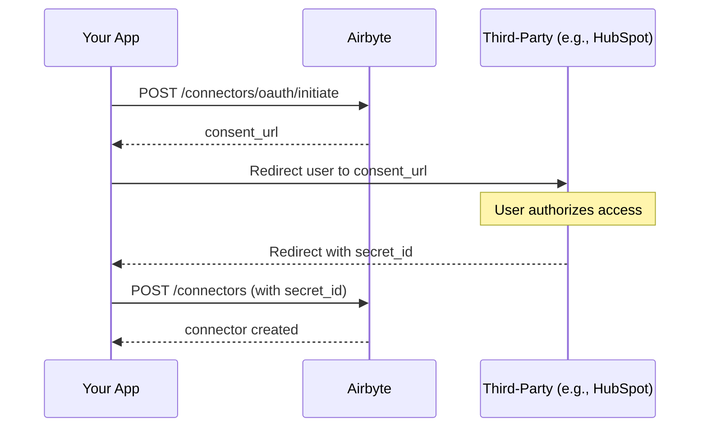

# Implement your own OAuth flow

If you provide an environment where your users can create connectors, they need to supply their credentials so their agents can access their data. Airbyte provides a standard [Embedded widget](../embedded/widget) for this purpose. However, you might prefer to create a fully customized OAuth flow with your own branding and UX. In this case, implement your own OAuth flow.

This tutorial walks you through implementing a server-side OAuth flow for your users. By the end, you'll be able to initiate OAuth consent, handle the callback, and create connectors using the obtained credentials.

## How it works

The server-side OAuth flow involves four main steps:

1. **Initiate OAuth**: Your backend calls Airbyte's API to get a consent URL for the connector.
2. **User consent**: You redirect your user to the consent URL where they authorize access to their account.
3. **Handle callback**: After authorization, Airbyte redirects your user back to your app with a `secret_id`.
4. **Create connector**: You use that `secret_id` to create a connector without handling raw credentials.



## Prerequisites

Before implementing an OAuth flow, ensure you have:

1. **Airbyte Cloud credentials**: Your `client_id` and `client_secret` from the Airbyte Cloud dashboard under **Settings > Applications**.

2. **An operator bearer token**: See [Authentication](../embedded/api/authentication.md) for how to obtain one.

3. **A scoped token**: Required for workspace-level operations. Generate one using your operator token.

4. **A redirect URL**: A URL in your application that will receive the OAuth callback with the `secret_id`.

## Part 1 (Optional): Configure OAuth overrides

By default, Airbyte uses its own OAuth application credentials for each connector. If you want to use your own OAuth application (for custom branding on the consent screen or to avoid rate limits), configure OAuth credential overrides.

### Endpoint

```
PUT https://api.airbyte.ai/api/v1/oauth/credentials
```

### Authentication

Requires **Operator Bearer Token**

### Request body

| Field | Type | Required | Description |
|-------|------|----------|-------------|
| `connector_type` | string | Yes* | Connector name (case-insensitive). For example, `hubspot`, `Salesforce`. |
| `connector_definition_id` | UUID | Yes* | Actor definition ID for the connector. |
| `configuration` | object | Yes | Your OAuth application credentials (client_id, client_secret, etc.). |

*Provide exactly one of `connector_type` or `connector_definition_id`.

### Request example

```bash
curl -X PUT https://api.airbyte.ai/api/v1/oauth/credentials \
  -H 'Authorization: Bearer <operator_token>' \
  -H 'Content-Type: application/json' \
  -d '{
    "connector_type": "hubspot",
    "configuration": {
      "client_id": "your-hubspot-client-id",
      "client_secret": "your-hubspot-client-secret"
    }
  }'
```

### Response example

```json
{
  "id": "a1b2c3d4-e5f6-7890-ab12-cd34ef567890",
  "scope_type": "organization",
  "scope_id": "12345678-1234-1234-1234-123456789012",
  "connector_type": "source",
  "connector_definition_id": "36c891d9-4bd9-43ac-bad2-10e12756272c",
  "created_at": "2024-01-15T10:30:00Z",
  "updated_at": "2024-01-15T10:30:00Z"
}
```

The configuration schema varies by connector. To get the required fields for a specific connector, call `GET /api/v1/oauth/credentials/spec?connector_type=<connector_type>`.

## Part 2: Initiate the OAuth flow

When your user wants to connect a third-party service, initiate the OAuth flow to get a consent URL.

### Endpoint

```
POST https://api.airbyte.ai/api/v1/integrations/connectors/oauth/initiate
```

### Authentication

Requires **Operator Bearer Token** or **Scoped Token**

### Request body

| Field | Type | Required | Description |
|-------|------|----------|-------------|
| `external_user_id` | string | Yes | Your user's identifier. Maps to a workspace name in Airbyte. |
| `redirect_url` | string | Yes | URL where the user will be redirected after OAuth consent. Airbyte appends `?secret_id=<value>` to this URL. |
| `connector_type` | string | Yes* | Connector name (case-insensitive). For example, `hubspot`, `Salesforce`, `Intercom`. |
| `definition_id` | UUID | Yes* | Actor definition ID for the connector. |
| `oauth_input_configuration` | object | No | Additional OAuth parameters required by some connectors. |

*Provide exactly one of `connector_type` or `definition_id`.

### Request example

```bash
curl -X POST https://api.airbyte.ai/api/v1/integrations/connectors/oauth/initiate \
  -H 'Authorization: Bearer <operator_token>' \
  -H 'Content-Type: application/json' \
  -d '{
    "external_user_id": "user_12345",
    "connector_type": "hubspot",
    "redirect_url": "https://yourapp.com/oauth/callback"
  }'
```

### Response

```json
{
  "consent_url": "https://app.hubspot.com/oauth/authorize?client_id=...&redirect_uri=...&scope=..."
}
```

### Response fields

| Field | Type | Description |
|-------|------|-------------|
| `consent_url` | string | The URL to redirect your user to for OAuth authorization. |

### What to do with the response

Redirect your user to the `consent_url`. This takes them to the third-party service's authorization page where they grant access to their account.

```javascript
// Example: Redirect user to consent URL
const response = await fetch('https://api.airbyte.ai/api/v1/integrations/connectors/oauth/initiate', {
  method: 'POST',
  headers: {
    'Authorization': `Bearer ${operatorToken}`,
    'Content-Type': 'application/json'
  },
  body: JSON.stringify({
    external_user_id: userId,
    connector_type: 'hubspot',
    redirect_url: 'https://yourapp.com/oauth/callback'
  })
});

const { consent_url } = await response.json();

// Redirect the user to the consent URL
window.location.href = consent_url;
```

## Part 3: Create a connector

After the user authorizes access, they are redirected to your `redirect_url` with a `secret_id` query parameter. Use this `secret_id` to create a connector.

### Handle the OAuth callback

When the user is redirected back to your application, extract the `secret_id` from the URL:

```
https://yourapp.com/oauth/callback?secret_id=abc123def456
```

```javascript
// Example: Extract secret_id from callback URL
const urlParams = new URLSearchParams(window.location.search);
const secretId = urlParams.get('secret_id');

// Store this securely - you'll need it to create the connector
```

### Create the connector

Use the `secret_id` to create a connector without providing raw credentials.

### Endpoint

```
POST https://api.airbyte.ai/api/v1/integrations/connectors
```

### Authentication

Requires **Operator Bearer Token** or **Scoped Token**

### Request body

| Field | Type | Required | Description |
|-------|------|----------|-------------|
| `external_user_id` | string | Yes | Your user's identifier. Must match the value used in the initiate step. |
| `connector_type` | string | Yes* | Connector name (case-insensitive). |
| `definition_id` | UUID | Yes* | Actor definition ID for the connector. |
| `source_template_id` | UUID | Yes* | Source template ID. Required when multiple templates exist for the connector. |
| `name` | string | No | Display name for the connector. Auto-generated if not provided. |
| `server_side_oauth_secret_id` | string | Yes** | The `secret_id` from the OAuth callback. |
| `credentials` | object | Yes** | Authentication credentials. Not required when using `server_side_oauth_secret_id`. |
| `replication_config` | object | No | Connector-specific configuration like `start_date`, `lookback_window`, etc. |
| `environment` | object | No | Additional environment configuration for the connector. |

*Provide exactly one of `connector_type`, `definition_id`, or `source_template_id`.

**Provide either `server_side_oauth_secret_id` (for OAuth) or `credentials` (for API key/token auth).

### Request example (with OAuth secret)

```bash
curl -X POST https://api.airbyte.ai/api/v1/integrations/connectors \
  -H 'Authorization: Bearer <operator_token>' \
  -H 'Content-Type: application/json' \
  -d '{
    "external_user_id": "user_12345",
    "connector_type": "hubspot",
    "name": "My HubSpot Connection",
    "server_side_oauth_secret_id": "abc123def456"
  }'
```

### Response example

```json
{
  "id": "f1e2d3c4-b5a6-7890-fe12-dc34ba567890",
  "name": "My HubSpot Connection",
  "source_template": {
    "id": "a1b2c3d4-e5f6-7890-ab12-cd34ef567890",
    "name": "HubSpot",
    "connector_type": "hubspot"
  },
  "replication_config": {},
  "created_at": "2024-01-15T10:30:00Z",
  "updated_at": "2024-01-15T10:30:00Z"
}
```

### Response fields

| Field | Type | Description |
|-------|------|-------------|
| `id` | UUID | The unique identifier for the created connector. Save this for executing operations. |
| `name` | string | Display name of the connector. |
| `source_template` | object | Information about the source template used. |
| `replication_config` | object | The connector's configuration settings. |
| `created_at` | string | ISO 8601 timestamp of creation. |
| `updated_at` | string | ISO 8601 timestamp of last update. |

## Part 4: Execute operations

Once you've created a connector, you can execute operations against the third-party API.

### Endpoint

```
POST https://api.airbyte.ai/api/v1/connectors/sources/<connector_id>/execute
```

### Authentication

Requires **Scoped Token**

### Request body

| Field | Type | Required | Description |
|-------|------|----------|-------------|
| `entity` | string | Yes | The entity to operate on (for example, `contacts`, `deals`, `companies`). |
| `action` | string | Yes | The action to perform (for example, `list`, `get`, `create`). |
| `params` | object | No | Parameters for the operation. |

### Request example

```bash
curl -X POST https://api.airbyte.ai/api/v1/connectors/sources/f1e2d3c4-b5a6-7890-fe12-dc34ba567890/execute \
  -H 'Authorization: Bearer <scoped_token>' \
  -H 'Content-Type: application/json' \
  -d '{
    "entity": "contacts",
    "action": "list",
    "params": {
      "limit": 10
    }
  }'
```

### Response example

```json
{
  "result": [
    {
      "id": "123",
      "email": "contact@example.com",
      "firstname": "John",
      "lastname": "Doe"
    }
  ],
  "connector_metadata": {
    "pagination": {
      "cursor": "next_page_cursor"
    }
  }
}
```

## Complete example

Here's a complete Node.js example implementing the server-side OAuth flow:

```javascript
const express = require('express');
const app = express();

const AIRBYTE_API_BASE = 'https://api.airbyte.ai/api/v1';
const OPERATOR_TOKEN = process.env.AIRBYTE_OPERATOR_TOKEN;

// Step 1: Initiate OAuth when user clicks "Connect HubSpot"
app.post('/api/connect/:connectorType', async (req, res) => {
  const { connectorType } = req.params;
  const { userId } = req.body;

  const response = await fetch(`${AIRBYTE_API_BASE}/integrations/connectors/oauth/initiate`, {
    method: 'POST',
    headers: {
      'Authorization': `Bearer ${OPERATOR_TOKEN}`,
      'Content-Type': 'application/json'
    },
    body: JSON.stringify({
      external_user_id: userId,
      connector_type: connectorType,
      redirect_url: `https://yourapp.com/oauth/callback?user_id=${userId}&connector_type=${connectorType}`
    })
  });

  const { consent_url } = await response.json();
  res.json({ consent_url });
});

// Step 2: Handle OAuth callback
app.get('/oauth/callback', async (req, res) => {
  const { secret_id, user_id, connector_type } = req.query;

  // Step 3: Create the connector using the secret_id
  const response = await fetch(`${AIRBYTE_API_BASE}/integrations/connectors`, {
    method: 'POST',
    headers: {
      'Authorization': `Bearer ${OPERATOR_TOKEN}`,
      'Content-Type': 'application/json'
    },
    body: JSON.stringify({
      external_user_id: user_id,
      connector_type: connector_type,
      server_side_oauth_secret_id: secret_id
    })
  });

  const connector = await response.json();

  // Store connector.id for future operations
  await saveConnectorForUser(user_id, connector.id);

  // Redirect user to success page
  res.redirect('/connection-success');
});

// Step 4: Execute operations using the connector
app.post('/api/execute', async (req, res) => {
  const { userId, entity, action, params } = req.body;

  // Get the user's scoped token and connector ID
  const scopedToken = await getScopedTokenForUser(userId);
  const connectorId = await getConnectorIdForUser(userId);

  const response = await fetch(`${AIRBYTE_API_BASE}/connectors/sources/${connectorId}/execute`, {
    method: 'POST',
    headers: {
      'Authorization': `Bearer ${scopedToken}`,
      'Content-Type': 'application/json'
    },
    body: JSON.stringify({ entity, action, params })
  });

  const result = await response.json();
  res.json(result);
});

app.listen(3000);
```

## Connectors requiring additional OAuth configuration

Some connectors require additional parameters in the `oauth_input_configuration` field when initiating OAuth. Check the connector's documentation for specific requirements.

### Example: Slack

Slack requires no additional configuration:

```json
{
  "external_user_id": "user_12345",
  "connector_type": "slack",
  "redirect_url": "https://yourapp.com/oauth/callback"
}
```

### Example: Connectors with replication config

Some connectors need additional configuration when creating the source:

```json
{
  "external_user_id": "user_12345",
  "connector_type": "intercom",
  "server_side_oauth_secret_id": "abc123def456",
  "replication_config": {
    "start_date": "2024-01-01T00:00:00Z"
  }
}
```

## Troubleshooting

### "Workspace not found" error

Ensure the `external_user_id` you provide in the initiate step matches exactly what you use when creating the connector. The workspace is created automatically on first use.

### OAuth consent URL returns an error

- Verify your OAuth credentials are configured correctly (Part 1).
- Check that the connector supports OAuth authentication.
- Ensure your redirect URL is properly URL-encoded if it contains special characters.

### "Invalid secret_id" when creating connector

- The `secret_id` may have expired. OAuth secrets are short-lived. Initiate a new OAuth flow.
- Ensure you're using the exact `secret_id` from the callback URL without modification.

### Connector creation succeeds but operations fail

- Verify the user completed the OAuth consent flow and granted all required permissions.
- Check that the connector's required `replication_config` fields are provided.
- Some connectors require specific scopes. Review the connector's documentation.
