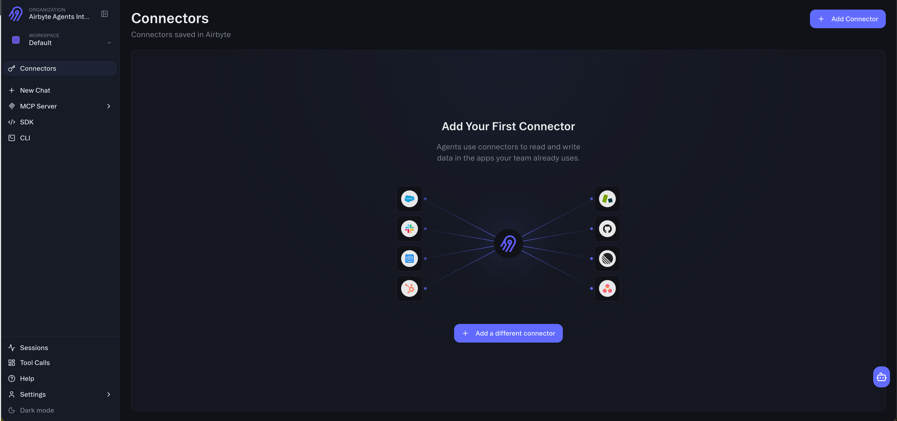
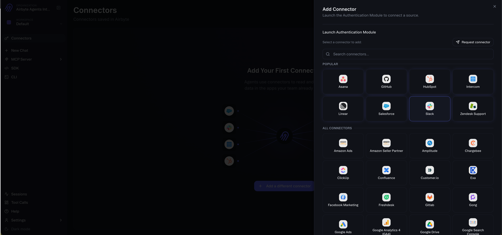
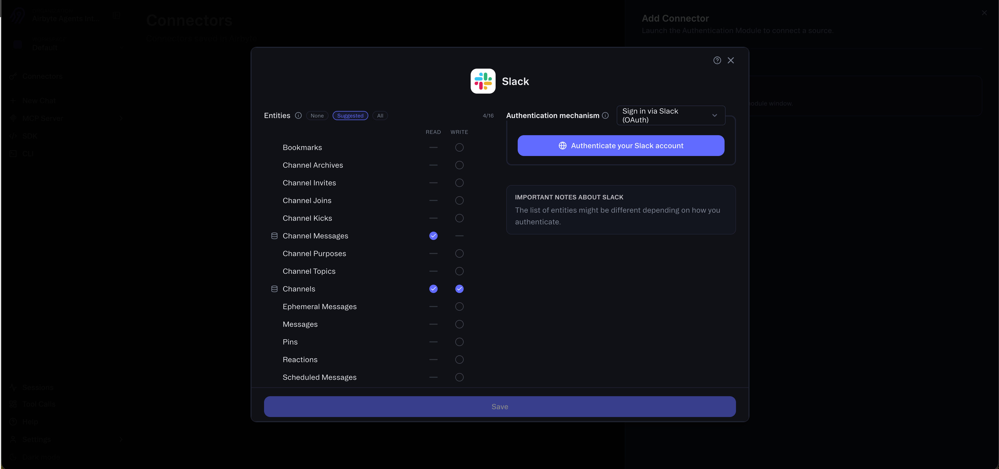
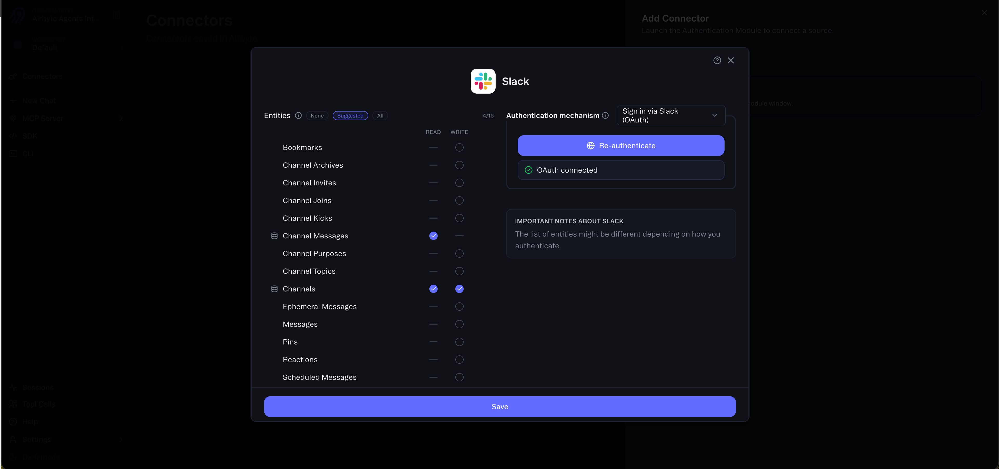
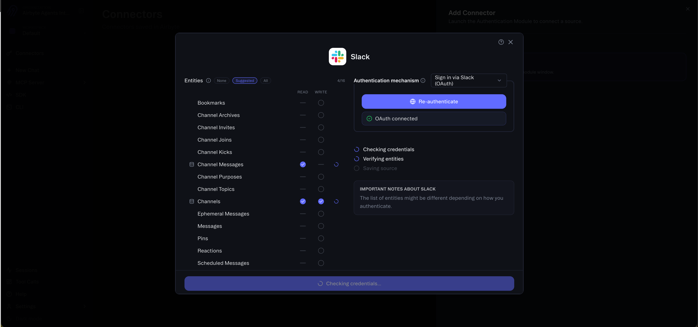
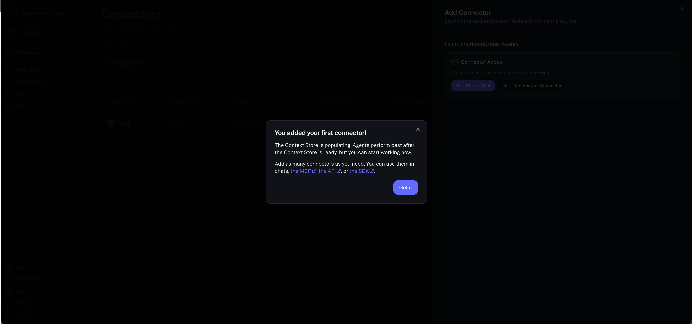
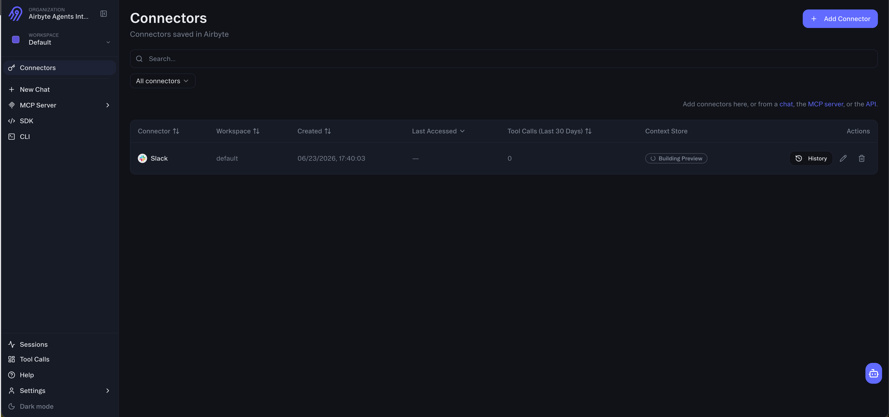

<head>
  <meta name="robots" content="noindex, nofollow" />
</head>

# Airbyte Agents for Slack

Airbyte Agents connects your AI agents to Slack so they can read, search, and write across your workspace in real time. Manage channels, send messages, track conversations, and search your Slack data — all through a single, secure integration.

Airbyte Agents is a data and context layer for AI agents. It gives agents reliable access to the tools your organization runs on through managed connectors and secure credential storage. The Slack connector is one the connectors available on the platform.

[Get started with Airbyte Agents](https://app.airbyte.ai)

:::info

Airbyte Agents uses AI and can generate inaccurate or incomplete responses. Verify important information before acting on it.

:::

## What the Slack connector does

The Slack connector equips AI agents to interact with your Slack workspace through strongly typed, well-documented tools. It supports both read and write operations across a wide range of Slack entities.

### Read operations

- **Users**: List and look up workspace members.
- **Channels**: List public channels and view channel details.
- **Channel messages**: Retrieve recent messages from channels.
- **Threads**: View thread replies on messages.
- **Context Store search**: Search recent users, channels, messages, and threads.

### Write operations

- **Messages**: Send, update, delete, and schedule messages. Send ephemeral (private) messages visible only to a specific user.
- **Channels**: Create, rename, and archive channels. Set channel topics and purposes.
- **Reactions**: Add and remove emoji reactions on messages.
- **Membership**: Invite users to channels, remove users from channels, and join channels.
- **Pins and bookmarks**: Pin messages and add bookmarks to channels.

### Example prompts

Once the Slack connector is set up, agents can handle prompts like these:

- "List all users in my Slack workspace"
- "Show me recent messages in the #general channel"
- "Send a message to #project-updates saying 'Deployment complete'"
- "Create a new channel called #incident-response"
- "Add a :thumbsup: reaction to the latest message in #announcements"
- "Schedule a reminder in #team for tomorrow at 9am"
- "Show me thread replies on the latest message in #support"
- "Search for messages mentioning 'release' in #engineering"

## How it works in Slack

Airbyte Agents connects to your Slack workspace through OAuth. Once authenticated, your AI agents can read from and write to Slack in real time. Here's how the setup works:

### Step 1: Sign in to Airbyte Agents

Go to [app.airbyte.ai](https://app.airbyte.ai) and sign in or create a free account. Navigate to the **Connectors** page.



### Step 2: Add the Slack connector

Click **Add Connector** and select **Slack** from the list of available connectors.



### Step 3: Authenticate with Slack

The Slack connector configuration dialog opens. Choose **Sign in via Slack (OAuth)** as the authentication mechanism and click **Authenticate your Slack account**. This opens the standard Slack OAuth flow where you grant Airbyte Agents access to your workspace.



After completing the Slack OAuth flow, you'll see a confirmation that OAuth is connected.



### Step 4: Save and verify

Click **Save**. Airbyte Agents verifies your credentials and checks that the selected entities are accessible.



### Step 5: Start using the connector

Once saved, you'll see a confirmation that your connector was added. The Context Store works in the background to power low latency search across your workspace. You can start working with the connector immediately.



Your Slack connector now appears in the Connectors list. You can use it through the Airbyte Agents web app, the MCP server, the Python SDK, the CLI, or the API.



## Getting started

There are several ways to install and use the Slack connector:

### Web app

1. Go to [app.airbyte.ai](https://app.airbyte.ai) and sign in or create a free account.
2. Navigate to **Connectors** and click **Add Connector**.
3. Select **Slack** and authenticate with OAuth.
4. Start using the connector in chats, the MCP serer, the API, the CLI, or the SDK.

### API

You can add the Slack connector programmatically through the [Agent API](https://docs.airbyte.com/ai-agents/reference/api/):

```bash
curl -X POST "https://api.airbyte.ai/api/v1/integrations/connectors" \
  -H "Authorization: Bearer <YOUR_BEARER_TOKEN>" \
  -H "Content-Type: application/json" \
  -d '{
    "workspace_name": "<WORKSPACE_NAME>",
    "connector_type": "Slack",
    "name": "My Slack Connector",
    "credentials": {
      "client_id": "<Your Slack App Client ID>",
      "client_secret": "<Your Slack App Client Secret>",
      "access_token": "<OAuth access token>"
    }
  }'
```

### Python SDK

Install the SDK and connect to Slack in a few lines of code:

```bash
pip install airbyte-agent-sdk
```

```python
from airbyte_agent_sdk import connect

connector = connect("slack", workspace_name="<your_workspace_name>")
result = await connector.execute("channels", "list")
```

For complete SDK documentation, see the [Slack connector docs](https://docs.airbyte.com/ai-agents/connectors/slack/).

## After installation

Once the Slack connector is installed:

- **Use the connector across all interfaces.** The same Slack connector works in the web app chat, through the MCP server (for Claude, ChatGPT, and other AI tools), the Python SDK, the CLI, and the REST API.
- **Context Store powers fast search.** A background process powers fast search across your Slack workspace.
- **Manage your connector from the Connectors page.** View connection status and reauthenticate if needed from the [Connectors page](https://app.airbyte.ai).

## Support

If you have questions or need help with the Airbyte Agents Slack connector:

- **Documentation**: [Slack connector reference](https://docs.airbyte.com/ai-agents/connectors/slack/)
- **Community**: [Airbyte community Slack](https://slack.airbyte.com)
- **Support**: [Airbyte support](https://docs.airbyte.com/community/getting-support)

## Privacy policy

Airbyte's privacy policy is available at [airbyte.com/privacy-policy](https://airbyte.com/privacy-policy).

Airbyte's terms of service are available at [airbyte.com/terms](https://airbyte.com/terms).
