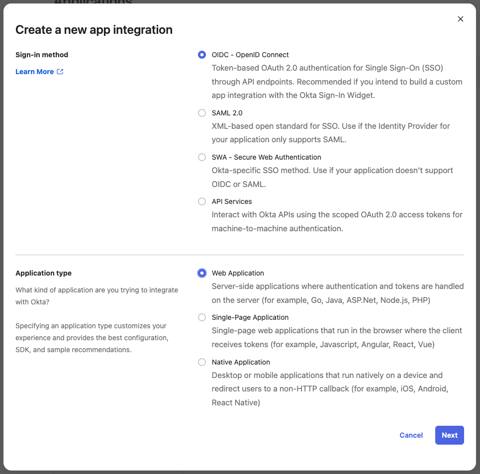
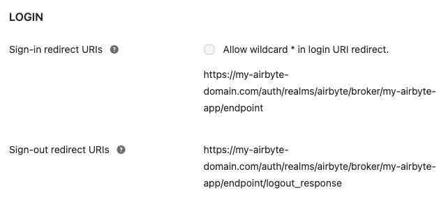

# Airbyte Enterprise

Airbyte Enterprise is a self-hosted version of Airbyte with additional features for enterprise customers. Airbyte Enterprise is currently in early development. Interested in Airbyte Enterprise for your organization? [Learn more](https://airbyte.com/solutions/airbyte-enterprise).

## Airbyte Enterprise License Key

A valid license key is required for Airbyte Enterprise. Talk to your Sales Representative to receive your license key before installing Airbyte Enterprise.

## Single Sign-On (SSO)

Airbyte Enterprise supports Single Sign-On, allowing an organization to manage user acces to their Airbyte Enterprise instance through the configuration of an Identity Provider (IdP).

Airbyte Enterprise currently supports SSO via OIDC with [Okta](https://www.okta.com/) as an IdP.

### Setting up Okta for SSO

You will need to create a new Okta OIDC App Integration for your Airbyte instance. Documentation on how to do this in Okta can be found [here](https://help.okta.com/en-us/Content/Topics/Apps/Apps_App_Integration_Wizard_OIDC.htm).

You should create an app integration with **OIDC - OpenID Connect** as the sign-in method and **Web Application** as the application type:



#### App integration name

Please choose a URL-friendly app integraiton name without spaces or special characters, such as `my-airbyte-app`:


Spaces or special characters in this field could result in invalid redirect URIs.

#### Redirect URIs

In the **Login** section, set the following fields, substituting `<your-airbyte-domain>` and `<app-integration-name>` for your own values:

Sign-in redirect URIs:

```
<your-airbyte-domain>/auth/realms/airbyte/broker/<app-integration-name>/endpoint
```

Sign-out redirect URIs

```
<your-airbyte-domain>/auth/realms/airbyte/broker/<app-integration-name>/endpoint/logout_response
```



_Example values_

`<your-airbyte-domain>` should point to where your Airbyte instance will be available, including the http/https protocol.

#### Deploying Airbyte Enterprise with Okta

Your Okta app is now set up and you're ready to deploy Airbyte with SSO! Take note of the following configuration values, as you will need them to configure Airbyte to use your new Okta SSO app integration:

- Okta domain ([how to find your Okta domain](https://developer.okta.com/docs/guides/find-your-domain/main/))
- App integration name
- Client ID
- Client Secret

Visit [Airbyte Enterprise deployment](/deploying-airbyte/on-kubernetes-via-helm#alpha-airbyte-pro-deployment) for instructions on how to deploy Airbyte Enterprise using `kubernetes`, `kubectl` and `helm`.
