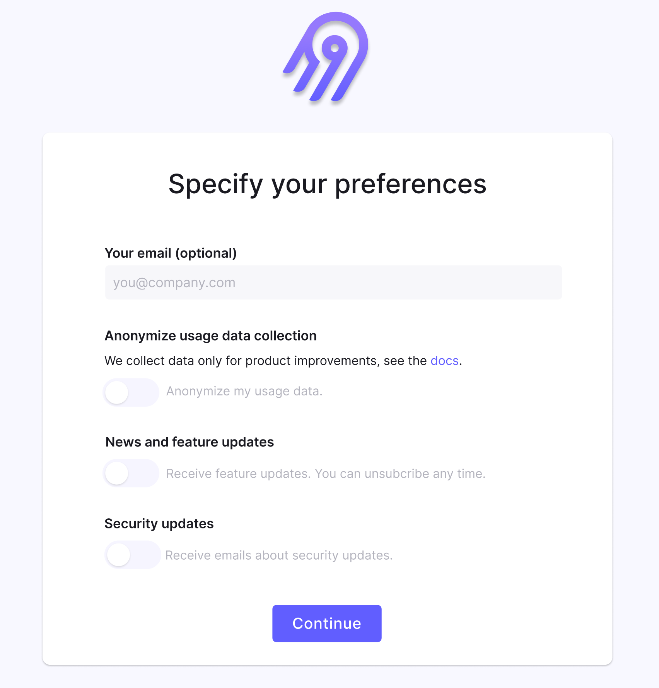
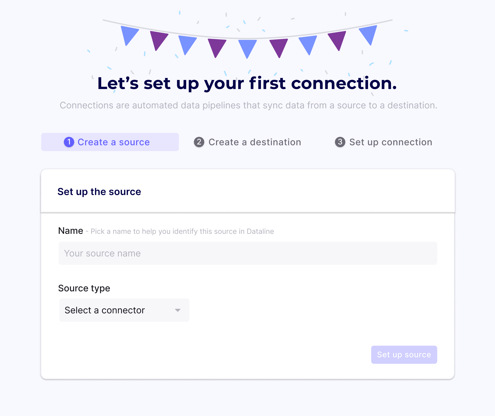
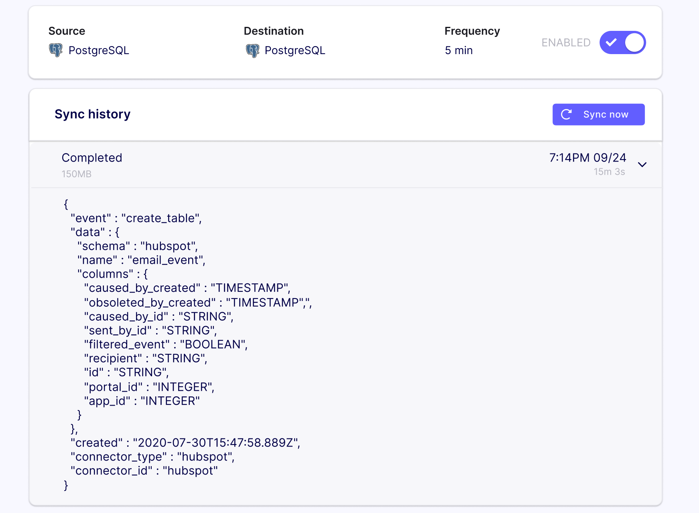

# Postgres Replication

Let's see how you can spin up a local instance of Airbyte and syncing data from one Postgres database to another.

Here's a 6-minute video showing you how you can do it.



First of all, make sure you have Docker and Docker Compose installed. If this isn't the case, follow the [guide](../../deploying-airbyte/local-deployment.md) for the recommended approach to install Docker. 

Once Docker is installed successfully, run the following commands:

```text
git clone https://github.com/airbytehq/airbyte.git
cd airbyte
docker-compose up
```

Once you see an Airbyte banner, the UI is ready to go at [http://localhost:8000/](http://localhost:8000/).

## 1. Set up your preferences

You should see an onboarding page. Enter your email and continue.



## 2. Set up your first connection

We support a growing [list of source connectors](../../category/sources). For now, we will start out with a Postgres source and destination.

**If you don't have a readily available Postgres database to sync, here are some quick instructions:**  
Run the following commands in a new terminal window to start backgrounded source and destination databases:

```text
docker run --rm --name airbyte-source -e POSTGRES_PASSWORD=password -p 2000:5432 -d postgres
docker run --rm --name airbyte-destination -e POSTGRES_PASSWORD=password -p 3000:5432 -d postgres
```

Add a table with a few rows to the source database:

```text
docker exec -it airbyte-source psql -U postgres -c "CREATE TABLE users(id SERIAL PRIMARY KEY, col1 VARCHAR(200));"
docker exec -it airbyte-source psql -U postgres -c "INSERT INTO public.users(col1) VALUES('record1');"
docker exec -it airbyte-source psql -U postgres -c "INSERT INTO public.users(col1) VALUES('record2');"
docker exec -it airbyte-source psql -U postgres -c "INSERT INTO public.users(col1) VALUES('record3');"
```

You now have a Postgres database ready to be replicated!

### **Connect the Postgres database**

In the UI, you will see a wizard that allows you choose the data you want to send through Airbyte.



Use the name `airbyte-source` for the name and `Postgres`as the type. If you used our instructions to create a Postgres database, fill in the configuration fields as follows:

```text
Host: localhost
Port: 2000
User: postgres
Password: password
DB Name: postgres
```

Click on `Set Up Source` and the wizard should move on to allow you to configure a destination.

We support a growing list of data warehouses, lakes and databases. For now, use the name `airbyte-destination`, and configure the destination Postgres database:

```text
Host: localhost
Port: 3000
User: postgres
Password: password
DB Name: postgres
```

After adding the destination, you can choose what tables and columns you want to sync.


For this demo, we recommend leaving the defaults and selecting "Every 5 Minutes" as the frequency. Click `Set Up Connection` to finish setting up the sync.

## 3. Check the logs of your first sync

You should now see a list of sources with the source you just added. Click on it to find more information about your connection. This is the page where you can update any settings about this source and how it syncs. There should be a `Completed` job under the history section. If you click on that run, it will show logs from that run.



One of biggest problems we've seen in tools like Fivetran is the lack of visibility when debugging. In Airbyte, allowing full log access and the ability to debug and fix connector problems is one of our highest priorities. We'll be working hard to make these logs accessible and understandable.

## 4. Check if the syncing actually worked

Now let's verify that this worked. Let's output the contents of the destination db:

```text
docker exec airbyte-destination psql -U postgres -c "SELECT * FROM public.users;"
```

:::info

Don't worry about the awkward `public_users` name for now; we are currently working on an update to allow users to configure their destination table names!

:::

You should see the rows from the source database inside the destination database!

And there you have it. You've taken data from one database and replicated it to another. All of the actual configuration for this replication only took place in the UI.

That's it! This is just the beginning of Airbyte. If you have any questions at all, please reach out to us on [Slack](https://slack.airbyte.io/). We’re still in alpha, so if you see any rough edges or want to request a connector you need, please create an issue on our [Github](https://github.com/airbytehq/airbyte) or leave a thumbs up on an existing issue.

Thank you and we hope you enjoy using Airbyte.
