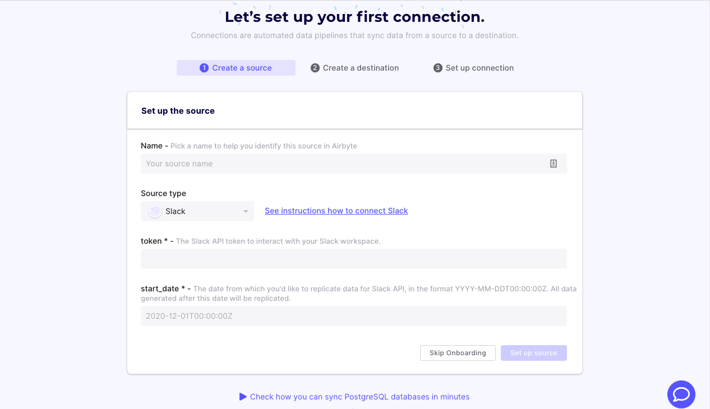
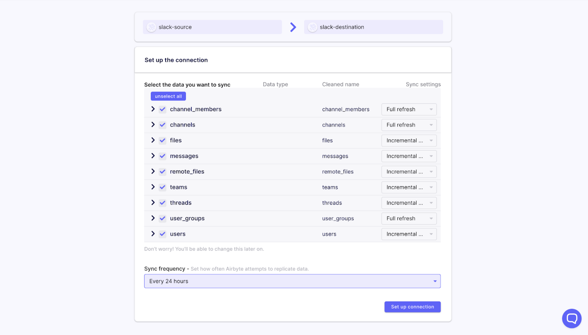
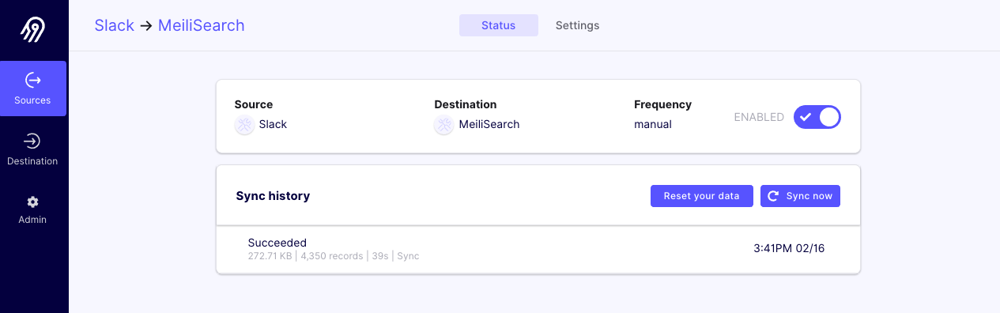
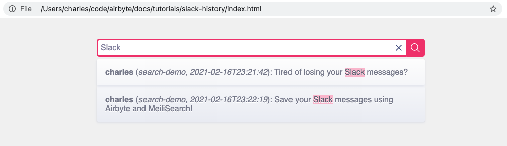

# Save and Search Through Your Slack History on a Free Slack Plan


The [Slack free tier](https://slack.com/pricing/paid-vs-free) saves only the last 10K messages. For social Slack instances, it may be impractical to upgrade to a paid plan to retain these messages. Similarly, for an open-source project like [Airbyte](../../understanding-airbyte/airbyte-protocol.md#catalog) where we interact with our community through a public Slack instance, the cost of paying for a seat for every Slack member is prohibitive.

However, searching through old messages can be really helpful. Losing that history feels like some advanced form of memory loss. What was that joke about Java 8 Streams? This contributor question sounds familiar—haven't we seen it before? But you just can't remember!

This tutorial will show you how you can, for free, use Airbyte to save these messages \(even after Slack removes access to them\). It will also provide you a convenient way to search through them.

Specifically, we will export messages from your Slack instance into an open-source search engine called [MeiliSearch](https://github.com/meilisearch/meilisearch). We will be focusing on getting this setup running from your local workstation. We will mention at the end how you can set up a more productionized version of this pipeline.

We want to make this process easy, so while we will link to some external documentation for further exploration, we will provide all the instructions you need here to get this up and running.

## 1. Set Up MeiliSearch

First, let's get MeiliSearch running on our workstation. MeiliSearch has extensive docs for [getting started](https://docs.meilisearch.com/reference/features/installation.html#download-and-launch). For this tutorial, however, we will give you all the instructions you need to set up MeiliSearch using Docker.

```text
docker run -it --rm \
  -p 7700:7700 \
  -v $(pwd)/data.ms:/data.ms \
  getmeili/meilisearch
```

That's it!

:::info

MeiliSearch stores data in $\(pwd\)/data.ms, so if you prefer to store it somewhere else, just adjust this path.

:::

## 2. Replicate Your Slack Messages to MeiliSearch

### a. Set Up Airbyte

Make sure you have Docker and Docker Compose installed. If you haven’t set Docker up, follow the [instructions here](https://docs.docker.com/desktop/) to set it up on your machine. Then, run the following commands:

```bash
git clone https://github.com/airbytehq/airbyte.git
cd airbyte
docker-compose up
```

If you run into any problems, feel free to check out our more extensive [Getting Started FAQ](https://discuss.airbyte.io/c/faq/15) for help.

Once you see an Airbyte banner, the UI is ready to go at [http://localhost:8000/](http://localhost:8000/). Once you have set your user preferences, you will be brought to a page that asks you to set up a source. In the next step, we'll go over how to do that.

### b. Set Up Airbyte’s Slack Source Connector

In the Airbyte UI, select Slack from the dropdown. We provide step-by-step instructions for setting up the Slack source in Airbyte [here](https://docs.airbyte.io/integrations/sources/slack#setup-guide). These will walk you through how to complete the form on this page.



By the end of these instructions, you should have created a Slack source in the Airbyte UI. For now, just add your Slack app to a single public channel \(you can add it to more channels later\). Only messages from that channel will be replicated.

The Airbyte app will now prompt you to set up a destination. Next, we will walk through how to set up MeiliSearch.

### c. Set Up Airbyte’s MeiliSearch Destination Connector

Head back to the Airbyte UI. It should still be prompting you to set up a destination. Select "MeiliSearch" from the dropdown. For the `host` field, set: `http://localhost:7700`. The `api_key` can be left blank.

### d. Set Up the Replication

On the next page, you will be asked to select which streams of data you'd like to replicate. We recommend unchecking "files" and "remote files" since you won't really be able to search them easily in this search engine.



For frequency, we recommend every 24 hours.

## 3. Search MeiliSearch

After the connection has been saved, Airbyte should start replicating the data immediately. When it completes you should see the following:



When the sync is done, you can sanity check that this is all working by making a search request to MeiliSearch. Replication can take several minutes depending on the size of your Slack instance.

```bash
curl 'http://localhost:7700/indexes/messages/search' --data '{ "q": "<search-term>" }'
```

For example, I have the following message in one of the messages that I replicated: "welcome to airbyte".

```bash
curl 'http://localhost:7700/indexes/messages/search' --data '{ "q": "welcome to" }'
# => {"hits":[{"_ab_pk":"7ff9a858_6959_45e7_ad6b_16f9e0e91098","channel_id":"C01M2UUP87P","client_msg_id":"77022f01-3846-4b9d-a6d3-120a26b2c2ac","type":"message","text":"welcome to airbyte.","user":"U01AS8LGX41","ts":"2021-02-05T17:26:01.000000Z","team":"T01AB4DDR2N","blocks":[{"type":"rich_text"}],"file_ids":[],"thread_ts":"1612545961.000800"}],"offset":0,"limit":20,"nbHits":2,"exhaustiveNbHits":false,"processingTimeMs":21,"query":"test-72"}
```

## 4. Search via a UI

Making curl requests to search your Slack History is a little clunky, so we have modified the example UI that MeiliSearch provides in [their docs](https://docs.meilisearch.com/learn/tutorials/getting_started.html#integrate-with-your-project) to search through the Slack results.

Download \(or copy and paste\) this [html file](https://github.com/airbytehq/airbyte/blob/master/docs/examples/slack-history/index.html) to your workstation. Then, open it using a browser. You should now be able to write search terms in the search bar and get results instantly!



## 5. "Productionizing" Saving Slack History

You can find instructions for how to host Airbyte on various cloud platforms [here](../../deploying-airbyte/README.md).

Documentation on how to host MeiliSearch on cloud platforms can be found [here](https://docs.meilisearch.com/running-production/#a-quick-introduction).

If you want to use the UI mentioned in the section above, we recommend statically hosting it on S3, GCS, or equivalent.
