# Visualizing the Time Spent by Your Team in Zoom Calls

In this article, we will show you how you can understand how much your team leverages Zoom, or spends time in meetings, in a couple of minutes. We will be using [Airbyte](https://airbyte.io) \(an open-source data integration platform\) and [Tableau](https://www.tableau.com) \(a business intelligence and analytics software\) for this tutorial.

Here is what we will cover:

1. Replicating data from Zoom to a PostgreSQL database, using Airbyte
2. Connecting the PostgreSQL database to Tableau
3. Creating charts in Tableau with Zoom data

We will produce the following charts in Tableau:

* Meetings per week in a team
* Hours a team spends in meetings per week
* Listing of team members with the number of meetings per week and number of hours spent in meetings, ranked
* Webinars per week in a team
* Hours a team spends in webinars per week
* Participants for all webinars in a team per week
* Listing of team members with the number of webinars per week and number of hours spent in meetings, ranked 

Let’s get started by replicating Zoom data using Airbyte.

## Step 1: Replicating Zoom data to PostgreSQL

### Launching Airbyte

In order to replicate Zoom data, we will need to use [Airbyte’s Zoom connector](https://docs.airbyte.io/integrations/sources/zoom). To do this, you need to start off Airbyte’s web app by opening up your terminal and navigating to Airbyte and running:

`docker-compose up`

You can find more details about this in the [Getting Started FAQ](https://discuss.airbyte.io/c/faq/15) on our Discourse Forum.

This will start up Airbyte on `localhost:8000`; open that address in your browser to access the Airbyte dashboard.

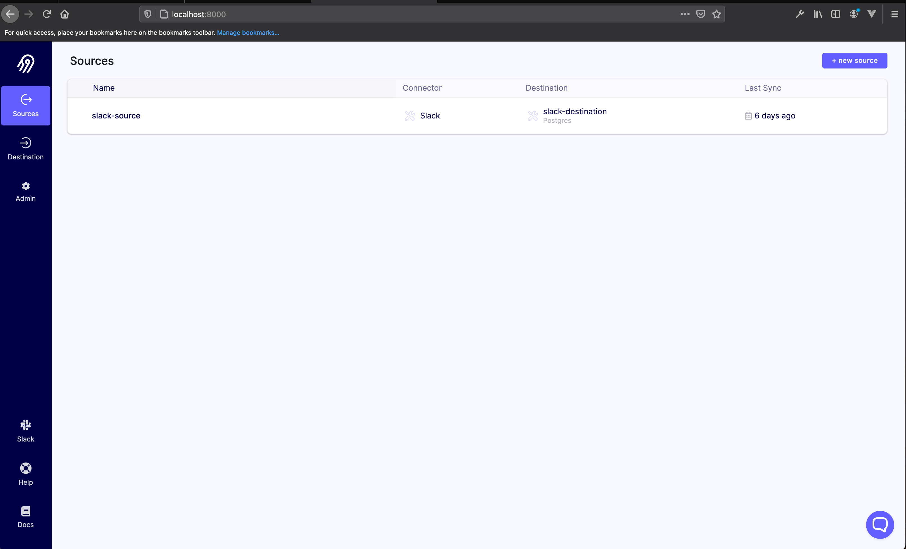

If you haven't gone through the onboarding yet, you will be prompted to connect a source and a destination. Then just follow the instructions. If you've gone through it, then you will see the screenshot above. In the top right corner of the Airbyte dashboard, click on the **+ new source** button to add a new Airbyte source. In the screen to set up the new source, enter the source name \(we will use airbyte-zoom\) and select **Zoom** as source type.

Choosing Zoom as **source type** will cause Airbyte to display the configuration parameters needed to set up the Zoom source.

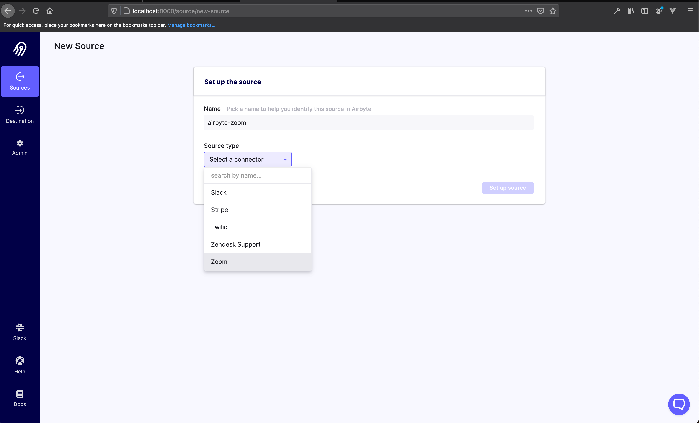

The Zoom connector for Airbyte requires you to provide it with a Zoom JWT token. Let’s take a detour and look at how to obtain one from Zoom.

### Obtaining a Zoom JWT Token

To obtain a Zoom JWT Token, login to your Zoom account and go to the [Zoom Marketplace](https://marketplace.zoom.us/). If this is your first time in the marketplace, you will need to agree to the Zoom’s marketplace terms of use.

Once you are in, you need to click on the **Develop** dropdown and then click on **Build App.**

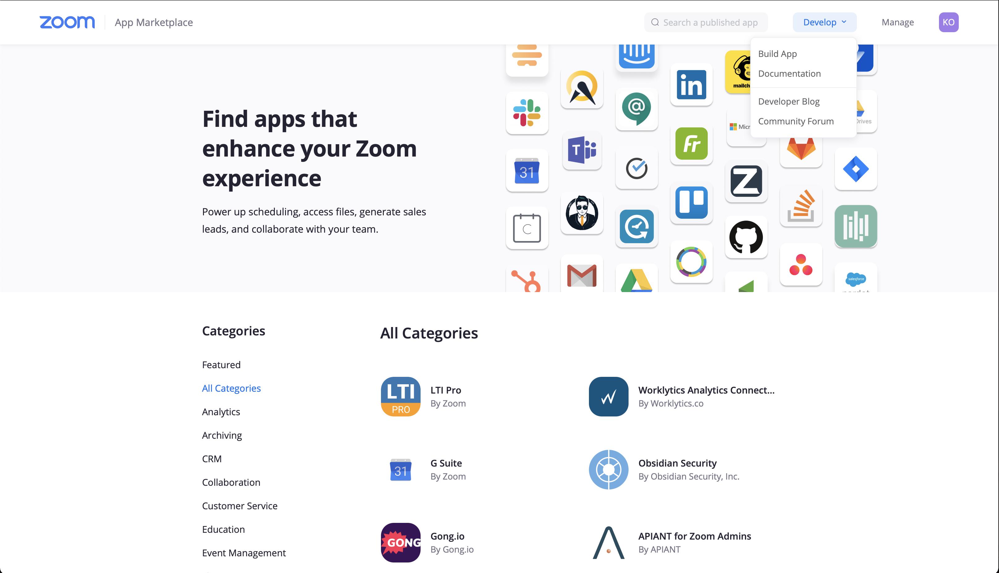

Clicking on **Build App** for the first time will display a modal for you to accept the Zoom’s API license and terms of use. Do accept if you agree and you will be presented with the below screen.

%20(3).png)

Select **JWT** as the app you want to build and click on the **Create** button on the card. You will be presented with a modal to enter the app name; type in `airbyte-zoom`.

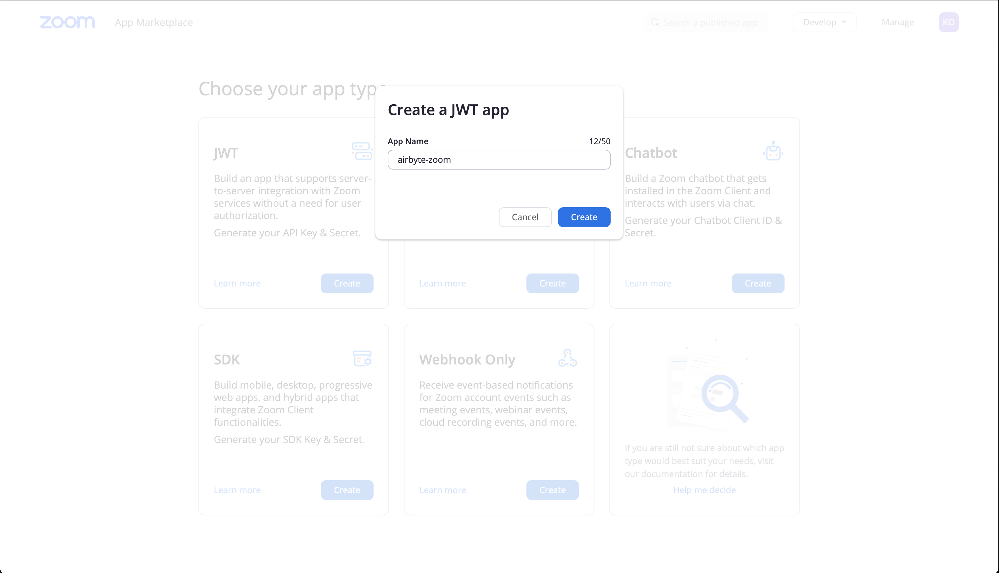

Next, click on the **Create** button on the modal.

You will then be taken to the **App Information** page of the app you just created. Fill in the required information.

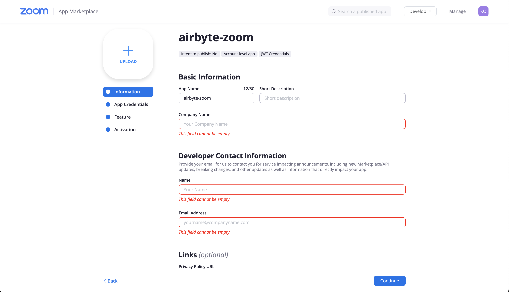

After filling in the needed information, click on the **Continue** button. You will be taken to the **App Credentials** page. Here, click on the **View JWT Token** dropdown.

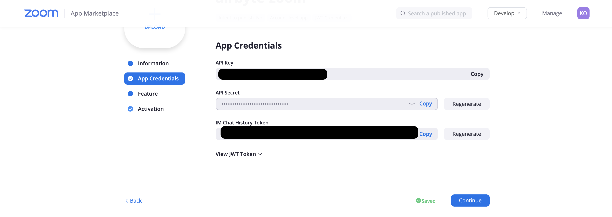

There you can set the expiration time of the token \(we will leave the default 90 minutes\), and then you click on the **Copy** button of the **JWT Token**.

After copying it, click on the **Continue** button.

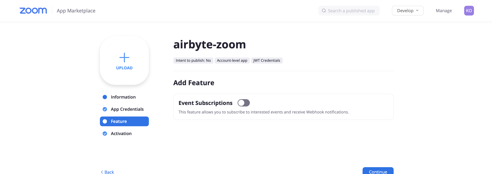

You will be taken to a screen to activate **Event Subscriptions**. Just leave it as is, as we won’t be needing Webhooks. Click on **Continue**, and your app should be marked as activated.

### Connecting Zoom on Airbyte

So let’s go back to the Airbyte web UI and provide it with the JWT token we copied from our Zoom app.

Now click on the **Set up source** button. You will see the below success message when the connection is made successfully.

%20(2).png)

And you will be taken to the page to add your destination.

### Connecting PostgreSQL on Airbyte

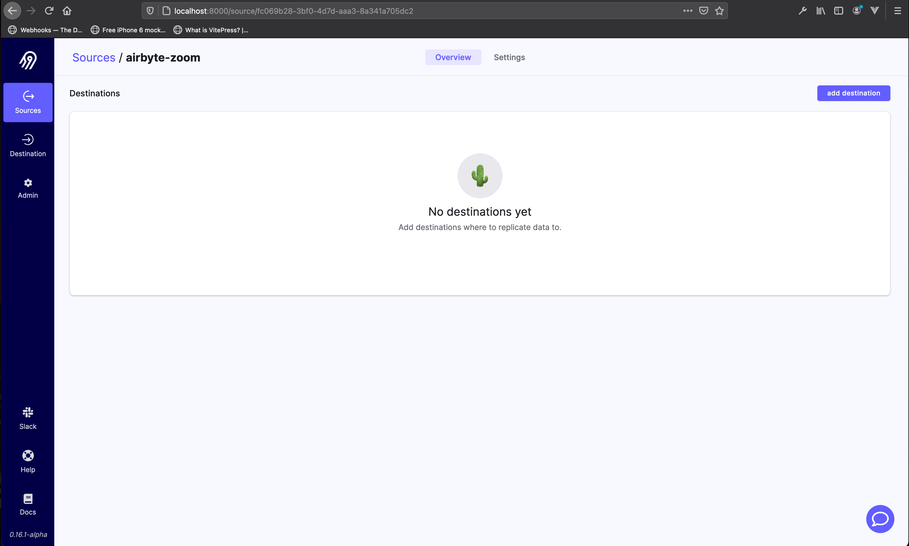

For our destination, we will be using a PostgreSQL database, since Tableau supports PostgreSQL as a data source. Click on the **add destination** button, and then in the drop down click on **+ add a new destination**. In the page that presents itself, add the destination name and choose the Postgres destination.

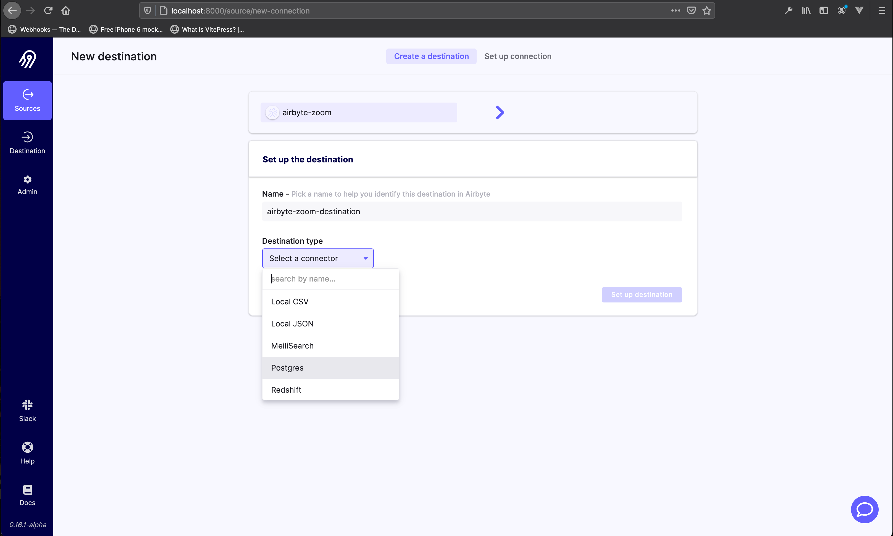

To supply Airbyte with the PostgreSQL configuration parameters needed to make a PostgreSQL destination, we will spin off a PostgreSQL container with Docker using the following command in our terminal.

`docker run --rm --name airbyte-zoom-db -e POSTGRES_PASSWORD=password -v airbyte_zoom_data:/var/lib/postgresql/data -p 2000:5432 -d postgres`

This will spin a docker container and persist the data we will be replicating in the PostgreSQL database in a Docker volume `airbyte_zoom_data`.

Now, let’s supply the above credentials to the Airbyte UI requiring those credentials.

%20(3).png)

Then click on the **Set up destination** button.

After the connection has been made to your PostgreSQL database successfully, Airbyte will generate the schema of the data to be replicated in your database from the Zoom source.

Leave all the fields checked.

%20(3).png)

Select a **Sync frequency** of **manual** and then click on **Set up connection**.

After successfully making the connection, you will see your PostgreSQL destination. Click on the Launch button to start the data replication.

%20(3).png)

Then click on the **airbyte-zoom-destination** to see the Sync page.

%20(3).png)

Syncing should take a few minutes or longer depending on the size of the data being replicated. Once Airbyte is done replicating the data, you will get a **succeeded** status.

Then, you can run the following SQL command on the PostgreSQL container to confirm that the sync was done successfully.

`docker exec airbyte-zoom-db psql -U postgres -c "SELECT * FROM public.users;"`

Now that we have our Zoom data replicated successfully via Airbyte, let’s move on and set up Tableau to make the various visualizations and analytics we want.

## Step 2: Connect the PostgreSQL database to Tableau

Tableau helps people and organizations to get answers from their data. It’s a visual analytic platform that makes it easy to explore and manage data.

To get started with Tableau, you can opt in for a [free trial period](https://www.tableau.com/products/trial) by providing your email and clicking the **DOWNLOAD FREE TRIAL** button to download the Tableau desktop app. The download should automatically detect your machine type \(Windows/Mac\).

Go ahead and install Tableau on your machine. After the installation is complete, you will need to fill in some more details to activate your free trial.

Once your activation is successful, you will see your Tableau dashboard.

%20(3).png)

On the sidebar menu under the **To a Server** section, click on the **More…** menu. You will see a list of datasource connectors you can connect Tableau with.

%20(4).png)

Select **PostgreSQL** and you will be presented with a connection credentials modal.

Fill in the same details of the PostgreSQL database we used as the destination in Airbyte.

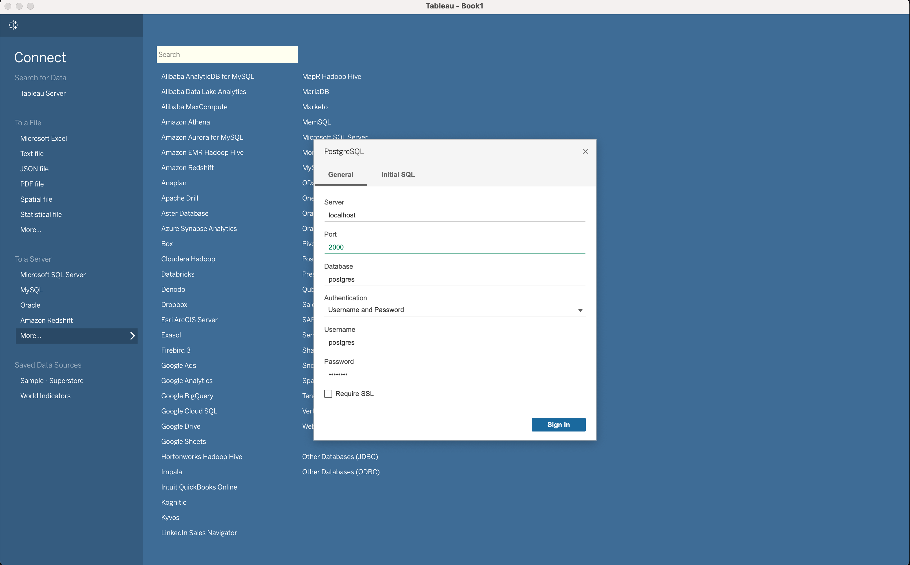

Next, click on the **Sign In** button. If the connection was made successfully, you will see the Tableau dashboard for the database you just connected.

_Note: If you are having trouble connecting PostgreSQL with Tableau, it might be because the driver Tableau comes with for PostgreSQL might not work for newer versions of PostgreSQL. You can download the JDBC driver for PostgreSQL_ [_here_](https://www.tableau.com/support/drivers?_ga=2.62351404.1800241672.1616922684-1838321730.1615100968) _and follow the setup instructions._

Now that we have replicated our Zoom data into a PostgreSQL database using Airbyte’s Zoom connector, and connected Tableau with our PostgreSQL database containing our Zoom data, let’s proceed to creating the charts we need to visualize the time spent by a team in Zoom calls.

## Step 3: Create the charts on Tableau with the Zoom data

### Meetings per week in a team

To create this chart, we will need to use the count of the meetings and the **createdAt** field of the **meetings** table. Currently, we haven’t selected a table to work on in Tableau. So you will see a prompt to **Drag tables here**.

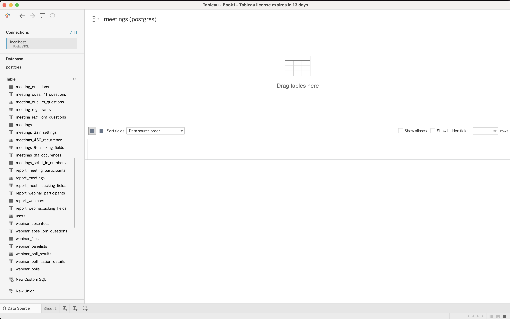

Drag the **meetings** table from the sidebar onto the space with the prompt.

Now that we have the meetings table, we can start building out the chart by clicking on **Sheet 1** at the bottom left of Tableau.

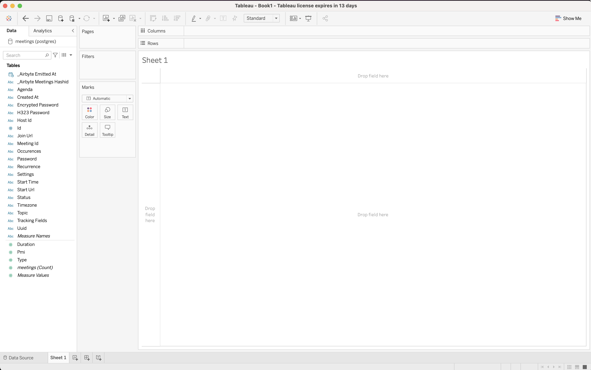

As stated earlier, we need **Created At**, but currently it’s a String data type. Let’s change that by converting it to a data time. So right click on **Created At**, then select `ChangeDataType` and choose Date & Time. And that’s it! That field is now of type **Date** & **Time**.

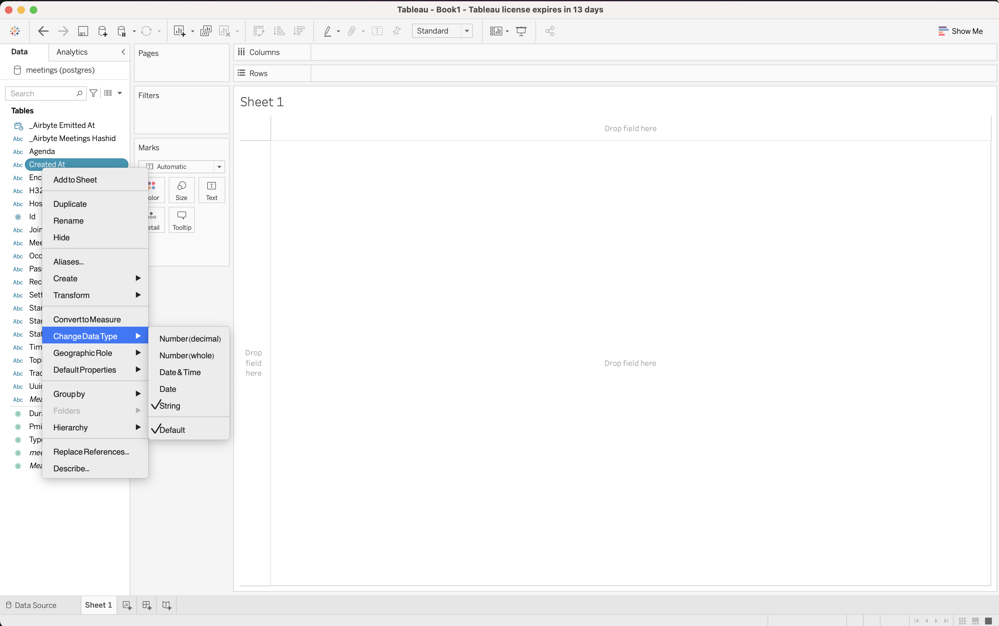

Next, drag **Created At** to **Columns**.

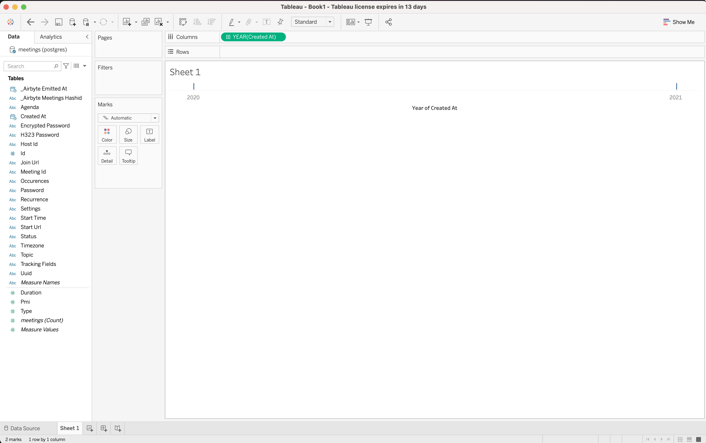

Currently, we get the Created At in **YEAR**, but per our requirement we want them in Weeks, so right click on the **YEAR\(Created At\)** and choose **Week Number**.

%20(3).png)

Tableau should now look like this:

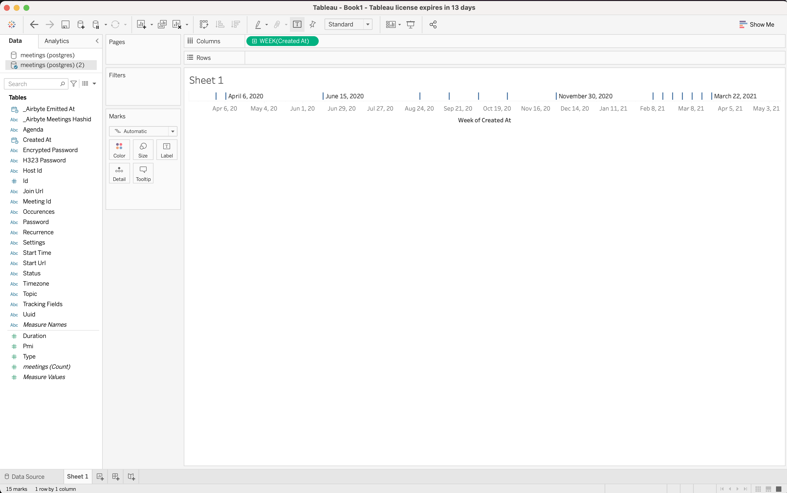

Now, to finish up, we need to add the **meetings\(Count\) measure** Tableau already calculated for us in the **Rows** section. So drag **meetings\(Count\)** onto the Columns section to complete the chart.

%20(3).png)

And now we are done with the very first chart. Let's save the sheet and create a new Dashboard that we will add this sheet to as well as the others we will be creating.

Currently the sheet shows **Sheet 1**; right click on **Sheet 1** at the bottom left and rename it to **Weekly Meetings**.

To create our Dashboard, we can right click on the sheet we just renamed and choose **new Dashboard**. Rename the Dashboard to Zoom Dashboard and drag the sheet into it to have something like this:

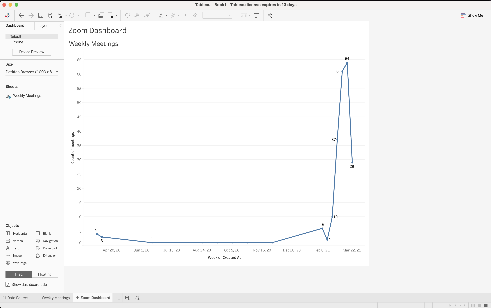

Now that we have this first chart out of the way, we just need to replicate most of the process we used for this one to create the other charts. Because the steps are so similar, we will mostly be showing the finished screenshots of the charts except when we need to conform to the chart requirements.

### Hours a team spends in meetings per week

For this chart, we need the sum of the duration spent in weekly meetings. We already have a Duration field, which is currently displaying durations in minutes. We can derive a calculated field off this field since we want the duration in hours \(we just need to divide the duration field by 60\).

To do this, right click on the Duration field and select **create**, then click on **calculatedField**. Change the name to **Duration in Hours**, and then the calculation should be **\[Duration\]/60**. Click ok to create the field.

So now we can drag the Duration in Hours and Created At fields onto your sheet like so:

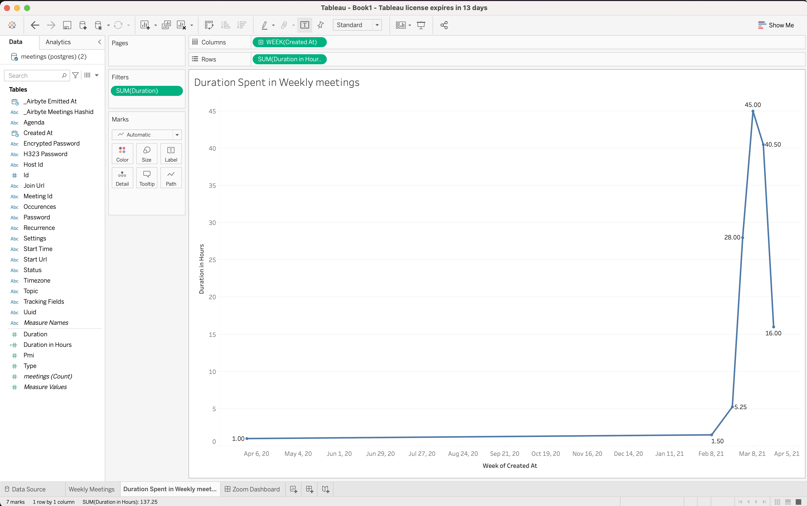

Note: We are adding a filter on the Duration to filter out null values. You can do this by right clicking on the **SUM\(Duration\)** pill and clicking filter, then make sure the **include null values** checkbox is unchecked.

### Participants for all meetings per week

For this chart, we will need to have a calculated field called **\# of meetings attended**, which will be an aggregate of the counts of rows matching a particular user's email in the `report_meeting_participants` table plotted against the **Created At** field of the **meetings** table. To get this done, right click on the **User Email** field. Select **create** and click on **calculatedField**, then enter the title of the field as **\# of meetings attended**. Next, enter the below formula:

`COUNT(IF [User Email] == [User Email] THEN [Id (Report Meeting Participants)] END)`

Then click on apply. Finally, drag the **Created At** fields \(make sure it’s on the **Weekly** number\) and the calculated field you just created to match the below screenshot:

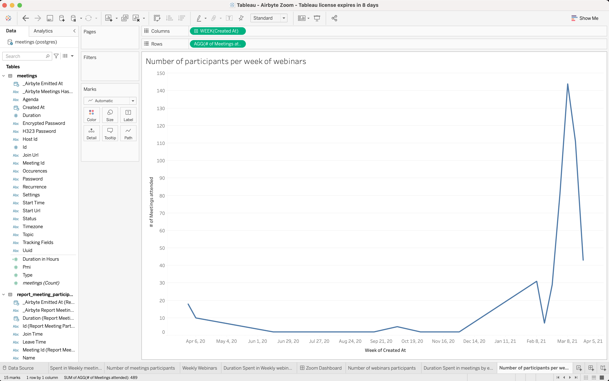

### Listing of team members with the number of meetings per week and number of hours spent in meetings, ranked.

To get this chart, we need to create a relationship between the **meetings table** and the `report_meeting_participants` table. You can do this by dragging the `report_meeting_participants` table in as a source alongside the **meetings** table and relate both via the **meeting id**. Then you will be able to create a new worksheet that looks like this:

%20(3).png)

Note: To achieve the ranking, we simply use the sort menu icon on the top menu bar.

### Webinars per week in a team

The rest of the charts will be needing the **webinars** and `report_webinar_participants` tables. Similar to the number of meetings per week in a team, we will be plotting the Count of webinars against the **Created At** property.

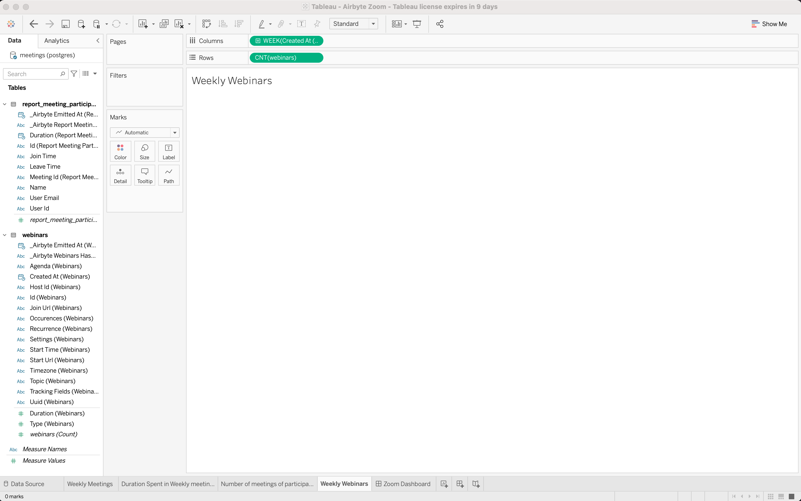

### Hours a week spends in webinars per week

For this chart, as for the meeting’s counterpart, we will get a calculated field off the Duration field to get the **Webinar Duration in Hours**, and then plot **Created At** against the **Sum of Webinar Duration in Hours**, as shown in the screenshot below. Note: Make sure you create a new sheet for each of these graphs.

### Participants for all webinars per week

This calculation is the same as the number of participants for all meetings per week, but instead of using the **meetings** and `report_meeting_participants` tables, we will use the webinars and `report_webinar_participants` tables.

Also, the formula will now be:

`COUNT(IF [User Email] == [User Email] THEN [Id (Report Webinar Participants)] END)`

Below is the chart:

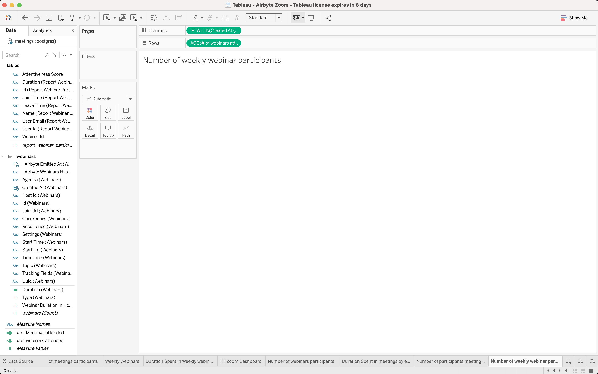

#### Listing of team members with the number of webinars per week and number of hours spent in meetings, ranked

Below is the chart with these specs

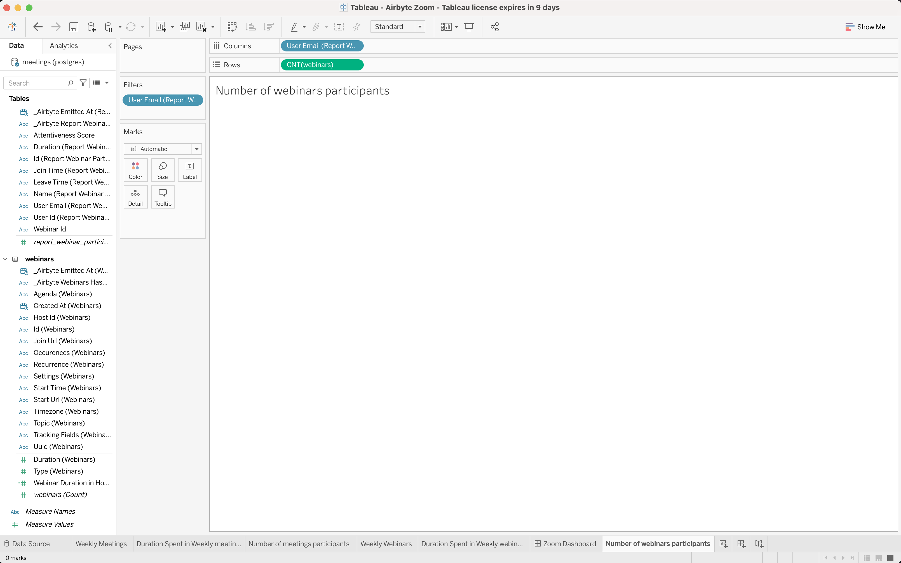

## Conclusion

In this article, we see how we can use Airbyte to get data off the Zoom API onto a PostgreSQL database, and then use that data to create some chart visualizations in Tableau.

You can leverage Airbyte and Tableau to produce graphs on any collaboration tool. We just used Zoom to illustrate how it can be done. Hope this is helpful!

