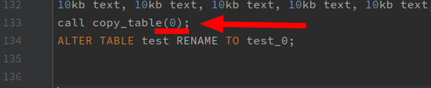
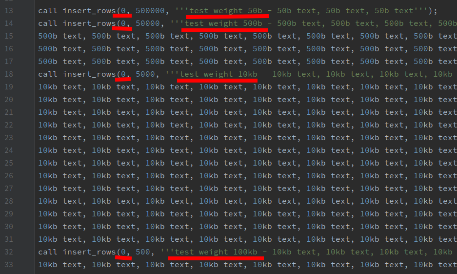

# How to use Postgres Script?

In order to create a database with a certain number of tables, and a certain number of records in each of them, 
you need to follow a few simple steps.

1. Create a new database.
2. On the new database, run script **1-create-copy-tables-procedure.sql** to create the table copy procedure.
3. Run script **2-create-insert-rows-to-table-procedure.sql** to create a procedure for creating a table with the specified number of records.
4. In the **3-run-script.sql** file, you need to change a few points to create the required number of tables and records in them.
   1. Change the value for the number of tables.
   
      
   2. You can add records of different sizes to the table - 50 bytes, 500 bytes, 10 kilobytes, and 100 kilobytes. To do this, 
   you need to specify the number of records for each size.
   
      
5. Execute the **3-run-script.sql** script with your changes for the new database. After the script finishes its work, you will receive the number of tables specified in the script, with names starting with **test_0** and ending with **test_(the number of tables minus 1)**.

