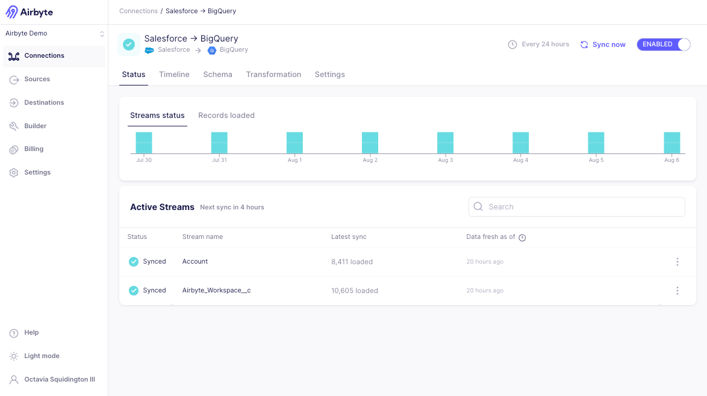
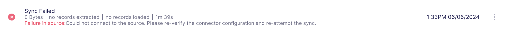
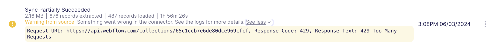

# Review the connection status

Each connection you've set up in your Workspace has a **Status** page that displays the connection's current status, timing of the next scheduled sync, and a summary of historic sync trends. Reviewing this page allows you to monitor the health of your connection. 

:::note
The Streams status and Records loaded graphs are available in Airbyte Cloud and Airbyte Enterprise.
:::

To view the connection status:

1. In the Airbyte UI, click **Connections**.

2. Each connection is listed alongside its status.  From here, you can filter for a specific status to see which connections need attention. You can also select a single connection to view more details about the connection and for a breakdown of the status of each Stream in that connection.  

|   | Status      |  Description                                                                                        |
| - | ----------- | --------------------------------------------------------------------------------------------------- |
|| **Healthy** | The most recent sync for this connection succeeded                                                  |
| | **Failed**  | The most recent sync for this connection failed                                                         |
| | **Running** | The connection is currently actively syncing                                                        |
| | **Paused**  | The connection is disabled and is not scheduled to run automatically                                |

3. On the **Status** tab for a connection, there is a list of associated Streams. To the left of the name for each Stream, there is an icon that displays its status. 

## Review the stream status

The stream status allows you to monitor an individual stream's latest status. Connections often sync more than one stream. This view allows you to more easily determine if there is a problem with a given stream that could be causing problems with the connection. 

|   | Status                   | Description                                                                                     |
| - | ------------------------ | ----------------------------------------------------------------------------------------------- |
| | **Synced**              | The stream's last sync was successful. |
| | **Syncing**              | The stream is currently actively syncing. The stream will also be highlighted in grey to indicate the sync is actively extracting or loading data.    |
| | **Queued**               | The stream has not synced yet, and is scheduled to be synced in the current ongoing sync            |
| | **Queued for next sync** | The stream has not synced yet, and is scheduled to be synced in the next scheduled sync             |
| | **Error**              | The connection did not succeed on its most recent sync, but is expected to recover on the next one                    |
| | **Action Required**    | A breaking change related to the source or destination requires attention to resolve                |

Once the sync is complete, each stream displays the time since the last record was loaded to the destination. You can click **Last record loaded** in the header to optionally display the exact datetime the last record was loaded.

## Per-Stream Actions

In addition to the stream status, Airbyte offers several stream-specific actions that allow for precise management of your data. Clicking the three grey dots next to any stream opens the available options for the stream.
- **Show in replication table** navigates you to the **Schema** tab of the connection, where the stream you selected is highlighted
- **Open details** opens the field selection pane for the stream.
- [Refresh stream](/operator-guides/refreshes) repulls all historical data for the stream.
- [Clear data](/operator-guides/clear) removes previously synced data from your destination for the stream.

## Connection Troubleshooting

The Status page offers users visibility into the recent history of your syncs. For Cloud and Enterprise users, the **Streams status** and **Records loaded** are shown for the last 8 syncs. To navigate quickly to the related sync history, hover over the graph and select the sync you're interested in viewing.

### Resolving Connection Errors

If the most recent sync failed, you'll see the error message that will help to diagnose next steps. If a sync starts to fail, it will automatically be disabled after multiple consecutive failures or several consecutive days of failure.

#### Rate-Limited Syncs
If a source is being rate-limited by Airbyte trying to extract data, an informational message will be displayed. This can occur more frequently when Airbyte is attempting to pull a large amount of data. If available from the source, Airbyte will also show a countdown to when the sync will attempt to start syncing again. 

Airbyte will not continue attempting to sync until the rate limit is lifted. The Active Streams section will indicate which specific streams have been rate limited. The sync will automatically start attempting to sync again once the rate limit has lifted. 

#### Configuration Errors
Configuration errors are shown in red. If the failure is due to a configuration error, Airbyte recommends navigating to the related source or destination to re-test and save before attempting another sync.

#### System Errors
Sync errors can also be shown in yellow. These can range from transient errors to warnings from the source (e.g. rate limits). These types of errors usually resolve themselves without any action required. 

### Major Version Upgrades (Cloud only)
If a new major version of the connector has been released in Cloud, you will also see a banner on this page indicating the cutoff date for the version upgrade. Airbyte recommends upgrading before the cutoff date to ensure your data continues syncing. If you do not upgrade before the cutoff date, Airbyte will automatically disable your connection.

Learn more about version upgrades in our [resolving breaking change documentation](/using-airbyte/schema-change-management.md#resolving-breaking-changes).