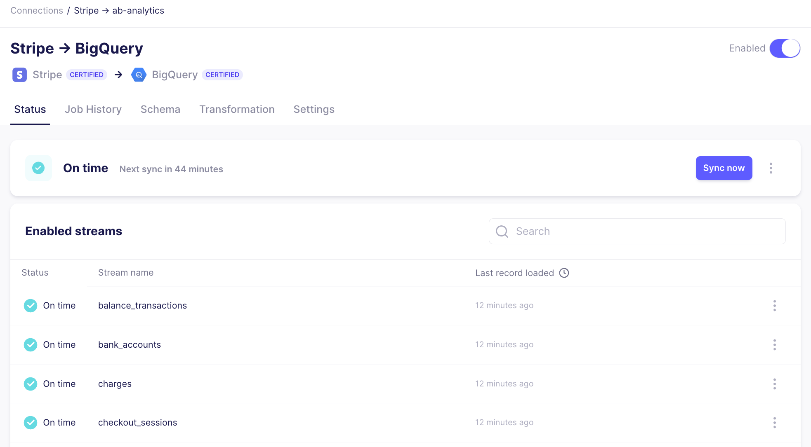

# Review the connection status

The connection status displays information about the connection and of each stream being synced. Reviewing this summary allows you to assess the connection's current status and understand when the next sync will be run.

To review the connection status:

1. In the Airbyte UI, click **Connections**.

2. Click a connection in the list to view its status.

| Status          | Description                                                                                                                                                                                                  |
| --------------- | ------------------------------------------------------------------------------------------------------------------------------------------------------------------------------------------------------------ |
| On time         | The connection is operating within the expected timeframe expectations set by the replication frequency                                                                                                      |
| On track        | The connection is slightly delayed but is expected to catch up before the next sync.                                                                                                                         |
| Delayed         | The connection has not loaded data within the scheduled replication frequency. For example, if the replication frequency is 1 hour, the connection has not loaded data for more than 1 hour                  |
| Error           | The connection has not loaded data in more than two times the scheduled replication frequency. For example, if the replication frequency is 1 hour, the connection has not loaded data for more than 2 hours |
| Action Required | A breaking change related to the source or destination requires attention to resolve                                                                                                                         |
| In Progress     | The connection is currently extracting or loading data                                                                                                                                                       |
| Disabled        | The connection has been disabled and is not scheduled to run                                                                                                                                                 |
| Pending         | The connection has not been run yet, so no status exists                                                                                                                                                     |

If the most recent sync failed, you'll see the error message that will help diagnose if the failure is due to a source or destination configuration error. [Reach out](/community/getting-support.md) to us if you need any help to ensure you data continues syncing.

:::info
If a sync starts to fail, it will automatically be disabled after multiple consecutive failures or several consecutive days of failure.
:::

If a new major version of the connector has been released, you will also see a banner on this page indicating the cutoff date for the version. Airbyte recommends upgrading before the cutoff date to ensure your data continues syncing. If you do not upgrade before the cutoff date, Airbyte will automatically disable your connection.

Learn more about version upgrades in our [resolving breaking change documentation](/using-airbyte/schema-change-management.md#resolving-breaking-changes).

## Review the stream status

The stream status allows you to monitor each stream's latest status. The stream will be highlighted with a grey pending bar to indicate the sync is actively extracting or loading data.

| Status  | Description                                                                                         |
| ------- | --------------------------------------------------------------------------------------------------- |
| On time | The stream is operating within the expected timeframe expectations set by the replication frequency |
| Error   | The most recent sync for this stream failed                                                         |
| Pending | The stream has not been synced yet, so not status exists                                            |

Each stream shows the last record loaded to the destination. Toggle the header to display the exact datetime the last record was loaded.

You can [clear](/operator-guides/reset.md) an individual stream without clearing all streams in a connection by clicking the three grey dots next to any stream.

You can also navigate directly to the stream's configuration by click the three grey dots next to any stream and selecting "Open details" to be redirected to the stream configuration.
