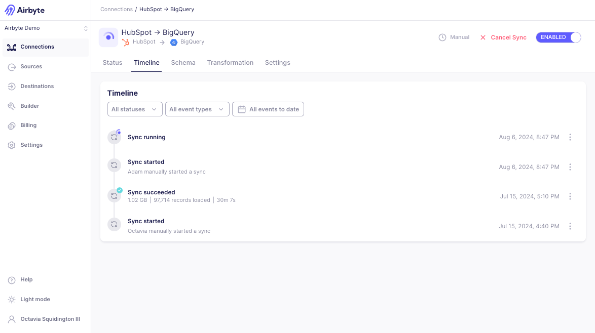

# Review the connection timeline

The Connection Timeline displays information about several types of relevant connection events. The following events are included in the Connection Timeline: 
- Sync
- Refresh
- Clear
- Connection configuration changes
- Schema changes (coming soon)
- Connector Version changes (coming soon)
- Connector configuration changes (coming soon)

To review the Connection Timeline, click a connection in the list and navigate to the "Timeline" tab to view its event history. The page displays recent events and their statuses. Where relevant, the event will also show the user who took the action.

## Sync, Refresh, and Clear events

Completed Syncs, [Refreshes](/operator-guides/refreshes), and [Clears](/operator-guides/clear) will have a status associated to the event. 

| Status              | Description                                                       |
| ------------------- | ----------------------------------------------------------------- |
| Succeeded           | 100% of the data has been extracted and loaded to the destination |
| Incomplete          | The sync encountered an error, and should resolve itself. A subset or none of the data has been loaded to the destination.           |
| Failed              | The sync encountered a fatal error, and needs user intervention to resolve. A subset or none of the data has been loaded to the destination.               |
| Cancelled           | The sync was cancelled manually before finishing.                  |
| Running             | The sync is currently running                                     |

Airbyte will also separately record when a sync has been manually started by a user. 

For sync and refresh events, Airbyte also shows the volume of synced data, such as the amount of data moved, the number of records read and committed, and the total sync time. Reviewing this timeline can help you monitor the connection and identify any potential issues.

| Data                           | Description                                                   |
| ------------------------------ | ------------------------------------------------------------- |
| x GB (also measured in KB, MB) | Amount of data moved during the sync                          |
| x extracted records            | Number of records read from the source during the sync        |
| x loaded records               | Number of records the destination confirmed it received.      |
| xh xm xs                       | Total time (hours, minutes, seconds) for the sync to complete |

While most syncs only contain a single attempt, a sync can sometimes fail. In the event of a failure, Airbyte will make several attempts to sync your data before waiting for the next sync to retry. You can read more about our retry approach [here](../../understanding-airbyte/jobs.md#retry-rules). If multiple attempts are used in a sync, you can open the logs to see individual logs from each attempt.

Airbyte summarizes metrics in the sync summary across all the attempts in the sync. As a result, you may observe that the number of records extracted is higher than the number of records loaded if an attempt fails during the extraction process. A successful sync status means that all the records from the source have been successfully written to the destination.

:::info

For Airbyte Cloud syncs which [are priced based on the size of the records moved](https://airbyte.com/pricing), we use the information presented in the sync summary in the Airbyte user interface. As every database stores and compresses data differently, the measure of data volume which is used is that which is observed by the Airbyte Platform during the sync. When the data is in transit, it is serialized to [Airbyte Protocol format](/understanding-airbyte/airbyte-protocol/#airbyterecordmessage) records. This is likely to be a larger representation of your data than you would see if you were to query your database directly.

:::

On this page, you can also view the complete logs and find any relevant errors, find a link to the job to share with Support, or download a copy of the logs locally.
