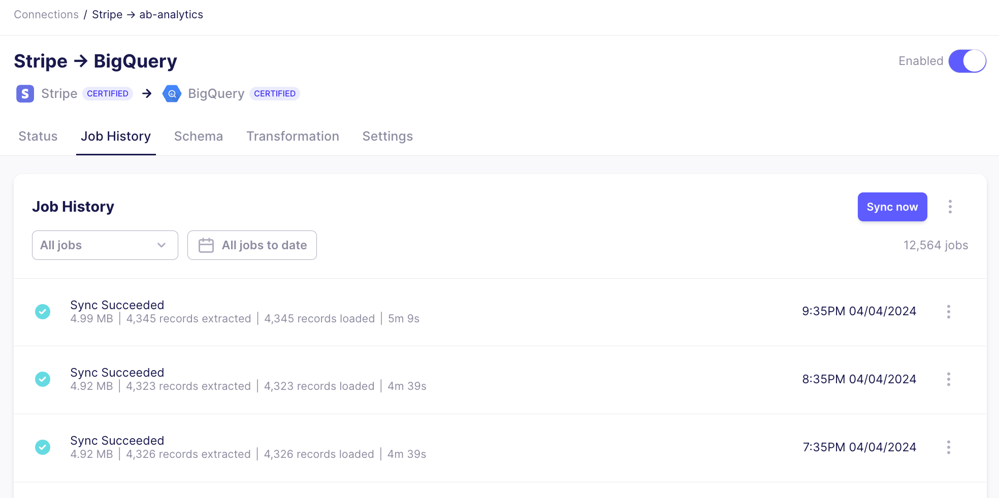

# Review the sync history

The job history displays information about synced data, such as the amount of data moved, the number of records read and committed, and the total sync time. Reviewing this summary can help you monitor the sync performance and identify any potential issues.

To review the sync history, click a connection in the list and navigate to the "Job History" tab to view its sync history. The page displays recent syncs and their statuses. The sync status is defined as:

| Status              | Description                                                       |
| ------------------- | ----------------------------------------------------------------- |
| Succeeded           | 100% of the data has been extracted and loaded to the destination |
| Partially Succeeded | A subset of the data has been loaded to the destination           |
| Failed              | None of the data has been loaded to the destination               |
| Cancelled           | The sync was cancelled manually before finishing                  |
| Running             | The sync is currently running                                     |

If you have recently run a [refresh](/operator-guides/refreshes) or [clear](/operator-guides/clear), you will also see this noted on the Job History page and their corresponding status.

## Sync summary

Each sync shows the time the sync was initiated and additional metadata. This information can help in understanding sync performance over time.

| Data                           | Description                                                   |
| ------------------------------ | ------------------------------------------------------------- |
| x GB (also measured in KB, MB) | Amount of data moved during the sync                          |
| x extracted records            | Number of records read from the source during the sync        |
| x loaded records               | Number of records the destination confirmed it received.      |
| xh xm xs                       | Total time (hours, minutes, seconds) for the sync to complete |

While most syncs only contain a single attempt, a sync can sometimes fail. In the event of a failure, Airbyte will make several attempts to sync your data before waiting for the next sync to retry. You can read more about our retry approach [here](../../understanding-airbyte/jobs.md#retry-rules). 

Airbyte summarizes metrics in the sync summary across all the attempts in the sync. As a result, you may observe that the number of records extracted is higher than the number of records loaded if an attempt fails during the extraction process. A successful sync status means that all the records from the source have been successfully written to the destination.

:::info

For Airbyte Cloud syncs which [are priced based on the size of the records moved](https://airbyte.com/pricing), we use the information presented in the sync summary in the Airbyte user interface. As every database stores and compresses data differently, the measure of data volume which is used is that which is observed by the Airbyte Platform during the sync. When the data is in transit, it is serialized to [Airbyte Protocol format](/understanding-airbyte/airbyte-protocol/#airbyterecordmessage) records. This is likely to be a larger representation of your data than you would see if you were to query your database directly.

:::

On this page, you can also view the complete logs and find any relevant errors, find a link to the job to share with Support, or download a copy of the logs locally.
