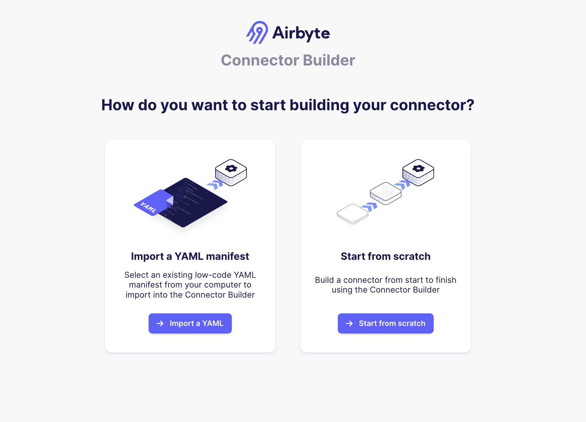
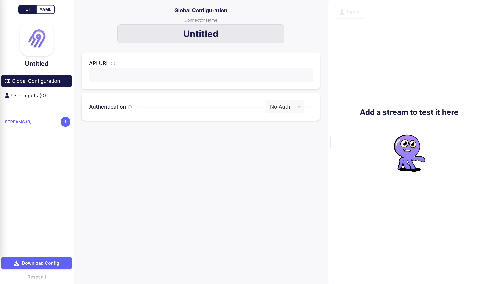
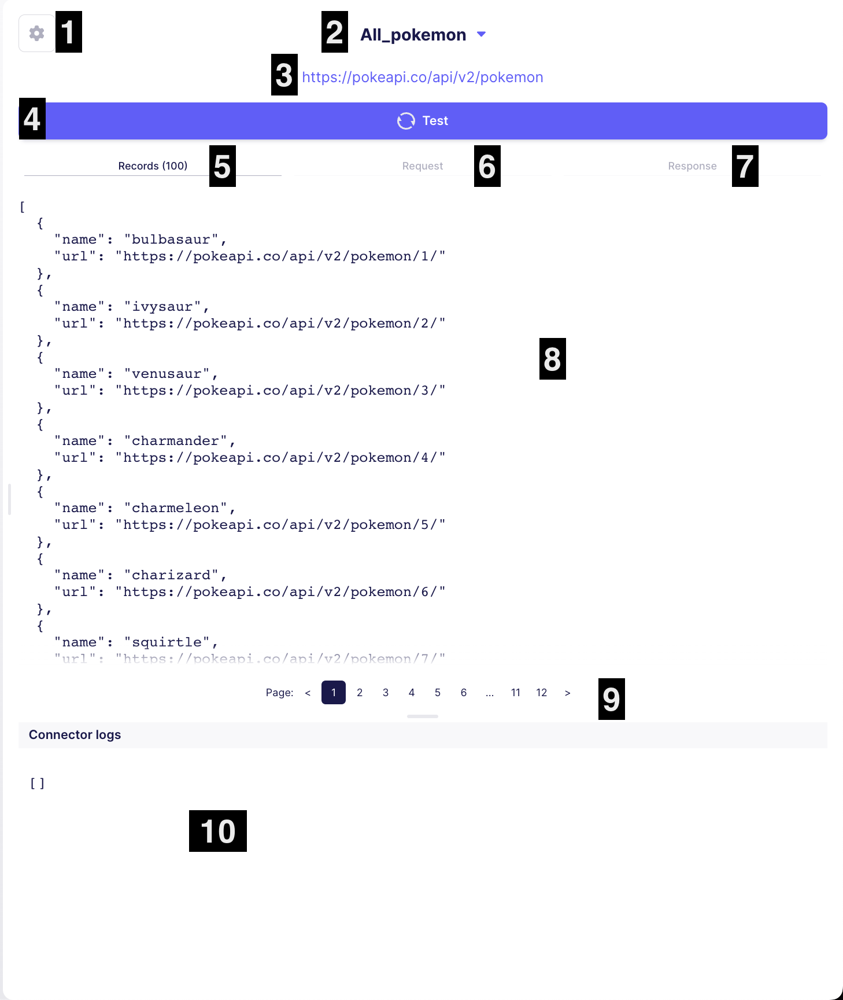

# Connector Builder UI

The connector builder UI provides an ergonomic iteration interface on top of the [low-code YAML format](https://docs.airbyte.com/connector-development/config-based/understanding-the-yaml-file/yaml-overview). We recommend using it to iterate on your low-code connectors.

:::caution
The connector builder UI is in alpha, which means it’s still in active development and may include backward-incompatible changes. Share feedback and requests with us on our Slack channel or email us at feedback@airbyte.io

**Developer updates will be announced via our #using-the-cdk Slack channel. If you are using the CDK, please join to stay up to date on changes and issues.**
:::

## Can I integrate with this API using the Connector Builder UI?
[Follow this guide to determine whether the Connector Builder UI is the right tool to build the connector you need](./connector-builder-compatibility.md).

## Getting started

The high level flow for using the connector builder is as follows:

1. Run the Airbyte webapp to access the connector builder
2. Use the connector builder to iterate on your low-code connector
3. Export the YAML into a low-code connector module on your local machine
4. Build the connector's Docker image
5. Use the built connector image in Airbyte

### Run an Airbyte instance

:::info
You need at least Airbyte v0.40.27 to run the connector builder UI.
:::

:::tip
We recommend using a dedicated Airbyte instance for the connector builder UI. This will allow you to pick up connector builder UI upgrades without impacting your production data pipelines.
:::

The connector builder UI is bundled as part of the Airbyte webapp. To run it, follow [the instructions for deploying Airbyte locally](https://docs.airbyte.com/deploying-airbyte/local-deployment) to run Airbyte on your machine. Once you do, Airbyte should be reachable at `http://localhost:8000`.

### Visit the connector builder

Once your Airbyte instance has started and you've moved past the initial setup screen, visit `http://localhost:8000/connector-builder`. You will be redirected to a URL of the form `localhost:8000/workspaces/<UUID>/connector-builder` where `<UUID>` is the ID automatically generated for your workspace by Airbyte

On this page you will find the Connector Builder landing page. It should look like this:

Here you can either upload an existing low-code YAML manifest, or start building a brand new connector in the UI. If you click `Start from scratch`, you will be redirected to `localhost:8000/workspaces/<UUID>/connector-builder/edit`, where you will see the following screen:

You can now use this UI to build your connector. See the [Testing Panel](#connector-builder-testing-panel) section for more information on how to use the UI to iterate on your connector.

The output of this UI is a low-code YAML representation of your connector, which you can preview by clicking the `UI | YAML` toggle button the the top-left. This screen also allows you to edit the low-code YAML directly if desired, and continue to test it in the testing panel.

### Exporting the YAML

Once you're done iterating on your connector in the UI, you'll need to export the low-code YAML representation of the connector to your local filesystem into a connector module. This YAML can be downloaded by clicking the `Download Config` button in the bottom-left.

If you haven't already, create a low-code connector module using the connector generator (see [this YAML tutorial for an example](tutorial/1-create-source.md)) using the name you'd like to use for your connector. For this section, let's assume our connector is called `exchange-rates`. After creating the connector, overwrite the contents of `airbyte-integrations/connectors/source-exchange-rates/source_exchange_rates/manifest.yaml` with the YAML you created in the UI.

### Building the connector image

Follow the instructions in the connector README to build the Docker image. Typically this will be something like `docker build . -t airbyte/source-<name>:<version>`.

Once you've built the connector image, [follow these instructions](https://docs.airbyte.com/integrations/custom-connectors#adding-your-connectors-in-the-ui) to add your connector to your Airbyte instance.

## Connector Builder Testing Panel

The UI contains two main components: the Builder UI where you can fill out inputs to build your connector (left), and the testing panel (right) where you can get feedback on how your connector works.

1. **Input parameters panel**: Configure the input parameters to be used in testing. For example, if the connector requires an API key, open this menu to input your API which will be used for testing.
2. **Stream Picker dropdown**: Use this dropdown to choose which stream you want to test
3. **Endpoint URL**: Displays the URL queried by the CDK to retrieve data for the current stream
4. **Test button**: When clicked, retrieves the data for the selected stream using the stream configuration setup in the UI. This is the equivalent of running the `read` command on the terminal for a single stream (the selected stream).
5. **Records tab**: Displays the final output returned by the connector for the selected page of data in this stream
6. **Request tab**: Displays the outgoing HTTP request made by the connector to retrieve the selected page of data. Useful for debugging.
7. **Response tab**: Displays the full HTTP response received by the connector for the selected page of data. Useful for debugging.
8. **Results view**: Displays information based on the selected tab
9. **Page selector** Displays the selected page
10. **Logs view**: Displays the logs emitted by the connector while running

<!-- 

TODO: update this video, see https://github.com/airbytehq/airbyte/issues/23019

The following demo video demonstrates these components on a very simple API:

<iframe src="https://www.loom.com/embed/acf899938ef74dec8dd61ba012bc872f" frameborder="0" webkitallowfullscreen mozallowfullscreen allowfullscreen style={{position: "absolute", top: 0, left: 0, width: "100%", height: "100%"}}></iframe>

 -->

## Upgrading

The connector builder ships as part of the Airbyte platform. So if you want to get the latest and greatest updates to the builder UI, follow the process for [upgrading Airbyte](https://docs.airbyte.com/operator-guides/upgrading-airbyte) and you should pick up the upgrades.
