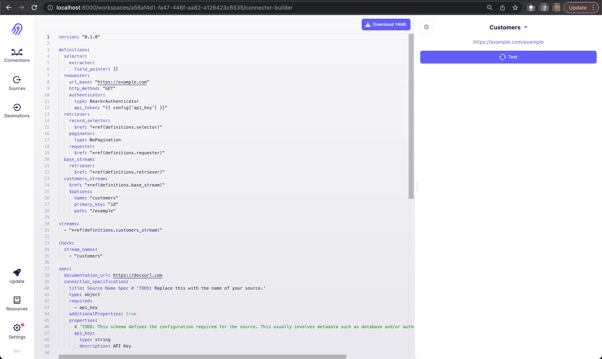

# Connector Builder UI

The connector builder UI provides an ergonomic iteration interface on top of the [low-code YAML format](understanding-the-yaml-file/yaml-overview). We recommend using it to iterate on your YAML connectors. 

:::caution 
The connector builder UI is in alpha, which means it’s still in active development and may include backward-incompatible changes. Share feedback and requests with us on our Slack channel or email us at feedback@airbyte.io 
:::

## Getting started
The high level flow for using the connector builder is as follows: 

1. Run the Airbyte webapp to access the connector builder
2. Use the connector builder to iterate on your YAML (either starting with a new YAML, or pasting an existing one into the editor)
3. Export the YAML into a low-code connector module on your local machine
4. Build the connector's Docker image
5. Use the built connector image in Airbyte

### Run an Airbyte instance
:::info
You need at least Airbyte v0.40.19 to run the connector builder. 
:::

:::tip
We recommend using a dedicated Airbyte instance for the connector builder UI. This will allow you to pick up connector builder UI upgrades without impacting your production data pipelines. 
:::

The connector builder UI is bundled as part of the Airbyte webapp. To run it, follow [the instructions for deploying Airbyte locally](../../deploying-airbyte/local-deployment) to run Airbyte on your machine. Once you do, Airbyte should be reachable at `http://localhost:8000`.

### Visit the connector builder
Once your Airbyte instance has started and you've moved past the initial setup screen, visit `http://localhost:8000/connector-builder`. You will be redirected to a URL of the form `localhost:8000/workspaces/<UUID>/connector-builder` where `<UUID>` is the ID automatically generated for your workspace by Airbyte. On this page you will find the connector builder UI. It should look like this: 

You can now iterate on your connector's YAML manifest. See the [components](#connector-builder-components) section for more information on how to use the UI to iterate on the YAML manifest. 

### Exporting the YAML
Once you're done iterating on your YAML in the UI, you'll need to export it to your local filesystem into a connector module. 

If you haven't already, create a low-code connector module using the connector generator (see [this YAML tutorial for an example](tutorial/1-create-source.md)) using the name you'd like to use for your connector. For this section, let's assume our connector is called `exchange-rates`. After creating the connector, overwrite the contents of `airbyte-integrations/connectors/source-exchange-rates/source_exchange_rates/exchange_rates.yaml` with the YAML you created in the UI. 

<!-- TODO remove this when we bundle schema specification into the YAML -->
:::info
Remember that you need to declare the schemas of your streams separately from the YAML manifest. 

You can do this by placing one `.json` file per stream in the `schemas/` directory of your connector module. Each `.json` should be a JSONSchema describing the schema of your stream. More information about this can be found in the [static schemas section of the Python CDK](../cdk-python/schemas#static-schemas). 
:::

### Building the connector image
Follow the instructions in the connector README to build the Docker image. Typically this will be something like `docker build . -t airbyte/source-<name>:<version>`. 

Once you've built the connector image, [follow these instructions](../../integrations/custom-connectors#adding-your-connectors-in-the-ui) to add your connector to your Airbyte instance. 

## Connector Builder Components

The UI contains two main components: the text editor where you can edit your YAML (left) according to the [YAML lowcode specification](./understanding-the-yaml-file/yaml-overview), and the testing panel (right) where you can get feedback on how your connector works as a result of your YAML manifest.

1. **Input parameters panel**: Configure the input parameters to be used in testing. For example, if the connector requires an API key, use this panel to specify a JSON object containing your API key e.g: `{"api_key": "xyz"}`
2. **Stream Picker dropdown**: Use this dropdown to choose which stream you want to test
3. **Endpoint URL**: Displays the URL queried by the CDK to retrieve data for the current stream
4. **Test button**: When clicked, retrieves the data for the selected stream using the stream configuration setup in the YAML file. This is the equivalent of running the `read` command on the terminal for a single stream (the selected stream). 
5. **Records tab**: Displays the final output returned by the connector for the selected page of data in this stream
6. **Request tab**: Displays the outgoing HTTP request made by the connector to retrieve the selected page of data. Useful for debugging. 
7. **Response tab**: Displays the full HTTP response received by the connector for the selected page of data. Useful for debugging. 
8. **Results view**: Displays information based on the selected tab
9. **Page selector** Displays the selected page
10. **Logs view**: Displays the logs emitted by the connector while running

The following demo video demonstrates these components on a very simple API: 

<iframe src="https://www.loom.com/embed/acf899938ef74dec8dd61ba012bc872f" frameborder="0" webkitallowfullscreen mozallowfullscreen allowfullscreen style={{position: "absolute", top: 0, left: 0, width: "100%", height: "100%"}}></iframe>

## Upgrading
The connector builder ships as part of the Airbyte platform. So if you want to get the latest and greatest updates to the builder UI, follow the process for [upgrading Airbyte](../../operator-guides/upgrading-airbyte) and you should pick up the upgrades.
