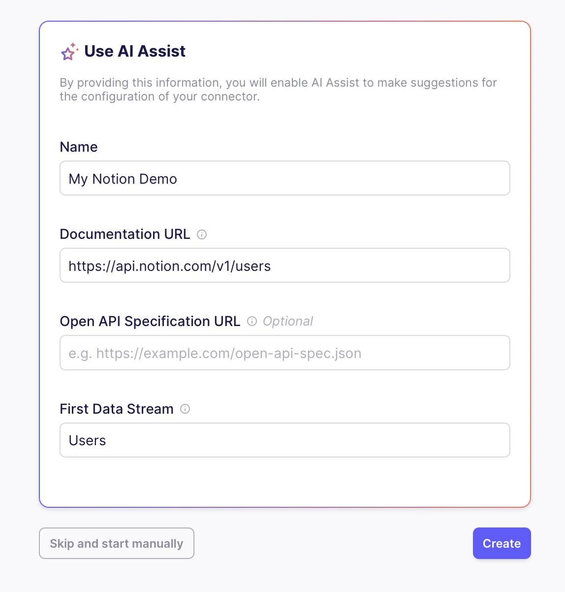
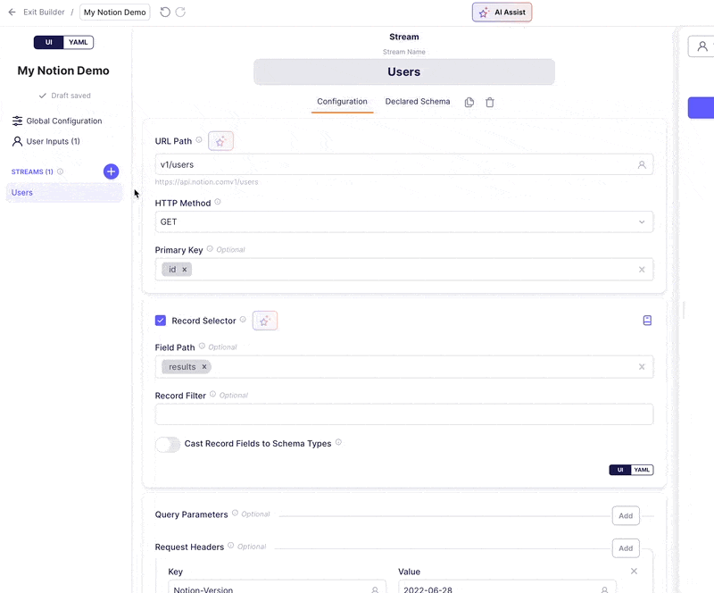
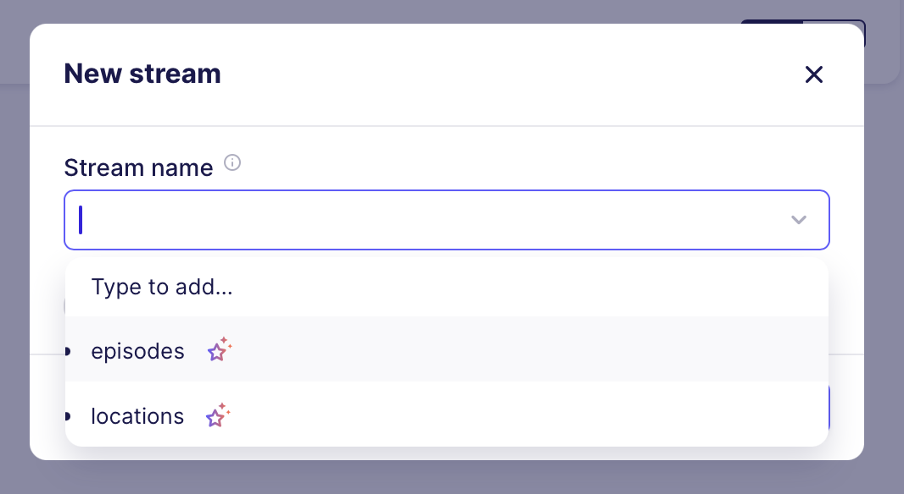

# AI Assistant for the Connector Builder (Beta)

Welcome to the **AI Assistant**, your personal helper for creating Airbyte connectors through our Connector Builder. While still in beta, this AI tool promises to significantly speed up your development time by automating and simplifying the process of building connectors.

Check out our [Hands-on Tutorial](https://airbyte.com/blog/hands-on-with-the-new-ai-assistant) to get started.

## Key Features

1. **Pre-fill and Configure Connectors**: When starting a new connector, AI Assistant can automatically prefill and configure a number of fields and sections in the Airbyte Connector Builder, drastically reducing setup time. This currently includes:
    - Base URL
    - Authentication
    - Pagination
    - Primary Key
    - Record Selection
    - Available streams
    - Stream configuration
2. **Ongoing Field and Section Suggestions**: As you continue working on a connector, AI Assistant will provide intelligent suggestions, helping you fine-tune your connector’s configuration.

## Why You’ll Love It

- **Faster Development**: The AI Assistant automates much of the setup and configuration, cutting down the time it takes to build connectors.
- **Less Time Spend Understanding the API Documentation**: The AI Assistant can read and understand the API documentation for you, so you don't have to.

## What Should You Expect?

- **Human Oversight Required**: Since it's an AI-based tool, you should still review the output to ensure everything is set up correctly. As it’s in beta, it won’t always be perfect, but it will save you significant time by handling most of the tedious setup tasks.
- **Optimized for Common API Types**: While the AI Assistant supports a wide range of APIs, like any AI feature it works best common use cases. It certainly performs best with **REST APIs** that return JSON responses. However, you can also use it with less common APIs like **GraphQL**.

## How It Works

### Provide API Documentation

Start by pasting a link to the API documentation or an OpenAPI spec into the Assistant.

### Automatic Configuration

AI Assistant will scan the documentation, finding critical information like the base URL, authentication methods, and pagination schemes.

### Suggestions for Fields and Sections

As you progress, the Assistant will offer suggestions for other fields and sections within the Connector Builder, making it easier to complete your setup.

### Stream Configuration

The Assistant will also help you setup your streams, providing you with a list of available streams and their likely configurations.

### Test & Review

After configuration, you can run tests to ensure the setup is correct. If the Assistant misses anything (like headers or pagination), you can adjust these manually and re-test.

## Where Can I Use It?

You can use the AI Assistant in the following scenarios:
- **When creating a new connector** from scratch in the Airbyte Connector Builder.
- **Within your existing connectors** by clicking the "AI Assist" button at the top of the builder.

---

We’re excited to see how much time AI Assistant can save you during the beta phase. While it's not perfect yet, it already simplifies the process of building and managing connectors.