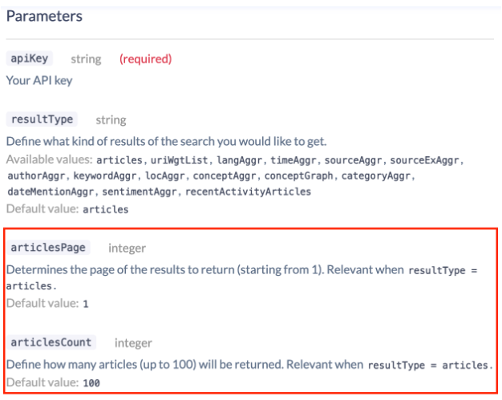
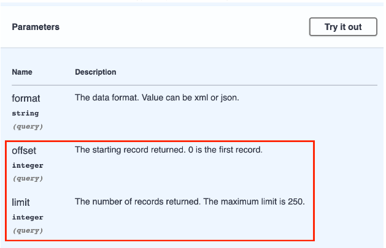
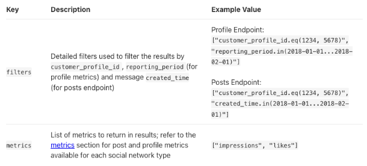

# Compatibility Guide

Answer the following questions to determine whether the Connector Builder is the right tool to build the connector you need:

- [ ] [Is it an HTTP API returning a collection of records synchronously?](#is-the-integration-an-http-api-returning-a-collection-of-records-synchronously)
- [ ] [Are data endpoints fixed?](#are-data-endpoints-fixed)
- [ ] [Is the API using one of the following authentication mechanism?](#what-type-of-authentication-is-required)
  - [Basic HTTP](#basic-http)
  - [API key injected in request header or query parameter](#api-key)
  - [OAuth2.0 with long-lived refresh token](#is-the-oauth-refresh-token-long-lived)
- [ ] [Is the data returned as JSON?](#is-the-data-returned-as-json)
- [ ] [If records are paginated, are they using one of the following mechanism?](#how-are-records-paginated)
  - [Limit-offset](#limit-offset--offsetincrement-)
  - [Page count](#page-count)
  - [Link to the next page](#link-to-next-page--cursorpagination-)
- [ ] [Are the required parameters of the integration key-value pairs?](#are-the-required-parameters-of-the-integration-key-value-pairs)

You can use the Connector Builder if the integration checks all the items.

You can follow [this chart](https://whimsical.com/connector-builder-compatibility-NEuqCZJzn7eaxfESQzCGWy@2Ux7TurymMvSCmDXoyPf) to guide you through the process.

The sections below provide more details to help you answer the questions.

## Is the integration an HTTP API returning a collection of records synchronously?

Look at the shape of the resource path.

Taking the [Congress API](https://api.congress.gov/#/bill) as an example,

`GET /bill`

Indicates the records can be retrieved by submitting a GET request to the `/bill` path. The sample response shows that the response returns a collection of records, so the Congress API is a REST API returning a collection of records.

Sample response:

```
{
  "bills":[
    {
      "congress":117,
      "latestAction":{
        "actionDate":"2022-04-06",
        "text":"Became Public Law No: 117-108."
      },
      "number":"3076",
      "originChamber":"House",
      "originChamberCode":"H",
      "title":"Postal Service Reform Act of 2022",
      "type":"HR",
      "updateDate":"2022-09-29",
      "updateDateIncludingText":"2022-09-29T03:27:05Z",
      "url":"https://api.congress.gov/v3/bill/117/hr/3076?format=json"
    },
    {
      "congress":117,
      "latestAction":{
        "actionDate":"2022-04-06",
        "text":"Read twice. Placed on Senate Legislative Calendar under General Orders. Calendar No. 343."
      },
      "number":"3599",
      "originChamber":"House",
      "originChamberCode":"H",
      "title":"Federal Rotational Cyber Workforce Program Act of 2021",
      "type":"HR",
      "updateDate":"2022-09-29",
      "updateDateIncludingText":"2022-09-29T03:41:50Z",
      "url":"https://api.congress.gov/v3/bill/117/hr/3599?format=json"
    }
  ]
}
```

Some endpoints are parameterized. An example of such endpoint is the [Congress API’s bill by congress endpoint](https://api.congress.gov/#/bill/bill_list_by_congress).
`GET /bill/:congress`

These endpoints are also valid synchronous HTTP endpoints.

This differs from the [Amazon Ads reports endpoint](https://advertising.amazon.com/API/docs/en-us/info/api-overview), which returns a report ID, which will be generated asynchronously by the source. This is not a synchronous HTTP API because the reports need to be downloaded separately.

Examples:

- Yes: [Congress API](https://api.congress.gov/#/)
- No: [Amazon Ads](https://advertising.amazon.com/API/docs/en-us/info/api-overview)

If the integration is not an HTTP API returning the records synchronously, use the Python CDK.

## Are data endpoints fixed?

The connector builder requires the data endpoints to be fixed. This means the data endpoints representing separate streams are not dynamically generated based on the data or user configuration, but specified as part of the API documentation.

For example, the [Congress API](https://api.congress.gov/#/) specifies the data endpoints as part of the documentation, while the [Salesforce API](https://developer.salesforce.com/docs/atlas.en-us.api_rest.meta/api_rest/dome_discoveryresource.htm) features a dynamic and configurable list of resources that can't be known in advance.

If an integration has a dynamic list of data endpoints representing separate streams, use the Python CDK.

## What type of authentication is required?

Look up the authentication mechanism in the API documentation, and identify which type it is.

### Basic HTTP

Are requests authenticated using the Basic HTTP authentication method? You can search the documentation page for one of the following keywords

- "Basic Auth"
- "Basic HTTP"
- "Authorization: Basic"

Example: [Greenhouse](https://developers.greenhouse.io/harvest.html#introduction)

If the authentication mechanism is Basic HTTP, it is compatible with the Connector Builder.

### API Key

Are requests authenticated using an API key injected either as a query parameter or as a request header?

Examples: [Congress API](https://api.congress.gov/), [Sendgrid](https://docs.sendgrid.com/for-developers/sending-email/authentication)

If the authentication mechanism is an API key injected as a query parameter or as a request header, it is compatible with the Connector Builder.

### OAuth

Are requests authenticated using an OAuth2.0 flow with a refresh token grant type?

Examples: [Square](https://developer.squareup.com/docs/oauth-api/overview), [Woocommerce](https://woocommerce.github.io/woocommerce-rest-api-docs/#introduction)

If the refresh request requires custom query parameters or request headers, use the Python CDK.<br/>
If the refresh request requires a [grant type](https://oauth.net/2/grant-types/) that is not "Refresh Token" or "Client Credentials", such as an Authorization Code, or a PKCE, use the Python CDK.<br/>
If the authentication mechanism is OAuth flow 2.0 with refresh token or client credentials and does not require custom query params, it is compatible with the Connector Builder.

### Session Token

Are data requests authenticated using a temporary session token that is obtained through a separate request?

Examples: [Metabase](https://www.metabase.com/learn/administration/metabase-api#authenticate-your-requests-with-a-session-token), [Splunk](https://dev.splunk.com/observability/reference/api/sessiontokens/latest)

If the authentication mechanism is a session token obtained through calling a separate endpoint, and which expires after some amount of time and needs to be re-obtained, it is compatible with the Connector Builder.

### Other

AWS endpoints are examples of APIs requiring a non-standard authentication mechanism. You can tell from [the documentation](https://docs.aws.amazon.com/pdfs/awscloudtrail/latest/APIReference/awscloudtrail-api.pdf#Welcome) that requests need to be signed with a hash.

Example: [AWS Cloudtrail](https://docs.aws.amazon.com/pdfs/awscloudtrail/latest/APIReference/awscloudtrail-api.pdf#Welcome)

If the integration requires a non-standard authentication mechanism, use Python CDK or low-code with custom components.

## Is the data returned as JSON?

Is the data returned by the API formatted as JSON, or is it formatted as another format such as XML, CSV, gRPC, or PDF?

Examples:

- Yes: [Congress API](https://api.congress.gov/)
- No: [Federal Railroad Administration (FRA) Safety Data APIs](https://safetydata.fra.dot.gov/MasterWebService/FRASafetyDataAPIs.aspx)

If the data is not formatted as JSON, use the Python CDK.

## How are records paginated?

Look up the pagination mechanism in the API documentation, and identify which type it is.

Here are the standard pagination mechanisms the connector builder supports:

### Page count

Endpoints using page count pagination accept two pagination parameters

1. The number of records to be returned (typically called “page_size”)
2. The page to request (typically called “page” or “page number“)

Example: [newsapi.ai](https://newsapi.ai/documentation)



### Limit-Offset (OffsetIncrement)

Endpoints using limit-offset pagination accept two pagination parameters

1. The number of records to be returned (typically called “limit”)
2. The index of the first record to return (typically called “offset”)



Example: [Congress API](https://api.congress.gov/)

### Link to next page (CursorPagination)

Endpoints paginated with a link to the next page of records typically include either a “Link” field in the response header, or in the response body.

You can search the documentation and the sample response for the “next” keyword.

Example: [Greenhouse](https://developers.greenhouse.io/harvest.html#pagination)

### Are the required parameters of the integration key-value pairs?

The Connector Builder currently only supports key-value query params and request body parameters.
This means endpoints requiring [GraphQL](https://graphql.org/) are not well supported at the moment.

An example of an endpoint that can't be implemented with the Connector Builder is [SproutSocial’s Analytics endpoint](https://api.sproutsocial.com/docs/#analytics-endpoints).

The endpoint requires a list of filters and metrics.



This endpoint is not supported by the connector builder because the “filters” and “metrics” fields are lists.

Examples:

- Yes: [Shopify GraphQL Admin API](https://shopify.dev/docs/api/admin-graphql#endpoints), [SproutSocial](https://api.sproutsocial.com/docs/#analytics-endpoints)
- No: [Congress API](https://api.congress.gov/)

If the integration requires query params or body parameters that are not key-value pairs, use the Python CDK.
