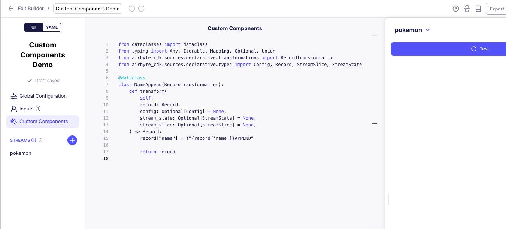

# Custom Components for the Connector Builder (Experimental)

:::danger
**SECURITY WARNING**: Custom Components are currently considered **UNSAFE** and **EXPERIMENTAL**. We do not provide any sandboxing guarantees. This feature could potentially execute arbitrary code in your Airbyte environment.

Administrators should enable this feature at their own discretion and risk. Only available in OSS and Enterprise deployments.
:::


*Screenshot: The Custom Components editor showing a simple RecordTransformation component that appends text to a record's name field.*

## What are Custom Components?

Custom Components allow you to extend the Connector Builder with your own Python implementations when the built-in components don't meet your specific integration needs. This feature enables you to:

- Override any built-in component with a custom Python class
- Implement specialized logic for handling complex API behaviors
- Maintain full control over the connection process while still leveraging the Connector Builder framework

At their core, Custom Components are Python classes that implement specific interfaces from the Airbyte CDK. They follow a consistent pattern:
- A dataclass that implements the interface of the component it's replacing
- Fields representing configurable arguments from the YAML configuration
- Implementation of required methods to handle the component's specific functionality

When enabled, Custom Components bring the full flexibility of the Low-Code CDK's advanced capabilities directly into the Connector Builder UI environment.

## Why Custom Components are Powerful

Custom Components provide significant advantages when building complex connectors:

1. **Handle Edge Cases**: They allow you to address unique API behaviors that aren't covered by built-in components, such as unusual pagination patterns, complex authentication schemes, or specialized data transformation needs.

2. **Extend Functionality**: When standard components don't offer the precise functionality you need, Custom Components let you implement exactly what's required without compromising.

3. **Maintain Framework Benefits**: While providing customization, you still benefit from the structure, testing capabilities, and deployment options of the Connector Builder framework.

4. **Iterative Development**: You can start with built-in components and gradually replace only the specific parts that need customization, rather than building an entire connector from scratch.

5. **Specialized Transformations**: Implement complex data manipulation, normalization, or enrichment that goes beyond what declarative configuration can provide.

This powerful capability bridges the gap between low-code simplicity and custom code flexibility, enabling integration with virtually any API regardless of its complexity or unique requirements.

## How to Enable Custom Components

Custom Components are disabled by default due to their experimental nature and security implications. Administrators can enable this feature in OSS and Enterprise deployments using one of the following methods:

### Using ABCTL

1. Create a values override file (e.g., `custom-components-values.yaml`) with the following content:
   ```yaml
   workload-launcher:
     extraEnv:
       AIRBYTE_ENABLE_UNSAFE_CODE: true
   connector-builder-server:
     extraEnv:
       AIRBYTE_ENABLE_UNSAFE_CODE: true
   ```

2. Use this file during deployment with the ABCTL command:
   ```bash
   abctl local install --values custom-components-values.yaml
   ```

### Using Helm Charts Directly

If you're deploying Airbyte using our public Helm charts without ABCTL:

1. Edit your existing `values.yaml` file or create a new override file with the same configuration:
   ```yaml
   workload-launcher:
     extraEnv:
       AIRBYTE_ENABLE_UNSAFE_CODE: true
   connector-builder-server:
     extraEnv:
       AIRBYTE_ENABLE_UNSAFE_CODE: true
   ```

2. Apply the configuration during Helm installation or upgrade:
   ```bash
   helm upgrade --install airbyte airbyte/airbyte -f values.yaml -f custom-components-values.yaml
   ```

:::caution
After enabling Custom Components, carefully monitor your deployment for any security or performance issues. Remember that this feature allows execution of arbitrary code in your Airbyte environment.
:::

## How to Use Custom Components

Custom Components in the Connector Builder UI extend the functionality available in the Low-Code CDK. For detailed implementation information, please refer to our [Custom Components documentation](../config-based/advanced-topics/custom-components.md).

Key implementation steps include:

1. Create a Python class that implements the interface of the component you want to customize
2. Define the necessary fields and methods required by that interface
3. Reference your custom component in the connector configuration using its fully qualified class name

The existing documentation provides examples of:
- How to create custom component classes
- Required implementation interfaces
- Properly referencing custom components in your configuration
- Handling parameter propagation between parent and child components

Remember that while using the Connector Builder UI, you'll need to switch to the YAML editor view to implement custom components, as they cannot be configured through the visual interface.

Custom Components are currently in active development. While powerful, they should be used with caution in production environments.