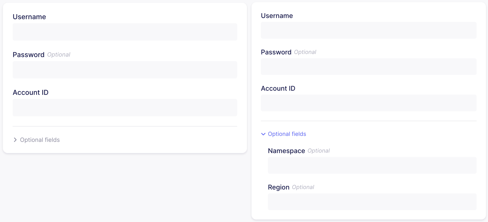

# Connector Specification Reference

The [connector specification](../understanding-airbyte/airbyte-protocol.md#spec) describes what inputs can be used to configure a connector. Like the rest of the Airbyte Protocol, it uses [JsonSchema](https://json-schema.org), but with some slight modifications.

## Demoing your specification

While iterating on your specification, you can preview what it will look like in the UI in realtime by following the instructions [here](https://github.com/airbytehq/airbyte-platform/blob/master/airbyte-webapp/docs/HowTo-ConnectionSpecification.md).

### Secret obfuscation

By default, any fields in a connector's specification are visible can be read in the UI. However, if you want to obfuscate fields in the UI and API \(for example when working with a password\), add the `airbyte_secret` annotation to your connector's `spec.json` e.g:

```text
"password": {
  "type": "string",
  "examples": ["hunter2"],
  "airbyte_secret": true
},
```

Here is an example of what the password field would look like: 

### Ordering fields in the UI

Use the `order` property inside a definition to determine the order in which it will appear relative to other objects on the same level of nesting in the UI.

For example, using the following spec:

```
{
  "username": {"type": "string", "order": 1},
  "password": {"type": "string", "order": 2},
  "cloud_provider": {
    "order": 0,
    "type": "object",
    "properties" : {
      "name": {"type": "string", "order": 0},
      "region": {"type": "string", "order": 1}
    }
  }
}
```

will result in the following configuration on the UI:


:::info

Within an object definition, if some fields have the `order` property defined, and others don't, then the fields without the `order` property defined should be rendered last in the UI. Among those elements (which don't have `order` defined), required fields are ordered before optional fields, and both categories are further ordered alphabetically by their field name.

Additionally, `order` values cannot be duplicated within the same object or group. See the [Grouping fields](#grouping-fields) section for more info on field groups.

:::

### Collapsing optional fields

By default, all optional fields will be collapsed into an `Optional fields` section which can be expanded or collapsed by the user. This helps streamline the UI for setting up a connector by initially focusing attention on the required fields only. For existing connectors, if their configuration contains a non-empty and non-default value for a collapsed optional field, then that section will be automatically opened when the connector is opened in the UI.

These `Optional fields` sections are placed at the bottom of a field group, meaning that all required fields in the same group will be placed above it. To interleave optional fields with required fields, set `always_show: true` on the optional field along with an `order`, which will cause the field to no longer be collapsed in an `Optional fields` section and be ordered as normal. 

**Note:** `always_show` also causes fields that are normally hidden by an OAuth button to still be shwon.

Within a collapsed `Optional fields` section, the optional fields' `order` defines their position in the section; those without an `order` will be placed after fields with an `order`, and will themselves be ordered alphabetically by field name.

For example, using the following spec:

```
{
  "connectionSpecification": {
    "type": "object",
    "required": ["username", "account_id"],
    "properties": {
      "username": {
        "type": "string",
        "title": "Username",
        "order": 1
      },
      "password": {
        "type": "string",
        "title": "Password",
        "order": 2,
        "always_show": true
      },
      "namespace": {
        "type": "string",
        "title": "Namespace",
        "order": 3
      },
      "region": {
        "type": "string",
        "title": "Region",
        "order": 4
      },
      "account_id": {
        "type": "integer",
        "title": "Account ID",
        "order": 5
      }
    }
  }
}
```

will result in the following configuration on the UI (left side shows initial collapsed state, right side shows the optional fields section expanded):



### Grouping fields

Fields in the connector spec can be grouped into cards in the UI by utilizing the `group` property on a field. All fields that share the same `group` value will be grouped into the same card in the UI, and fields without a `group` will be placed into their own group card.

:::info

`group` can only be set on top-level properties in the connectionSpecification; it is not allowed on fields of objects nested inside the connectionSpecification.

Additionally, within a group the `order` values set on each field determine how they are ordered in the UI, and therefore an `order` value cannot be duplicated within a group.

:::

Groups themselves can also be ordered and titled by setting the `groups` property on the connectorSpecification. The value of this field is an array containing objects with `id` that matches the `group` values that were set on fields, and optionally a `title` which causes the Airbyte UI to render that title at the top of the group's card.

The order of entries in this `groups` array decides the order of the cards; `group` IDs that are set on fields which do not appear in this `groups` array will be ordered after those that do appear and will be ordered alphanumerically.

For example, using the following spec:

```
{
  "connectionSpecification": {
    "type": "object",
    "required": ["username", "namespace", "account_id"],
    "properties": {
      "username": {
        "type": "string",
        "title": "Username",
        "order": 1,
        "group": "auth"
      },
      "password": {
        "type": "string",
        "title": "Password",
        "always_show": true,
        "order": 2,
        "group": "auth"
      },
      "namespace": {
        "type": "string",
        "title": "Namespace",
        "order": 1,
        "group": "location"
      },
      "region": {
        "type": "string",
        "title": "Region",
        "order": 2,
        "group": "location"
      },
      "account_id": {
        "type": "integer",
        "title": "Account ID"
      }
    },
    "groups": [
      {
        "id": "auth",
        "title": "Authentication"
      },
      {
        "id": "location"
      }
    ]
  }
}
```

will result in the following configuration on the UI:


### Multi-line String inputs

Sometimes when a user is inputting a string field into a connector, newlines need to be preserveed. For example, if we want a connector to use an RSA key which looks like this:

```text
---- BEGIN PRIVATE KEY ----
123
456
789
---- END PRIVATE KEY ----
```

we need to preserve the line-breaks. In other words, the string `---- BEGIN PRIVATE KEY ----123456789---- END PRIVATE KEY ----` is not equivalent to the one above since it loses linebreaks.

By default, string inputs in the UI can lose their linebreaks. In order to accept multi-line strings in the UI, annotate your string field with `multiline: true` e.g:

```text
"private_key": {
  "type": "string",
  "description": "RSA private key to use for SSH connection",
  "airbyte_secret": true,
  "multiline": true
},
```

this will display a multi-line textbox in the UI like the following screenshot: 

### Hiding inputs in the UI

In some rare cases, a connector may wish to expose an input that is not available in the UI, but is still potentially configurable when running the connector outside of Airbyte, or via the UI. For example, exposing a very technical configuration like the page size of an outgoing HTTP requests may only be relevant to power users, and therefore shouldn't be available via the UI but might make sense to expose via the API.

In this case, use the `"airbyte_hidden": true` keyword to hide that field from the UI. E.g:

```
{
  "first_name": {
    "type": "string",
    "title": "First Name"
  },
  "secret_name": {
    "type": "string",
    "title": "You can't see me!!!",
    "airbyte_hidden": true
  }
}
```

Results in the following form:


## Pattern descriptors

Setting a `pattern` on a field in a connector spec enforces that the value entered into that input matches the `pattern` regex value. However, this causes the regex pattern to be displayed in the input's error message, which is usually not very helpful for the end-user.

The `pattern_descriptor` property allows the connector developer to set a human-readable format that should be displayed above the field, and if set in conjunction with a `pattern`, this `pattern_descriptor` will be used in the invalid format error message instead of the raw regex.

For example, having a field in the spec like:

```
"start_date": {
  "type": "string",
  "title": "Start date",
  "pattern": "^[0-9]{4}-[0-9]{2}-[0-9]{2}$",
  "pattern_descriptor": "YYYY-MM-DD"
},
```

will result in the following look in the UI (empty state, valid state, and error state):


## Airbyte Modifications to `jsonschema`

### Using `oneOf`

In some cases, a connector needs to accept one out of many options. For example, a connector might need to know the compression codec of the file it will read, which will render in the Airbyte UI as a list of the available codecs. In JSONSchema, this can be expressed using the [oneOf](https://json-schema.org/understanding-json-schema/reference/combining.html#oneof) keyword.

:::info

Some connectors may follow an older format for dropdown lists, we are currently migrating away from that to this standard.

:::

In order for the Airbyte UI to correctly render a specification, however, a few extra rules must be followed:

1. The top-level item containing the `oneOf` must have `type: object`.
2. Each item in the `oneOf` array must be a property with `type: object`.
3. One `string` field with the same property name must be consistently present throughout each object inside the `oneOf` array. It is required to add a [`const`](https://json-schema.org/understanding-json-schema/reference/generic.html#constant-values) value unique to that `oneOf` option.

Let's look at the [source-file](../integrations/sources/file.md) implementation as an example. In this example, we have `provider` as a dropdown list option, which allows the user to select what provider their file is being hosted on. We note that the `oneOf` keyword lives under the `provider` object as follows:

In each item in the `oneOf` array, the `option_title` string field exists with the aforementioned `const` value unique to that item. This helps the UI and the connector distinguish between the option that was chosen by the user. This can be displayed with adapting the file source spec to this example:

```javascript
{
  "connection_specification": {
    "$schema": "http://json-schema.org/draft-07/schema#",
    "title": "File Source Spec",
    "type": "object",
    "required": ["dataset_name", "format", "url", "provider"],
    "properties": {
      "dataset_name": {
        ...
      },
      "format": {
        ...
      },
      "reader_options": {
        ...
      },
      "url": {
        ...
      },
      "provider": {
        "type": "object",
        "oneOf": [
          {
            "required": [
              "option_title"
            ],
            "properties": {
              "option_title": {
                "type": "string",
                "const": "HTTPS: Public Web",
                "order": 0
              }
            }
          },
          {
            "required": [
              "option_title"
            ],
            "properties": {
              "option_title": {
                "type": "string",
                "const": "GCS: Google Cloud Storage",
                "order": 0
              },
              "service_account_json": {
                "type": "string",
                "description": "In order to access private Buckets stored on Google Cloud, this connector would need a service account json credentials with the proper permissions as described <a href=\"https://cloud.google.com/iam/docs/service-accounts\" target=\"_blank\">here</a>. Please generate the credentials.json file and copy/paste its content to this field (expecting JSON formats). If accessing publicly available data, this field is not necessary."
              }
            }
          }
        ]
      }
  }
}
```

### Using `enum`

In regular `jsonschema`, some drafts enforce that `enum` lists must contain distinct values, while others do not. For consistency, Airbyte enforces this restriction.

For example, this spec is invalid, since `a_format` is listed twice under the enumerated property `format`:

```javascript
{
  "connection_specification": {
    "$schema": "http://json-schema.org/draft-07/schema#",
    "title": "File Source Spec",
    "type": "object",
    "required": ["format"],
    "properties": {
      "dataset_name": {
        ...
      },
      "format": {
        type: "string",
        enum: ["a_format", "another_format", "a_format"]
      },
    }
  }
}
```

### Forbidden keys

In connector specs, the following JSON schema keys are forbidden, as Airbyte does not currently contain logic to interpret them

- `not`
- `anyOf`
- `patternProperties`
- `prefixItems`
- `allOf`
- `if`
- `then`
- `else`
- `dependentSchemas`
- `dependentRequired`
