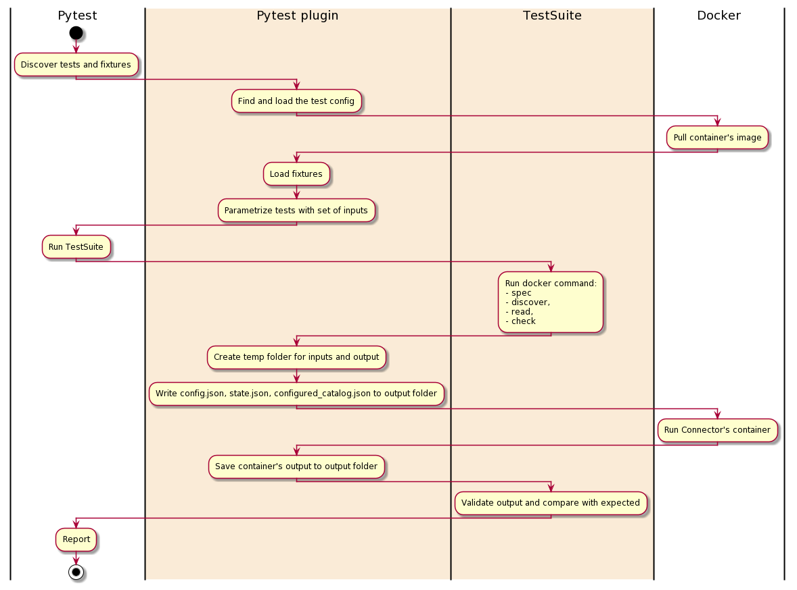

# Acceptance Tests Reference

To ensure a minimum quality bar, Airbyte runs all connectors against the same set of integration tests. Those tests ensure that each connector adheres to the [Airbyte Specification](../../understanding-airbyte/airbyte-protocol.md) and responds correctly to Airbyte commands when provided valid \(or invalid\) inputs.

_Note: If you are looking for reference documentation for the deprecated first version of test suites, see_ [_Standard Tests \(Legacy\)_](https://github.com/airbytehq/airbyte/tree/e378d40236b6a34e1c1cb481c8952735ec687d88/docs/contributing-to-airbyte/building-new-connector/legacy-standard-source-tests.md)_._

## Architecture of standard tests

The Standard Test Suite runs its tests against the connector's Docker image. It takes as input the configuration file `acceptance-tests-config.yml`.



The Standard Test Suite use pytest as a test runner and was built as pytest plugin `connector-acceptance-test`. This plugin adds a new configuration option `—acceptance-test-config` - it should points to the folder with `acceptance-tests-config.yml`.

Each test suite has a timeout and will fail if the limit is exceeded.

See all the test cases, their description, and inputs in [Connector Acceptance Tests](https://github.com/airbytehq/airbyte/tree/e378d40236b6a34e1c1cb481c8952735ec687d88/docs/contributing-to-airbyte/building-new-connector/connector-acceptance-tests.md).

## Setting up standard acceptance tests for your connector

Create `acceptance-test-config.yml`. In most cases, your connector already has this file in its root folder. Here is an example of the minimal `acceptance-test-config.yml`:

```yaml
connector_image: airbyte/source-some-connector:dev
acceptance-tests:
  spec:
    tests:
      - spec_path: "some_folder/spec.yaml"
```

_Note: Not all types of tests work for all connectors, only configure the ones that make sense in your scenario. The `spec` and `check` test suites are universal for all sources and destinations, the other test suites are only applicable to sources, and the `incremental` test suite is only applicable if the source connector supports incremental syncs._

Build your connector image if needed.

**Option A (Preferred): Building the docker image with `airbyte-ci`**

This is the preferred method for building and testing connectors.

If you want to open source your connector we encourage you to use our [`airbyte-ci`](https://github.com/airbytehq/airbyte/blob/master/airbyte-ci/connectors/pipelines/README.md) tool to build your connector.
It will not use a Dockerfile but will build the connector image from our [base image](https://github.com/airbytehq/airbyte/blob/master/airbyte-ci/connectors/base_images/README.md) and use our internal build logic to build an image from your Python connector code.

Running `airbyte-ci connectors --name source-<source-name> build` will build your connector image.
Once the command is done, you will find your connector image in your local docker host: `airbyte/source-<source-name>:dev`.

**Option B: Building the docker image with a Dockerfile**

If you don't want to rely on `airbyte-ci` to build your connector, you can build the docker image using your own Dockerfile. This method is not preferred, and is not supported for certified connectors.

Create a `Dockerfile` in the root of your connector directory. The `Dockerfile` should look something like this:

```Dockerfile

FROM airbyte/python-connector-base:1.1.0

COPY . ./airbyte/integration_code
RUN pip install ./airbyte/integration_code

# The entrypoint and default env vars are already set in the base image
# ENV AIRBYTE_ENTRYPOINT "python /airbyte/integration_code/main.py"
# ENTRYPOINT ["python", "/airbyte/integration_code/main.py"]
```

Please use this as an example. This is not optimized.

Build your image:

```bash
docker build . -t airbyte/source-example-python:dev
```

And test via one of the two following Options

### Option 1 (Preferred): Run against the Airbyte CI test suite

Learn how to use and install [`airbyte-ci` here](https://github.com/airbytehq/airbyte/blob/master/airbyte-ci/connectors/pipelines/README.md). Once installed, `airbyte-ci connectors test` command will run unit, integration, and acceptance tests against your connector. Pass `--name <your_connector_name>` to test just one connector.

```bash
airbyte-ci connectors --name=<name-of-your-connector></name-of-your-connector> --use-remote-secrets=false test
```

### Option 2 (Debugging): Run against the acceptance tests on your branch

This will run the acceptance test suite directly with pytest. Allowing you to set breakpoints and debug your connector locally.

The only pre-requisite is that you have [Poetry](https://python-poetry.org/docs/#installation) installed.

Afterwards you do the following from the root of the `airbyte` repo:

```bash
cd airbyte-integrations/bases/connector-acceptance-test/
poetry install
poetry run pytest -p connector_acceptance_test.plugin --acceptance-test-config=../../connectors/<your-connector> --pdb
```

See other useful pytest options [here](https://docs.pytest.org/en/stable/usage.html)
See a more comprehensive guide in our README [here](https://github.com/airbytehq/airbyte/blob/master/airbyte-integrations/bases/connector-acceptance-test/README.md)

## Dynamically managing inputs & resources used in standard tests

Since the inputs to standard tests are often static, the file-based runner is sufficient for most connectors. However, in some cases, you may need to run pre or post hooks to dynamically create or destroy resources for use in standard tests. For example, if we need to spin up a Redshift cluster to use in the test then tear it down afterwards, we need the ability to run code before and after the tests, as well as customize the Redshift cluster URL we pass to the standard tests. If you have need for this use case, please reach out to us via [Github](https://github.com/airbytehq/airbyte) or [Slack](https://slack.airbyte.io). We currently support it for Java & Python, and other languages can be made available upon request.

### Python

Create pytest yield-fixture with your custom setup/teardown code and place it in `integration_tests/acceptance.py`, Example of fixture that starts a docker container before tests and stops before exit:

```python
@pytest.fixture(scope="session", autouse=True)
def connector_setup():
    """ This fixture is a placeholder for external resources that acceptance test might require.
    """
    client = docker.from_env()
    container = client.containers.run("your/docker-image", detach=True)
    yield
    container.stop()
```

These tests are configurable via `acceptance-test-config.yml`. Each test has a number of inputs, you can provide multiple sets of inputs which will cause the same to run multiple times - one for each set of inputs.

Example of `acceptance-test-config.yml`:

```yaml
connector_image: string # Docker image to test, for example 'airbyte/source-pokeapi:0.1.0'
base_path: string # Base path for all relative paths, optional, default - ./
custom_environment_variables:
  foo: bar
acceptance_tests: # Tests configuration
  spec: # list of the test inputs
    bypass_reason: "Explain why you skipped this test"
  connection: # list of the test inputs
    tests:
      - config_path: string # set #1 of inputs
        status: string
      - config_path: string # set #2 of inputs
        status: string
    # discovery:  # skip this test
  incremental:
    bypass_reason: "Incremental sync are not supported on this connector"
```

## Test Spec

Verify that a `spec` operation issued to the connector returns a valid connector specification.
Additional tests are validating the backward compatibility of the current specification compared to the specification of the previous connector version. If no previous connector version is found (by default the test looks for a docker image with the same name but with the `latest` tag), this test is skipped.
These backward compatibility tests can be bypassed by changing the value of the `backward_compatibility_tests_config.disable_for_version` input in `acceptance-test-config.yml` (see below).
One more test validates the specification against containing exposed secrets. This means fields that potentially could hold a secret value should be explicitly marked with `"airbyte_secret": true`. If an input field like `api_key` / `password` / `client_secret` / etc. is exposed, the test will fail.

| Input                                                            | Type    | Default             | Note                                                                                                                  |
| :--------------------------------------------------------------- | :------ | :------------------ | :-------------------------------------------------------------------------------------------------------------------- |
| `spec_path`                                                      | string  | `secrets/spec.json` | Path to a YAML or JSON file representing the spec expected to be output by this connector                             |
| `backward_compatibility_tests_config.previous_connector_version` | string  | `latest`            | Previous connector version to use for backward compatibility tests (expects a version following semantic versioning). |
| `backward_compatibility_tests_config.disable_for_version`        | string  | None                | Disable the backward compatibility test for a specific version (expects a version following semantic versioning).     |
| `timeout_seconds`                                                | int     | 10                  | Test execution timeout in seconds                                                                                     |
| `auth_default_method`                                            | object  | None                | Ensure that OAuth is default method, if OAuth uses by source                                                          |
| `auth_default_method.oauth`                                      | boolean | True                | Validate that OAuth is default method if set to True                                                                  |
| `auth_default_method.bypass_reason`                              | string  |                     | Reason why OAuth is not default method                                                                                |

## Test Connection

Verify that a check operation issued to the connector with the input config file returns a successful response.

| Input             | Type                           | Default               | Note                                                               |
| :---------------- | :----------------------------- | :-------------------- | :----------------------------------------------------------------- |
| `config_path`     | string                         | `secrets/config.json` | Path to a JSON object representing a valid connector configuration |
| `status`          | `succeed` `failed` `exception` |                       | Indicate if connection check should succeed with provided config   |
| `timeout_seconds` | int                            | 30                    | Test execution timeout in seconds                                  |

## Test Discovery

Verifies when a `discover` operation is run on the connector using the given config file, a valid catalog is produced by the connector.
Additional tests are validating the backward compatibility of the discovered catalog compared to the catalog of the previous connector version. If no previous connector version is found (by default the test looks for a docker image with the same name but with the `latest` tag), this test is skipped.
These backward compatibility tests can be bypassed by changing the value of the `backward_compatibility_tests_config.disable_for_version` input in `acceptance-test-config.yml` (see below).

| Input                                                            | Type   | Default                                     | Note                                                                                                                  |
| :--------------------------------------------------------------- | :----- | :------------------------------------------ | :-------------------------------------------------------------------------------------------------------------------- |
| `config_path`                                                    | string | `secrets/config.json`                       | Path to a JSON object representing a valid connector configuration                                                    |
| `configured_catalog_path`                                        | string | `integration_tests/configured_catalog.json` | Path to configured catalog                                                                                            |
| `timeout_seconds`                                                | int    | 30                                          | Test execution timeout in seconds                                                                                     |
| `backward_compatibility_tests_config.previous_connector_version` | string | `latest`                                    | Previous connector version to use for backward compatibility tests (expects a version following semantic versioning). |
| `backward_compatibility_tests_config.disable_for_version`        | string | None                                        | Disable the backward compatibility test for a specific version (expects a version following semantic versioning).     |

## Test Basic Read

Configuring all streams in the input catalog to full refresh mode verifies that a read operation produces some RECORD messages. Each stream should have some data, if you can't guarantee this for particular streams - add them to the `empty_streams` list.
Set `validate_data_points=True` if possible. This validation is going to be enabled by default and won't be configurable in future releases.

| Input                                           | Type             | Default                                     | Note                                                                                                         |
| :---------------------------------------------- | :--------------- | :------------------------------------------ | :----------------------------------------------------------------------------------------------------------- |
| `config_path`                                   | string           | `secrets/config.json`                       | Path to a JSON object representing a valid connector configuration                                           |
| `configured_catalog_path`                       | string           | `integration_tests/configured_catalog.json` | Path to configured catalog                                                                                   |
| `empty_streams`                                 | array of objects | \[\]                                        | List of streams that might be empty with a `bypass_reason`                                                   |
| `empty_streams[0].name`                         | string           |                                             | Name of the empty stream                                                                                     |
| `empty_streams[0].bypass_reason`                | string           | None                                        | Reason why this stream is empty                                                                              |
| `ignored_fields[stream][0].name`                | string           |                                             | Name of the ignored field                                                                                    |
| `ignored_fields[stream][0].bypass_reason`       | string           | None                                        | Reason why this field is ignored                                                                             |
| `validate_schema`                               | boolean          | True                                        | Verify that structure and types of records matches the schema from discovery command                         |
| `fail_on_extra_columns`                         | boolean          | True                                        | Fail schema validation if undeclared columns are found in records. Only relevant when `validate_schema=True` |
| `validate_data_points`                          | boolean          | False                                       | Validate that all fields in all streams contained at least one data point                                    |
| `timeout_seconds`                               | int              | 5\*60                                       | Test execution timeout in seconds                                                                            |
| `expect_trace_message_on_failure`               | boolean          | True                                        | Ensure that a trace message is emitted when the connector crashes                                            |
| `expect_records`                                | object           | None                                        | Compare produced records with expected records, see details below                                            |
| `expect_records.path`                           | string           |                                             | File with expected records                                                                                   |
| `expect_records.bypass_reason`                  | string           |                                             | Explain why this test is bypassed                                                                            |
| `expect_records.exact_order`                    | boolean          | False                                       | Ensure that records produced in exact same order                                                             |
| `file_types`                                    | object           | None                                        | Configure file-based connectors specific tests                                                               |
| `file_types.skip_test`                          | boolean          | False                                       | Skip file-based connectors specific tests for the current config with a `bypass_reason`                      |
| `file_types.bypass_reason`                      | string           | None                                        | Reason why file-based connectors specific tests are skipped                                                  |
| `file_types.unsupported_types`                  | array of objects | None                                        | Configure file types which are not supported by a source                                                     |
| `file_types.unsupported_types[0].extension`     | string           |                                             | File type in `.csv` format which cannot be added to a test account                                           |
| `file_types.unsupported_types[0].bypass_reason` | string           | None                                        | Reason why this file type cannot be added to a test account                                                  |

`expect_records` is a nested configuration, if omitted - the part of the test responsible for record matching will be skipped.

### Schema format checking

If some field has [format](https://json-schema.org/understanding-json-schema/reference/string.html#format) attribute specified on its catalog json schema, Connector Acceptance Testing framework performs checking against format. It support checking of all [builtin](https://json-schema.org/understanding-json-schema/reference/string.html#built-in-formats) jsonschema formats for draft 7 specification: email, hostnames, ip addresses, time, date and date-time formats.

Note: For date-time we are not checking against compliance against ISO8601 \(and RFC3339 as subset of it\). Since we are using specified format to set database column type on db normalization stage, value should be compliant to bigquery [timestamp](https://cloud.google.com/bigquery/docs/reference/standard-sql/data-types#timestamp_type) and SQL "timestamp with timezone" formats.

### Example of `expected_records.jsonl`:

In general, the expected_records.jsonl should contain the subset of output of the records of particular stream you need to test. The required fields are: `stream, data, emitted_at`

```javascript
{"stream": "my_stream", "data": {"field_1": "value0", "field_2": "value0", "field_3": null, "field_4": {"is_true": true}, "field_5": 123}, "emitted_at": 1626172757000}
{"stream": "my_stream", "data": {"field_1": "value1", "field_2": "value1", "field_3": null, "field_4": {"is_true": false}, "field_5": 456}, "emitted_at": 1626172757000}
{"stream": "my_stream", "data": {"field_1": "value2", "field_2": "value2", "field_3": null, "field_4": {"is_true": true}, "field_5": 678}, "emitted_at": 1626172757000}
{"stream": "my_stream", "data": {"field_1": "value3", "field_2": "value3", "field_3": null, "field_4": {"is_true": false}, "field_5": 91011}, "emitted_at": 1626172757000}
```

## Test Full Refresh sync

### TestSequentialReads

This test performs two read operations on all streams which support full refresh syncs. It then verifies that the RECORD messages output from both were identical or the former is a strict subset of the latter.

| Input                                     | Type   | Default                                     | Note                                                                   |
| :---------------------------------------- | :----- | :------------------------------------------ | :--------------------------------------------------------------------- |
| `config_path`                             | string | `secrets/config.json`                       | Path to a JSON object representing a valid connector configuration     |
| `configured_catalog_path`                 | string | `integration_tests/configured_catalog.json` | Path to configured catalog                                             |
| `timeout_seconds`                         | int    | 20\*60                                      | Test execution timeout in seconds                                      |
| `ignored_fields`                          | dict   | None                                        | For each stream, list of fields path ignoring in sequential reads test |
| `ignored_fields[stream][0].name`          | string |                                             | Name of the ignored field                                              |
| `ignored_fields[stream][0].bypass_reason` | string | None                                        | Reason why this field is ignored                                       |

## Test Incremental sync

### TestTwoSequentialReads

This test verifies that all streams in the input catalog which support incremental sync can do so correctly. It does this by running two read operations: the first takes the configured catalog and config provided to this test as input. It then verifies that the sync produced a non-zero number of `RECORD` and `STATE` messages. The second read takes the same catalog and config used in the first test, plus the last `STATE` message output by the first read operation as the input state file. It verifies that either no records are produced \(since we read all records in the first sync\) or all records that produced have cursor value greater or equal to cursor value from `STATE` message. This test is performed only for streams that support incremental. Streams that do not support incremental sync are ignored. If no streams in the input catalog support incremental sync, this test is skipped.

| Input                     | Type   | Default                                     | Note                                                               |
| :------------------------ | :----- | :------------------------------------------ | :----------------------------------------------------------------- |
| `config_path`             | string | `secrets/config.json`                       | Path to a JSON object representing a valid connector configuration |
| `configured_catalog_path` | string | `integration_tests/configured_catalog.json` | Path to configured catalog                                         |
| `timeout_seconds`         | int    | 20\*60                                      | Test execution timeout in seconds                                  |

### TestReadSequentialSlices

This test offers more comprehensive verification that all streams in the input catalog which support incremental syncs perform the sync correctly. It does so in two phases. The first phase uses the configured catalog and config provided to this test as input to make a request to the partner API and assemble the complete set of messages to be synced. It then verifies that the sync produced a non-zero number of `RECORD` and `STATE` messages. This set of messages is partitioned into batches of a `STATE` message followed by zero or more `RECORD` messages. For each batch of messages, the initial `STATE` message is used as input for a read operation to get records with respect to the cursor. The test then verifies that all of the `RECORDS` retrieved have a cursor value greater or equal to the cursor from the current `STATE` message. This test is performed only for streams that support incremental. Streams that do not support incremental sync are ignored. If no streams in the input catalog support incremental sync, this test is skipped.

| Input                                  | Type   | Default                                     | Note                                                                                                               |
| :------------------------------------- | :----- | :------------------------------------------ | :----------------------------------------------------------------------------------------------------------------- |
| `config_path`                          | string | `secrets/config.json`                       | Path to a JSON object representing a valid connector configuration                                                 |
| `configured_catalog_path`              | string | `integration_tests/configured_catalog.json` | Path to configured catalog                                                                                         |
| `timeout_seconds`                      | int    | 20\*60                                      | Test execution timeout in seconds                                                                                  |
| `skip_comprehensive_incremental_tests` | bool   | false                                       | For non-GA and in-development connectors, control whether the more comprehensive incremental tests will be skipped |

**Note that this test samples a fraction of stream slices across an incremental sync in order to reduce test duration and avoid spamming partner APIs**

### TestStateWithAbnormallyLargeValues

This test verifies that sync produces no records when run with the STATE with abnormally large values

| Input                     | Type   | Default                                     | Note                                                               |     |
| :------------------------ | :----- | :------------------------------------------ | :----------------------------------------------------------------- | :-- |
| `config_path`             | string | `secrets/config.json`                       | Path to a JSON object representing a valid connector configuration |     |
| `configured_catalog_path` | string | `integration_tests/configured_catalog.json` | Path to configured catalog                                         |     |
| `future_state_path`       | string | None                                        | Path to the state file with abnormally large cursor values         |     |
| `timeout_seconds`         | int    | 20\*60                                      | Test execution timeout in seconds                                  |     |
| `bypass_reason`           | string | None                                        | Explain why this test is bypassed                                  |     |

## Test Connector Attributes

Verifies that certain properties of the connector and its streams guarantee a higher level of usability standards for certified connectors.
Some examples of the types of tests covered are verification that streams define primary keys, correct OAuth spec configuration, or a connector emits the correct stream status during a read.

| Input                                       | Type                        | Default               | Note                                                                                                                         |
| :------------------------------------------ | :-------------------------- | :-------------------- | :--------------------------------------------------------------------------------------------------------------------------- |
| `config_path`                               | string                      | `secrets/config.json` | Path to a JSON object representing a valid connector configuration                                                           |
| `streams_without_primary_key`               | array of objects            | None                  | List of streams that do not support a primary key like reports streams                                                       |
| `streams_without_primary_key.name`          | string                      | None                  | Name of the stream missing the PK                                                                                            |
| `streams_without_primary_key.bypass_reason` | string                      | None                  | The reason the stream doesn't have the PK                                                                                    |
| `allowed_hosts.bypass_reason`               | object with `bypass_reason` | None                  | Defines the `bypass_reason` description about why the `allowedHosts` check for the certified connector should be skipped     |
| `suggested_streams.bypass_reason`           | object with `bypass_reason` | None                  | Defines the `bypass_reason` description about why the `suggestedStreams` check for the certified connector should be skipped |

## Test Connector Documentation

Verifies that connectors documentation follows our standard template, does have correct order of headings,
does not have missing headings and all required fields in Prerequisites section.

| Input             | Type   | Default               | Note                                                               |
| :---------------- | :----- | :-------------------- | :----------------------------------------------------------------- |
| `config_path`     | string | `secrets/config.json` | Path to a JSON object representing a valid connector configuration |
| `timeout_seconds` | int    | 20\*60                | Test execution timeout in seconds                                  |

## Strictness level

To enforce maximal coverage of acceptances tests we expose a `test_strictness_level` field at the root of the `acceptance-test-config.yml` configuration.
The default `test_strictness_level` is `low`, but for generally available connectors it is expected to be eventually set to `high`.

_Note: For now, the strictness level can only be applied for sources, not for destination connectors_

### Test enforcements in `high` test strictness level

#### All acceptance tests are declared, a `bypass_reason` is filled if a test can't run

In `high` test strictness level we expect all acceptance tests to be declared:

- `spec`
- `connection`
- `discovery`
- `basic_read`
- `full_refresh`
- `incremental`

If a test can't be run for a valid technical or organizational reason a `bypass_reason` can be declared to skip this test.
E.G. `source-pokeapi` does not support incremental syncs, we can skip this test when `test_strictness_level` is `high` by setting a `bypass_reason` under `incremental`.

```yaml
connector_image: "airbyte/source-pokeapi"
test_strictness_level: high
acceptance_tests:
  spec:
    tests:
      - spec_path: "source_pokeapi/spec.json"
  connection:
    tests:
      - config_path: "integration_tests/config.json"
        status: "succeed"
  discovery:
    tests:
      - config_path: "integration_tests/config.json"
  basic_read:
    tests:
      - config_path: "integration_tests/config.json"
  full_refresh:
    tests:
      - config_path: "integration_tests/config.json"
        configured_catalog_path: "integration_tests/configured_catalog.json"
  incremental:
    bypass_reason: "Incremental syncs are not supported on this connector."
```

#### Basic read: no empty streams are allowed without a `bypass_reason`

In `high` test strictness level we expect that all streams declared in `empty-streams` to have a `bypass_reason` filled in.

E.G. Two streams from `source-recharge` can't be seeded with test data, they are declared as `empty_stream` we an explicit bypass reason.

```yaml
connector_image: airbyte/source-recharge:dev
test_strictness_level: high
acceptance_tests:
  basic_read:
    tests:
      - config_path: secrets/config.json
        empty_streams:
          - name: collections
            bypass_reason: "This stream can't be seeded in our sandbox account"
          - name: discounts
            bypass_reason: "This stream can't be seeded in our sandbox account"
        timeout_seconds: 1200
```

#### Basic read: `expect_records` must be set

In `high` test strictness level we expect the `expect_records` subtest to be set.
If you can't create an `expected_records.jsonl` with all the existing stream you need to declare the missing streams in the `empty_streams` section.
If you can't get an `expected_records.jsonl` file at all, you must fill in a `bypass_reason`.

#### Basic read: no `configured_catalog_path` can be set

In `high` test strictness level we want to run the `basic_read` test on a configured catalog created from the discovered catalog from which we remove declared empty streams. Declaring `configured_catalog_path` in the test configuration is not allowed.

```yaml
connector_image: airbyte/source-recharge:dev
test_strictness_level: high
acceptance_tests:
  basic_read:
    tests:
      - config_path: secrets/config.json
        empty_streams:
          - name: collections
            bypass_reason: "This stream can't be seeded in our sandbox account"
          - name: discounts
            bypass_reason: "This stream can't be seeded in our sandbox account"
        timeout_seconds: 1200
```

#### Incremental: `future_state` must be set

In `high` test strictness level we expect the `future_state` configuration to be set.
The future state JSON file (usually `abnormal_states.json`) must contain one state for each stream declared in the configured catalog.
`missing_streams` can be set to ignore a subset of the streams with a valid bypass reason. E.G:

```yaml
test_strictness_level: high
connector_image: airbyte/source-my-connector:dev
acceptance_tests:
  ...
  incremental:
    tests:
      - config_path: secrets/config.json
        configured_catalog_path: integration_tests/configured_catalog.json
          ...
        future_state:
          future_state_path: integration_tests/abnormal_state.json
          missing_streams:
            - name: my_missing_stream
              bypass_reason: "Please fill a good reason"
```

## Caching

We cache discovered catalogs by default for performance and reuse the same discovered catalog through all tests.
You can disable this behavior by setting `cached_discovered_catalog: False` at the root of the configuration.

## Breaking Changes and Backwards Compatibility

Breaking changes are modifications that make previous versions of the connector incompatible, requiring a major version bump. Here are the various types of changes that we consider breaking:

1. **Changes to Stream Schema**

   - **Removing a Field**: If a field is removed from the stream's schema, it's a breaking change. Clients expecting the field may fail when it's absent.
   - **Changing Field Type**: If the data type of a field is changed, it could break clients expecting the original type. For instance, changing a field from string to integer would be a breaking change.
   - **Renaming a Field**: If a field is renamed, it can break existing clients that expect the field by its original name.

2. **Changes to Stream Behaviour**

   - **Changing the Cursor**: Changing the cursor field for incremental streams can cause data discrepancies or synchronization issues. Therefore, it's considered a breaking change.
   - **Renaming a Stream**: If a stream is renamed, it could cause failures for clients expecting the stream with its original name. Hence, this is a breaking change.
   - **Changing Sync Mechanism**: If a stream's sync mechanism changes, such as switching from full refresh sync to incremental sync (or vice versa), it's a breaking change. Existing workflows may fail or behave unexpectedly due to this change.

3. **Changes to Configuration Options**

   - **Removing or Renaming Options**: If configuration options are removed or renamed, it could break clients using those options, hence, is considered a breaking change.
   - **Changing Default Values or Behaviours**: Altering default values or behaviours of configuration options can break existing clients that rely on previous defaults.

4. **Changes to Authentication Mechanism**

   - Any change to the connector's authentication mechanism that isn't backwards compatible is a breaking change. For example, switching from API key authentication to OAuth without supporting both is a breaking change.

5. **Changes to Error Handling**

   - Altering the way errors are handled can be a breaking change. For example, if a certain type of error was previously ignored and now causes the connector to fail, it could break user's existing workflows.

6. **Changes That Require User Intervention**
   - If a change requires user intervention, such as manually updating settings or reconfiguring workflows, it would be considered a breaking change.

Please note that this is an exhaustive but not an exclusive list. Other changes could be considered breaking if they disrupt the functionality of the connector or alter user expectations in a significant way.

## Additional Checks

While not necessarily related to Connector Acceptance Testing, Airbyte employs a number of additional checks which run on connector Pull Requests which check the following items:

### Strictness Level

Generally Available Connectors must enable high-strictness testing for the Connector Acceptance Test suite. This ensures that these connectors have implemented the most robust collection of tests.

### Allowed Hosts

GA and Beta connectors are required to provide an entry for Allowed Hosts in the [metadata.yaml](../connector-metadata-file.md) for the connector. You can provide:

A list of static hostnames or IP addresses. Wildcards are valid.

```yaml
data:
  # ...
  allowedHosts:
    hosts:
      - "api.github.com"
      - "*.hubspot.com"
```

A list of dynamic hostnames or IP addresses which reference values from the connector's configuration. The variable names need to match the connector's config exactly. In this example, `subdomain` is a required option defined by the connector's SPEC response. It is also possible to refrence sub-fields with dot-notation, e.g. `networking_options.tunnel_host`.

```yaml
data:
  # ...
  allowedHosts:
    hosts:
      - "${subdomain}.vendor.com"
      - "${networking_options.tunnel_host}"
```

or prevent network access for this connector entirely

```yaml
data:
  # ...
  allowedHosts:
    hosts: []
```

## Custom environment variable

The connector under tests can be run with custom environment variables:

```yaml
connector_image: "airbyte/source-pokeapi"
custom_environment_variables:
  my_custom_environment_variable: value
```
