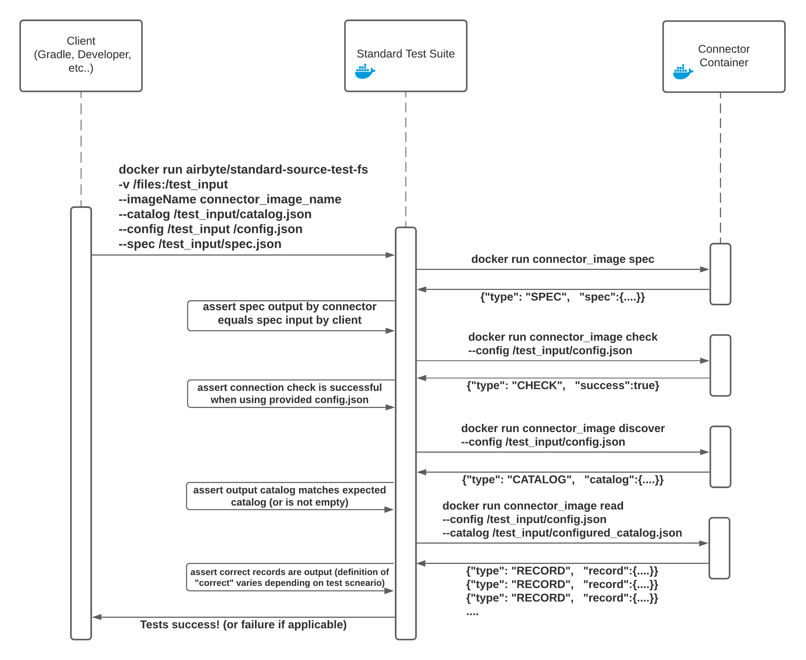

# Standard Tests (Legacy)

## Airbyte's Standard Tests (v1)

This document describes the old version Standard Tests, please check the latest version [here](../../connector-development/testing-connectors/README.md)
To ensure a minimum quality bar, Airbyte runs all connectors against the same set of integration tests \(sources & destinations have two different test suites\). Those tests ensure that each connector adheres to the [Airbyte Specification](../../understanding-airbyte/airbyte-protocol.md) and responds correctly to Airbyte commands when provided valid \(or invalid\) inputs.

### Architecture of standard tests



The Standard Test Suite runs its tests against the connector's Docker image. It takes as input the following:

* **The Connector's Docker image name**, so it can run tests against that image
* **A config file** containing necessary credentials/information to connect to the underlying data source/destination
* **A configured catalog** that will be used when running read/write operations against the connector
* **\(Optional\) A state file** for use in incremental sync test scenarios

The test suite then runs its test cases, which include:

* Using the input config file, running the `check` operation should succeed. 
* Using a made up/fake config file, running the `check` operation should fail. 
* Running a `read` operation should produce at least one record. 
* Running two consecutive full refresh reads should produce identical records. 

See all the test cases and their description in [Standard Source Tests](standard-source-tests.md).

### Setting up standard tests for your connector

Standard tests are typically run from a docker container. The default standard test runner is the File-based Standard Test suite, which gets its name because its inputs are passed as files via Docker volume mounts. This is the simplest way to run the standard test suite: the only requirements are that you place its input files inside your connector's directory, and to pass the paths to those input files as arguments to the Gradle plugin required to invoke it. This is setup by default inside the `build.gradle` file on all connectors generated from templates.

For reference, to configure the file-based standard test suite the only requirement is to add the following block in your connectors `build.gradle` file:

```text
apply plugin: 'airbyte-standard-source-test-file'
airbyteStandardSourceTestFile { 
  // all these paths must be inside your connector's directory
  configPath = "/path/to/config"
  specPath = "/path/to/spec"
  configuredCatalogPath = "/path/to/catalog"
}
```

These inputs are all described in the [Airbyte Specification](../../understanding-airbyte/airbyte-protocol.md) and will be used as follows:

* **Spec file** will be compared to the spec file output by the connector when the `spec` command is called. 
* **Config file** is expected to be a valid config file. It's expected that calling `check` with this config will succeed. 
* **Configured Catalog** read operations will be performed on all the streams found in this catalog. All sync modes supported for each stream will be tested. If any stream requires a user-defined cursor, this should be defined in this catalog file. \(If this sounds like gibberish, make sure to read about incremental sync\). 

### Dynamically managing inputs & resources used in standard tests

Since the inputs to standard tests are often static, the file-based runner is sufficient for most connectors. However, in some cases, you may need to run pre or post hooks to dynamically create or destroy resources for use in standard tests. For example, if we need to spin up a Redshift cluster to use in the test then tear it down afterwards, we need the ability to run code before and after the tests, as well as customize the Redshift cluster URL we pass to the standard tests. If you have need for this use case, please reach out to us via [Github](https://github.com/airbytehq/airbyte) or [Slack](https://slack.airbyte.io). We currently support it for Java & Python, and other languages can be made available upon request.

## Running Integration tests

The GitHub `master` and branch builds will build the core Airbyte infrastructure \(scheduler, ui, etc\) as well as the images for all connectors. Integration tests \(tests that run a connector's image against an external resource\) can be run one of three ways.

### 1. Local iteration

First, you can run the image locally. Connectors should have instructions in the connector's README on how to create or pull credentials necessary for the test. Also, during local development, there is usually a `main` entrypoint for Java integrations or `main_dev.py` for Python integrations that let you run your connector without containerization, which is fastest for iteration.

### 2. Requesting GitHub PR Integration Test Runs

:::caution

This option is not available to PRs from forks, so it is effectively limited to Airbyte employees.

:::

If you don't want to handle secrets, you're making a relatively minor change, or you want to ensure the connector's integration test will run remotely, you should request builds on GitHub. You can request an integration test run by creating a comment with a slash command.

Here are some example commands:

1. `/test connector=all` - Runs integration tests for all connectors in a single GitHub workflow. Some of our integration tests interact with rate-limited resources, so please use this judiciously.
2. `/test connector=source-sendgrid` - Runs integration tests for a single connector on the latest PR commit.
3. `/test connector=connectors/source-sendgrid` - Runs integration tests for a single connector on the latest PR commit.
4. `/test connector=source-sendgrid ref=master` - Runs integration tests for a single connector on a different branch. 
5. `/test connector=source-sendgrid ref=d5c53102` - Runs integration tests for a single connector on a specific commit.

A command dispatcher GitHub workflow will launch on comment submission. This dispatcher will add an :eyes: reaction to the comment when it starts processing. If there is an error dispatching your request, an error will be appended to your comment. If it launches the test run successfully, a :rocket: reaction will appear on your comment.

Once the integration test workflow launches, it will append a link to the workflow at the end of the comment. A success or failure response will also be added upon workflow completion.

Integration tests can also be manually requested by clicking "[Run workflow](https://github.com/airbytehq/airbyte/actions?query=workflow%3Aintegration-test)" and specifying the connector and GitHub ref.

### 3. Requesting GitHub PR publishing Docker Images

In order for users to reference the new versions of a connector, it needs to be published and available in the [dockerhub](https://hub.docker.com/r/airbyte/source-sendgrid/tags?page=1&ordering=last_updated) with the latest tag updated.

As seen previously, GitHub workflow can be triggered by comment submission. Publishing docker images to the dockerhub repository can also be submitted likewise:

Note that integration tests can be triggered with a slightly different syntax for arguments. This second set is required to distinguish between `connectors` and `bases` folders. Thus, it is also easier to switch between the `/test` and `/publish` commands:

* `/test connector=connectors/source-sendgrid` - Runs integration tests for a single connector on the latest PR commit.
* `/publish connector=connectors/source-sendgrid` - Publish the docker image if it doesn't exist for a single connector on the latest PR commit.

### 4. Automatically Run From `master`

Commits to `master` attempt to launch integration tests. Two workflows launch for each commit: one is a launcher for integration tests, the other is the core build \(the same as the default for PR and branch builds\).

Since some of our connectors use rate-limited external resources, we don't want to overload from multiple commits to master. If a certain threshold of `master` integration tests are running, the integration test launcher passes but does not launch any tests. This can manually be re-run if necessary. The `master` build also runs every few hours automatically, and will launch the integration tests at that time.
