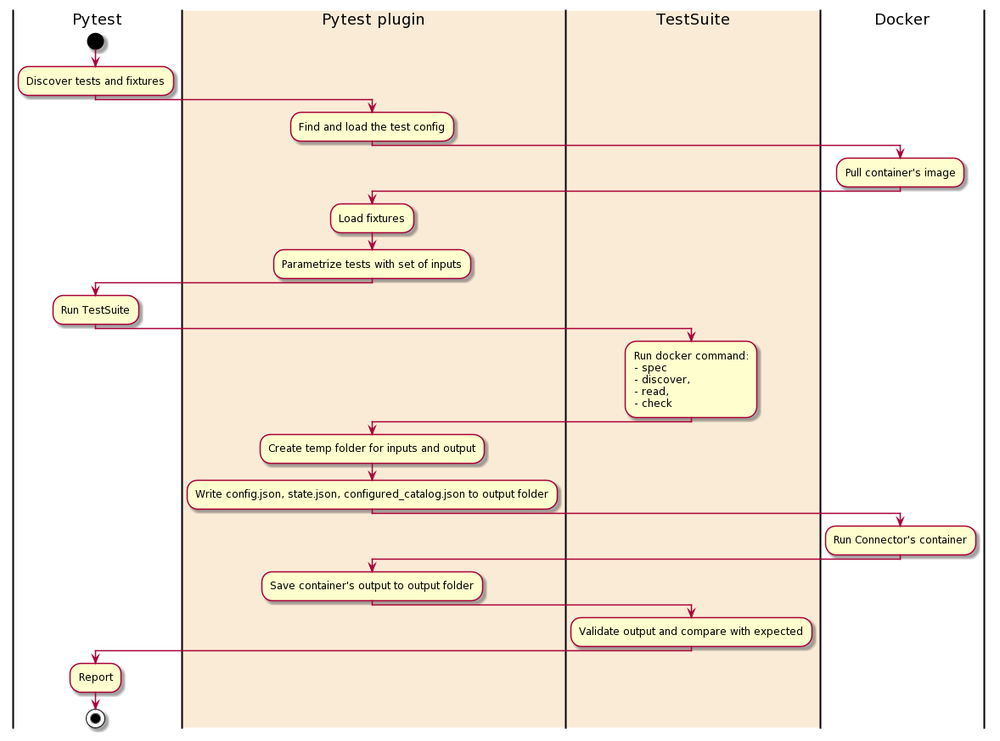

# Source Acceptance Tests Reference

To ensure a minimum quality bar, Airbyte runs all connectors against the same set of integration tests \(sources & destinations have two different test suites\). Those tests ensure that each connector adheres to the [Airbyte Specification](../../understanding-airbyte/airbyte-protocol.md) and responds correctly to Airbyte commands when provided valid \(or invalid\) inputs.

_Note: If you are looking for reference documentation for the deprecated first version of test suites, see_ [_Standard Tests \(Legacy\)_](https://github.com/airbytehq/airbyte/tree/e378d40236b6a34e1c1cb481c8952735ec687d88/docs/contributing-to-airbyte/building-new-connector/legacy-standard-source-tests.md)_._

## Architecture of standard tests

The Standard Test Suite runs its tests against the connector's Docker image. It takes as input the configuration file `acceptance-tests-config.yml`.



The Standard Test Suite use pytest as a test runner and was built as pytest plugin `source-acceptance-test`. This plugin adds a new configuration option `—acceptance-test-config` - it should points to the folder with `acceptance-tests-config.yml`.

Each test suite has a timeout and will fail if the limit is exceeded.

See all the test cases, their description, and inputs in [Source Acceptance Tests](https://github.com/airbytehq/airbyte/tree/e378d40236b6a34e1c1cb481c8952735ec687d88/docs/contributing-to-airbyte/building-new-connector/source-acceptance-tests.md).

## Setting up standard tests for your connector

Create `acceptance-test-config.yml`. In most cases, your connector already has this file in its root folder. Here is an example of the minimal `acceptance-test-config.yml`:

```yaml
connector_image: airbyte/source-some-connector:dev
tests:
  spec:
    - spec_path: "some_folder/spec.yaml"
```

Build your connector image if needed.

```text
docker build .
```

Run one of the two scripts in the root of the connector:

* `python -m pytest -p integration_tests.acceptance` - to run tests inside virtual environment
  * On test completion, a log will be outputted to the terminal verifying:
    * The connector the tests were ran for 
    * The git hash of the code used 
    * Whether the tests passed or failed 
      
    This is useful to provide in your PR as evidence of the acceptance tests passing locally.
    
    
* `./acceptance-test-docker.sh` - to run tests from a docker container

If the test fails you will see detail about the test and where to find its inputs and outputs to reproduce it. You can also debug failed tests by adding `—pdb —last-failed`:

```text
python -m pytest -p integration_tests.acceptance --pdb --last-failed
```

See other useful pytest options [here](https://docs.pytest.org/en/stable/usage.html)

## Dynamically managing inputs & resources used in standard tests

Since the inputs to standard tests are often static, the file-based runner is sufficient for most connectors. However, in some cases, you may need to run pre or post hooks to dynamically create or destroy resources for use in standard tests. For example, if we need to spin up a Redshift cluster to use in the test then tear it down afterwards, we need the ability to run code before and after the tests, as well as customize the Redshift cluster URL we pass to the standard tests. If you have need for this use case, please reach out to us via [Github](https://github.com/airbytehq/airbyte) or [Slack](https://slack.airbyte.io). We currently support it for Java & Python, and other languages can be made available upon request.

### Python

Create pytest yield-fixture with your custom setup/teardown code and place it in `integration_tests/acceptance.py`, Example of fixture that starts a docker container before tests and stops before exit:

```python
@pytest.fixture(scope="session", autouse=True)
def connector_setup():
    """ This fixture is a placeholder for external resources that acceptance test might require.
    """
    client = docker.from_env()
    container = client.containers.run("your/docker-image", detach=True)
    yield
    container.stop()
```

These tests are configurable via `acceptance-test-config.yml`. Each test has a number of inputs, you can provide multiple sets of inputs which will cause the same to run multiple times - one for each set of inputs.

Example of `acceptance-test-config.yml`:

```yaml
connector_image: string  # Docker image to test, for example 'airbyte/source-hubspot:0.1.0'
base_path: string  # Base path for all relative paths, optional, default - ./
tests:  # Tests configuration 
  spec: # list of the test inputs
  connection: # list of the test inputs
    - config_path: string  # set #1 of inputs
      status: string
    - config_path: string  # set #2 of inputs
      status: string
  # discovery:  # skip this test
  incremental: []  # skip this test as well
```

## Test Spec

Verify that a spec operation issued to the connector returns a valid spec.

| Input | Type | Default | Note                                                                                             |
| :--- | :--- | :--- |:-------------------------------------------------------------------------------------------------|
| `spec_path` | string | `secrets/spec.json` | Path to a YAML or JSON file representing the spec expected to be output by this connector |
| `backward_compatibility_tests_config.previous_connector_version` | string | `latest` | Previous connector version to use for backward compatibility tests (expects a version following semantic versioning). |
| `backward_compatibility_tests_config.disable_for_version` | string | None | Disable the backward compatibility test for a specific version (expects a version following semantic versioning). |
| `timeout_seconds` | int | 10 | Test execution timeout in seconds                                                                |

## Test Connection

Verify that a check operation issued to the connector with the input config file returns a successful response.

| Input | Type | Default | Note |
| :--- | :--- | :--- | :--- |
| `config_path` | string | `secrets/config.json` | Path to a JSON object representing a valid connector configuration |
| `status` | `succeed` `failed` `exception` |  | Indicate if connection check should succeed with provided config |
| `timeout_seconds` | int | 30 | Test execution timeout in seconds |

## Test Discovery

Verifies when a discover operation is run on the connector using the given config file, a valid catalog is produced by the connector.

| Input | Type | Default | Note |
| :--- | :--- | :--- | :--- |
| `config_path` | string | `secrets/config.json` | Path to a JSON object representing a valid connector configuration |
| `configured_catalog_path` | string | `integration_tests/configured_catalog.json` | Path to configured catalog |
| `timeout_seconds` | int | 30 | Test execution timeout in seconds |
| `backward_compatibility_tests_config.previous_connector_version` | string | `latest` | Previous connector version to use for backward compatibility tests (expects a version following semantic versioning). |
| `backward_compatibility_tests_config.disable_for_version` | string | None | Disable the backward compatibility test for a specific version (expects a version following semantic versioning). |

## Test Basic Read

Configuring all streams in the input catalog to full refresh mode verifies that a read operation produces some RECORD messages. Each stream should have some data, if you can't guarantee this for particular streams - add them to the `empty_streams` list.
Set `validate_data_points=True` if possible. This validation is going to be enabled by default and won't be configurable in future releases.

| Input                             | Type | Default | Note |
|:----------------------------------| :--- | :--- | :--- |
| `config_path`                     | string | `secrets/config.json` | Path to a JSON object representing a valid connector configuration |
| `configured_catalog_path`         | string | `integration_tests/configured_catalog.json` | Path to configured catalog |
| `empty_streams`                   | array | \[\] | List of streams that might be empty |
| `validate_schema`                 | boolean | True | Verify that structure and types of records matches the schema from discovery command |
| `validate_data_points`            | boolean | False | Validate that all fields in all streams contained at least one data point |
| `timeout_seconds`                 | int | 5\*60 | Test execution timeout in seconds |
| `expect_trace_message_on_failure` | boolean | True | Ensure that a trace message is emitted when the connector crashes |
| `expect_records`                  | object | None | Compare produced records with expected records, see details below |
| `expect_records.path`             | string |  | File with expected records |
| `expect_records.extra_fields`     | boolean | False | Allow output records to have other fields i.e: expected records are a subset |
| `expect_records.exact_order`      | boolean | False | Ensure  that records produced in exact same order |
| `expect_records.extra_records`    | boolean | True | Allow connector to produce extra records, but still enforce all records from the expected file to be produced |

`expect_records` is a nested configuration, if omitted - the part of the test responsible for record matching will be skipped. Due to the fact that we can't identify records without primary keys, only the following flag combinations are supported:

| extra\_fields | exact\_order | extra\_records |
| :--- | :--- | :--- |
| x | x |  |
|  | x | x |
|  | x |  |
|  |  | x |
|  |  |  |

### Schema format checking

If some field has [format](https://json-schema.org/understanding-json-schema/reference/string.html#format) attribute specified on its catalog json schema, Source Acceptance Testing framework performs checking against format. It support checking of all [builtin](https://json-schema.org/understanding-json-schema/reference/string.html#built-in-formats) jsonschema formats for draft 7 specification: email, hostnames, ip addresses, time, date and date-time formats.

Note: For date-time we are not checking against compliance against ISO8601 \(and RFC3339 as subset of it\). Since we are using specified format to set database column type on db normalization stage, value should be compliant to bigquery [timestamp](https://cloud.google.com/bigquery/docs/reference/standard-sql/data-types#timestamp_type) and SQL "timestamp with timezone" formats.

### Example of `expected_records.txt`:

In general, the expected\_records.json should contain the subset of output of the records of particular stream you need to test. The required fields are: `stream, data, emitted_at`

```javascript
{"stream": "my_stream", "data": {"field_1": "value0", "field_2": "value0", "field_3": null, "field_4": {"is_true": true}, "field_5": 123}, "emitted_at": 1626172757000}
{"stream": "my_stream", "data": {"field_1": "value1", "field_2": "value1", "field_3": null, "field_4": {"is_true": false}, "field_5": 456}, "emitted_at": 1626172757000}
{"stream": "my_stream", "data": {"field_1": "value2", "field_2": "value2", "field_3": null, "field_4": {"is_true": true}, "field_5": 678}, "emitted_at": 1626172757000}
{"stream": "my_stream", "data": {"field_1": "value3", "field_2": "value3", "field_3": null, "field_4": {"is_true": false}, "field_5": 91011}, "emitted_at": 1626172757000}
```

## Test Full Refresh sync

### TestSequentialReads

This test performs two read operations on all streams which support full refresh syncs. It then verifies that the RECORD messages output from both were identical or the former is a strict subset of the latter.

| Input | Type | Default | Note |
| :--- | :--- | :--- | :--- |
| `config_path` | string | `secrets/config.json` | Path to a JSON object representing a valid connector configuration |
| `configured_catalog_path` | string | `integration_tests/configured_catalog.json` | Path to configured catalog |
| `timeout_seconds` | int | 20\*60 | Test execution timeout in seconds |
| `ignored_fields` | dict | None |For each stream, list of fields path ignoring in sequential reads test|

## Test Incremental sync

### TestTwoSequentialReads

This test verifies that all streams in the input catalog which support incremental sync can do so correctly. It does this by running two read operations: the first takes the configured catalog and config provided to this test as input. It then verifies that the sync produced a non-zero number of `RECORD` and `STATE` messages. The second read takes the same catalog and config used in the first test, plus the last `STATE` message output by the first read operation as the input state file. It verifies that either no records are produced \(since we read all records in the first sync\) or all records that produced have cursor value greater or equal to cursor value from `STATE` message. This test is performed only for streams that support incremental. Streams that do not support incremental sync are ignored. If no streams in the input catalog support incremental sync, this test is skipped.

| Input                     | Type   | Default                                     | Note                                                                                                                                                                 |
|:--------------------------|:-------|:--------------------------------------------|:---------------------------------------------------------------------------------------------------------------------------------------------------------------------|
| `config_path`             | string | `secrets/config.json`                       | Path to a JSON object representing a valid connector configuration                                                                                                   |
| `configured_catalog_path` | string | `integration_tests/configured_catalog.json` | Path to configured catalog                                                                                                                                           |
| `cursor_paths`            | dict   | {}                                          | For each stream, the path of its cursor field in the output state messages. If omitted the path will be taken from the last piece of path from stream cursor\_field. |
| `timeout_seconds`         | int    | 20\*60                                      | Test execution timeout in seconds                                                                                                                                    |
| `threshold_days`          | int    | 0                                           | For date-based cursors, allow records to be emitted with a cursor value this number of days before the state value.                                                  |

### TestReadSequentialSlices

This test offers more comprehensive verification that all streams in the input catalog which support incremental syncs perform the sync correctly. It does so in two phases. The first phase uses the configured catalog and config provided to this test as input to make a request to the partner API and assemble the complete set of messages to be synced. It then verifies that the sync produced a non-zero number of `RECORD` and `STATE` messages. This set of messages is partitioned into batches of a `STATE` message followed by zero or more `RECORD` messages. For each batch of messages, the initial `STATE` message is used as input for a read operation to get records with respect to the cursor. The test then verifies that all of the `RECORDS` retrieved have a cursor value greater or equal to the cursor from the current `STATE` message. This test is performed only for streams that support incremental. Streams that do not support incremental sync are ignored. If no streams in the input catalog support incremental sync, this test is skipped.

| Input                     | Type   | Default                                     | Note                                                                                                                                                                 |
|:--------------------------|:-------|:--------------------------------------------|:---------------------------------------------------------------------------------------------------------------------------------------------------------------------|
| `config_path`                          | string | `secrets/config.json`                       | Path to a JSON object representing a valid connector configuration                                                                                                   |
| `configured_catalog_path`              | string | `integration_tests/configured_catalog.json` | Path to configured catalog                                                                                                                                           |
| `cursor_paths`                         | dict   | {}                                          | For each stream, the path of its cursor field in the output state messages. If omitted the path will be taken from the last piece of path from stream cursor\_field. |
| `timeout_seconds`                      | int    | 20\*60                                      | Test execution timeout in seconds                                                                                                                                    |
| `threshold_days`                       | int    | 0                                           | For date-based cursors, allow records to be emitted with a cursor value this number of days before the state value.                                                  |
| `skip_comprehensive_incremental_tests` | bool   | false                                       | For non-GA and in-development connectors, control whether the more comprehensive incremental tests will be skipped                                                 |

**Note that this test samples a fraction of stream slices across an incremental sync in order to reduce test duration and avoid spamming partner APIs**

### TestStateWithAbnormallyLargeValues

This test verifies that sync produces no records when run with the STATE with abnormally large values

| Input                     | Type   | Default | Note |                                                                           |
|:--------------------------|:-------|:--------|:-----|:--------------------------------------------------------------------------|
| `config_path`             | string | `secrets/config.json` | Path to a JSON object representing a valid connector configuration |
| `configured_catalog_path` | string | `integration_tests/configured_catalog.json` | Path to configured catalog                   |
| `future_state_path`       | string | None | Path to the state file with abnormally large cursor values                          |
| `timeout_seconds`         | int    | 20\*60 | Test execution timeout in seconds                                                 |
