# Building a Source Connector: The Hard Way

This tutorial walks you through building a simple Airbyte source without using any helpers to demonstrate the following concepts in Action:

* [The Airbyte Specification](../../understanding-airbyte/airbyte-protocol.md) and the interface implemented by a source connector
* [The AirbyteCatalog](../../understanding-airbyte/beginners-guide-to-catalog.md)
* [Packaging your connector](https://docs.airbyte.io/connector-development#1.-implement-and-package-the-connector)
* [Testing your connector](../testing-connectors/source-acceptance-tests-reference.md)

At the end of this tutorial, you will have a working source that you will be able to use in the Airbyte UI.

**This tutorial is meant for those interested in learning how the Airbyte Specification works in detail, not for creating production connectors**. We intentionally don't use helper libraries provided by Airbyte so that this tutorial is self-contained. If you were building a "real" source, you'll want to use the helper modules such as the [Connector Development Kit](https://github.com/airbytehq/airbyte/tree/master/airbyte-cdk/python/docs/tutorials).

This tutorial can be done entirely on your local workstation.

### Requirements

To run this tutorial, you'll need:

* Docker, Python, and Java with the versions listed in the [tech stack section](../../understanding-airbyte/tech-stack.md).
* The `requests` Python package installed via `pip install requests` \(or `pip3` if `pip` is linked to a Python2 installation on your system\)

**A note on running Python**: all the commands below assume that `python` points to a version of Python 3.9 or greater. Verify this by running

```bash
$ python --version
Python 3.9.11
```

On some systems, `python` points to a Python2 installation and `python3` points to Python3. If this is the case on your machine, substitute all `python` commands in this guide with `python3` . Otherwise, make sure to install Python 3 before beginning.

You need also to install `requests` python library:
````bash
pip install requests 
````

## Our connector: a stock ticker API

Our connector will output the daily price of a stock since a given date. We'll leverage the free [Polygon.io API](https://polygon.io/pricing) for this. We'll use Python to implement the connector because its syntax is accessible to most programmers, but the process described here can be applied to any language.

Here's the outline of what we'll do to build our connector:

1. Use the Airbyte connector template to bootstrap the connector package
2. Implement the methods required by the Airbyte Specification for our connector:
   1. `spec`: declares the user-provided credentials or configuration needed to run the connector
   2. `check`: tests if the connector can connect with the underlying data source  with the user-provided configuration
   3. `discover`: declares the different streams of data that this connector can output
   4. `read`: reads data from the underlying data source \(The stock ticker API\)
3. Package the connector in a Docker image
4. Test the connector using Airbyte's Standard Test Suite
5. Use the connector to create a new Connection and run a sync in Airbyte UI

Once we've completed the above steps, we will have built a functioning connector. Then, we'll add some optional functionality:

* Support [incremental sync](../../understanding-airbyte/connections/incremental-append.md)
* Add custom integration tests

### 1. Bootstrap the connector package

We'll start the process from the Airbyte repository root:

```bash
$ pwd
/Users/sherifnada/code/airbyte
```

First, let's create a new branch:

```bash
$ git checkout -b $(whoami)/source-connector-tutorial
Switched to a new branch 'sherifnada/source-connector-tutorial'
```

Airbyte provides a code generator which bootstraps the scaffolding for our connector. Let's use it by running:

```bash
$ cd airbyte-integrations/connector-templates/generator
$ ./generate.sh
```

We'll select the `generic` template and call the connector `stock-ticker-api`:


Note: The generic template is very bare. If you are planning on developing a Python source, we recommend using the `python` template. It provides some convenience code to help reduce boilerplate. This tutorial uses the bare-bones version because it makes it easier to see how all the pieces of a connector work together. You can find a walk through on how to build a Python connector here \(**coming soon**\).

Head to the connector directory and we should see the following files have been generated:

```bash
$ cd ../../connectors/source-stock-ticker-api
$ ls
Dockerfile                 README.md                  acceptance-test-config.yml acceptance-test-docker.sh  build.gradle
```

We'll use each of these files later. But first, let's write some code!

### 2. Implement the connector in line with the Airbyte Specification

In the connector package directory, create a single Python file `source.py` that will hold our implementation:

```bash
touch source.py
```

#### Implement the spec operation

At this stage in the tutorial, we just want to implement the `spec` operation as described in the [Airbyte Protocol](https://docs.airbyte.com/understanding-airbyte/airbyte-protocol/#spec). This involves a couple of steps:

1. Decide which inputs we need from the user in order to connect to the stock ticker API \(i.e: the connector's specification\) and encode it as a JSON file.
2. Identify when the connector has been invoked with the `spec` operation and return the specification as an `AirbyteMessage`

To contact the stock ticker API, we need two things:

1. Which stock ticker we're interested in
2. The API key to use when contacting the API \(you can obtain a free API token from [Polygon.io](https://polygon.io/dashboard/signup) free plan\)

For reference, the API docs we'll be using [can be found here](https://polygon.io/docs/stocks/get_v2_aggs_ticker__stocksticker__range__multiplier___timespan___from___to).

Let's create a [JSONSchema](http://json-schema.org/) file `spec.json` encoding these two requirements:

```javascript
{
  "documentationUrl": "https://polygon.io/docs/stocks/get_v2_aggs_ticker__stocksticker__range__multiplier___timespan___from___to",
  "connectionSpecification": {
    "$schema": "http://json-schema.org/draft-07/schema#",
    "type": "object",
    "required": ["stock_ticker", "api_key"],
    "properties": {
      "stock_ticker": {
        "type": "string",
        "title": "Stock Ticker",
        "description": "The stock ticker to track",
        "examples": ["AAPL", "TSLA", "AMZN"]
      },
      "api_key": {
        "title": "API Key",
        "type": "string",
        "description": "The Polygon.io Stocks API key to use to hit the API.",
        "airbyte_secret": true
      }
    }
  }
}
```

* `documentationUrl` is the URL that will appear in the UI for the user to gain more info about this connector. Typically this points to `docs.airbyte.io/integrations/sources/source-<connector_name>` but to keep things simple we won't show adding documentation
* `title` is the "human readable" title displayed in the UI. Without this field, The Stock Ticker field will have the title `stock_ticker` in the UI
* `description` will be shown in the Airbyte UI under each field to help the user understand it
* `airbyte_secret` used by Airbyte to determine if the field should be displayed as a password \(e.g: `********`\) in the UI and not readable from the API

We'll save this file in the root directory of our connector. Now we have the following files:

```bash
$ ls -1
Dockerfile
README.md
acceptance-test-config.yml
acceptance-test-docker.sh
build.gradle
source.py
spec.json
```

Now, let's edit `source.py` to detect if the program was invoked with the `spec` argument and if so, output the connector specification:

```python
# source.py
import argparse  # helps parse commandline arguments
import json
import sys
import os


def read_json(filepath):
    with open(filepath, "r") as f:
        return json.loads(f.read())


def log(message):
    log_json = {"type": "LOG", "log": message}
    print(json.dumps(log_json))


def spec():
    # Read the file named spec.json from the module directory as a JSON file
    current_script_directory = os.path.dirname(os.path.realpath(__file__))
    spec_path = os.path.join(current_script_directory, "spec.json")
    specification = read_json(spec_path)

    # form an Airbyte Message containing the spec and print it to stdout
    airbyte_message = {"type": "SPEC", "spec": specification}
    # json.dumps converts the JSON (Python dict) to a string
    print(json.dumps(airbyte_message))


def run(args):
    parent_parser = argparse.ArgumentParser(add_help=False)
    main_parser = argparse.ArgumentParser()
    subparsers = main_parser.add_subparsers(title="commands", dest="command")

    # Accept the spec command
    subparsers.add_parser("spec", help="outputs the json configuration specification", parents=[parent_parser])

    parsed_args = main_parser.parse_args(args)
    command = parsed_args.command

    if command == "spec":
        spec()
    else:
        # If we don't recognize the command log the problem and exit with an error code greater than 0 to indicate the process
        # had a failure
        log_error("Invalid command. Allowable commands: [spec]")
        sys.exit(1)

    # A zero exit code means the process successfully completed
    sys.exit(0)


def main():
    arguments = sys.argv[1:]
    run(arguments)


if __name__ == "__main__":
    main()
```

Some notes on the above code:

1. As described in the [specification](https://docs.airbyte.com/understanding-airbyte/airbyte-protocol/#key-takeaways), Airbyte connectors are CLIs which communicate via stdout, so the output of the command is simply a JSON string formatted according to the Airbyte Specification. So to "return" a value we use `print` to output the return value to stdout
2. All Airbyte commands can output log messages that take the form `{"type":"LOG", "log":"message"}`, so we create a helper method `log(message)` to allow logging
3. All Airbyte commands can output error messages that take the form `{"type":"TRACE", "trace": {"type": "ERROR", "emitted_at": current_time_in_ms, "error": {"message": error_message}}}}`, so we create a helper method `log_error(message)` to allow error messages


Now if we run `python source.py spec` we should see the specification printed out:

```bash
python source.py spec
{"type": "SPEC", "spec": {"documentationUrl": "https://polygon.io/docs/stocks/get_v2_aggs_ticker__stocksticker__range__multiplier___timespan___from___to", "connectionSpecification": {"$schema": "http://json-schema.org/draft-07/schema#", "type": "object", "required": ["stock_ticker", "api_key"], "properties": {"stock_ticker": {"type": "string", "title": "Stock Ticker", "description": "The stock ticker to track", "examples": ["AAPL", "TSLA", "AMZN"]}, "api_key": {"type": "string", "description": "The Polygon.io Stocks API key to use to hit the API.", "airbyte_secret": true}}}}}
```

We've implemented the first command! Three more and we'll have a working connector.

#### Implementing check connection

The second command to implement is the [check operation](https://docs.airbyte.com/understanding-airbyte/airbyte-protocol/#check) `check --config <config_name>`, which tells the user whether a config file they gave us is correct. In our case, "correct" means they input a valid stock ticker and a correct API key like we declare via the `spec` operation.

To achieve this, we'll:

1. Create valid and invalid configuration files to test the success and failure cases with our connector. We'll place config files in the `secrets/` directory which is gitignored everywhere in the Airbyte monorepo by default to avoid accidentally checking in API keys
2. Add a `check` method which calls the Polygon.io API to verify if the provided token & stock ticker are correct and output the correct airbyte message
3. Extend the argument parser to recognize the `check --config <config>` command and call the `check` method when the `check` command is invoked

Let's first add the configuration files:

```bash
$ mkdir secrets
$ echo '{"api_key": "put_your_key_here", "stock_ticker": "TSLA"}' > secrets/valid_config.json
$ echo '{"api_key": "not_a_real_key", "stock_ticker": "TSLA"}' > secrets/invalid_config.json
```

Make sure to add your actual API key instead of the placeholder value `<put_your_key_here>` when following the tutorial.

Then we'll add the `check_method`:

```python
import requests
from datetime import date
from datetime import datetime
from datetime import timedelta

def _call_api(ticker, token):
    today = date.today()
    to_day = today.strftime("%Y-%m-%d")
    from_day = (today - timedelta(days=7)).strftime("%Y-%m-%d")
    return requests.get(f"https://api.polygon.io/v2/aggs/ticker/{ticker}/range/1/day/{from_day}/{to_day}?sort=asc&limit=120&apiKey={token}")


def check(config):
    # Validate input configuration by attempting to get the daily closing prices of the input stock ticker
    response = _call_api(ticker=config["stock_ticker"], token=config["api_key"])
    if response.status_code == 200:
        result = {"status": "SUCCEEDED"}
    elif response.status_code == 403:
        # HTTP code 403 means authorization failed so the API key is incorrect
        result = {"status": "FAILED", "message": "API Key is incorrect."}
    else:
        result = {"status": "FAILED", "message": "Input configuration is incorrect. Please verify the input stock ticker and API key."}

    output_message = {"type": "CONNECTION_STATUS", "connectionStatus": result}
    print(json.dumps(output_message))
```

Lastly we'll extend the `run` method to accept the `check` command and call the `check` method. First we'll add a helper method for reading input:

```python
def get_input_file_path(path):
    if os.path.isabs(path):
        return path
    else:
        return os.path.join(os.getcwd(), path)
```

In Airbyte, the contract for input files is that they will be available in the current working directory if they are not provided as an absolute path. This method helps us achieve that.

We also need to extend the arguments parser by adding the following two blocks to the `run` method:

```python
    # Accept the check command
    check_parser = subparsers.add_parser("check", help="checks the config used to connect", parents=[parent_parser])
    required_check_parser = check_parser.add_argument_group("required named arguments")
    required_check_parser.add_argument("--config", type=str, required=True, help="path to the json configuration file")
```

and

```python
elif command == "check":
    config_file_path = get_input_file_path(parsed_args.config)
    config = read_json(config_file_path)
    check(config)
```

Then we need to update our list of available commands:

```python
        log("Invalid command. Allowable commands: [spec, check]")
```

This results in the following `run` method.

```python
def run(args):
    parent_parser = argparse.ArgumentParser(add_help=False)
    main_parser = argparse.ArgumentParser()
    subparsers = main_parser.add_subparsers(title="commands", dest="command")

    # Accept the spec command
    subparsers.add_parser("spec", help="outputs the json configuration specification", parents=[parent_parser])

    # Accept the check command
    check_parser = subparsers.add_parser("check", help="checks the config used to connect", parents=[parent_parser])
    required_check_parser = check_parser.add_argument_group("required named arguments")
    required_check_parser.add_argument("--config", type=str, required=True, help="path to the json configuration file")

    parsed_args = main_parser.parse_args(args)
    command = parsed_args.command

    if command == "spec":
        spec()
    elif command == "check":
        config_file_path = get_input_file_path(parsed_args.config)
        config = read_json(config_file_path)
        check(config)
    else:
        # If we don't recognize the command log the problem and exit with an error code greater than 0 to indicate the process
        # had a failure
        log_error("Invalid command. Allowable commands: [spec, check]")
        sys.exit(1)

    # A zero exit code means the process successfully completed
    sys.exit(0)
```

and that should be it.

Let's test our new method:

```bash
$ python source.py check --config secrets/valid_config.json
{'type': 'CONNECTION_STATUS', 'connectionStatus': {'status': 'SUCCEEDED'}}
$ python source.py check --config secrets/invalid_config.json
{'type': 'CONNECTION_STATUS', 'connectionStatus': {'status': 'FAILED', 'message': 'API Key is incorrect.'}}
```

Our connector is able to detect valid and invalid configs correctly. Two methods down, two more to go!

#### Implementing Discover

The `discover` command outputs a Catalog, a struct that declares the Streams and Fields \(Airbyte's equivalents of tables and columns\) output by the connector. It also includes metadata around which features a connector supports \(e.g. which sync modes\). In other words it describes what data is available in the source. If you'd like to read a bit more about this concept check out our [Beginner's Guide to the Airbyte Catalog](../../understanding-airbyte/beginners-guide-to-catalog.md) or for a more detailed treatment read the [Airbyte Specification](../../understanding-airbyte/airbyte-protocol.md).

The data output by this connector will be structured in a very simple way. This connector outputs records belonging to exactly one Stream \(table\). Each record contains three Fields \(columns\): `date`, `price`, and `stock_ticker`, corresponding to the price of a stock on a given day.

To implement `discover`, we'll:

1. Add a method `discover` in `source.py` which outputs the Catalog. To better understand what a catalog is, check out our [Beginner's Guide to the AirbyteCatalog](../../understanding-airbyte/beginners-guide-to-catalog.md)
2. Extend the arguments parser to use detect the `discover --config <config_path>` command and call the `discover` method

Let's implement `discover` by adding the following in `source.py`:

```python
def discover():
    catalog = {
        "streams": [{
            "name": "stock_prices",
            "supported_sync_modes": ["full_refresh"],
            "json_schema": {
                "properties": {
                    "date": {
                        "type": "string"
                    },
                    "price": {
                        "type": "number"
                    },
                    "stock_ticker": {
                        "type": "string"
                    }
                }
            }
        }]
    }
    airbyte_message = {"type": "CATALOG", "catalog": catalog}
    print(json.dumps(airbyte_message))
```

Note that we describe the schema of the output stream using [JSONSchema](http://json-schema.org/).

Then we'll extend the arguments parser by adding the following blocks to the `run` method:

```python
# Accept the discover command
discover_parser = subparsers.add_parser("discover", help="outputs a catalog describing the source's schema", parents=[parent_parser])
required_discover_parser = discover_parser.add_argument_group("required named arguments")
required_discover_parser.add_argument("--config", type=str, required=True, help="path to the json configuration file")
```

and

```python
elif command == "discover":
    discover()
```

We need to update our list of available commands:

```python
        log("Invalid command. Allowable commands: [spec, check, discover]")
```

You may be wondering why `config` is a required input to `discover` if it's not used. This is done for consistency: the Airbyte Specification requires `--config` as an input to `discover` because many sources require it \(e.g: to discover the tables available in a Postgres database, you must supply a password\). So instead of guessing whether the flag is required depending on the connector, we always assume it is required, and the connector can choose whether to use it.

The full run method is now below:

```python
def run(args):
    parent_parser = argparse.ArgumentParser(add_help=False)
    main_parser = argparse.ArgumentParser()
    subparsers = main_parser.add_subparsers(title="commands", dest="command")

    # Accept the spec command
    subparsers.add_parser("spec", help="outputs the json configuration specification", parents=[parent_parser])

    # Accept the check command
    check_parser = subparsers.add_parser("check", help="checks the config used to connect", parents=[parent_parser])
    required_check_parser = check_parser.add_argument_group("required named arguments")
    required_check_parser.add_argument("--config", type=str, required=True, help="path to the json configuration file")

    # Accept the discover command
    discover_parser = subparsers.add_parser("discover", help="outputs a catalog describing the source's schema", parents=[parent_parser])
    required_discover_parser = discover_parser.add_argument_group("required named arguments")
    required_discover_parser.add_argument("--config", type=str, required=True, help="path to the json configuration file")

    parsed_args = main_parser.parse_args(args)
    command = parsed_args.command

    if command == "spec":
        spec()
    elif command == "check":
        config_file_path = get_input_file_path(parsed_args.config)
        config = read_json(config_file_path)
        check(config)
    elif command == "discover":
        discover()
    else:
        # If we don't recognize the command log the problem and exit with an error code greater than 0 to indicate the process
        # had a failure
        log_error("Invalid command. Allowable commands: [spec, check, discover]")
        sys.exit(1)

    # A zero exit code means the process successfully completed
    sys.exit(0)
```

Let's test our new command:

```bash
$ python source.py discover --config secrets/valid_config.json
{"type": "CATALOG", "catalog": {"streams": [{"name": "stock_prices", "supported_sync_modes": ["full_refresh"], "json_schema": {"properties": {"date": {"type": "string"}, "price": {"type": "number"}, "stock_ticker": {"type": "string"}}}}]}}
```

With that, we're done implementing the `discover` command.

#### Implementing the read operation

We've done a lot so far, but a connector ultimately exists to read data! This is where the [`read` command](https://docs.airbyte.com/understanding-airbyte/airbyte-protocol/#read) comes in. The format of the command is:

```bash
python source.py read --config <config_file_path> --catalog <configured_catalog.json> [--state <state_file_path>]
```

Each of these are described in the Airbyte Specification in detail, but we'll give a quick description of the two options we haven't seen so far:

* `--catalog` points to a Configured Catalog. The Configured Catalog contains the contents for the Catalog \(remember the Catalog we output from discover?\). It also contains some configuration information that describes how the data will by replicated. For example, we had `supported_sync_modes` in the Catalog. In the Configured Catalog, we select which of the `supported_sync_modes` we want to use by specifying the `sync_mode` field. \(This is the most complicated concept when working Airbyte, so if it is still not making sense that's okay for now. If you're just dying to understand how the Configured Catalog works checkout the [Beginner's Guide to the Airbyte Catalog](../../understanding-airbyte/beginners-guide-to-catalog.md)\)
* `--state` points to a state file. The state file is only relevant when some Streams are synced with the sync mode `incremental`, so we'll cover the state file in more detail in the incremental section below

For our connector, the contents of those two files should be very unsurprising: the connector only supports one Stream, `stock_prices`, so we'd expect the input catalog to contain that stream configured to sync in full refresh. Since our connector doesn't support incremental sync \(yet!\) we'll ignore the state option for now.

To read data in our connector, we'll:

1. Create a configured catalog which tells our connector that we want to sync the `stock_prices` stream
2. Implement a method `read` in `source.py`. For now we'll always read the last 7 days of a stock price's data
3. Extend the arguments parser to recognize the `read` command and its arguments

First, let's create a configured catalog `fullrefresh_configured_catalog.json` to use as test input for the read operation:

```javascript
{
    "streams": [
        {
            "stream": {
                "name": "stock_prices",
                "supported_sync_modes": [
                    "full_refresh"
                ],
                "json_schema": {
                    "properties": {
                        "date": {
                            "type": "string"
                        },
                        "price": {
                            "type": "number"
                        },
                        "stock_ticker": {
                            "type": "string"
                        }
                    }
                }
            },
            "sync_mode": "full_refresh",
            "destination_sync_mode": "overwrite"
        }
    ]
}

```

Then we'll define the `read` method in `source.py`:

```python
def log_error(error_message):
    current_time_in_ms = int(datetime.now().timestamp()) * 1000
    log_json = {"type": "TRACE", "trace": {"type": "ERROR", "emitted_at": current_time_in_ms, "error": {"message": error_message}}}
    print(json.dumps(log_json))

   
def read(config, catalog):
    # Assert required configuration was provided
    if "api_key" not in config or "stock_ticker" not in config:
        log_error("Input config must contain the properties 'api_key' and 'stock_ticker'")
        sys.exit(1)

    # Find the stock_prices stream if it is present in the input catalog
    stock_prices_stream = None
    for configured_stream in catalog["streams"]:
        if configured_stream["stream"]["name"] == "stock_prices":
            stock_prices_stream = configured_stream

    if stock_prices_stream is None:
        log_error("No stream selected.")
        return

    # We only support full_refresh at the moment, so verify the user didn't ask for another sync mode
    if stock_prices_stream["sync_mode"] != "full_refresh":
        log_error("This connector only supports full refresh syncs! (for now)")
        sys.exit(1)

    # If we've made it this far, all the configuration is good and we can pull the last 7 days of market data
    response = _call_api(ticker=config["stock_ticker"], token = config["api_key"])
    if response.status_code != 200:
        # In a real scenario we'd handle this error better :)
        log_error("Failure occurred when calling Polygon.io API")
        sys.exit(1)
    else:
        # Stock prices are returned sorted by date in ascending order
        # We want to output them one by one as AirbyteMessages
        results = response.json()["results"]
        for result in results:
            data = {"date": date.fromtimestamp(result["t"]/1000).isoformat(), "stock_ticker": config["stock_ticker"], "price": result["c"]}
            record = {"stream": "stock_prices", "data": data, "emitted_at": int(datetime.now().timestamp()) * 1000}
            output_message = {"type": "RECORD", "record": record}
            print(json.dumps(output_message))
```

Note we've added a `log_error()` function to simplify formatting error messages from within connector functions as [`AirbyteTraceMessage`](https://docs.airbyte.com/understanding-airbyte/airbyte-protocol#airbytetracemessage)s, specifically `AirbyteErrorTraceMessage`s.

After doing some input validation, the code above calls the API to obtain daily prices for the input stock ticker, then outputs the prices. As always, our output is formatted according to the Airbyte Specification. Let's update our args parser with the following blocks:

```python
# Accept the read command
read_parser = subparsers.add_parser("read", help="reads the source and outputs messages to STDOUT", parents=[parent_parser])
read_parser.add_argument("--state", type=str, required=False, help="path to the json-encoded state file")
required_read_parser = read_parser.add_argument_group("required named arguments")
required_read_parser.add_argument("--config", type=str, required=True, help="path to the json configuration file")
required_read_parser.add_argument(
    "--catalog", type=str, required=True, help="path to the catalog used to determine which data to read"
)
```

and:

```python
elif command == "read":
    config = read_json(get_input_file_path(parsed_args.config))
    configured_catalog = read_json(get_input_file_path(parsed_args.catalog))
    read(config, configured_catalog)
```

and: 

```python
        log_error("Invalid command. Allowable commands: [spec, check, discover, read]")
```

this yields the following `run` method:

```python
def run(args):
    parent_parser = argparse.ArgumentParser(add_help=False)
    main_parser = argparse.ArgumentParser()
    subparsers = main_parser.add_subparsers(title="commands", dest="command")

    # Accept the spec command
    subparsers.add_parser("spec", help="outputs the json configuration specification", parents=[parent_parser])

    # Accept the check command
    check_parser = subparsers.add_parser("check", help="checks the config used to connect", parents=[parent_parser])
    required_check_parser = check_parser.add_argument_group("required named arguments")
    required_check_parser.add_argument("--config", type=str, required=True, help="path to the json configuration file")

    # Accept the discover command
    discover_parser = subparsers.add_parser("discover", help="outputs a catalog describing the source's schema", parents=[parent_parser])
    required_discover_parser = discover_parser.add_argument_group("required named arguments")
    required_discover_parser.add_argument("--config", type=str, required=True, help="path to the json configuration file")

    # Accept the read command
    read_parser = subparsers.add_parser("read", help="reads the source and outputs messages to STDOUT", parents=[parent_parser])
    read_parser.add_argument("--state", type=str, required=False, help="path to the json-encoded state file")
    required_read_parser = read_parser.add_argument_group("required named arguments")
    required_read_parser.add_argument("--config", type=str, required=True, help="path to the json configuration file")
    required_read_parser.add_argument(
        "--catalog", type=str, required=True, help="path to the catalog used to determine which data to read"
    )

    parsed_args = main_parser.parse_args(args)
    command = parsed_args.command

    if command == "spec":
        spec()
    elif command == "check":
        config_file_path = get_input_file_path(parsed_args.config)
        config = read_json(config_file_path)
        check(config)
    elif command == "discover":
        discover()
    elif command == "read":
        config = read_json(get_input_file_path(parsed_args.config))
        configured_catalog = read_json(get_input_file_path(parsed_args.catalog))
        read(config, configured_catalog)
    else:
        # If we don't recognize the command log the problem and exit with an error code greater than 0 to indicate the process
        # had a failure
        log_error("Invalid command. Allowable commands: [spec, check, discover, read]")
        sys.exit(1)

    # A zero exit code means the process successfully completed
    sys.exit(0)
```

Let's test out our new command:

```bash
$ python source.py read --config secrets/valid_config.json --catalog fullrefresh_configured_catalog.json
{'type': 'RECORD', 'record': {'stream': 'stock_prices', 'data': {'date': '2020-12-15', 'stock_ticker': 'TSLA', 'price': 633.25}, 'emitted_at': 1608626365000}}
{'type': 'RECORD', 'record': {'stream': 'stock_prices', 'data': {'date': '2020-12-16', 'stock_ticker': 'TSLA', 'price': 622.77}, 'emitted_at': 1608626365000}}
{'type': 'RECORD', 'record': {'stream': 'stock_prices', 'data': {'date': '2020-12-17', 'stock_ticker': 'TSLA', 'price': 655.9}, 'emitted_at': 1608626365000}}
{'type': 'RECORD', 'record': {'stream': 'stock_prices', 'data': {'date': '2020-12-18', 'stock_ticker': 'TSLA', 'price': 695}, 'emitted_at': 1608626365000}}
{'type': 'RECORD', 'record': {'stream': 'stock_prices', 'data': {'date': '2020-12-21', 'stock_ticker': 'TSLA', 'price': 649.86}, 'emitted_at': 1608626365000}}
```

With this method, we now have a fully functioning connector! Let's pat ourselves on the back for getting there.

For reference, the full `source.py` file now looks like this:

```python
# MIT License
#
# Copyright (c) 2020 Airbyte
#
# Permission is hereby granted, free of charge, to any person obtaining a copy
# of this software and associated documentation files (the "Software"), to deal
# in the Software without restriction, including without limitation the rights
# to use, copy, modify, merge, publish, distribute, sublicense, and/or sell
# copies of the Software, and to permit persons to whom the Software is
# furnished to do so, subject to the following conditions:
#
# The above copyright notice and this permission notice shall be included in all
# copies or substantial portions of the Software.
#
# THE SOFTWARE IS PROVIDED "AS IS", WITHOUT WARRANTY OF ANY KIND, EXPRESS OR
# IMPLIED, INCLUDING BUT NOT LIMITED TO THE WARRANTIES OF MERCHANTABILITY,
# FITNESS FOR A PARTICULAR PURPOSE AND NONINFRINGEMENT. IN NO EVENT SHALL THE
# AUTHORS OR COPYRIGHT HOLDERS BE LIABLE FOR ANY CLAIM, DAMAGES OR OTHER
# LIABILITY, WHETHER IN AN ACTION OF CONTRACT, TORT OR OTHERWISE, ARISING FROM,
# OUT OF OR IN CONNECTION WITH THE SOFTWARE OR THE USE OR OTHER DEALINGS IN THE
# SOFTWARE.


import argparse  # helps parse commandline arguments
import json
import sys
import os
import requests
from datetime import date
from datetime import datetime
from datetime import timedelta

def read(config, catalog):
    # Assert required configuration was provided
    if "api_key" not in config or "stock_ticker" not in config:
        log_error("Input config must contain the properties 'api_key' and 'stock_ticker'")
        sys.exit(1)

    # Find the stock_prices stream if it is present in the input catalog
    stock_prices_stream = None
    for configured_stream in catalog["streams"]:
        if configured_stream["stream"]["name"] == "stock_prices":
            stock_prices_stream = configured_stream

    if stock_prices_stream is None:
        log_error("No streams selected")
        return

    # We only support full_refresh at the moment, so verify the user didn't ask for another sync mode
    if stock_prices_stream["sync_mode"] != "full_refresh":
        log_error("This connector only supports full refresh syncs! (for now)")
        sys.exit(1)

    # If we've made it this far, all the configuration is good and we can pull the last 7 days of market data
    response = _call_api(ticker=config["stock_ticker"], token = config["api_key"])
    if response.status_code != 200:
        # In a real scenario we'd handle this error better :)
        log_error("Failure occurred when calling Polygon.io API")
        sys.exit(1)
    else:
        # Stock prices are returned sorted by date in ascending order
        # We want to output them one by one as AirbyteMessages
        results = response.json()["results"]
        for result in results:
            data = {"date": date.fromtimestamp(result["t"]/1000).isoformat(), "stock_ticker": config["stock_ticker"], "price": result["c"]}
            record = {"stream": "stock_prices", "data": data, "emitted_at": int(datetime.now().timestamp()) * 1000}
            output_message = {"type": "RECORD", "record": record}
            print(json.dumps(output_message))


def read_json(filepath):
    with open(filepath, "r") as f:
        return json.loads(f.read())


def _call_api(ticker, token):
    today = date.today()
    to_day = today.strftime("%Y-%m-%d")
    from_day = (today - timedelta(days=7)).strftime("%Y-%m-%d")
    return requests.get(f"https://api.polygon.io/v2/aggs/ticker/{ticker}/range/1/day/{from_day}/{to_day}?sort=asc&limit=120&apiKey={token}")


def check(config):
    # Assert required configuration was provided
    if "api_key" not in config or "stock_ticker" not in config:
        log_error("Input config must contain the properties 'api_key' and 'stock_ticker'")
        sys.exit(1)
    else:
        # Validate input configuration by attempting to get the daily closing prices of the input stock ticker
        response = _call_api(ticker=config["stock_ticker"], token=config["api_key"])
        if response.status_code == 200:
            result = {"status": "SUCCEEDED"}
        elif response.status_code == 403:
            # HTTP code 403 means authorization failed so the API key is incorrect
            result = {"status": "FAILED", "message": "API Key is incorrect."}
        else:
            # Consider any other code a "generic" failure and tell the user to make sure their config is correct.
            result = {"status": "FAILED", "message": "Input configuration is incorrect. Please verify the input stock ticker and API key."}

        # Format the result of the check operation according to the Airbyte Specification
        output_message = {"type": "CONNECTION_STATUS", "connectionStatus": result}
        print(json.dumps(output_message))


def log(message):
    log_json = {"type": "LOG", "log": message}
    print(json.dumps(log_json))


def log_error(error_message):
   current_time_in_ms = int(datetime.now().timestamp()) * 1000
   log_json = {"type": "TRACE", "trace": {"type": "ERROR", "emitted_at": current_time_in_ms, "error": {"message": error_message}}}
   print(json.dumps(log_json))


def discover():
    catalog = {
        "streams": [{
            "name": "stock_prices",
            "supported_sync_modes": ["full_refresh"],
            "json_schema": {
                "properties": {
                    "date": {
                        "type": "string"
                    },
                    "price": {
                        "type": "number"
                    },
                    "stock_ticker": {
                        "type": "string"
                    }
                }
            }
        }]
    }
    airbyte_message = {"type": "CATALOG", "catalog": catalog}
    print(json.dumps(airbyte_message))


def get_input_file_path(path):
    if os.path.isabs(path):
        return path
    else:
        return os.path.join(os.getcwd(), path)


def spec():
    # Read the file named spec.json from the module directory as a JSON file
    current_script_directory = os.path.dirname(os.path.realpath(__file__))
    spec_path = os.path.join(current_script_directory, "spec.json")
    specification = read_json(spec_path)

    # form an Airbyte Message containing the spec and print it to stdout
    airbyte_message = {"type": "SPEC", "spec": specification}
    # json.dumps converts the JSON (Python dict) to a string
    print(json.dumps(airbyte_message))


def run(args):
    parent_parser = argparse.ArgumentParser(add_help=False)
    main_parser = argparse.ArgumentParser()
    subparsers = main_parser.add_subparsers(title="commands", dest="command")

    # Accept the spec command
    subparsers.add_parser("spec", help="outputs the json configuration specification", parents=[parent_parser])

    # Accept the check command
    check_parser = subparsers.add_parser("check", help="checks the config used to connect", parents=[parent_parser])
    required_check_parser = check_parser.add_argument_group("required named arguments")
    required_check_parser.add_argument("--config", type=str, required=True, help="path to the json configuration file")

    # Accept the discover command
    discover_parser = subparsers.add_parser("discover", help="outputs a catalog describing the source's schema", parents=[parent_parser])
    required_discover_parser = discover_parser.add_argument_group("required named arguments")
    required_discover_parser.add_argument("--config", type=str, required=True, help="path to the json configuration file")

    # Accept the read command
    read_parser = subparsers.add_parser("read", help="reads the source and outputs messages to STDOUT", parents=[parent_parser])
    read_parser.add_argument("--state", type=str, required=False, help="path to the json-encoded state file")
    required_read_parser = read_parser.add_argument_group("required named arguments")
    required_read_parser.add_argument("--config", type=str, required=True, help="path to the json configuration file")
    required_read_parser.add_argument(
        "--catalog", type=str, required=True, help="path to the catalog used to determine which data to read"
    )

    parsed_args = main_parser.parse_args(args)
    command = parsed_args.command

    if command == "spec":
        spec()
    elif command == "check":
        config_file_path = get_input_file_path(parsed_args.config)
        config = read_json(config_file_path)
        check(config)
    elif command == "discover":
        discover()
    elif command == "read":
        config = read_json(get_input_file_path(parsed_args.config))
        configured_catalog = read_json(get_input_file_path(parsed_args.catalog))
        read(config, configured_catalog)
    else:
        # If we don't recognize the command log the problem and exit with an error code greater than 0 to indicate the process
        # had a failure
        log_error("Invalid command. Allowable commands: [spec, check, discover, read]")
        sys.exit(1)

    # A zero exit code means the process successfully completed
    sys.exit(0)


def main():
    arguments = sys.argv[1:]
    run(arguments)


if __name__ == "__main__":
    main()
```

A full connector in less than 200 lines of code. Not bad! We're now ready to package & test our connector then use it in the Airbyte UI.

### 3. Package the connector in a Docker image

Our connector is very lightweight, so the Dockerfile needed to run it is very light as well. We edit the autogenerated `Dockerfile` so that its contents are as followed:

```Dockerfile
FROM python:3.9-slim

# We change to a directory unique to us
WORKDIR /airbyte/integration_code
# Install any needed Python dependencies
RUN pip install requests
# Copy source files
COPY source.py .
COPY spec.json .

# When this container is invoked, append the input argemnts to `python source.py`
ENTRYPOINT ["python", "/airbyte/integration_code/source.py"]

# Airbyte's build system uses these labels to know what to name and tag the docker images produced by this Dockerfile.
LABEL io.airbyte.name=airbyte/source-stock-ticker-api
LABEL io.airbyte.version=0.1.0

# In order to launch a source on Kubernetes in a pod, we need to be able to wrap the entrypoint.
# The source connector must specify its entrypoint in the AIRBYTE_ENTRYPOINT variable.
ENV AIRBYTE_ENTRYPOINT='python /airbyte/integration_code/source.py'
```

Once we save the `Dockerfile`, we can build the image by running:

```bash
docker build . -t airbyte/source-stock-ticker-api:dev
```

Then we can run the image using:

```bash
docker run airbyte/source-stock-ticker-api:dev
```

To run any of our commands, we'll need to mount all the inputs into the Docker container first, then refer to their _mounted_ paths when invoking the connector. This allows the connector to access your secrets without having to build them into the container. For example, we'd run `check` or `read` as follows:

```bash
$ docker run airbyte/source-stock-ticker-api:dev spec
{"type": "SPEC", "spec": {"documentationUrl": "https://polygon.io/docs/stocks/get_v2_aggs_ticker__stocksticker__range__multiplier___timespan___from___to", "connectionSpecification": {"$schema": "http://json-schema.org/draft-07/schema#", "type": "object", "required": ["stock_ticker", "api_key"], "properties": {"stock_ticker": {"type": "string", "title": "Stock Ticker", "description": "The stock ticker to track", "examples": ["AAPL", "TSLA", "AMZN"]}, "api_key": {"type": "string", "description": "The Polygon.io Stocks API key to use to hit the API.", "airbyte_secret": true}}}}}

$ docker run -v $(pwd)/secrets/valid_config.json:/data/config.json airbyte/source-stock-ticker-api:dev check --config /data/config.json
{'type': 'CONNECTION_STATUS', 'connectionStatus': {'status': 'SUCCEEDED'}}

$ docker run -v $(pwd)/secrets/valid_config.json:/data/config.json airbyte/source-stock-ticker-api:dev discover --config /data/config.json
{"type": "CATALOG", "catalog": {"streams": [{"name": "stock_prices", "supported_sync_modes": ["full_refresh"], "json_schema": {"properties": {"date": {"type": "string"}, "price": {"type": "number"}, "stock_ticker": {"type": "string"}}}}]}}

$ docker run -v $(pwd)/secrets/valid_config.json:/data/config.json -v $(pwd)/fullrefresh_configured_catalog.json:/data/fullrefresh_configured_catalog.json airbyte/source-stock-ticker-api:dev read --config /data/config.json --catalog /data/fullrefresh_configured_catalog.json
{'type': 'RECORD', 'record': {'stream': 'stock_prices', 'data': {'date': '2020-12-15', 'stock_ticker': 'TSLA', 'price': 633.25}, 'emitted_at': 1608628424000}}
{'type': 'RECORD', 'record': {'stream': 'stock_prices', 'data': {'date': '2020-12-16', 'stock_ticker': 'TSLA', 'price': 622.77}, 'emitted_at': 1608628424000}}
{'type': 'RECORD', 'record': {'stream': 'stock_prices', 'data': {'date': '2020-12-17', 'stock_ticker': 'TSLA', 'price': 655.9}, 'emitted_at': 1608628424000}}
{'type': 'RECORD', 'record': {'stream': 'stock_prices', 'data': {'date': '2020-12-18', 'stock_ticker': 'TSLA', 'price': 695}, 'emitted_at': 1608628424000}}
{'type': 'RECORD', 'record': {'stream': 'stock_prices', 'data': {'date': '2020-12-21', 'stock_ticker': 'TSLA', 'price': 649.86}, 'emitted_at': 1608628424000}}
```

and with that, we've packaged our connector in a functioning Docker image. The last requirement before calling this connector finished is to pass the [Airbyte Source Acceptance Test suite](../testing-connectors/source-acceptance-tests-reference.md).

### 4. Test the connector

The minimum requirement for testing your connector is to pass the [Source Acceptance Test (SAT)](https://docs.airbyte.com/connector-development/testing-connectors/source-acceptance-tests-reference) suite. SAT is a blackbox test suite containing a number of tests that validate your connector behaves as intended by the Airbyte Specification. You're encouraged to add custom test cases for your connector where it makes sense to do so e.g: to test edge cases that are not covered by the standard suite. But at the very least, you must pass Airbyte's SATs suite.

The code generator should have already generated a YAML file which configures the test suite. In order to run it, modify the `acceptance-test-config.yaml` file to look like this: 


```yaml
# See [Source Acceptance Tests](https://docs.airbyte.io/connector-development/testing-connectors/source-acceptance-tests-reference)
# for more information about how to configure these tests
connector_image: airbyte/source-stock-ticker-api:dev
acceptance_tests:
  basic_read:
    tests:
    - config_path: secrets/valid_config.json
      configured_catalog_path: fullrefresh_configured_catalog.json
      empty_streams: []
  connection:
    tests:
    - config_path: secrets/valid_config.json
      status: succeed
    - config_path: secrets/invalid_config.json
      status: failed
  discovery:
    tests:
    - config_path: secrets/valid_config.json
  full_refresh:
    tests:
    - config_path: secrets/valid_config.json
      configured_catalog_path: fullrefresh_configured_catalog.json
  spec:
    tests:
    - config_path: secrets/valid_config.json
      spec_path: spec.json
#  incremental: # TODO uncomment this once you implement incremental sync in part 2 of the tutorial
#    tests:
#    - config_path: "secrets/config.json"
#      configured_catalog_path: "integration_tests/configured_catalog.json"
#      future_state_path: "integration_tests/abnormal_state.json"
```

Then from the connector module directory run

```bash
./acceptance-test-docker.sh
```

After tests have run, you should see a test summary like:

```text
collecting ...
 test_core.py ✓✓✓✓✓✓✓✓✓✓✓✓✓✓✓✓✓✓✓                                                                                                                                                                                                                                                                                                                           95% █████████▌
 test_full_refresh.py ✓                                                                                                                                                                                                                                                                                                                                    100% ██████████

================== short test summary info ================== 
SKIPPED [1] source_acceptance_test/plugin.py:56: Skipping TestIncremental.test_two_sequential_reads because not found in the config

Results (8.91s):
      20 passed
```

That's it! We've created a fully functioning connector. Now let's get to the exciting part: using it from the Airbyte UI.

### Use the connector in the Airbyte UI

Let's recap what we've achieved so far:

1. Implemented a connector
2. Packaged it in a Docker image
3. Integrated it with the Airbyte Standard Test suite

To use it from the Airbyte UI, we need to:

1. Publish our connector's Docker image somewhere accessible by Airbyte Core \(Airbyte's server, scheduler, workers, and webapp infrastructure\)
2. Add the connector via the Airbyte UI and setup a connection from our new connector to a local CSV file for illustration purposes
3. Run a sync and inspect the output

#### 1. Publish the Docker image

Since we're running this tutorial locally, Airbyte will have access to any Docker images available to your local `docker` daemon. So all we need to do is build & tag our connector. If you want your connector to be available to everyone using Airbyte, you'll need to publish it to `Dockerhub`. [Open a PR](https://github.com/airbytehq/airbyte) or visit our [Slack](https://slack.airbyte.io) for help with this.

Airbyte's build system builds and tags your connector's image correctly by default as part of the connector's standard `build` process. **From the Airbyte repo root**, run:

```bash
./gradlew clean :airbyte-integrations:connectors:source-stock-ticker-api:build
```

This is the equivalent of running `docker build . -t airbyte/source-stock-ticker-api:dev` from the connector root, where the tag `airbyte/source-stock-ticker-api` is extracted from the label `LABEL io.airbyte.name` inside your `Dockerfile`.

Verify the image was built by running:

```bash
$  docker images | head
  REPOSITORY                                                    TAG                 IMAGE ID       CREATED          SIZE
  airbyte/source-stock-ticker-api                               dev                 9494ea93b7d0   16 seconds ago   121MB
  <none>                                                        <none>              8fe5b49f9ae5   3 hours ago      121MB
  <none>                                                        <none>              4cb00a551b3c   3 hours ago      121MB
  <none>                                                        <none>              1caf57c72afd   3 hours ago      121MB
```

`airbyte/source-stock-ticker-api` was built and tagged with the `dev` tag. Now let's head to the last step.

#### 2. Add the connector via the Airbyte UI

If the Airbyte server isn't already running, start it by running **from the Airbyte repository root**:

```bash
docker compose up
```

When Airbyte server is done starting up, it prints the following banner in the log output \(it can take 10-20 seconds for the server to start\):

```bash
airbyte-server      | 2022-03-11 18:38:33 INFO i.a.s.ServerApp(start):121 - 
airbyte-server      |     ___    _      __          __
airbyte-server      |    /   |  (_)____/ /_  __  __/ /____
airbyte-server      |   / /| | / / ___/ __ \/ / / / __/ _ \
airbyte-server      |  / ___ |/ / /  / /_/ / /_/ / /_/  __/
airbyte-server      | /_/  |_/_/_/  /_.___/\__, /\__/\___/
airbyte-server      |                     /____/
airbyte-server      | --------------------------------------
airbyte-server      |  Now ready at http://localhost:8000/
airbyte-server      | --------------------------------------
airbyte-server      | Version: dev
airbyte-server      | 
```

After you see the above banner printed out in the terminal window where you are running `docker compose up`, visit [http://localhost:8000](http://localhost:8000) in your browser and log in with the default credentials: username `airbyte` and password `password`.

If this is the first time using the Airbyte UI, then you will be prompted to go through a first-time wizard. To skip it, click the "Skip Onboarding" button.

In the UI, click the "Settings" button in the left side bar:

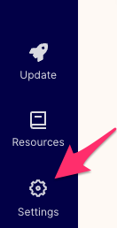

Then on the Settings page, select Sources

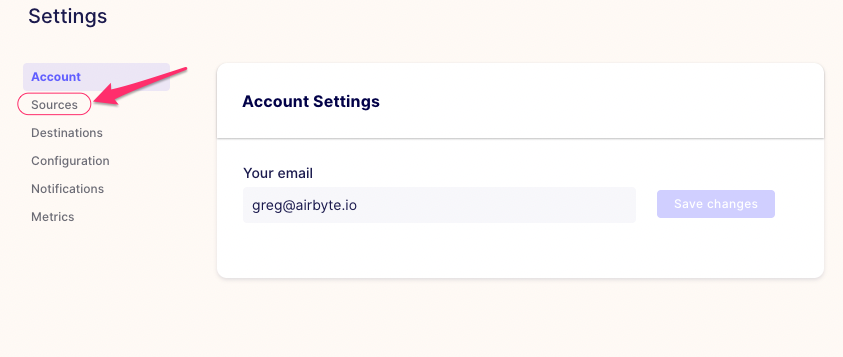

Then on the Settings/Sources page, click "+ New Connector" button at the top right:

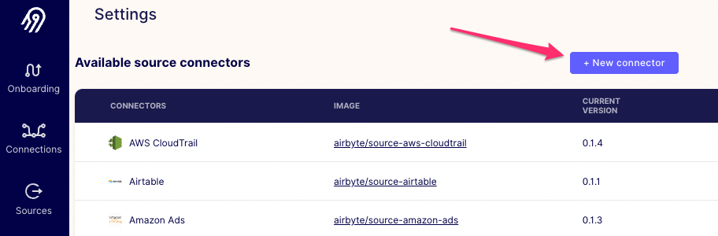

On the modal that pops up, enter the following information then click "Add"

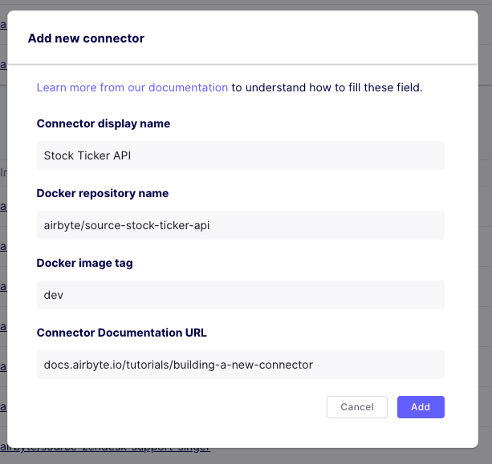

After you click "Add", the modal will close and you will be back at the Settings page.
Now click "Sources" in the navigation bar on the left:

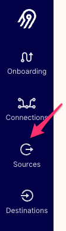

You will be redirected to Sources page, which, if you have not set up any connections, will be empty.
On the Sources page click "+ new source" in the top right corner:

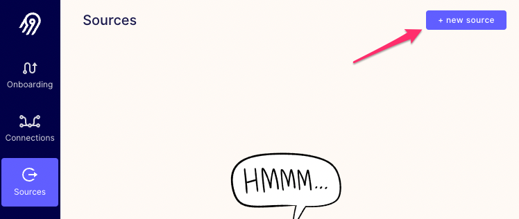

A new modal will prompt you for details of the new source. Type "Stock Ticker" in the Name field.
Then, find your connector in the Source type dropdown. We have lots of connectors already, so it might be easier
to find your connector by typing part of its name:

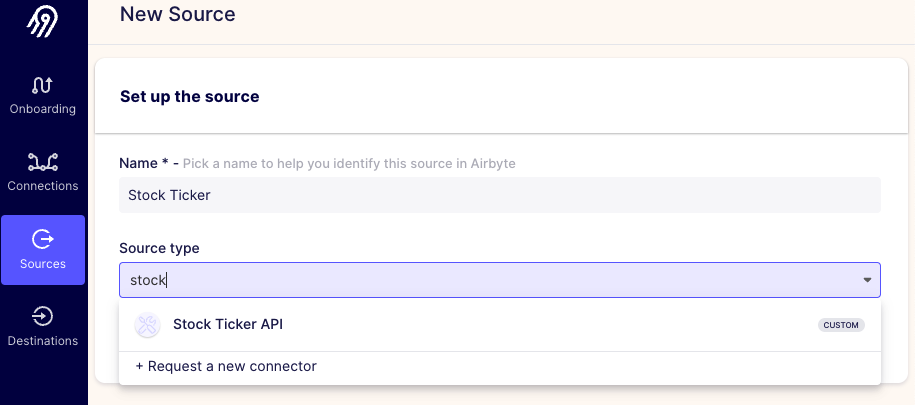

After you select your connector in the Source type dropdown, the modal will show two more fields: API Key and Stock Ticker.
Remember that `spec.json` file you created at the very beginning of this tutorial? These fields should correspond to the `properties`
section of that file. Copy-paste your Polygon.io API key and a stock ticker into these fields and then click "Set up source"
button at the bottom right of the modal. 

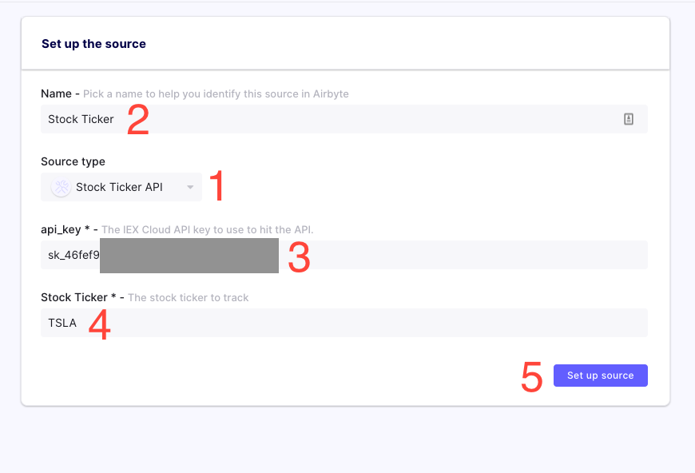

Once you click "Set up source", Airbyte will spin up your connector and run "check" method to verify the configuration.
You will see a progress bar briefly and if the configuration is valid, you will see a success message, 
the modal will close and you will see your connector on the updated Sources page.


Next step is to add a destination. On the same page, click "add destination" and then click "+ add a new destination":

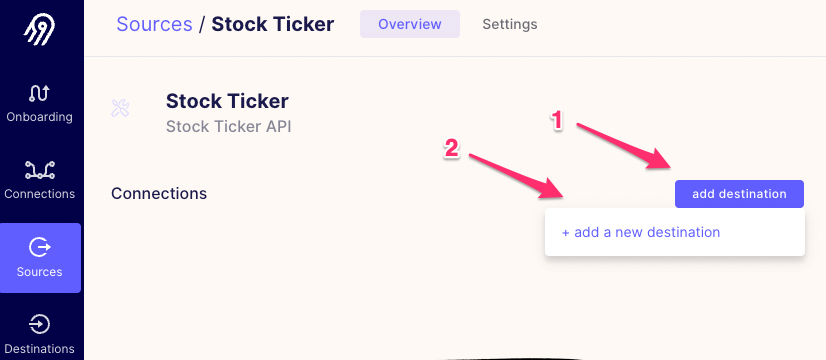

"New destination" wizard will show up. Type a name (e.g. "Local JSON") into the Name field and select "Local JSON" in Destination type drop-down.
After you select the destination type, type `/local/tutorial_json` into Destination path field.
When we run syncs, we'll find the output on our local filesystem in `/tmp/airbyte_local/tutorial_json`.

Click "Set up destination" at the lower right of the form.

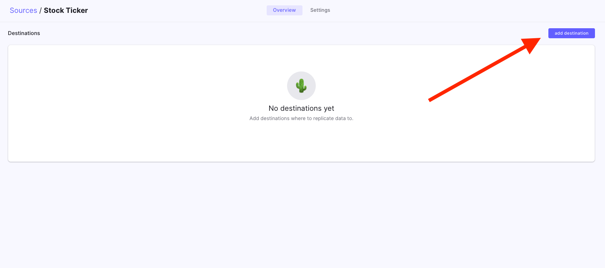

After that Airbyte will test the destination and prompt you to configure the connection between Stock Ticker source and Local JSON destination.
Select "Mirror source structure" in the Destination Namespace, check the checkbox next to the stock_prices stream, and click "Set up connection" button at the bottom of the form:

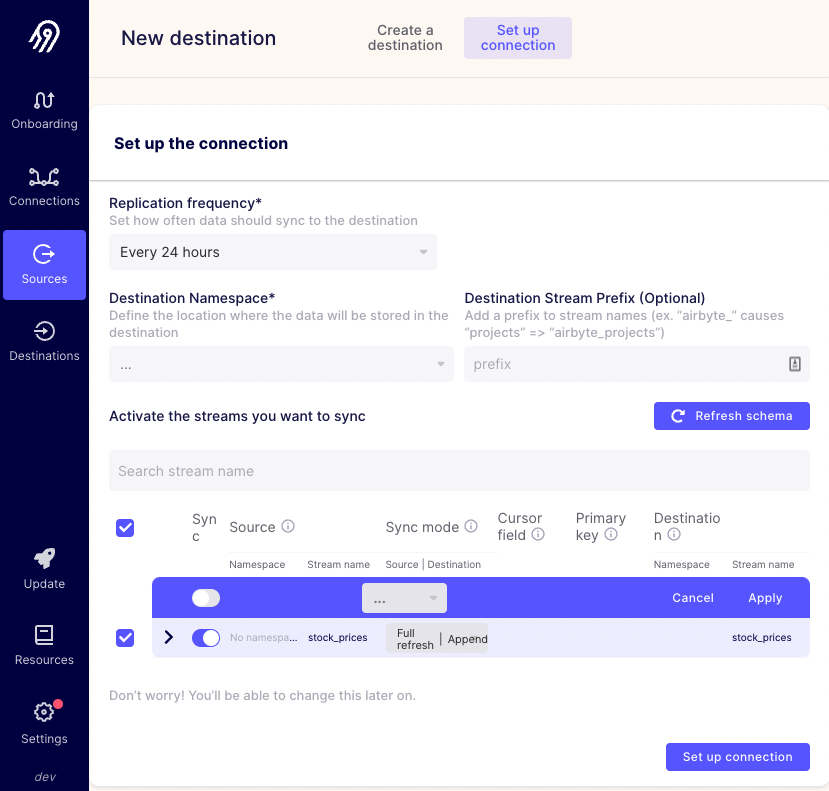

Ta-da! Your connection is now configured to sync once a day. You will see your new connection on the next screen: 


Airbyte will run the first sync job as soon as your connection is saved. Navigate to "Connections" in the side bar and wait for the first sync to succeed:

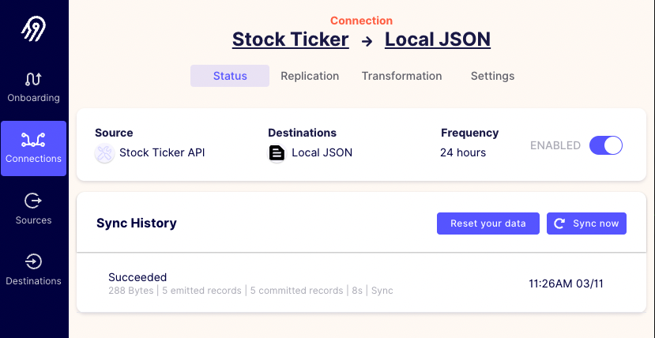

Let's verify the output. From your shell, run:

```bash
$ cat /tmp/airbyte_local/tutorial_json/_airbyte_raw_stock_prices.jsonl
{"_airbyte_ab_id":"7383c6c1-783a-4a8a-a39c-3890ab562495","_airbyte_emitted_at":1647026803000,"_airbyte_data":{"date":"2022-03-04","stock_ticker":"TSLA","price":838.29}}
{"_airbyte_ab_id":"cf7dc8d9-1ece-4a40-a7d6-35cae54b94e5","_airbyte_emitted_at":1647026803000,"_airbyte_data":{"date":"2022-03-07","stock_ticker":"TSLA","price":804.58}}
{"_airbyte_ab_id":"da7da131-41d2-4ba7-bba1-1a0a5329a30a","_airbyte_emitted_at":1647026803000,"_airbyte_data":{"date":"2022-03-08","stock_ticker":"TSLA","price":824.4}}
{"_airbyte_ab_id":"20df0d78-5a5e-437b-95d8-aa57cf19fce1","_airbyte_emitted_at":1647026803000,"_airbyte_data":{"date":"2022-03-09","stock_ticker":"TSLA","price":858.97}}
{"_airbyte_ab_id":"0b7a8d33-4500-4a6d-9d74-11716bd22f01","_airbyte_emitted_at":1647026803000,"_airbyte_data":{"date":"2022-03-10","stock_ticker":"TSLA","price":838.3}}
```

Congratulations! We've successfully written a fully functioning Airbyte connector. You're an Airbyte contributor now ;\)

Armed with the knowledge you gained in this guide, here are some places you can go from here:

1. Implement Incremental Sync for your connector \(described in the sections below\)
2. Implement another connector using the language specific helpers listed below
3. While not required, we love contributions! if you end up creating a new connector, we're here to help you make it available to everyone using Airbyte. Remember that you're never expected to maintain a connector by yourself if you merge it to Airbyte -- we're committed to supporting connectors if you can't do it yourself

## Optional additions

This section is not yet complete and will be completed soon. Please reach out to us on [Slack](https://slack.airbyte.io) or [Github](https://github.com/airbytehq/airbyte) if you need the information promised by these sections immediately.

### Incremental sync
Follow the [next tutorial](adding-incremental-sync.md) to implement incremental sync.

### Connector Development Kit
Like we mention at the beginning of the tutorial, this guide is meant more for understanding than as a blueprint for implementing production connectors. See the [Connector Development Kit](https://github.com/airbytehq/airbyte/tree/master/airbyte-cdk/python/docs/tutorials) for the frameworks you should use to build production-ready connectors.

### Language specific helpers
 * [Building a Python Source](https://docs.airbyte.com/connector-development/tutorials/building-a-python-source)
 * [Building a Python Destination](https://docs.airbyte.com/connector-development/tutorials/building-a-python-destination)
 * [Building a Java Destination](https://docs.airbyte.com/connector-development/tutorials/building-a-java-destination)
