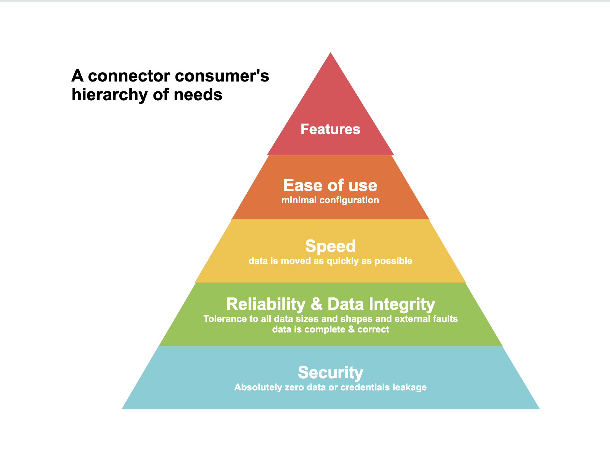

# UX Handbook

## Connector Development UX Handbook


### Overview

The goal of this handbook is to allow scaling high quality decision making when developing connectors.

The Handbook is a living document, meant to be continuously updated. It is the best snapshot we can produce of the lessons learned from building and studying hundreds of connectors. While helpful, this snapshot is never perfect. Therefore, this Handbook is not a replacement for good judgment, but rather learnings that should help guide your work.

### How to use this handbook

1. When thinking about a UX-impacting decision regarding connectors, consult this Handbook.
2. If the Handbook does not answer your question, then consider proposing an update to the Handbook if you believe your question will be applicable to more cases.

### Definition of UX-impacting changes

UX-impacting changes are ones which impact how the user directly interacts with, consumes, or perceives the product.

**Examples**:

1. Public-facing documentation
2. Input configuration
3. Output schema
4. Prerequisite configuration by the user (e.g: you need to link an instagram account to your Facebook page for this connector to work properly)
5. Consolidating two connectors into one, or splitting one connector into two
6. Wait time for human-at-keyboard
7. Anything that negatively impacts the runtime of the connector (e.g: a change that makes the runtime go from 10 minutes to 20 minutes on the same data size)
8. Any other change which you deem UX-impacting
   1. The guide can’t cover everything, so this is an escape hatch based on the developer’s judgment.

**Examples of UX-impacting changes**:

1. Adding or removing an input field to/from spec.json
2. Adding or removing fields from the output schema
3. Adding a new stream or category of stream (e.g: supporting views in databases)
4. Adding OAuth support

**Examples of non-UX-impacting changes**:

1. Refactoring without changing functionality
2. Bugfix (e.g: pagination doesn’t work correctly)

### Guiding Principles

Would you trust AWS or Docker if it only worked 70, 80, or 90% of the time or if it leaked your business secrets? Yeah, me neither. You would only build on a tool if it worked at least 99% of the time. Infrastructure should give you back your time, rather than become a debugging timesink.

The same is true with Airbyte: if it worked less than 99% of the time, many users will stop using it. Airbyte is an infrastructure component within a user’s data pipeline. Our users’ goal is to move data; Airbyte is an implementation detail. In that sense, it is much closer to Terraform, Docker, or AWS than an end application.

#### Trust & Reliability are the top concerns

Our users have the following hierarchy of needs:&#x20;



**Security**

Users often move very confidential data like revenue numbers, salaries, or confidential documents through Airbyte. A user therefore must trust that their data is secure. This means no leaking credentials in logs or plain text, no vulnerabilities in the product, no frivolous sharing of credentials or data over internal slack channels, video calls, or other communications etc.

**Data integrity**

Data replicated by Airbyte must be correct and complete. If a user moves data with Airbyte, then all of the data must be present, and it must all be correct - no corruption, incorrect values, or wrongly formatted data.

Some tricky examples which can break data integrity if not handled correctly:

* Zipcodes for the US east coast should not lose their leading zeros because of being detected as integer
* Database timezones could affect the value of timestamps
* Esoteric text values (e.g: weird UTF characters)

**Reliability**

A connector needs to be reliable. Otherwise, a user will need to spend a lot of time debugging, and at that point, they’re better off using a competing product. The connector should be able to handle large inputs, weirdly formatted inputs, all data types, and basically anything a user should throw at it.

In other words, a connector should work 100% of the time, but 99.9% is occasionally acceptable.

#### Speed

Sync speed minimizes the time needed for deriving value from data. It also provides a better user experience as it allows quick iteration on connector configurations without suffering through long wait times.&#x20;

**Ease of use**

People love and trust a product that is easy to use. This means that it works as quickly as possible, introduces no friction, and uses sensible defaults that are good enough for 95% of users.

An important component of usability is predictability. That is, as much as possible, a user should know before running a connector what its output will be and what the different tables will mean.

Ideally, they would even see an ERD describing the output schema they can expect to find in the destination. (This particular feature is tracked [here](https://github.com/airbytehq/airbyte/issues/3731)).

**Feature Set**

Our connectors should cover as many use cases as is feasible. While it may not always work like that given our incremental delivery preference, we should always strive to provide the most featureful connectors which cover as much of the underlying API or database surface as possible.

There is also a tension between featureset and ease of use. The more features are available, the more thought it takes to make the product easy and intuitive to use. We’ll elaborate on this later.

### Airbyte's Target Personas

Without repeating too many details mentioned elsewhere, the important thing to know is Airbyte serves all the following personas:

| **Persona**        | **Level of technical knowledge**                                                                                                                                                                                                                                                                                                |
| ------------------ | ------------------------------------------------------------------------------------------------------------------------------------------------------------------------------------------------------------------------------------------------------------------------------------------------------------------------------- |
| Data Analyst       | <p>Proficient with:<br/><br/>Data manipulation tools like Excel or SQL<br/>Dashboard tools like Looker<br/><br/>Not very familiar with reading API docs and doesn't know what a curl request is. But might be able to generate an API key if you tell them exactly how.</p>                                                          |
| Analytics Engineer | <p>Proficient with:<br/><br/>SQL &#x26; DBT<br/>Git<br/>A scripting language like Python<br/>Shallow familiarity with infra tools like Docker<br/><br/>Much more technical than a data analyst, but not as much as a data engineer</p>                                                                                                 |
| Data Engineer      | <p>Proficient with:<br/><br/>SQL &#x26; DBT<br/>Git<br/>2 or more programming languages<br/>Infra tools like Docker or Kubernetes<br/>Cloud technologies like AWS or GCP<br/>Building or consuming APIs<br/>orhestartion tools like Airflow<br/><br/>The most technical persona we serve. Think of them like an engineer on your team</p> |

Keep in mind that the distribution of served personas will differ per connector. Data analysts are highly unlikely to form the majority of users for a very technical connector like say, Kafka.

## Specific Guidelines

### Input Configuration

_aka spec.json_

**Avoid configuration completely when possible**

Configuration means more work for the user and more chances for confusion, friction, or misconfiguration. If I could wave a magic wand, a user wouldn’t have to configure anything at all. Unfortunately, this is not reality, and some configuration is strictly required. When this is the case, follow the guidelines below.

**Avoid exposing implementation details in configuration**

If a configuration controls an implementation detail (like how many retries a connector should make before failing), then there should be almost no reason to expose this. If you feel a need to expose it, consider it might be a smell that the connector implementation is not robust.

Put another way, if a configuration tells the user how to do its job of syncing data rather than what job to achieve, it’s a code smell.

For example, the memory requirements for a database connector which syncs a table with very wide rows (50mb rows) can be very different than when syncing a table with very narrow rows (10kb per row). In this case, it may be acceptable to ask the user for some sort of “hint”/tuning parameter in configuration (hidden behind advanced configuration) to ensure the connector performs reliably or quickly. But even then, this option would strictly be a necessary evil/escape hatch. It is much more preferable for the connector to auto-detect what this setting should be and never need to bother the user with it.

**Minimize required configurations by setting defaults whenever possible**

In many cases, a configuration can be avoided by setting a default value for it but still making it possible to set other values. Whenever possible, follow this pattern.

**Hide technical or niche parameters under an “Advanced” section**

Sometimes, it’s inevitable that we need to expose some advanced or technical configuration. For example, the option to upload a TLS certificate to connect to a database, or the option to configure the number of retries done by an API connector: while these may be useful to some small percentage of users, it’s not worth making all users think or get confused about them.

Note: this is currently blocked by this [issue](https://github.com/airbytehq/airbyte/issues/3681).

**Add a “title” and “description” property for every input parameter**

This displays this information to the user in a polished way and gives less technical users (e.g: analysts) confidence that they can use this product. Be specific and unambiguous in the wording, explaining more than just the field name alone provides.

For example, the following spec:

```json
{
  "type": "object",
  "properties": {
    "user_name": {
      "type": "string"
    }
  }
}
```

produces the following input field in the UI:&#x20;


Whereas the following specification:

```json
{
  "type": "object",
  "properties": {
    "user_name": {
      "type": "string",
      "description": "The username you use to login to the database",
      "title": "Username"
    }
  }
}
```

produces the following UI:


The title should use Pascal Case “with spaces” e.g: “Attribution Lookback Window”, “Host URL”, etc...

**Clearly document the meaning and impact of all parameters**

All configurations must have an unmistakable explanation describing their purpose and impact, even the obvious ones. Remember, something that is obvious to an analyst may not be obvious to an engineer, and vice-versa.

For example, in some Ads APIs like Facebook, the user’s data may continue to be updated up to 28 days after it is created. This happens because a user may take action because of an ad (like buying a product) many days after they see the ad. In this case, the user may want to configure a “lookback” window for attributing.

Adding a parameter “attribution\_lookback\_window” with no explanation might confuse the user more than it helps them. Instead, we should add a clear title and description which describes what this parameter is and how different values will impact the data output by the connector.

**Document how users can obtain configuration parameters**

If a user needs to obtain an API key or host name, tell them exactly where to find it. Ideally you would show them screenshots, though include a date and API version in those if possible, so it’s clear when they’ve aged out of date.

**Links should point to page anchors where applicable**. 

Often, you are trying to redirect the user to a specific part of the page. For example, if you wanted to point someone to the "Input Configuration" section of this doc, it is better to point them to `https://docs.airbyte.com/connector-development/ux-handbook#input-configuration` instead of `https://docs.airbyte.com/connector-development/ux-handbook`.

**Fail fast & actionably**

A user should not be able to configure something that will not work. If a user’s configuration is invalid, we should inform them as precisely as possible about what they need to do to fix the issue.

One helpful aid is to use the json-schema “pattern” keyword to accept inputs which adhere to the correct input shape.

### Output Data & Schemas

#### Strongly Favor ELT over ETL

Extract-Load-Transform (ELT) means extracting and loading the data into a destination while leaving its format/schema as unchanged as possible, and making transformation the responsibility of the consumer. By contrast, ETL means transforming data before it is sent to the destination, for example changing its schema to make it easier to consume in the destination.

When extracting data, strongly prefer ELT to ETL for the following reasons:

**Removes Airbyte as a development bottleneck**

If we get into the habit of structuring the output of each source according to how some users want to use it, then we will invite more feature requests from users asking us to transform data in a particular way. This introduces Airbyte’s dev team as an unnecessary bottleneck for these users.

Instead, we should set the standard that a user should be responsible for transformations once they’ve loaded data in a destination.

**Will always be backwards compatible**

APIs already follow strong conventions to maintain backwards compatibility. By transforming data, we break this guarantee, which means we may break downstream flows for our users.

**Future proof**

We may have a vision of what a user needs today. But if our persona evolves next year, then we’ll probably also need to adapt our transformation logic, which would require significant dev and data migration efforts.

**More flexible**

Current users have different needs from data. By being opinionated on how they should consume data, we are effectively favoring one user persona over the other. While there might be some cases where this is warranted, it should be done with extreme intentionality.

**More efficient**

With ETL, if the “T” ever needs to change, then we need to re-extract all data for all users. This is computationally and financially expensive and will place a lot of pressure on the source systems as we re-extract all data.

#### Describe output schemas as completely and reliably as possible

Our most popular destinations are strongly typed like Postgres, BigQuery, or Parquet & Avro.

Being strongly typed enables optimizations and syntactic sugar to make it very easy & performant for the user to query data.

To provide the best UX when moving data to these destinations, Airbyte source connectors should describe their schema in as much detail as correctness allows.

In some cases, describing schemas is impossible to do reliably. For example, MongoDB doesn’t have any schemas. To infer the schema, one needs to read all the records in a particular table. And even then, once new records are added, they also must all be read in order to update the inferred schema. At the time of writing, this is infeasible to do performantly in Airbyte since we do not have an intermediate staging area to do this. In this case, we should do the “best we can” to describe the schema, keeping in mind that reliability of the described schema is more important than expressiveness.

That is, we would rather not describe a schema at all than describe it incorrectly, as incorrect descriptions **will** lead to failures downstream.

To keep schema descriptions reliable, [automate schema generation](https://docs.airbyte.io/connector-development/cdk-python/schemas#generating-schemas-from-openapi-definitions) whenever possible.

#### Be very cautious about breaking changes to output schemas

Assuming we follow ELT over ETL, and automate generation of output schemas, this should come up very rarely. However, it is still important enough to warrant mention.

If for any reason we need to change the output schema declared by a connector in a backwards breaking way, consider it a necessary evil that should be avoided if possible. Basically, the only reasons for a backwards breaking change should be:

* a connector previously had an incorrect schema, or
* It was not following ELT principles and is now being changed to follow them

Other breaking changes should probably be escalated for approval.

### Prerequisite Configurations & assumptions

**Document all assumptions**

If a connector makes assumptions about the underlying data source, then these assumptions must be documented. For example: for some features of the Facebook Pages connector to work, a user must have an Instagram Business account linked to an Instagram page linked to their Facebook Page. In this case, the externally facing documentation page for the connector must be very clear about this.

**Provide how-tos for prerequisite configuration**

If a user needs to set up their data source in a particular way to pull data, then we must provide documentation for how they should do it.

For example, to set up CDC for databases, a user must create logical replication slots and do a few other things. These steps should be documented with examples or screenshots wherever possible (e.g: here are the SQL statements you need to run, with the following permissions, on the following screen, etc.)

### External Documentation

This section is concerned with the external-facing documentation of a connector that goes in [https://docs.airbyte.io](https://docs.airbyte.io) e.g: [this one](https://docs.airbyte.io/integrations/sources/amazon-seller-partner)

**Documentation should communicate persona-impacting behaviors**

When writing documentation ask: who is the intended target persona for a piece of documentation, and what information do they need to understand how this connector impacts their workflows?

For example, data analysts & analytics engineers probably don’t care if we use Debezium for database replication. To them, the important thing is that we provide Change Data Capture (CDC) -- Debezium is an implementation detail. Therefore, when communicating information about our database replication logic, we should emphasize the end behaviors, rather than implementation details.

**Example**: Don’t say: “Debezium cannot process UTF-16 character set“.

Instead, say: “When using CDC, UTF-16 characters are not currently supported”

A user who doesn’t already know what Debezium is might be left confused by the first phrasing, so we should use the second phrasing.

\*: _this is a fake example. AFAIK there is no such limitation in Debezi-- I mean, the Postgres connector._
