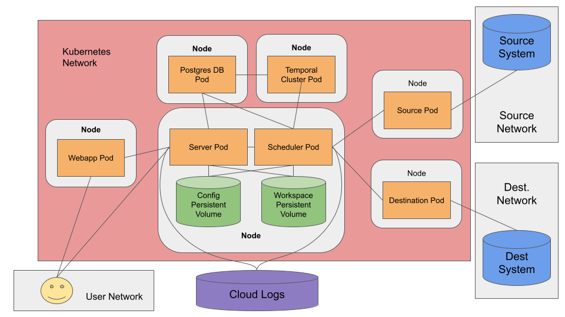

# Developing on Kubernetes

Make sure to read [our docs for developing locally](developing-locally.md) first.

## Architecture



## Iteration Cycle \(Locally\)

If you're developing locally using Minikube/Docker Desktop/Kind, you can iterate with the following series of commands:

```bash
./gradlew build # build dev images
kubectl delete -k kube/overlays/dev # optional (allows you to recreate resources from scratch)
kubectl apply -k kube/overlays/dev # applies manifests
kubectl port-forward svc/airbyte-webapp-svc 8000:80 # port forward the api/ui
```

## Iteration Cycle \(on GKE\)

The process is similar to developing on a local cluster, except you will need to build the local version and push it to your own container registry with names such as `your-registry/scheduler`. Then you will need to configure an overlay to override the name of images and apply your overlay with `kubectl apply -k <path to your overlay>`.

We are [working to improve this process](https://github.com/airbytehq/airbyte/issues/4225).

## Completely resetting a local cluster

In most cases, running `kubectl delete -k kube/overlays/dev` is sufficient to remove the core Airbyte-related components. However, if you are in a dev environment on a local cluster only running Airbyte and want to start **completely from scratch** \(removing all PVCs, pods, completed pods, etc.\), you can use the following command to destroy everything on the cluster:

```bash
# BE CAREFUL, THIS COMMAND DELETES ALL RESOURCES, EVEN NON-AIRBYTE ONES!
kubectl delete "$(kubectl api-resources --namespaced=true --verbs=delete -o name | tr "\n" "," | sed -e 's/,$//')" --all
```

