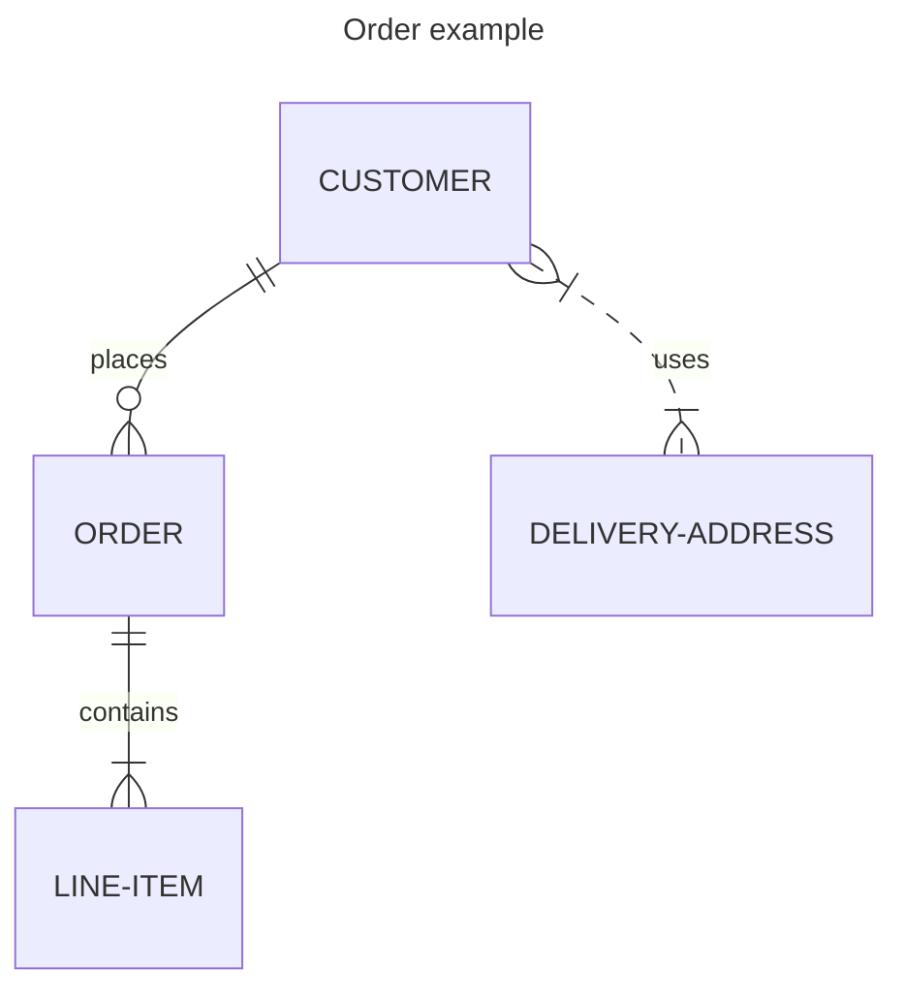

import Tabs from "@theme/Tabs";
import TabItem from "@theme/TabItem";

# Updating Documentation

We welcome contributions to the Airbyte documentation!

Our docs are written in [Markdown](https://guides.github.com/features/mastering-markdown/) following the [Google developer documentation style guide](https://developers.google.com/style/highlights) and the files are stored in our [Github repository](https://github.com/airbytehq/airbyte/tree/master/docs). The docs are published at [docs.airbyte.com](https://docs.airbyte.com/) using [Docusaurus](https://docusaurus.io/) and [GitHub Pages](https://pages.github.com/).

## Finding good first issues

Before contributing to Airbyte docs, read the Airbyte Community [Code of Conduct](../community/code-of-conduct.md).

The Docs team maintains a list of [good first issues](https://github.com/airbytehq/airbyte/issues?q=is%3Aopen+is%3Aissue+label%3Aarea%2Fdocumentation+label%3A%22good+first+issue%22) for new contributors.

- If you're new to technical writing, start with the smaller issues (fixing typos, broken links, spelling and grammar, and so on). You can [edit the files directly on GitHub](#editing-directly-on-github).
- If you're an experienced technical writer or a developer interested in technical writing, comment on an issue that interests you to discuss it with the Docs team. Once we decide on the approach and the tasks involved, [edit the files and open a Pull Request](#editing-on-your-local-machine) for the Docs team to review.

:::tip
If you're new to GitHub and Markdown, complete [the First Contributions tutorial](https://github.com/firstcontributions/first-contributions) and learn [Markdown basics](https://guides.github.com/features/mastering-markdown/) before contributing to Airbyte documentation. Even if you're familiar with the basics, you may be interested in Airbyte's [custom markdown extensions for connector docs](#custom-markdown-extensions-for-connector-docs).
:::

### Editing directly on GitHub

To make minor changes (example: fixing typos) or edit a single file, you can edit the file directly on GitHub:

1. Click **Edit this page** at the bottom of any published document on [docs.airbyte.com](https://docs.airbyte.com/). You'll be taken to the GitHub editor.
2. [Edit the file directly on GitHub and open a Pull Request](https://docs.github.com/en/repositories/working-with-files/managing-files/editing-files).

### Editing on your local machine

#### Prerequisites

To contribute to our documentation, please ensure following required technologies are installed on your local machine:

1. [`Node.js`](https://nodejs.org/en/learn/getting-started/how-to-install-nodejs)
2. [`pnpm`](https://pnpm.io/installation)

#### Setup and Making Changes

To make complex changes or edit multiple files, edit the files on your local machine:

1. [Fork](https://docs.github.com/en/github/getting-started-with-github/fork-a-repo) the Airbyte [repository](https://github.com/airbytehq/airbyte).

2. Clone the fork on your local machine:

   ```bash
   git clone git@github.com:{YOUR_USERNAME}/airbyte.git
   cd airbyte
   ```

   Or

   ```bash
   git clone https://github.com/{YOUR_USERNAME}/airbyte.git
   cd airbyte
   ```

3. Create a feature branch from which to make changes:

   ```bash
   git checkout -b {YOUR_USERNAME}/{FEATURE/BUG}
   ```

   (e.g. `jdoe/source-stock-api-stream-fix`)

4. Test changes locally:

   To install the docs locally, run the following commands in your terminal:

   ```bash
   cd docusaurus
   pnpm install
   ```

   To see changes as you make them, run:

   ```bash
   pnpm start
   ```

   Then navigate to [http://localhost:3005/](http://localhost:3005/). Whenever you make and save changes, you will see them reflected in the server. You can stop the running server in OSX/Linux by pressing `Ctrl-C` in the terminal.

   You can also build the docs locally and see the resulting changes. This is useful if you introduce changes that need to be run at build-time (e.g. adding a docs plug-in). To do so, run:

   ```bash
   pnpm build
   pnpm serve
   ```

   Then navigate to [http://localhost:3000/](http://localhost:3000/) to see your changes. You can stop the running server in OSX/Linux by pressing `Ctrl-C` in the terminal.

5. [Follow the GitHub workflow](https://docs.github.com/en/get-started/quickstart/contributing-to-projects/) to edit the files and create a pull request.

   :::note
   Before we accept any contributions, you'll need to sign the Contributor License Agreement (CLA). By signing a CLA, we can ensure that the community is free and confident in its ability to use your contributions. You will be prompted to sign the CLA while opening a pull request.
   :::

6. Assign `airbytehq/docs` as a Reviewer for your pull request.

### Custom markdown extensions for connector docs

Airbyte's markdown documentation—particularly connector-specific documentation—needs to gracefully support multiple different contexts: key details may differ between open-source builds and Airbyte Cloud, and the more exhaustive explanations appropriate for https://docs.airbyte.com may bury key details when rendered as inline documentation within the Airbyte application. In order to support all these different contexts without resorting to multiple overlapping files that must be maintained in parallel, Airbyte's documentation tooling supports multiple nonstandard features.

Please familiarize yourself with all the tools available to you when writing documentation for a connector, so that you can provide appropriately tailored information to your readers in whichever context they see it.

:::note
As a general rule, features that introduce new behavior or prevent certain content from rendering will affect how the Airbyte UI displays markdown content, but have no impact on https://docs.airbyte.com. If you want to test out these in-app features in [a local Airbyte build](https://docs.airbyte.com/contributing-to-airbyte/developing-locally/#develop-on-airbyte-webapp), ensure that you have the `airbyte` git repository checked out to the same parent directory as the airbyte platform repository: if so, development builds will by default fetch connector documentation from your local filesystem, allowing you to freely edit their content and view the rendered output.
:::

#### Select between mutually-exclusive content options with `<Tabs>`

Tabs are a built-in feature of Docusaurus, the tool we use to build `https://docs.airbyte.com`; please refer to [their documentation](https://docusaurus.io/docs/markdown-features/tabs) for their options and behavior in this context. For better site-agnostic documentation, and because we like the feature, we maintain a separate `Tabs` implementation with limited, one-way API compatibility: all usage options we document should behave the same in-app and on `https://docs.airbyte.com`. If you find a discrepancy or breakage, we would appreciate if you [report it as a bug](https://github.com/airbytehq/airbyte/issues/new?assignees=&labels=type%2Fenhancement%2Carea%2Fdocumentation+needs-triage&projects=&template=8-documentation.yaml)! The reverse is not necessarily true, however: Docusaurus supports many use cases besides ours, so supporting its every usage pattern is a deliberate non-goal.

:::info
Because Docusaurus uses an mdx component, you must include the following import lines in any markdown file which uses tabs:

```js
import Tabs from "@theme/Tabs";
import TabItem from "@theme/TabItem";
```

This is not optional: if these lines are missing, the documentation site will have errors. They won't show up in the rendered document, however.
:::

Here's an example set of tabs; note that you can put any number of `<TabItem value="..." label="...">...</TabItem>` tags inside a `<Tabs>`.

```md
<Tabs>
<TabItem value="http-basic" label="Basic HTTP authentication">

When configuring this hypothetical connector using basic HTTP auth, you should mind some tricky security considerations! This just a hypothetical, though, so I never bothered to come up with any.

As the first tab, this would be shown by default if no `TabItem` were marked as `default`.

</TabItem>
<TabItem value="oauth" label="OAuth authentication" default>

When configuring this hypothetical connector using OAuth authentication, you should do a dance. Good for you! Since it's not the first `TabItem` in its set, we had to explicitly mark this tab as `default` for it to get top billing.

</TabItem>
</Tabs>
```

That renders as the following:

<Tabs>
<TabItem value="http-basic" label="Basic HTTP authentication">

When configuring this hypothetical connector using basic HTTP auth, you should mind some tricky security considerations! This just a hypothetical, though, so I never bothered to come up with any.

As the first tab, this would be shown by default if no `TabItem` were marked as `default`.

</TabItem>
<TabItem value="oauth" label="OAuth authentication" default>

When configuring this hypothetical connector using OAuth authentication, you should do a dance. Good for you! Since it's not the first `TabItem` in its set, we had to explicitly mark this tab as `default` for it to get top billing.

</TabItem>
</Tabs>

- You don't need to mark any tab as `default`
- If you don't, the first tab (here, Basic HTTP) will be the initial selection instead
- You can use ordinary markdown syntax inside a `TabItem`
- **however**, due to bugs in our in-app markdown rendering library, you should be dilligent about using empty lines to separate different formatting-related things (surrounding tags and their contents, paragraphs vs lists, etc)
- You should also avoid indenting `TabItem` tags and their content according to html conventions, since text indented by four spaces (common for html nested inside two levels of tags) can be interpreted as a code block; different markdown rendering tools can handle this inconsistently.

#### Jump to the relevant documentation section when specific connector setup inputs are focused with `<FieldAnchor>`

In the documentation, the relevant section needs to be wrapped in a `<FieldAnchor field="path.to.field" />` component. When a user focuses the field identified by the `field` attribute in the connector setup UI, the documentation pane will automatically scroll to the associated section of the documentation, highlighting all content contained inside the `<FieldAnchor></FieldAnchor>` tag. These are rendered as regular divs in the documentation site, so they have no effect in places other than the in-app documentation panel—however, note that there must be blank lines between a custom tag like `FieldAnchor` the content it wraps for the documentation site to render markdown syntax inside the custom tag to html.

The `field` attribute must be a valid json path to one of the properties nested under `connectionSpecification.properties` in that connector's `spec.json` or `spec.yaml` file. For example, if the connector spec contains a `connectionSpecification.properties.replication_method.replication_slot`, you would mark the start of the related documentation section with `<FieldAnchor field="replication_method.replication_slot">` and its end with `</FieldAnchor>`. It's also possible to highlight the same section for multiple fields by separating them with commas, like `<FieldAnchor field="replication_method.replication_slot,replication_method.queue_size">`. To mark a section as highlighted after the user picks an option from a `oneOf`: use a `field` prop like `path.to.field[value-of-selection-key]`, where the `value-of-selection-key` is the value of a `const` field nested inside that `oneOf`. For example, if the specification of the `oneOf` field is:

```json
"replication_method": {
  "type": "object",
  "title": "Update Method",
  "oneOf": [
    {
      "title": "Read Changes using Binary Log (CDC)",
      "required": ["method"],
      "properties": {
        "method": {
          "type": "string",
          "const": "CDC",
          "order": 0
        },
        "initial_waiting_seconds": {
          "type": "integer",
          "title": "Initial Waiting Time in Seconds (Advanced)",
        },
      }
    },
    {
      "title": "Scan Changes with User Defined Cursor",
      "required": ["method"],
      "properties": {
        "method": {
          "type": "string",
          "const": "STANDARD",
          "order": 0
        }
      }
    }
  ]
}
```

The selection keys are `CDC` and `STANDARD`, so you can wrap a specific replication method's documentation section with a `<FieldAnchor field="replication_method[CDC]">...</FieldAnchor>` tag, and it will be highlighted if the user selects CDC replication in the UI.

:::tip
Because of their close connection with the connector setup form fields, `<FieldAnchor>` tags are only enabled for the source and destination setup pages.
:::

#### Prevent specific content from rendering in the UI with `<HideInUI>`

Certain content is important to document, but unhelpful in the context of the Airbyte UI's inline documentation views:

- background information that helps users understand a connector but doesn't affect configuration
- edge cases that are unusual but time-consuming to solve
- context for readers on the documentation site about environment-specific content (see [below](#environment-specific-in-app-content-with-magic-html-comments))

Wrapping such content in a pair of `<HideInUI>...</HideInUI>` tags will prevent it from being rendered within the Airbyte UI without affecting its presentation on https://docs.airbyte.com. This allows a single markdown file to be the source of truth for both a streamlined in-app reference and a more thorough treatment on the documentation website.

#### Environment-specific in-app content with magic html comments

Sometimes, there are connector setup instructions which differ between open-source Airbyte builds and Airbyte Cloud. Document both cases, but wrap each in a pair of special HTML comments:

```md
<!-- env:oss -->
<HideInUI>

## For open source:

</HideInUI>

Only open-source builds of the Airbyte UI will render this content.

<!-- /env:oss -->

<!-- env:cloud -->
<HideInUI>

## For Airbyte Cloud:

</HideInUI>

Only cloud builds of the Airbyte UI will render this content.

<!-- /env:oss -->

Content outside of the magic-comment-delimited blocks will be rendered everywhere.
```

Note that the documentation site will render _all_ environment-specific content, so please introduce environment-specific variants with some documentation-site-only context (like the hidden subheadings in the example above) to disambiguate.

#### Contextually-styled callouts with admonition blocks

We have added support for [Docusaurus' admonition syntax](https://docusaurus.io/docs/markdown-features/admonitions) to Airbyte's in-app markdown renderer.

To make an admonition, wrap text with lines of three colons, with the first colons immediately followed (no space) by a tag specifying the callout's semantic styling, which will be one of `tip`, `warning`, `caution`, `danger`, `note`, or `info`. The syntax parallells a code block's, but with colons instead of backticks.

Examples of the different admonition types:

```md
:::note

A **note** with _Markdown_ `syntax`.

:::
```

:::note

A **note** with _Markdown_ `syntax`.

:::

```md
:::tip

A **tip** with _Markdown_ `syntax`.

:::
```

:::tip

A **tip** with _Markdown_ `syntax`.

:::

```md
:::info

Some **info** with _Markdown_ `syntax`.

:::
```

:::info

Some **info** with _Markdown_ `syntax`.

:::

```md
:::caution

A **caution** with _Markdown_ `syntax`.

:::
```

:::caution

A **caution** with _Markdown_ `syntax`.

:::

```md
:::danger

Some **dangerous** content with _Markdown_ `syntax`.

:::
```

:::danger

Some **dangerous** content with _Markdown_ `syntax`.

:::

#### Collapsible content with `<details>` and `<summary>`

```md
## Ordinary markdown content

<details>
  <summary>Here is an expandible section! Everything but this title is hidden by default.</summary>
  Here is the dropdown content; if users expand this section, they will be able to read your valuable but perhaps nonessential content.
</details>

Back to ordinary markdown content.
```

Eagle-eyed readers may note that _all_ markdown should support this feature since it's part of the html spec. However, it's worth special mention since these dropdowns have been styled to be a graceful visual fit within our rendered documentation in all environments.

#### Documenting PyAirbyte usage

PyAirbyte is a Python library that allows to run syncs within a Python script for a subset of connectors. Documentation around PyAirbyte connectors is automatically generated from the connector's JSON schema spec. There are a few approaches to combine full control over the documentation with automatic generation for common cases:

- If a connector is PyAirbyte enabled (`remoteRegistries.pypi.enabled` set in the `metadata.yaml` file of the connector) and there is no second-level heading `Usage with PyAirbyte` in the documentation, the documentation will be automatically generated and placed above the `Changelog` section.
- By manually specifying a `Usage with PyAirbyte` section, this automatism is disabled. The following is a good starting point for this section:

```md
<HideInUI>

## Usage with PyAirbyte

<PyAirbyteExample connector="source-google-sheets" />

<SpecSchema connector="source-google-sheets" />

</HideInUI>
```

The `PyAirbyteExample` component will generate a code example that can be run with PyAirbyte, excluding an auto-generated sample configuration based on the configuration schema. The `SpecSchema` component will generate a reference table with the connector's JSON schema spec, like a non-interactive version of the connector form in the UI. It can be used on any docs page.

## Additional guidelines

- If you're updating a connector doc, follow the [Connector documentation template](https://hackmd.io/Bz75cgATSbm7DjrAqgl4rw)
- If you're adding a new file, update the [sidebars.js file](https://github.com/airbytehq/airbyte/blob/master/docusaurus/sidebars.js)
- If you're adding a README to a code module, make sure the README has the following components:
  - A brief description of the module
  - Development pre-requisites (like which language or binaries are required for development)
  - How to install dependencies
  - How to build and run the code locally & via Docker
  - Any other information needed for local iteration

## Advanced tasks

### Adding a redirect

To add a redirect, open the [`docusaurus/redirects.yml`](https://github.com/airbytehq/airbyte/blob/master/docusaurus/redirects.yml) file and add an entry from which old path to which new path a redirect should happen.

:::note
Your path **needs** a leading slash `/` to work
:::

### Deploying and reverting the documentation site

:::note
Only the Airbyte team and maintainers have permissions to deploy the documentation site.
:::

#### Automated documentation site deployment

When `docs/` folder gets changed in `master` branch of the repository, [`Deploy docs.airbyte.com` Github workflow](https://github.com/airbytehq/airbyte/actions/workflows/deploy-docs-site.yml) steps in, builds and deploys the documentation site. This process is automatic, takes five to ten minutes, and needs no human intervention.

#### Manual documentation site deployment

:::note
Manual deployment is reserved for emergency cases. Please, bear in mind that automatic deployment is triggered by changes to `docs/` folder, so it needs to be disabled to avoid interference with manual deployment.
:::

You'll need a GitHub SSH key to deploy the documentation site using the [deployment tool](https://github.com/airbytehq/airbyte/blob/master/tools/bin/deploy_docusaurus).

To deploy the documentation site, run:

```bash
cd airbyte
# or cd airbyte-cloud
git checkout master
git pull
./tools/bin/deploy_docusaurus
```

To revert/rollback doc changes, run:

```
cd airbyte
git checkout <OLDER_BRANCH>
./tools/bin/deploy_docusaurus
```

### Adding a diagram

We have the docusaurus [Mermaid](https://mermaid.js.org/) plugin which has a variety of diagram
types and syntaxes available.

:::danger
The connector specific docs do **not** currently support this, only use this for general docs.
:::

Here is an example from the [Mermaid docs](https://mermaid.js.org/syntax/entityRelationshipDiagram.html)
you would add the following to your markdown wrapped in a code block.

```md
    ---
    title: Order example
    ---
    erDiagram
        CUSTOMER ||--o{ ORDER : places
        ORDER ||--|{ LINE-ITEM : contains
        CUSTOMER }|..|{ DELIVERY-ADDRESS : uses
```

which produces the following diagram



check out the rest of the Mermaid documentation for its capabilities just be aware that not all
the features are available to the docusaurus plugin.
