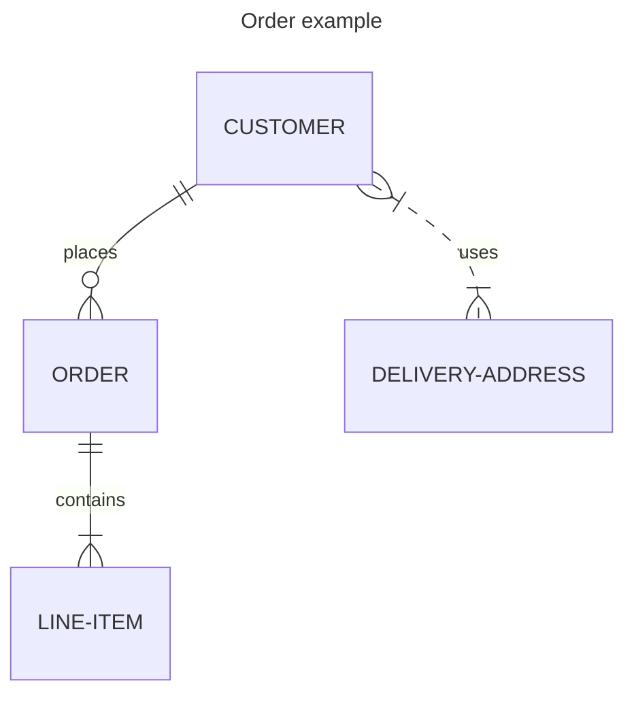

import Tabs from "@theme/Tabs";
import TabItem from "@theme/TabItem";

# Updating documentation

Everyone is welcome to contribute to Airbyte's documentation! 

Our documentation is stored in the [Airbyte repository](https://github.com/airbytehq/airbyte/tree/master/docs) on GitHub. It is published at [docs.airbyte.com](https://docs.airbyte.com/) using [GitHub Pages](https://pages.github.com/). The docs are built on [Docusaurus](https://docusaurus.io/). Content is written in [Markdown](https://guides.github.com/features/mastering-markdown/) and all topics are in the /docs/ folder. Configuration files are in the /docusaurus/ folder.

## Open source contributions

Open source contributors are a vital part of Airbyte. You're welcome to use content you author in your portfolio. If you join Airbyte's [Contributor program](https://airbyte.com/community/contributor-program), we pay for high-quality work on select issues.

## Before you start

Before you contribute, familiarize yourself with these concepts.

### Read our code of conduct

Read the Airbyte Community [code of conduct](../community/code-of-conduct.md).

### Learn the Docusaurus basics

Even if you've never used it before, most developers and technical writers find Docusaurus intuitive.

- [Markdown basics](https://guides.github.com/features/mastering-markdown/)
- [Docusaurus 5-minute tutorial](https://tutorial.docusaurus.io/)

### Style guide

Follow the [Google developer documentation style guide](https://developers.google.com/style/highlights). It's a widely adopted style guide with good examples and easy-to-follow rules. We don't enforce these rules with automation, but might in the future. Fow now, just try to follow it to the best of your ability.

### Find a good first issue

The Docs team maintains a list of [good first issues](https://github.com/airbytehq/airbyte/issues?q=is%3Aopen+is%3Aissue+label%3Aarea%2Fdocumentation+label%3A%22good+first+issue%22) for new contributors. If you'd like to start a complex documentation project, create or comment on a [GitHub issue](https://github.com/airbytehq/airbyte/issues) and tag [@ian-at-airbyte](https://github.com/ian-at-airbyte) so we can decide on an approach together.

## Edit files directly on GitHub

To make minor changes like fixing typos or editing a single file, you can edit the file directly in your browser.

1. Click **Edit this page** at the bottom of any page on [docs.airbyte.com](https://docs.airbyte.com/). You'll be taken to the GitHub editor.
2. [Edit the file directly on GitHub and open a Pull Request](https://docs.github.com/en/repositories/working-with-files/managing-files/editing-files).

## Edit files on your local machine

If you're making substantial documentation changes, it's best to clone the repository and work locally.

### Prerequisites

Install these tools on your local machine, first.

1. [Node.js](https://nodejs.org/en/learn/getting-started/how-to-install-nodejs)
2. [`pnpm`](https://pnpm.io/installation)
3. A tool to work with GitHub, like [Git](https://git-scm.com/) or [GitHub Desktop](https://github.com/apps/desktop)

### Fork and clone the repo

1. [Fork](https://docs.github.com/en/github/getting-started-with-github/fork-a-repo) the [Airbyte repo](https://github.com/airbytehq/airbyte).

2. Clone the fork on your local machine.

   ```bash
   git clone git@github.com:{YOUR_USERNAME}/airbyte.git
   cd airbyte
   ```

   Or

   ```bash
   git clone https://github.com/{YOUR_USERNAME}/airbyte.git
   cd airbyte
   ```

3. Create a feature branch.

   ```bash
   git checkout -b {YOUR_USERNAME}/{FEATURE/BUG}
   ```

   For example:

   ```bash
   git checkout -b jdoe/source-stock-api-stream-fix
   ```

### Set up your environment

Open a terminal and install the docs locally.

```bash
cd docusaurus
pnpm install
```

To see changes as you make them in a dev build:

1. Run:

   ```bash
   pnpm start
   ```

2. Navigate to [http://localhost:3005/](http://localhost:3005/). Whenever you make and save changes, you will see them reflected in the server. To stop the running server, press <kbd>Ctrl</kbd>+<kbd>C</kbd> in the terminal.

To create an optimized production build that does not update automatically:

1. Run:

   ```bash
   pnpm build
   pnpm serve
   ```

2. Navigate to [http://localhost:3000/](http://localhost:3000/) to see your changes. To stop the running server, press <kbd>Ctrl</kbd>+<kbd>C</kbd> in the terminal.

## Write docs

[Follow the usual GitHub workflow](https://docs.github.com/en/get-started/quickstart/contributing-to-projects/) to update content.

### Templates

Every page must have a purpose. Bad documentation often has origins in:

- Poorly-defined goals, or no goal
- Failed execution of otherwise good goals
- The intimidating effect of a blank page

The [Good Docs Project](https://www.thegooddocsproject.dev/) maintains a collection of open-source docs templates you can use to help you write and update articles. Here are common patterns we see at Airbyte:

| Purpose         | Overview                                                                                            | Template                                                                  |
| --------------- | --------------------------------------------------------------------------------------------------- | ------------------------------------------------------------------------- |
| Concept         | Explain a concept, context, or background information about a product or its features.              | [Template](https://gitlab.com/tgdp/templates/-/tree/main/concept)         |
| How-to          | A concise set of numbered steps to do one task with the product.                                    | [Template](https://gitlab.com/tgdp/templates/-/tree/main/how-to)          |
| Tutorial        | Instructions to set up an example project using the product, intended for hands-on learning.        | [Template](https://gitlab.com/tgdp/templates/-/tree/main/tutorial)        |
| Troubleshooting | Common problems experienced by users, an explanation of the causes, and steps to resolve the issue. | [Template](https://gitlab.com/tgdp/templates/-/tree/main/troubleshooting) |
| Reference       | Specific, in-depth details about a particular topic.                                                | [Template](https://gitlab.com/tgdp/templates/-/tree/main/reference)       |
| Release note    | Communicate new features, improvements, bug fixes, and known issues about a product.                | [Template](https://gitlab.com/tgdp/templates/-/tree/main/release-notes)   |

[View all templates](https://www.thegooddocsproject.dev/template).

### Write connector docs

If you're writing docs for a data source or destination, there are special rules you must follow. See the [Connector Documentation Guide](../connector-development/writing-connector-docs.md). Platform documentation is less strict.

### Common tools and patterns

Since the docs site is based on Docusaurus, it inherits all of Docusaurus' capabilities. There are also some Airbyte-specific elements to be aware of. Most of these customizations can be combined together.

#### Tabs

Use tabs to display mutually-exclusive concepts in a concise way. See [Tabs](https://docusaurus.io/docs/markdown-features/tabs). 

:::note
We maintain a separate `Tabs` implementation to support in-app content the same way we support docs.airbyte.com. Our in-app renderer creates some additional rules that aren't necessarily true in other Docusaurus implementations:

- Always use empty lines to separate different Markup elements (tags, paragraphs, lists, etc.)
- Do not indent `TabItem` tags and their content according to normal HTML conventions. Different Markdown rendering tools handle indented tags inconsistently.
:::

#### Code blocks

Code blocks are used to represent sample code and command line input and output with easy-to-read syntax highlighting. See [Code blocks](https://docusaurus.io/docs/markdown-features/code-blocks).

#### Admonitions (notes, warnings, tips, etc.)

Docusaurus has custom markup to create a note, warning, tip, danger, or info block. See [Admonitions](https://docusaurus.io/docs/markdown-features/admonitions).

#### Expandable panels (details)

Expandable details panels are a great way to render auxiliary content that is only valuable for a minority of people or situations. See [Details](https://docusaurus.io/docs/markdown-features#details).

#### Product metadata

#### Environment specific content 
<!-- I think this needs to be moved to the connector docs doc -->

Airbyte's documentation also appears in Airbyte itself, mainly as context-sensitive help when setting up data sources and destinations. This won't generally cause you problems, but we do have some special markup to handle different contexts, and you should always beware that your content can be viewed in a context you did not expect when you wrote it.

Sometimes, there are connector setup instructions which differ between open-source Airbyte builds and Airbyte Cloud. Document both cases, but wrap each in a pair of special HTML comments:

```md
<!-- env:oss -->
<HideInUI>

## For open source:

</HideInUI>

Only open-source builds of the Airbyte UI will render this content.

<!-- /env:oss -->

<!-- env:cloud -->
<HideInUI>

## For Airbyte Cloud:

</HideInUI>

Only cloud builds of the Airbyte UI will render this content.

<!-- /env:oss -->

Content outside of the magic-comment-delimited blocks will be rendered everywhere.
```

Note that the documentation site will render _all_ environment-specific content, so please introduce environment-specific variants with some documentation-site-only context (like the hidden subheadings in the example above) to disambiguate.


<!-- 
---
Everything below this line is not yet updated.
---
-->


### Environment-specific in-app content with magic html comments

Sometimes, there are connector setup instructions which differ between open-source Airbyte builds and Airbyte Cloud. Document both cases, but wrap each in a pair of special HTML comments:

```md
<!-- env:oss -->
<HideInUI>

## For open source:

</HideInUI>

Only open-source builds of the Airbyte UI will render this content.

<!-- /env:oss -->

<!-- env:cloud -->
<HideInUI>

## For Airbyte Cloud:

</HideInUI>

Only cloud builds of the Airbyte UI will render this content.

<!-- /env:oss -->

Content outside of the magic-comment-delimited blocks will be rendered everywhere.
```

Note that the documentation site will render _all_ environment-specific content, so please introduce environment-specific variants with some documentation-site-only context (like the hidden subheadings in the example above) to disambiguate.

### Contextually-styled callouts with admonition blocks

We have added support for [Docusaurus' admonition syntax](https://docusaurus.io/docs/markdown-features/admonitions) to Airbyte's in-app markdown renderer.

To make an admonition, wrap text with lines of three colons, with the first colons immediately followed (no space) by a tag specifying the callout's semantic styling, which will be one of `tip`, `warning`, `caution`, `danger`, `note`, or `info`. The syntax parallells a code block's, but with colons instead of backticks.

Examples of the different admonition types:

```md
:::note

A **note** with _Markdown_ `syntax`.

:::
```

:::note

A **note** with _Markdown_ `syntax`.

:::

```md
:::tip

A **tip** with _Markdown_ `syntax`.

:::
```

:::tip

A **tip** with _Markdown_ `syntax`.

:::

```md
:::info

Some **info** with _Markdown_ `syntax`.

:::
```

:::info

Some **info** with _Markdown_ `syntax`.

:::

```md
:::caution

A **caution** with _Markdown_ `syntax`.

:::
```

:::caution

A **caution** with _Markdown_ `syntax`.

:::

```md
:::danger

Some **dangerous** content with _Markdown_ `syntax`.

:::
```

:::danger

Some **dangerous** content with _Markdown_ `syntax`.

:::

### Collapsible content with `<details>` and `<summary>`

```md
## Ordinary markdown content

<details>
  <summary>Here is an expandible section! Everything but this title is hidden by default.</summary>
  Here is the dropdown content; if users expand this section, they will be able to read your valuable but perhaps nonessential content.
</details>

Back to ordinary markdown content.
```

Eagle-eyed readers may note that _all_ markdown should support this feature since it's part of the html spec. However, it's worth special mention since these dropdowns have been styled to be a graceful visual fit within our rendered documentation in all environments.

### Documenting PyAirbyte usage

PyAirbyte is a Python library that allows to run syncs within a Python script for a subset of connectors. Documentation around PyAirbyte connectors is automatically generated from the connector's JSON schema spec. There are a few approaches to combine full control over the documentation with automatic generation for common cases:

- If a connector is PyAirbyte enabled (`remoteRegistries.pypi.enabled` set in the `metadata.yaml` file of the connector) and there is no second-level heading `Usage with PyAirbyte` in the documentation, the documentation will be automatically generated and placed above the `Changelog` section.
- By manually specifying a `Usage with PyAirbyte` section, this automatism is disabled. The following is a good starting point for this section:

```md
<HideInUI>

## Usage with PyAirbyte

<PyAirbyteExample connector="source-google-sheets" />

<SpecSchema connector="source-google-sheets" />

</HideInUI>
```

The `PyAirbyteExample` component will generate a code example that can be run with PyAirbyte, excluding an auto-generated sample configuration based on the configuration schema. The `SpecSchema` component will generate a reference table with the connector's JSON schema spec, like a non-interactive version of the connector form in the UI. It can be used on any docs page.

## Additional guidelines

- If you're adding a new file, update the [sidebars.js file](https://github.com/airbytehq/airbyte/blob/master/docusaurus/sidebars.js)
- If you're adding a README to a code module, make sure the README has the following components:
  - A brief description of the module
  - Development pre-requisites (like which language or binaries are required for development)
  - How to install dependencies
  - How to build and run the code locally & via Docker
  - Any other information needed for local iteration

## Advanced tasks

### Adding a redirect

To add a redirect, open the [`docusaurus/redirects.yml`](https://github.com/airbytehq/airbyte/blob/master/docusaurus/redirects.yml) file and add an entry from which old path to which new path a redirect should happen.

:::note
Your path **needs** a leading slash `/` to work
:::

### Deploying and reverting the documentation site

:::note
Only the Airbyte team and maintainers have permissions to deploy the documentation site.
:::

#### Automated documentation site deployment

When `docs/` folder gets changed in `master` branch of the repository, [`Deploy docs.airbyte.com` Github workflow](https://github.com/airbytehq/airbyte/actions/workflows/deploy-docs-site.yml) steps in, builds and deploys the documentation site. This process is automatic, takes five to ten minutes, and needs no human intervention.

#### Manual documentation site deployment

:::note
Manual deployment is reserved for emergency cases. Please, bear in mind that automatic deployment is triggered by changes to `docs/` folder, so it needs to be disabled to avoid interference with manual deployment.
:::

You'll need a GitHub SSH key to deploy the documentation site using the [deployment tool](https://github.com/airbytehq/airbyte/blob/master/tools/bin/deploy_docusaurus).

To deploy the documentation site, run:

```bash
cd airbyte
# or cd airbyte-cloud
git checkout master
git pull
./tools/bin/deploy_docusaurus
```

To revert/rollback doc changes, run:

```
cd airbyte
git checkout <OLDER_BRANCH>
./tools/bin/deploy_docusaurus
```

### Adding a diagram

We have the docusaurus [Mermaid](https://mermaid.js.org/) plugin which has a variety of diagram
types and syntaxes available.

:::danger
The connector specific docs do **not** currently support this, only use this for general docs.
:::

Here is an example from the [Mermaid docs](https://mermaid.js.org/syntax/entityRelationshipDiagram.html)
you would add the following to your markdown wrapped in a code block.

```md
    ---
    title: Order example
    ---
    erDiagram
        CUSTOMER ||--o{ ORDER : places
        ORDER ||--|{ LINE-ITEM : contains
        CUSTOMER }|..|{ DELIVERY-ADDRESS : uses
```

which produces the following diagram



check out the rest of the Mermaid documentation for its capabilities just be aware that not all
the features are available to the docusaurus plugin.

## Create a pull request

:::note
Before we accept any contributions, you need to sign the Contributor License Agreement (CLA). By signing a CLA, we can ensure that the community is free and confident in its ability to use your contributions. You will be prompted to sign the CLA while opening a pull request.
:::

6. Assign [@ian-at-airbyte](https://github.com/ian-at-airbyte) as a reviewer for your pull request. If you want a developer to review them, do so.
- A great way to collaborate is to create a draft PR so Vercel can build your docs site.
- Tag others