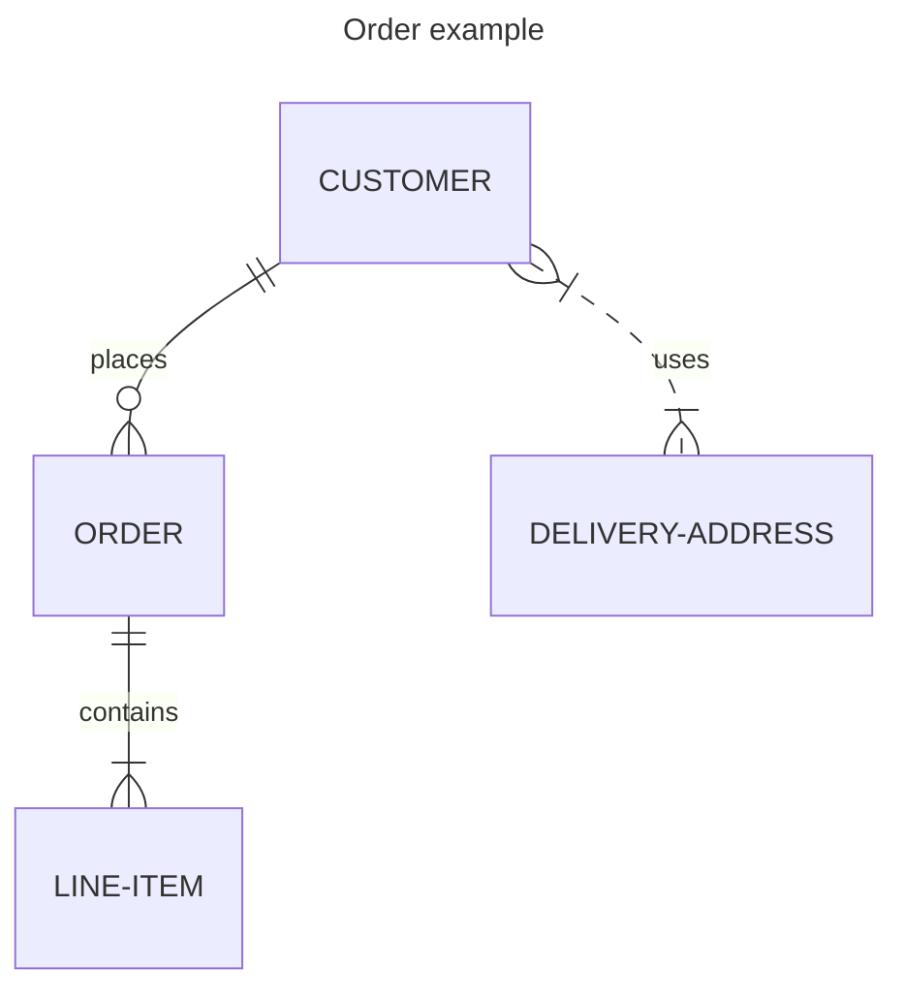

import Tabs from "@theme/Tabs";
import TabItem from "@theme/TabItem";

# Updating documentation

Everyone is welcome to contribute to Airbyte's documentation! 

Our documentation is stored in the [Airbyte repository](https://github.com/airbytehq/airbyte/tree/master/docs) on GitHub. It's published at [docs.airbyte.com](https://docs.airbyte.com/) using [Vercel](https://vercel.com). Connector docs are also rendered within Airbyte itself when setting up new connectors. The docs are built on [Docusaurus](https://docusaurus.io/). Content is written in [Markdown](https://guides.github.com/features/mastering-markdown/) and all topics are in the `/docs` folder. Configuration files are in the `/docusaurus` folder.

## Open source contributions welcome

Open source contributors are a vital part of Airbyte. Technical writers are welcome to use any content you author in your portfolio. 

If you're interested in becoming a regular contributor, join Airbyte's [Contributor program](https://airbyte.com/community/contributor-program). We pay for high-quality work on select issues. AI-generated content isn't eligible for the contributor program. You're welcome to use AI as a research tool and editing partner, but paid submissions must be principally human-generated.

## Before you start

Before you contribute, familiarize yourself with these concepts.

### Read our code of conduct

Read the Airbyte Community [code of conduct](../community/code-of-conduct.md).

### Learn Docusaurus basics

Even if you've never used it before, most developers and technical writers find Docusaurus intuitive.

- [Markdown basics](https://guides.github.com/features/mastering-markdown/)
- [Docusaurus 5-minute tutorial](https://tutorial.docusaurus.io/)

### Style guide

Follow the [Google developer documentation style guide](https://developers.google.com/style/highlights). It's a widely adopted style guide with good examples and easy-to-follow rules. We don't enforce these rules with automation, but might in the future. Fow now, just try to follow it to the best of your ability.

### Find a good first issue

The Docs team maintains a list of [good first issues](https://github.com/airbytehq/airbyte/issues?q=is%3Aopen+is%3Aissue+label%3Aarea%2Fdocumentation+label%3A%22good+first+issue%22) for new contributors. If you'd like to start a complex documentation project, create or comment on a [GitHub issue](https://github.com/airbytehq/airbyte/issues) and tag [@ian-at-airbyte](https://github.com/ian-at-airbyte) so we can decide on an approach together.

## Edit files directly on GitHub

To make minor changes like fixing typos or editing a single file, you can edit the file directly in your browser.

1. Click **Edit this page** at the bottom of any page on [docs.airbyte.com](https://docs.airbyte.com/). You'll be taken to the GitHub editor.
2. Edit the file directly on GitHub and open a Pull Request ([help](https://docs.github.com/en/repositories/working-with-files/managing-files/editing-files)).

## Edit files on your local machine

If you're making substantial documentation changes, it's best to clone the repository and work locally so you can test as you work.

### Prerequisites

Install these tools on your local machine, first.

1. [Node.js](https://nodejs.org/en/learn/getting-started/how-to-install-nodejs)
2. [`pnpm`](https://pnpm.io/installation)
3. A tool to work with GitHub, like [Git](https://git-scm.com/) or [GitHub Desktop](https://github.com/apps/desktop)
4. A code editor, like [Visual Studio Code](https://code.visualstudio.com/).

### Fork and clone the repo

1. [Fork](https://docs.github.com/en/github/getting-started-with-github/fork-a-repo) the [Airbyte repo](https://github.com/airbytehq/airbyte).

2. Clone the fork on your local machine.

   ```bash
   git clone git@github.com:{YOUR_USERNAME}/airbyte.git
   cd airbyte
   ```

   Or

   ```bash
   git clone https://github.com/{YOUR_USERNAME}/airbyte.git
   cd airbyte
   ```

3. Create a feature branch.

   ```bash
   git checkout -b {YOUR_USERNAME}/{FEATURE/BUG}
   ```

   For example:

   ```bash
   git checkout -b jdoe/source-stock-api-stream-fix
   ```

### Set up your environment

Open a terminal and install the docs locally.

```bash
cd docusaurus
pnpm install
```

:::important
Before making any documentation changes, always verify that you can successfully build the documentation in your environment. This helps distinguish between pre-existing issues and problems introduced by your changes.
:::

#### Development Build

To see changes as you make them in a dev build:

1. Run:

   ```bash
   pnpm start
   ```

2. Navigate to [http://localhost:3005/](http://localhost:3005/). Whenever you make and save changes, you will see them reflected in the server. To stop the running server, press <kbd>Ctrl</kbd>+<kbd>C</kbd> in the terminal.

#### Production Build

To create an optimized production build:

1. Clear any previous builds and create a new production build:

   ```bash
   pnpm clear && pnpm build
   ```

2. Review the build output carefully for:
   - Broken links and anchors (common during documentation restructuring)
   - Module loading warnings (these may indicate compatibility issues)
   - Missing dependencies or configuration problems

3. To serve the production build locally:

   ```bash
   pnpm serve
   ```

4. Navigate to [http://localhost:3000/](http://localhost:3000/) to verify your changes. To stop the running server, press <kbd>Ctrl</kbd>+<kbd>C</kbd> in the terminal.

#### Common Build Issues

1. **Broken Links and Anchors**
   - Links must match the exact case of the target file/heading
   - Anchors are generated from headings: spaces become hyphens, special characters are removed
   - Use relative paths for internal documentation links
   - Always verify links work in both development and production builds

2. **Module Loading Warnings**
   - CommonJS/ES Module warnings are expected and can be safely ignored
   - If you see new module-related errors, verify your Node.js version matches the one in `.nvmrc`

3. **Build Performance**
   - First builds may take longer due to dependency installation
   - Use `pnpm clear` before `pnpm build` to ensure a clean build
   - The development server (`pnpm start`) may take 1-2 minutes to initially compile

### Author content

[Follow the basic GitHub workflow](https://docs.github.com/en/get-started/quickstart/contributing-to-projects/) to update content: branch, write, commit, pull request, merge.

## Content templates

Every page must have a purpose. Bad documentation often has origins in:

- Poorly-defined goals, or no goal
- Failed execution of otherwise good goals
- The intimidating effect of a blank page

The [Good Docs Project](https://www.thegooddocsproject.dev/) maintains a collection of open-source docs templates you can use to help you write and update articles. Here are common patterns we see at Airbyte:

| Purpose         | Overview                                                                                            | Template                                                                  |
| --------------- | --------------------------------------------------------------------------------------------------- | ------------------------------------------------------------------------- |
| Concept         | Explain a concept, context, or background information about a product or its features.              | [Template](https://gitlab.com/tgdp/templates/-/tree/main/concept)         |
| How-to          | A concise set of numbered steps to do one task with the product.                                    | [Template](https://gitlab.com/tgdp/templates/-/tree/main/how-to)          |
| Tutorial        | Instructions to set up an example project intended for hands-on learning.        | [Template](https://gitlab.com/tgdp/templates/-/tree/main/tutorial)        |
| Troubleshooting | Common problems experienced by users, an explanation of the causes, and steps to resolve the issue. | [Template](https://gitlab.com/tgdp/templates/-/tree/main/troubleshooting) |
| Reference       | Specific, in-depth details about a particular topic.                                                | [Template](https://gitlab.com/tgdp/templates/-/tree/main/reference)       |
| Release note    | Communicate new features, improvements, bug fixes, and known issues about a product.                | [Template](https://gitlab.com/tgdp/templates/-/tree/main/release-notes)   |

[View all templates](https://www.thegooddocsproject.dev/template).

:::important
These templates can only be used for platform docs. Docs for connectors have their own template. See [Write connector docs](#connector-docs) for more details.
:::

## Write connector docs {#connector-docs}

If you're writing docs for a data source or destination, there are special rules you must follow. See the [Connector Documentation Guide](../connector-development/writing-connector-docs.md). Platform documentation is less formulaic.

## Common patterns and components

Since the docs site is based on Docusaurus, it inherits all of Docusaurus' capabilities. There are also some Airbyte-specific elements to be aware of. Most of these customizations can be combined together.

### Tabs

Use tabs to display mutually-exclusive concepts in a concise way. See [Tabs](https://docusaurus.io/docs/markdown-features/tabs). 

:::note
We maintain a separate `Tabs` implementation to support rendering tabs in Airbyte's in-app documentation. Our in-app renderer creates some additional rules that aren't necessarily true in other Docusaurus implementations:

- Always use empty lines to separate different Markup elements (tags, paragraphs, lists, etc.)
- Do not indent `TabItem` tags and their content according to normal HTML conventions. Different Markdown rendering tools handle indented tags inconsistently.
:::

### Code blocks

Code blocks are used to represent sample code and command line input and output with easy-to-read syntax highlighting. See [Code blocks](https://docusaurus.io/docs/markdown-features/code-blocks). 

Not all languages are turned on. If syntax highlighting doesn't work for your language, add it to `docusaurus/docusaurus.config.js`'s `module.exports.themeConfig.prism.additionalLanguages` property. Then, restart your local server to test the new language.

### Admonitions (notes, warnings, tips, etc.)

Docusaurus has custom markup to create a note, warning, tip, danger, or info block. See [Admonitions](https://docusaurus.io/docs/markdown-features/admonitions).

### Expandable details panels

Details panels are a great way to render content that's not relevant to everyone, or to condense long pages. See [Details](https://docusaurus.io/docs/markdown-features#details).

### Product badges

Some platform features are reserved for certain Airbyte products. To avoid confusion and indicate which products a topic applies to, pages can display badges in a prominent location under the title. [This page is an example](../using-airbyte/getting-started/oss-quickstart).

To enable badges, include `products` in the Markdown metadata. The following values are possible, and you can combine them as needed.

- `all`: Self-Managed Community, Self-Managed Enterprise, and Cloud
- `oss-community`: Self-Managed Community only
- `oss-enterprise`: Self-Managed Enterprise only
- `cloud`: Cloud only
- `cloud-teams`: Cloud Teams only

In this example, the Self-Managed Community badge is highlighted, and Cloud and Self-Managed Enterprise badges are grayed out.

```markdown
---
products: oss-community
---

# This topic is only for Self-Managed Community

Some text.
```

In this example, the Self-Managed Community badge is grayed out, but the Cloud Teams and Self-Managed Enterprise badges are highlighted.

```markdown
---
products: cloud-teams, oss-enterprise
---

# This topic is only for Cloud Teams and Self-Managed Enterprise

Some text.
```

### Diagrams

The [Mermaid](https://mermaid.js.org/) plugin runs on our Docusaurus instance. If possible, you should create diagrams with Mermaid, because they're easier to build, maintain, and translate. They're also more suitable for assistive technologies like screen readers.

:::warning
Connector docs do **not** support Mermaid. Mermaid can also be unsuitable for complex diagrams, where you need more visual control. If Mermaid can't meet your needs, create an SVG diagram or use Whimsical. Airbyte employees have access to a paid Whimsical account with Airbyte's color palette built in.
:::

Here is an example of how to create a Mermaid diagram:

Add a code block to your Markdown and specify `mermaid` as the language.

````md

````

This produces the following diagram.


The [Mermaid documentation](https://mermaid.js.org/intro) goes into more depth.

### Update the sidebar

If you're adding a new file, removing a file, or moving things around, update [`docusaurus/sidebars.js`](https://github.com/airbytehq/airbyte/blob/master/docusaurus/sidebars.js) to reflect the new structure.

### Handle Broken Links

When Docusaurus reports broken links:

1. **Types of Link Issues**
   - Missing files or incorrect paths
   - Case sensitivity mismatches
   - Incorrect anchor references
   - Relative vs. absolute path issues

2. **Resolution Steps**
   - Use production builds to catch all link issues
   - Fix the most critical navigation paths first
   - Update internal cross-references systematically
   - Consider adding redirects for moved content

3. **Prevention**
   - Test links in both development and production builds
   - Use relative paths for internal documentation
   - Follow consistent heading case conventions
   - Document any intentionally external references

### Add a redirect

If you're moving or renaming a page, you should add a redirect to its new location. If you're deleting a page, you should add a redirect to the most relevant new file, like a replacement topic or a parent page.

To add a redirect, open the [`docusaurus/redirects.yml`](https://github.com/airbytehq/airbyte/blob/master/docusaurus/redirects.yml) file and add an entry from which old path to which new path a redirect should happen.

:::note
Your path needs a leading slash `/` to work
:::

### Handling Documentation Framework Updates

When updating core documentation dependencies (like Docusaurus):

1. **Before Starting**
   - Create a complete build with current version
   - Document any existing warnings or errors
   - Note any custom components or plugins that might be affected

2. **During the Update**
   - Update dependencies incrementally if possible
   - Test custom components after each major change
   - Keep track of any new warnings or errors introduced
   - Pay special attention to:
     - Link validation changes
     - Markdown parsing updates
     - Plugin compatibility
     - Custom component behavior

3. **After the Update**
   - Run a complete production build
   - Compare new warnings/errors with pre-update list
   - Test documentation rendering in both development and production modes
   - Verify all custom components still function correctly

### Document a code module

If you're adding a README to a code module, make sure the README has the following components:

  - A brief description of the module
  - Development prerequisites (like which language or binaries are required for development)
  - How to install dependencies
  - How to build and run the code locally and via Docker
  - Any other information needed for local iteration

:::tip
AI tools like ChatGPT and GitHub Copilot are good at describing code. For open-source repositories, you might find it helpful to point one to your code module and ask it to generate a first draft for you. Airbyte employees working on a proprietary repository should follow Airbyte's AI usage policies.
:::

## Create a pull request

When you're ready to submit your work, create a pull request into `master`. 

### Review and approval

New pull requests with docs changes are automatically submitted to [#docs-prs](https://airbytehq-team.slack.com/archives/C075JMUK2FJ) in Airbyte's internal Slack. [@ian-at-airbyte](https://github.com/ian-at-airbyte) monitors this feed. If you want a specific person to review your work, add them as a reviewer. If not, you don't need to tag anyone, but you must wait for at least one Airbyte employee to explicitly approve your pull request before anyone can merge it.

Vercel builds a preview of the updated docs site automatically. If you're a community contributor, someone from Airbyte must authorize that build before it proceeds.

:::tip Collaboration tip
If you're not finished but want to collaborate with others, create a draft pull request. Vercel will still build your docs site, creating a preview others can see, and you can continue to work on your branch to incorporate feedback.
:::

:::note
Before we accept your contribution, you need to sign the Contributor License Agreement (CLA). By signing a CLA, we can ensure that the community is free and confident in its ability to use your contributions. You will be prompted to sign the CLA while opening a pull request.
:::

## Deploy the documentation site

When someone merges documentation changes into the `master` branch, Vercel deploys updated docs automatically. This takes 5-10 minutes and needs no human intervention.
