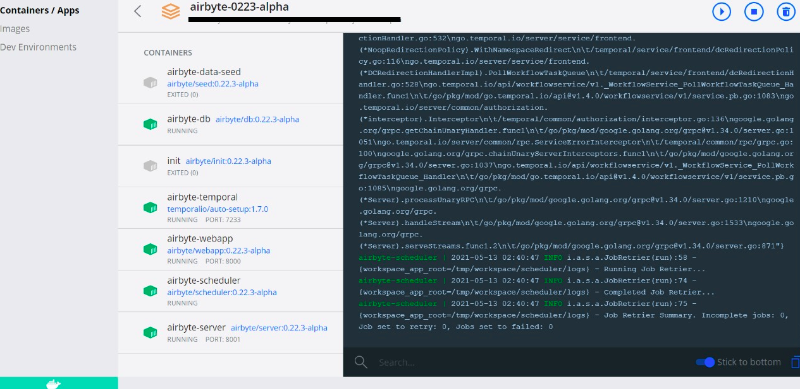

# Local Deployment


These instructions have been tested on MacOS, Windows 10 and Ubuntu 20.04.


## Setup & launch Airbyte

* Install Docker on your workstation \(see [instructions](https://www.docker.com/products/docker-desktop)\). Note: There is a known issue with docker-compose 1.27.3. If you are using that version, please upgrade to 1.27.4.
* After Docker is installed, you can immediately get started locally by running:

```bash
git clone https://github.com/airbytehq/airbyte.git
cd airbyte
docker-compose up
```

* In your browser, just visit [http://localhost:8000](http://localhost:8000)
* Start moving some data!

## Deploy on Windows

We recommend following [this guide](https://docs.docker.com/docker-for-windows/install/) to install Docker on Windows. After installing the WSL 2 backend and Docker you should be able to run containers using Windows PowerShell. Additionally, as we note frequently, you will need `docker-compose` to build Airbyte from source. The suggested guide already installs `docker-compose` on Windows. 

### Handling long filename error
If you are cloning the repo, you might run into a problem where git indicates that certain filenames are too long and it therefore can't create the local file. So if you received this error after cloning the repo, run the following commands in *git bash*:
```bash
cd airbyte
git config core.longpaths true
git reset --hard HEAD
```
However it's worth pointing out that the `core.longpaths` option is defaulted to false for a reason, so use with caution. This git configuration is only changed within the cloned Airbyte repo, so you won't need to worry about changing this setting for other repositories. Find more details about this issue in [this stack overflow question](https://stackoverflow.com/questions/22575662/filename-too-long-in-git-for-windows).

Instead of cloning the repo, you can alternatively download the latest Airbyte release [here](https://github.com/airbytehq/airbyte/releases). Unzip the downloaded file, access the unzipped file using PowerShell terminal, and run `docker-compose up`. After this, you should see the Airbyte containers in the Docker application as in the image below.



## Troubleshooting

**I have a Mac with the M1 chip. Is it possible to run Airbyte?**

Some users using Macs with an M1 chip are facing some problems running Airbyte.
The problem is related with the chip and Docker. [Issue #2017](https://github.com/airbytehq/airbyte/issues/2017) was created to follow up the problem, you can subscribe to it and get updates about the resolution.
If you can successfully run Airbyte using a MacBook with the M1 chip, let us know so that we can share the process with the community!

**Other issues**

If you encounter any issues, just connect to our [Slack](https://slack.airbyte.io). Our community will help! We also have a [troubleshooting](../troubleshooting/on-deploying.md) section in our docs for common problems.
